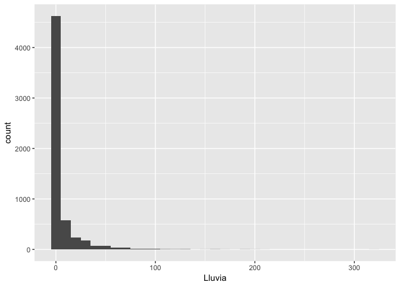
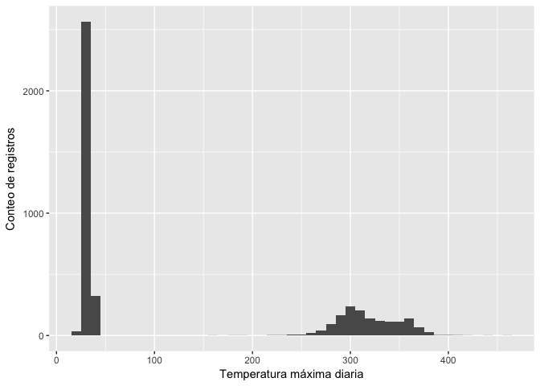
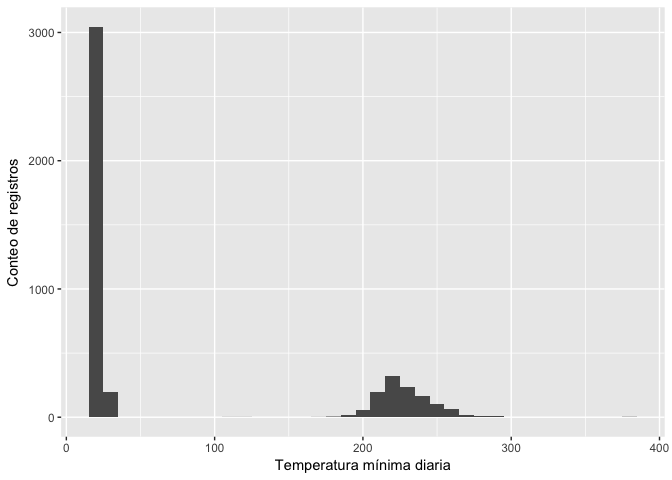
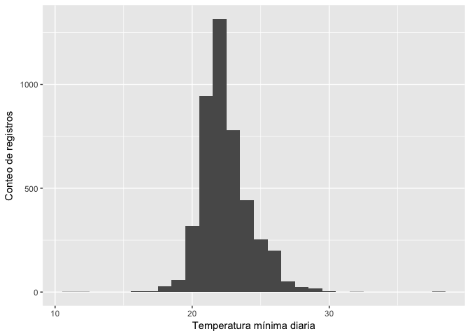
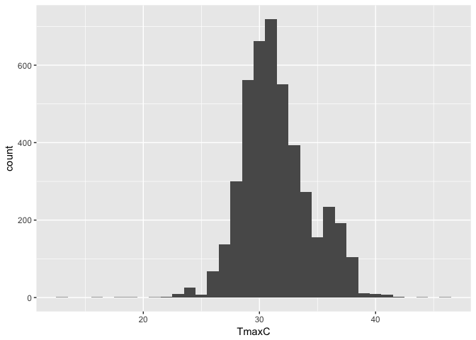

Datos climáticos históricos de ACG
================

``` r
rm(list = ls())
```

``` r
library("googlesheets")
library("tidyverse")
```

    ## Loading tidyverse: ggplot2
    ## Loading tidyverse: tibble
    ## Loading tidyverse: tidyr
    ## Loading tidyverse: readr
    ## Loading tidyverse: purrr
    ## Loading tidyverse: dplyr

    ## Conflicts with tidy packages ----------------------------------------------

    ## filter(): dplyr, stats
    ## lag():    dplyr, stats

``` r
library("lubridate")
```

    ## 
    ## Attaching package: 'lubridate'

    ## The following object is masked from 'package:base':
    ## 
    ##     date

``` r
library("ggplot2")
library("plotly")
```

    ## 
    ## Attaching package: 'plotly'

    ## The following object is masked from 'package:ggplot2':
    ## 
    ##     last_plot

    ## The following object is masked from 'package:stats':
    ## 
    ##     filter

    ## The following object is masked from 'package:graphics':
    ## 
    ##     layout

Estación Santa Rosa
-------------------

A leer GoogleSheet con los datos del ACG y cargar datos de Estación Santa Rosa:

``` r
SR <- gs_title("EstacionesACG")
```

    ## Warning in strptime(x, fmt, tz = "GMT"): unknown timezone 'zone/tz/2017c.
    ## 1.0/zoneinfo/America/Costa_Rica'

    ## Sheet successfully identified: "EstacionesACG"

``` r
SantaRosa <- SR %>% gs_read(ws = "StaRosa")
```

    ## Accessing worksheet titled 'StaRosa'.

    ## Parsed with column specification:
    ## cols(
    ##   dia = col_character(),
    ##   mes = col_integer(),
    ##   anno = col_integer(),
    ##   Lluvia = col_character(),
    ##   Tmax = col_number(),
    ##   Tmin = col_number(),
    ##   Unid_T = col_character(),
    ##   observ = col_character()
    ## )

Estructura de la tabla importada:

``` r
str(SantaRosa)
```

    ## Classes 'tbl_df', 'tbl' and 'data.frame':    7170 obs. of  8 variables:
    ##  $ dia   : chr  "1" "2" "3" "4" ...
    ##  $ mes   : int  1 1 1 1 1 1 1 1 1 1 ...
    ##  $ anno  : int  1995 1995 1995 1995 1995 1995 1995 1995 1995 1995 ...
    ##  $ Lluvia: chr  "0" "0" "0" "0" ...
    ##  $ Tmax  : num  NA NA NA NA NA NA NA NA NA NA ...
    ##  $ Tmin  : num  NA NA NA NA NA NA NA NA NA NA ...
    ##  $ Unid_T: chr  NA NA NA NA ...
    ##  $ observ: chr  NA NA NA NA ...
    ##  - attr(*, "spec")=List of 2
    ##   ..$ cols   :List of 8
    ##   .. ..$ dia   : list()
    ##   .. .. ..- attr(*, "class")= chr  "collector_character" "collector"
    ##   .. ..$ mes   : list()
    ##   .. .. ..- attr(*, "class")= chr  "collector_integer" "collector"
    ##   .. ..$ anno  : list()
    ##   .. .. ..- attr(*, "class")= chr  "collector_integer" "collector"
    ##   .. ..$ Lluvia: list()
    ##   .. .. ..- attr(*, "class")= chr  "collector_character" "collector"
    ##   .. ..$ Tmax  : list()
    ##   .. .. ..- attr(*, "class")= chr  "collector_number" "collector"
    ##   .. ..$ Tmin  : list()
    ##   .. .. ..- attr(*, "class")= chr  "collector_number" "collector"
    ##   .. ..$ Unid_T: list()
    ##   .. .. ..- attr(*, "class")= chr  "collector_character" "collector"
    ##   .. ..$ observ: list()
    ##   .. .. ..- attr(*, "class")= chr  "collector_character" "collector"
    ##   ..$ default: list()
    ##   .. ..- attr(*, "class")= chr  "collector_guess" "collector"
    ##   ..- attr(*, "class")= chr "col_spec"

Crear columna de fecha:

``` r
SantaRosa$fecha <- ymd(paste(SantaRosa$anno,SantaRosa$mes,SantaRosa$dia, sep = '/'))
```

Notese que "Lluvia" se importó como tipo "character", hay que convertirla a "numeric", pero primero hay que convertir el separador de decimales de coma a punto:

``` r
SantaRosa$Lluvia <- gsub(",", ".", SantaRosa$Lluvia, fixed = T)
```

``` r
SantaRosa$Lluvia <- as.numeric(SantaRosa$Lluvia)
```

    ## Warning: NAs introduced by coercion

Tipos de datos:

``` r
str(SantaRosa)
```

    ## Classes 'tbl_df', 'tbl' and 'data.frame':    7170 obs. of  9 variables:
    ##  $ dia   : chr  "1" "2" "3" "4" ...
    ##  $ mes   : int  1 1 1 1 1 1 1 1 1 1 ...
    ##  $ anno  : int  1995 1995 1995 1995 1995 1995 1995 1995 1995 1995 ...
    ##  $ Lluvia: num  0 0 0 0 0 0 0 0 0 0 ...
    ##  $ Tmax  : num  NA NA NA NA NA NA NA NA NA NA ...
    ##  $ Tmin  : num  NA NA NA NA NA NA NA NA NA NA ...
    ##  $ Unid_T: chr  NA NA NA NA ...
    ##  $ observ: chr  NA NA NA NA ...
    ##  $ fecha : Date, format: "1995-01-01" "1995-01-02" ...
    ##  - attr(*, "spec")=List of 2
    ##   ..$ cols   :List of 8
    ##   .. ..$ dia   : list()
    ##   .. .. ..- attr(*, "class")= chr  "collector_character" "collector"
    ##   .. ..$ mes   : list()
    ##   .. .. ..- attr(*, "class")= chr  "collector_integer" "collector"
    ##   .. ..$ anno  : list()
    ##   .. .. ..- attr(*, "class")= chr  "collector_integer" "collector"
    ##   .. ..$ Lluvia: list()
    ##   .. .. ..- attr(*, "class")= chr  "collector_character" "collector"
    ##   .. ..$ Tmax  : list()
    ##   .. .. ..- attr(*, "class")= chr  "collector_number" "collector"
    ##   .. ..$ Tmin  : list()
    ##   .. .. ..- attr(*, "class")= chr  "collector_number" "collector"
    ##   .. ..$ Unid_T: list()
    ##   .. .. ..- attr(*, "class")= chr  "collector_character" "collector"
    ##   .. ..$ observ: list()
    ##   .. .. ..- attr(*, "class")= chr  "collector_character" "collector"
    ##   ..$ default: list()
    ##   .. ..- attr(*, "class")= chr  "collector_guess" "collector"
    ##   ..- attr(*, "class")= chr "col_spec"

Transformar las temperaturas a centígrados: Primero hacer función de transformación

``` r
FaC <- function(x, y) {
  ifelse (x == 'F', (y - 32) * (5/9), y)
}
```

Ahora hacer la transformación para temperatura máxima (Tmax) y mínima (Tmin):

``` r
SantaRosa$TmaxC <- FaC(SantaRosa$Unid_T, SantaRosa$Tmax)
SantaRosa$TminC <- FaC(SantaRosa$Unid_T, SantaRosa$Tmin)
```

Revisar rango de valores a través de un histograma.

Lluvia:

``` r
ggplot(SantaRosa) + geom_histogram(aes(x=Lluvia), binwidth = 10)
```

    ## Warning: Removed 1267 rows containing non-finite values (stat_bin).



``` r
summary(SantaRosa$Lluvia)
```

    ##    Min. 1st Qu.  Median    Mean 3rd Qu.    Max.    NA's 
    ##   0.000   0.000   0.000   6.155   3.300 322.300    1267

Temperatura máxima:

``` r
ggplot(SantaRosa) + geom_histogram(aes(x=TmaxC), binwidth = 10)
```

    ## Warning: Removed 2738 rows containing non-finite values (stat_bin).



``` r
summary(SantaRosa$TmaxC)
```

    ##    Min. 1st Qu.  Median    Mean 3rd Qu.    Max.    NA's 
    ##   21.11   30.00   33.00  129.43  298.00  461.67    2738

Temperatura mínima:

``` r
ggplot(SantaRosa) + geom_histogram(aes(x=TminC), binwidth = 10)
```

    ## Warning: Removed 2729 rows containing non-finite values (stat_bin).



``` r
summary(SantaRosa$TminC)
```

    ##    Min. 1st Qu.  Median    Mean 3rd Qu.    Max.    NA's 
    ##  -6.111  22.000  23.000  79.043 215.000 379.444    2729

Los valores de más de 100 C se asumen son valores donde no se les puso el decimal, por lo que hay que hacer una función que seleccione esos valores y los divida entre 10.

``` r
deci <- function(x) {
  ifelse (x > 100, x/10, x)
}
```

Se aplica la función a las columnas TmaxC y TminC:

``` r
SantaRosa$TmaxC <- deci(SantaRosa$TmaxC)
SantaRosa$TminC <- deci(SantaRosa$TminC)
```

Comprobar cambios con nuevos histogramas:

``` r
ggplot(SantaRosa) + geom_histogram(aes(x=TminC), binwidth = 1)
```

    ## Warning: Removed 2729 rows containing non-finite values (stat_bin).



``` r
ggplot(SantaRosa) + geom_histogram(aes(x=TmaxC), binwidth = 1)
```

    ## Warning: Removed 2738 rows containing non-finite values (stat_bin).



``` r
summary(SantaRosa$TmaxC)
```

    ##    Min. 1st Qu.  Median    Mean 3rd Qu.    Max.    NA's 
    ##   12.94   29.50   31.11   31.53   33.33   46.17    2738

Estadísticas generales para los años con datos completos o casi completos
=========================================================================

Hacer vector con los años que se tienen datos completos:

``` r
AnnosCompletosSR <- as.factor(c(1994:1997,2001,2002, 2005:2008,2010))
```

Seleccionar los valores para esos años:

``` r
SantaRosa_AnnosCompletos <- SantaRosa %>% filter(anno %in% AnnosCompletosSR)
```

Calcular totales de lluvia por año completo:

``` r
TotalLluviaAnnos <- SantaRosa_AnnosCompletos %>% replace_na(list(Lluvia = 0)) %>% 
  group_by(anno) %>% summarise(LluviaAnno = sum(Lluvia))
```

Tabla con totales de lluvia por año y promedio de años con mediciones:

``` r
TotalLluviaAnnos
```

    ## # A tibble: 11 x 2
    ##     anno LluviaAnno
    ##    <int>      <dbl>
    ##  1  1994     470.00
    ##  2  1995    1519.42
    ##  3  1996    2044.70
    ##  4  1997     963.92
    ##  5  2001    2074.10
    ##  6  2002    1629.30
    ##  7  2005    3175.36
    ##  8  2006    1269.80
    ##  9  2007    3117.60
    ## 10  2008    2940.70
    ## 11  2010    2880.40

``` r
mean(TotalLluviaAnnos$LluviaAnno)
```

    ## [1] 2007.755

Graficos
========

Ordenar por fecha:

``` r
SantaRosa_AnnosCompletos <- SantaRosa_AnnosCompletos[order(SantaRosa_AnnosCompletos$fecha),]
```

Preparación para un gráfico de acumulado de lluvias por año:

``` r
SantaRosa_AnnosCompletos$djuliano <- yday(SantaRosa_AnnosCompletos$fecha)

SantaRosa_graficos <- SantaRosa_AnnosCompletos %>% replace_na(list(Lluvia = 0))

SantaRosa_graficos <- SantaRosa_graficos %>% group_by(year(fecha)) %>% mutate(LluviaAcumulada = cumsum(Lluvia))
```

Gráfico de lluvia acumulada por año:

``` r
LluviaAcumG <- ggplot(SantaRosa_graficos, aes(x = djuliano, y = LluviaAcumulada)) +
  geom_line(aes(group = factor(anno), colour = factor(anno)))
ggplotly()
```

    ## Warning in mutate_impl(.data, dots): Unequal factor levels: coercing to
    ## character

    ## Warning in mutate_impl(.data, dots): binding character and factor vector,
    ## coercing into character vector

    ## Warning in mutate_impl(.data, dots): binding character and factor vector,
    ## coercing into character vector

    ## Warning in mutate_impl(.data, dots): binding character and factor vector,
    ## coercing into character vector

    ## Warning in mutate_impl(.data, dots): binding character and factor vector,
    ## coercing into character vector

    ## Warning in mutate_impl(.data, dots): binding character and factor vector,
    ## coercing into character vector

    ## Warning in mutate_impl(.data, dots): binding character and factor vector,
    ## coercing into character vector

    ## Warning in mutate_impl(.data, dots): binding character and factor vector,
    ## coercing into character vector

    ## Warning in mutate_impl(.data, dots): binding character and factor vector,
    ## coercing into character vector

    ## Warning in mutate_impl(.data, dots): binding character and factor vector,
    ## coercing into character vector

    ## Warning in mutate_impl(.data, dots): binding character and factor vector,
    ## coercing into character vector

    ## Warning in mutate_impl(.data, dots): binding character and factor vector,
    ## coercing into character vector

    ## Warning in mutate_impl(.data, dots): binding character and factor vector,
    ## coercing into character vector

    ## PhantomJS not found. You can install it with webshot::install_phantomjs(). If it is installed, please make sure the phantomjs executable can be found via the PATH variable.

<!--html_preserve-->

<script type="application/json" data-for="3f4334b3cb0">{"x":{"data":[{"x":[91,92,93,94,95,96,97,98,99,100,101,102,103,104,105,106,107,108,109,110,111,112,113,114,115,116,117,118,119,120,121,152,153,154,155,156,157,158,159,160,161,162,163,164,165,166,167,168,169,170,171,172,173,174,175,176,177,178,179,180,181,182,182,183,184,185,186,187,188,189,190,191,192,193,194,195,196,197,198,199,200,201,202,203,204,205,206,207,208,209,210,211,212,213,213,214,215,216,217,218,219,220,221,222,223,224,225,226,227,228,229,230,231,232,233,234,235,236,237,238,239,240,241,242,243,244,305,306,307,308,309,310,311,312,313,314,315,316,317,318,319,320,321,322,323,324,325,326,327,328,329,330,331,332,333,334,335,335,336,337,338,339,340,341,342,343,344,345,346,347,348,349,350,351,352,353,354,355,356,357,358,359,360,361,362,363,364,365,null],"y":[0,0,0,0,0,0,0,0,0,0,0,0,0,0,0,0,0,0,0,0,0,0,0,0,0,0,0,0,0,66,66,67.7,92,92,103.6,140.4,141.2,141.2,141.2,149.7,149.7,149.7,149.7,158.1,158.1,158.1,161.7,161.9,161.9,161.9,161.9,161.9,167,167,167,167,167,167,167.4,167.4,167.4,167.4,167.4,168.1,184.7,184.7,184.8,185.2,185.2,185.2,185.2,185.2,185.2,185.2,185.6,186.7,186.8,194.9,197.7,197.7,197.7,197.7,197.7,197.7,197.7,197.7,197.7,197.7,197.7,197.7,199.1,199.1,199.1,204.6,210.1,210.1,211.7,211.7,212.3,212.3,212.3,223.5,234.1,234.1,234.8,234.8,235,237,237,237,237,237,237,237,237,250.7,256.3,256.3,256.3,256.3,256.3,256.3,272,272.1,272.1,275.2,275.2,275.7,301.7,338.7,340,359.4,360.1,360.1,415.1,432.3,432.3,436,438.5,438.5,438.5,438.5,438.5,438.5,438.5,439.2,439.2,441.3,441.3,443.3,443.5,444.8,447.7,447.7,448.9,448.9,448.9,448.9,448.9,448.9,448.9,448.9,448.9,449.5,457.6,467.4,468.5,468.5,468.6,468.6,468.6,470,470,470,470,470,470,470,470,470,470,470,470,470,470,470,470,470,0],"text":["factor(anno): 1994<br />factor(anno): 1994<br />djuliano:  91<br />LluviaAcumulada:    0.00","factor(anno): 1994<br />factor(anno): 1994<br />djuliano:  92<br />LluviaAcumulada:    0.00","factor(anno): 1994<br />factor(anno): 1994<br />djuliano:  93<br />LluviaAcumulada:    0.00","factor(anno): 1994<br />factor(anno): 1994<br />djuliano:  94<br />LluviaAcumulada:    0.00","factor(anno): 1994<br />factor(anno): 1994<br />djuliano:  95<br />LluviaAcumulada:    0.00","factor(anno): 1994<br />factor(anno): 1994<br />djuliano:  96<br />LluviaAcumulada:    0.00","factor(anno): 1994<br />factor(anno): 1994<br />djuliano:  97<br />LluviaAcumulada:    0.00","factor(anno): 1994<br />factor(anno): 1994<br />djuliano:  98<br />LluviaAcumulada:    0.00","factor(anno): 1994<br />factor(anno): 1994<br />djuliano:  99<br />LluviaAcumulada:    0.00","factor(anno): 1994<br />factor(anno): 1994<br />djuliano: 100<br />LluviaAcumulada:    0.00","factor(anno): 1994<br />factor(anno): 1994<br />djuliano: 101<br />LluviaAcumulada:    0.00","factor(anno): 1994<br />factor(anno): 1994<br />djuliano: 102<br />LluviaAcumulada:    0.00","factor(anno): 1994<br />factor(anno): 1994<br />djuliano: 103<br />LluviaAcumulada:    0.00","factor(anno): 1994<br />factor(anno): 1994<br />djuliano: 104<br />LluviaAcumulada:    0.00","factor(anno): 1994<br />factor(anno): 1994<br />djuliano: 105<br />LluviaAcumulada:    0.00","factor(anno): 1994<br />factor(anno): 1994<br />djuliano: 106<br />LluviaAcumulada:    0.00","factor(anno): 1994<br />factor(anno): 1994<br />djuliano: 107<br />LluviaAcumulada:    0.00","factor(anno): 1994<br />factor(anno): 1994<br />djuliano: 108<br />LluviaAcumulada:    0.00","factor(anno): 1994<br />factor(anno): 1994<br />djuliano: 109<br />LluviaAcumulada:    0.00","factor(anno): 1994<br />factor(anno): 1994<br />djuliano: 110<br />LluviaAcumulada:    0.00","factor(anno): 1994<br />factor(anno): 1994<br />djuliano: 111<br />LluviaAcumulada:    0.00","factor(anno): 1994<br />factor(anno): 1994<br />djuliano: 112<br />LluviaAcumulada:    0.00","factor(anno): 1994<br />factor(anno): 1994<br />djuliano: 113<br />LluviaAcumulada:    0.00","factor(anno): 1994<br />factor(anno): 1994<br />djuliano: 114<br />LluviaAcumulada:    0.00","factor(anno): 1994<br />factor(anno): 1994<br />djuliano: 115<br />LluviaAcumulada:    0.00","factor(anno): 1994<br />factor(anno): 1994<br />djuliano: 116<br />LluviaAcumulada:    0.00","factor(anno): 1994<br />factor(anno): 1994<br />djuliano: 117<br />LluviaAcumulada:    0.00","factor(anno): 1994<br />factor(anno): 1994<br />djuliano: 118<br />LluviaAcumulada:    0.00","factor(anno): 1994<br />factor(anno): 1994<br />djuliano: 119<br />LluviaAcumulada:    0.00","factor(anno): 1994<br />factor(anno): 1994<br />djuliano: 120<br />LluviaAcumulada:   66.00","factor(anno): 1994<br />factor(anno): 1994<br />djuliano: 121<br />LluviaAcumulada:   66.00","factor(anno): 1994<br />factor(anno): 1994<br />djuliano: 152<br />LluviaAcumulada:   67.70","factor(anno): 1994<br />factor(anno): 1994<br />djuliano: 153<br />LluviaAcumulada:   92.00","factor(anno): 1994<br />factor(anno): 1994<br />djuliano: 154<br />LluviaAcumulada:   92.00","factor(anno): 1994<br />factor(anno): 1994<br />djuliano: 155<br />LluviaAcumulada:  103.60","factor(anno): 1994<br />factor(anno): 1994<br />djuliano: 156<br />LluviaAcumulada:  140.40","factor(anno): 1994<br />factor(anno): 1994<br />djuliano: 157<br />LluviaAcumulada:  141.20","factor(anno): 1994<br />factor(anno): 1994<br />djuliano: 158<br />LluviaAcumulada:  141.20","factor(anno): 1994<br />factor(anno): 1994<br />djuliano: 159<br />LluviaAcumulada:  141.20","factor(anno): 1994<br />factor(anno): 1994<br />djuliano: 160<br />LluviaAcumulada:  149.70","factor(anno): 1994<br />factor(anno): 1994<br />djuliano: 161<br />LluviaAcumulada:  149.70","factor(anno): 1994<br />factor(anno): 1994<br />djuliano: 162<br />LluviaAcumulada:  149.70","factor(anno): 1994<br />factor(anno): 1994<br />djuliano: 163<br />LluviaAcumulada:  149.70","factor(anno): 1994<br />factor(anno): 1994<br />djuliano: 164<br />LluviaAcumulada:  158.10","factor(anno): 1994<br />factor(anno): 1994<br />djuliano: 165<br />LluviaAcumulada:  158.10","factor(anno): 1994<br />factor(anno): 1994<br />djuliano: 166<br />LluviaAcumulada:  158.10","factor(anno): 1994<br />factor(anno): 1994<br />djuliano: 167<br />LluviaAcumulada:  161.70","factor(anno): 1994<br />factor(anno): 1994<br />djuliano: 168<br />LluviaAcumulada:  161.90","factor(anno): 1994<br />factor(anno): 1994<br />djuliano: 169<br />LluviaAcumulada:  161.90","factor(anno): 1994<br />factor(anno): 1994<br />djuliano: 170<br />LluviaAcumulada:  161.90","factor(anno): 1994<br />factor(anno): 1994<br />djuliano: 171<br />LluviaAcumulada:  161.90","factor(anno): 1994<br />factor(anno): 1994<br />djuliano: 172<br />LluviaAcumulada:  161.90","factor(anno): 1994<br />factor(anno): 1994<br />djuliano: 173<br />LluviaAcumulada:  167.00","factor(anno): 1994<br />factor(anno): 1994<br />djuliano: 174<br />LluviaAcumulada:  167.00","factor(anno): 1994<br />factor(anno): 1994<br />djuliano: 175<br />LluviaAcumulada:  167.00","factor(anno): 1994<br />factor(anno): 1994<br />djuliano: 176<br />LluviaAcumulada:  167.00","factor(anno): 1994<br />factor(anno): 1994<br />djuliano: 177<br />LluviaAcumulada:  167.00","factor(anno): 1994<br />factor(anno): 1994<br />djuliano: 178<br />LluviaAcumulada:  167.00","factor(anno): 1994<br />factor(anno): 1994<br />djuliano: 179<br />LluviaAcumulada:  167.40","factor(anno): 1994<br />factor(anno): 1994<br />djuliano: 180<br />LluviaAcumulada:  167.40","factor(anno): 1994<br />factor(anno): 1994<br />djuliano: 181<br />LluviaAcumulada:  167.40","factor(anno): 1994<br />factor(anno): 1994<br />djuliano: 182<br />LluviaAcumulada:  167.40","factor(anno): 1994<br />factor(anno): 1994<br />djuliano: 182<br />LluviaAcumulada:  167.40","factor(anno): 1994<br />factor(anno): 1994<br />djuliano: 183<br />LluviaAcumulada:  168.10","factor(anno): 1994<br />factor(anno): 1994<br />djuliano: 184<br />LluviaAcumulada:  184.70","factor(anno): 1994<br />factor(anno): 1994<br />djuliano: 185<br />LluviaAcumulada:  184.70","factor(anno): 1994<br />factor(anno): 1994<br />djuliano: 186<br />LluviaAcumulada:  184.80","factor(anno): 1994<br />factor(anno): 1994<br />djuliano: 187<br />LluviaAcumulada:  185.20","factor(anno): 1994<br />factor(anno): 1994<br />djuliano: 188<br />LluviaAcumulada:  185.20","factor(anno): 1994<br />factor(anno): 1994<br />djuliano: 189<br />LluviaAcumulada:  185.20","factor(anno): 1994<br />factor(anno): 1994<br />djuliano: 190<br />LluviaAcumulada:  185.20","factor(anno): 1994<br />factor(anno): 1994<br />djuliano: 191<br />LluviaAcumulada:  185.20","factor(anno): 1994<br />factor(anno): 1994<br />djuliano: 192<br />LluviaAcumulada:  185.20","factor(anno): 1994<br />factor(anno): 1994<br />djuliano: 193<br />LluviaAcumulada:  185.20","factor(anno): 1994<br />factor(anno): 1994<br />djuliano: 194<br />LluviaAcumulada:  185.60","factor(anno): 1994<br />factor(anno): 1994<br />djuliano: 195<br />LluviaAcumulada:  186.70","factor(anno): 1994<br />factor(anno): 1994<br />djuliano: 196<br />LluviaAcumulada:  186.80","factor(anno): 1994<br />factor(anno): 1994<br />djuliano: 197<br />LluviaAcumulada:  194.90","factor(anno): 1994<br />factor(anno): 1994<br />djuliano: 198<br />LluviaAcumulada:  197.70","factor(anno): 1994<br />factor(anno): 1994<br />djuliano: 199<br />LluviaAcumulada:  197.70","factor(anno): 1994<br />factor(anno): 1994<br />djuliano: 200<br />LluviaAcumulada:  197.70","factor(anno): 1994<br />factor(anno): 1994<br />djuliano: 201<br />LluviaAcumulada:  197.70","factor(anno): 1994<br />factor(anno): 1994<br />djuliano: 202<br />LluviaAcumulada:  197.70","factor(anno): 1994<br />factor(anno): 1994<br />djuliano: 203<br />LluviaAcumulada:  197.70","factor(anno): 1994<br />factor(anno): 1994<br />djuliano: 204<br />LluviaAcumulada:  197.70","factor(anno): 1994<br />factor(anno): 1994<br />djuliano: 205<br />LluviaAcumulada:  197.70","factor(anno): 1994<br />factor(anno): 1994<br />djuliano: 206<br />LluviaAcumulada:  197.70","factor(anno): 1994<br />factor(anno): 1994<br />djuliano: 207<br />LluviaAcumulada:  197.70","factor(anno): 1994<br />factor(anno): 1994<br />djuliano: 208<br />LluviaAcumulada:  197.70","factor(anno): 1994<br />factor(anno): 1994<br />djuliano: 209<br />LluviaAcumulada:  197.70","factor(anno): 1994<br />factor(anno): 1994<br />djuliano: 210<br />LluviaAcumulada:  199.10","factor(anno): 1994<br />factor(anno): 1994<br />djuliano: 211<br />LluviaAcumulada:  199.10","factor(anno): 1994<br />factor(anno): 1994<br />djuliano: 212<br />LluviaAcumulada:  199.10","factor(anno): 1994<br />factor(anno): 1994<br />djuliano: 213<br />LluviaAcumulada:  204.60","factor(anno): 1994<br />factor(anno): 1994<br />djuliano: 213<br />LluviaAcumulada:  210.10","factor(anno): 1994<br />factor(anno): 1994<br />djuliano: 214<br />LluviaAcumulada:  210.10","factor(anno): 1994<br />factor(anno): 1994<br />djuliano: 215<br />LluviaAcumulada:  211.70","factor(anno): 1994<br />factor(anno): 1994<br />djuliano: 216<br />LluviaAcumulada:  211.70","factor(anno): 1994<br />factor(anno): 1994<br />djuliano: 217<br />LluviaAcumulada:  212.30","factor(anno): 1994<br />factor(anno): 1994<br />djuliano: 218<br />LluviaAcumulada:  212.30","factor(anno): 1994<br />factor(anno): 1994<br />djuliano: 219<br />LluviaAcumulada:  212.30","factor(anno): 1994<br />factor(anno): 1994<br />djuliano: 220<br />LluviaAcumulada:  223.50","factor(anno): 1994<br />factor(anno): 1994<br />djuliano: 221<br />LluviaAcumulada:  234.10","factor(anno): 1994<br />factor(anno): 1994<br />djuliano: 222<br />LluviaAcumulada:  234.10","factor(anno): 1994<br />factor(anno): 1994<br />djuliano: 223<br />LluviaAcumulada:  234.80","factor(anno): 1994<br />factor(anno): 1994<br />djuliano: 224<br />LluviaAcumulada:  234.80","factor(anno): 1994<br />factor(anno): 1994<br />djuliano: 225<br />LluviaAcumulada:  235.00","factor(anno): 1994<br />factor(anno): 1994<br />djuliano: 226<br />LluviaAcumulada:  237.00","factor(anno): 1994<br />factor(anno): 1994<br />djuliano: 227<br />LluviaAcumulada:  237.00","factor(anno): 1994<br />factor(anno): 1994<br />djuliano: 228<br />LluviaAcumulada:  237.00","factor(anno): 1994<br />factor(anno): 1994<br />djuliano: 229<br />LluviaAcumulada:  237.00","factor(anno): 1994<br />factor(anno): 1994<br />djuliano: 230<br />LluviaAcumulada:  237.00","factor(anno): 1994<br />factor(anno): 1994<br />djuliano: 231<br />LluviaAcumulada:  237.00","factor(anno): 1994<br />factor(anno): 1994<br />djuliano: 232<br />LluviaAcumulada:  237.00","factor(anno): 1994<br />factor(anno): 1994<br />djuliano: 233<br />LluviaAcumulada:  237.00","factor(anno): 1994<br />factor(anno): 1994<br />djuliano: 234<br />LluviaAcumulada:  250.70","factor(anno): 1994<br />factor(anno): 1994<br />djuliano: 235<br />LluviaAcumulada:  256.30","factor(anno): 1994<br />factor(anno): 1994<br />djuliano: 236<br />LluviaAcumulada:  256.30","factor(anno): 1994<br />factor(anno): 1994<br />djuliano: 237<br />LluviaAcumulada:  256.30","factor(anno): 1994<br />factor(anno): 1994<br />djuliano: 238<br />LluviaAcumulada:  256.30","factor(anno): 1994<br />factor(anno): 1994<br />djuliano: 239<br />LluviaAcumulada:  256.30","factor(anno): 1994<br />factor(anno): 1994<br />djuliano: 240<br />LluviaAcumulada:  256.30","factor(anno): 1994<br />factor(anno): 1994<br />djuliano: 241<br />LluviaAcumulada:  272.00","factor(anno): 1994<br />factor(anno): 1994<br />djuliano: 242<br />LluviaAcumulada:  272.10","factor(anno): 1994<br />factor(anno): 1994<br />djuliano: 243<br />LluviaAcumulada:  272.10","factor(anno): 1994<br />factor(anno): 1994<br />djuliano: 244<br />LluviaAcumulada:  275.20","factor(anno): 1994<br />factor(anno): 1994<br />djuliano: 305<br />LluviaAcumulada:  275.20","factor(anno): 1994<br />factor(anno): 1994<br />djuliano: 306<br />LluviaAcumulada:  275.70","factor(anno): 1994<br />factor(anno): 1994<br />djuliano: 307<br />LluviaAcumulada:  301.70","factor(anno): 1994<br />factor(anno): 1994<br />djuliano: 308<br />LluviaAcumulada:  338.70","factor(anno): 1994<br />factor(anno): 1994<br />djuliano: 309<br />LluviaAcumulada:  340.00","factor(anno): 1994<br />factor(anno): 1994<br />djuliano: 310<br />LluviaAcumulada:  359.40","factor(anno): 1994<br />factor(anno): 1994<br />djuliano: 311<br />LluviaAcumulada:  360.10","factor(anno): 1994<br />factor(anno): 1994<br />djuliano: 312<br />LluviaAcumulada:  360.10","factor(anno): 1994<br />factor(anno): 1994<br />djuliano: 313<br />LluviaAcumulada:  415.10","factor(anno): 1994<br />factor(anno): 1994<br />djuliano: 314<br />LluviaAcumulada:  432.30","factor(anno): 1994<br />factor(anno): 1994<br />djuliano: 315<br />LluviaAcumulada:  432.30","factor(anno): 1994<br />factor(anno): 1994<br />djuliano: 316<br />LluviaAcumulada:  436.00","factor(anno): 1994<br />factor(anno): 1994<br />djuliano: 317<br />LluviaAcumulada:  438.50","factor(anno): 1994<br />factor(anno): 1994<br />djuliano: 318<br />LluviaAcumulada:  438.50","factor(anno): 1994<br />factor(anno): 1994<br />djuliano: 319<br />LluviaAcumulada:  438.50","factor(anno): 1994<br />factor(anno): 1994<br />djuliano: 320<br />LluviaAcumulada:  438.50","factor(anno): 1994<br />factor(anno): 1994<br />djuliano: 321<br />LluviaAcumulada:  438.50","factor(anno): 1994<br />factor(anno): 1994<br />djuliano: 322<br />LluviaAcumulada:  438.50","factor(anno): 1994<br />factor(anno): 1994<br />djuliano: 323<br />LluviaAcumulada:  438.50","factor(anno): 1994<br />factor(anno): 1994<br />djuliano: 324<br />LluviaAcumulada:  439.20","factor(anno): 1994<br />factor(anno): 1994<br />djuliano: 325<br />LluviaAcumulada:  439.20","factor(anno): 1994<br />factor(anno): 1994<br />djuliano: 326<br />LluviaAcumulada:  441.30","factor(anno): 1994<br />factor(anno): 1994<br />djuliano: 327<br />LluviaAcumulada:  441.30","factor(anno): 1994<br />factor(anno): 1994<br />djuliano: 328<br />LluviaAcumulada:  443.30","factor(anno): 1994<br />factor(anno): 1994<br />djuliano: 329<br />LluviaAcumulada:  443.50","factor(anno): 1994<br />factor(anno): 1994<br />djuliano: 330<br />LluviaAcumulada:  444.80","factor(anno): 1994<br />factor(anno): 1994<br />djuliano: 331<br />LluviaAcumulada:  447.70","factor(anno): 1994<br />factor(anno): 1994<br />djuliano: 332<br />LluviaAcumulada:  447.70","factor(anno): 1994<br />factor(anno): 1994<br />djuliano: 333<br />LluviaAcumulada:  448.90","factor(anno): 1994<br />factor(anno): 1994<br />djuliano: 334<br />LluviaAcumulada:  448.90","factor(anno): 1994<br />factor(anno): 1994<br />djuliano: 335<br />LluviaAcumulada:  448.90","factor(anno): 1994<br />factor(anno): 1994<br />djuliano: 335<br />LluviaAcumulada:  448.90","factor(anno): 1994<br />factor(anno): 1994<br />djuliano: 336<br />LluviaAcumulada:  448.90","factor(anno): 1994<br />factor(anno): 1994<br />djuliano: 337<br />LluviaAcumulada:  448.90","factor(anno): 1994<br />factor(anno): 1994<br />djuliano: 338<br />LluviaAcumulada:  448.90","factor(anno): 1994<br />factor(anno): 1994<br />djuliano: 339<br />LluviaAcumulada:  448.90","factor(anno): 1994<br />factor(anno): 1994<br />djuliano: 340<br />LluviaAcumulada:  448.90","factor(anno): 1994<br />factor(anno): 1994<br />djuliano: 341<br />LluviaAcumulada:  449.50","factor(anno): 1994<br />factor(anno): 1994<br />djuliano: 342<br />LluviaAcumulada:  457.60","factor(anno): 1994<br />factor(anno): 1994<br />djuliano: 343<br />LluviaAcumulada:  467.40","factor(anno): 1994<br />factor(anno): 1994<br />djuliano: 344<br />LluviaAcumulada:  468.50","factor(anno): 1994<br />factor(anno): 1994<br />djuliano: 345<br />LluviaAcumulada:  468.50","factor(anno): 1994<br />factor(anno): 1994<br />djuliano: 346<br />LluviaAcumulada:  468.60","factor(anno): 1994<br />factor(anno): 1994<br />djuliano: 347<br />LluviaAcumulada:  468.60","factor(anno): 1994<br />factor(anno): 1994<br />djuliano: 348<br />LluviaAcumulada:  468.60","factor(anno): 1994<br />factor(anno): 1994<br />djuliano: 349<br />LluviaAcumulada:  470.00","factor(anno): 1994<br />factor(anno): 1994<br />djuliano: 350<br />LluviaAcumulada:  470.00","factor(anno): 1994<br />factor(anno): 1994<br />djuliano: 351<br />LluviaAcumulada:  470.00","factor(anno): 1994<br />factor(anno): 1994<br />djuliano: 352<br />LluviaAcumulada:  470.00","factor(anno): 1994<br />factor(anno): 1994<br />djuliano: 353<br />LluviaAcumulada:  470.00","factor(anno): 1994<br />factor(anno): 1994<br />djuliano: 354<br />LluviaAcumulada:  470.00","factor(anno): 1994<br />factor(anno): 1994<br />djuliano: 355<br />LluviaAcumulada:  470.00","factor(anno): 1994<br />factor(anno): 1994<br />djuliano: 356<br />LluviaAcumulada:  470.00","factor(anno): 1994<br />factor(anno): 1994<br />djuliano: 357<br />LluviaAcumulada:  470.00","factor(anno): 1994<br />factor(anno): 1994<br />djuliano: 358<br />LluviaAcumulada:  470.00","factor(anno): 1994<br />factor(anno): 1994<br />djuliano: 359<br />LluviaAcumulada:  470.00","factor(anno): 1994<br />factor(anno): 1994<br />djuliano: 360<br />LluviaAcumulada:  470.00","factor(anno): 1994<br />factor(anno): 1994<br />djuliano: 361<br />LluviaAcumulada:  470.00","factor(anno): 1994<br />factor(anno): 1994<br />djuliano: 362<br />LluviaAcumulada:  470.00","factor(anno): 1994<br />factor(anno): 1994<br />djuliano: 363<br />LluviaAcumulada:  470.00","factor(anno): 1994<br />factor(anno): 1994<br />djuliano: 364<br />LluviaAcumulada:  470.00","factor(anno): 1994<br />factor(anno): 1994<br />djuliano: 365<br />LluviaAcumulada:  470.00","factor(anno): 1994<br />factor(anno): 1994<br />djuliano:  NA<br />LluviaAcumulada:    0.00"],"type":"scatter","mode":"lines","line":{"width":1.88976377952756,"color":"rgba(248,118,109,1)","dash":"solid"},"hoveron":"points","name":"1994","legendgroup":"1994","showlegend":true,"xaxis":"x","yaxis":"y","hoverinfo":"text","frame":null},{"x":[1,1,2,3,4,5,6,7,8,9,10,11,12,13,14,15,16,17,18,19,20,21,22,23,24,25,26,27,28,29,30,31,32,32,33,34,35,36,37,38,39,40,41,42,43,44,45,46,47,48,49,50,51,52,53,54,55,56,57,58,59,60,61,62,63,64,65,66,67,68,69,70,71,72,73,74,75,76,77,78,79,80,81,82,83,84,85,86,87,88,89,90,91,91,92,93,94,95,96,97,98,99,100,101,102,103,104,105,106,107,108,109,110,111,112,113,114,115,116,117,118,119,120,121,152,153,154,155,156,157,158,159,160,161,162,163,164,165,166,167,168,169,170,171,172,173,174,175,176,177,178,179,180,181,182,182,183,184,185,186,187,188,189,190,191,192,193,194,195,196,197,198,199,200,201,202,203,204,205,206,207,208,209,210,211,212,213,213,214,215,216,217,218,219,220,221,222,223,224,225,226,227,228,229,230,231,232,233,234,235,236,237,238,239,240,241,242,243,244,244,245,246,247,248,249,250,251,252,253,254,255,256,257,258,259,260,261,262,263,264,265,266,267,268,269,270,271,272,273,274,274,275,276,277,278,279,280,281,282,283,284,285,286,287,288,289,290,291,292,293,294,295,296,297,298,299,300,301,302,303,304,305,305,306,307,308,309,310,311,312,313,314,315,316,317,318,319,320,321,322,323,324,325,326,327,328,329,330,331,332,333,334,335,335,336,337,338,339,340,341,342,343,344,345,346,347,348,349,350,351,352,353,354,355,356,357,358,359,360,361,362,363,364,365,null,null],"y":[0,0,0,0,0,0,0,0,0,0,0,0,0,0,0,0,0,0,0,0,0,0,0,0,0,0,0,0,0,0,0,0,0,0,0,0,0,0,0,0,0,0,0,0,0,0,0,0,0,0,0,0,0,0,0,0,0,0,0,0,0,0,0,0,0,0,0,0,0,0,0,0,0,0,0,0,0,0,0,0,0,0,0,1,1,1,1,1,1,1,1,1,1,1,1,1,1,1,1,1,1,1,1,1,1,1,1,1,1,1,1,1,46.5,46.5,46.5,46.5,46.5,46.5,46.5,46.5,46.5,46.5,46.5,47.6,47.6,52.1,53.9,53.9,54.1,57.3,57.3,60.6,63.1,63.1,64.1,64.1,64.1,64.1,103.2,112.8,123.2,123.2,131,186.7,193.2,193.2,193.2,194.6,203.4,217.3,217.3,219.6,219.6,221.9,221.9,221.9,221.9,221.9,221.9,221.9,243.5,243.5,243.5,243.5,243.5,243.5,256.5,256.5,256.5,256.5,257.3,257.3,258.1,259.5,259.5,259.5,259.5,259.5,259.5,268.6,270.8,273.5,289.2,295.4,296.9,310.4,320.2,320.2,380.7,408.6,408.6,409.1,414.6,433.7,433.7,433.7,433.7,451.7,451.7,451.7,507.5,540.8,553.6,572.1,637.8,637.8,646.6,646.6,660.9,664.3,666.5,666.5,674.1,702.6,711.9,722.4,731.5,731.5,735.9,740.3,764.3,764.3,764.3,764.3,764.3,764.3,784.6,784.6,785.4,785.4,788.4,788.4,788.4,823.7,823.7,823.7,823.7,823.7,823.7,854.6,864.4,890.2,890.2,911.4,911.4,978,1021.4,1025.6,1025.8,1026,1026.2,1092.1,1117.7,1117.7,1146.5,1146.5,1217,1283.3,1304.1,1326.6,1326.6,1329.9,1349.1,1386.3,1405.8,1409.9,1411.6,1425.8,1428.2,1428.62,1439.92,1440.22,1440.22,1440.42,1440.72,1441.92,1441.92,1453.72,1461.22,1473.72,1473.72,1473.72,1473.72,1473.72,1473.72,1473.72,1477.22,1479.32,1480.02,1480.02,1480.02,1480.22,1484.32,1491.02,1491.02,1491.02,1491.02,1491.02,1491.02,1491.02,1491.02,1493.62,1493.62,1493.62,1493.62,1498.72,1498.72,1498.72,1499.32,1499.32,1501.82,1502.22,1502.22,1502.22,1502.22,1502.22,1502.22,1502.22,1502.22,1502.22,1502.22,1502.72,1502.72,1502.72,1502.72,1518.82,1519.12,1519.42,1519.42,1519.42,1519.42,1519.42,1519.42,1519.42,1519.42,1519.42,1519.42,1519.42,1519.42,1519.42,1519.42,1519.42,1519.42,1519.42,0,0],"text":["factor(anno): 1995<br />factor(anno): 1995<br />djuliano:   1<br />LluviaAcumulada:    0.00","factor(anno): 1995<br />factor(anno): 1995<br />djuliano:   1<br />LluviaAcumulada:    0.00","factor(anno): 1995<br />factor(anno): 1995<br />djuliano:   2<br />LluviaAcumulada:    0.00","factor(anno): 1995<br />factor(anno): 1995<br />djuliano:   3<br />LluviaAcumulada:    0.00","factor(anno): 1995<br />factor(anno): 1995<br />djuliano:   4<br />LluviaAcumulada:    0.00","factor(anno): 1995<br />factor(anno): 1995<br />djuliano:   5<br />LluviaAcumulada:    0.00","factor(anno): 1995<br />factor(anno): 1995<br />djuliano:   6<br />LluviaAcumulada:    0.00","factor(anno): 1995<br />factor(anno): 1995<br />djuliano:   7<br />LluviaAcumulada:    0.00","factor(anno): 1995<br />factor(anno): 1995<br />djuliano:   8<br />LluviaAcumulada:    0.00","factor(anno): 1995<br />factor(anno): 1995<br />djuliano:   9<br />LluviaAcumulada:    0.00","factor(anno): 1995<br />factor(anno): 1995<br />djuliano:  10<br />LluviaAcumulada:    0.00","factor(anno): 1995<br />factor(anno): 1995<br />djuliano:  11<br />LluviaAcumulada:    0.00","factor(anno): 1995<br />factor(anno): 1995<br />djuliano:  12<br />LluviaAcumulada:    0.00","factor(anno): 1995<br />factor(anno): 1995<br />djuliano:  13<br />LluviaAcumulada:    0.00","factor(anno): 1995<br />factor(anno): 1995<br />djuliano:  14<br />LluviaAcumulada:    0.00","factor(anno): 1995<br />factor(anno): 1995<br />djuliano:  15<br />LluviaAcumulada:    0.00","factor(anno): 1995<br />factor(anno): 1995<br />djuliano:  16<br />LluviaAcumulada:    0.00","factor(anno): 1995<br />factor(anno): 1995<br />djuliano:  17<br />LluviaAcumulada:    0.00","factor(anno): 1995<br />factor(anno): 1995<br />djuliano:  18<br />LluviaAcumulada:    0.00","factor(anno): 1995<br />factor(anno): 1995<br />djuliano:  19<br />LluviaAcumulada:    0.00","factor(anno): 1995<br />factor(anno): 1995<br />djuliano:  20<br />LluviaAcumulada:    0.00","factor(anno): 1995<br />factor(anno): 1995<br />djuliano:  21<br />LluviaAcumulada:    0.00","factor(anno): 1995<br />factor(anno): 1995<br />djuliano:  22<br />LluviaAcumulada:    0.00","factor(anno): 1995<br />factor(anno): 1995<br />djuliano:  23<br />LluviaAcumulada:    0.00","factor(anno): 1995<br />factor(anno): 1995<br />djuliano:  24<br />LluviaAcumulada:    0.00","factor(anno): 1995<br />factor(anno): 1995<br />djuliano:  25<br />LluviaAcumulada:    0.00","factor(anno): 1995<br />factor(anno): 1995<br />djuliano:  26<br />LluviaAcumulada:    0.00","factor(anno): 1995<br />factor(anno): 1995<br />djuliano:  27<br />LluviaAcumulada:    0.00","factor(anno): 1995<br />factor(anno): 1995<br />djuliano:  28<br />LluviaAcumulada:    0.00","factor(anno): 1995<br />factor(anno): 1995<br />djuliano:  29<br />LluviaAcumulada:    0.00","factor(anno): 1995<br />factor(anno): 1995<br />djuliano:  30<br />LluviaAcumulada:    0.00","factor(anno): 1995<br />factor(anno): 1995<br />djuliano:  31<br />LluviaAcumulada:    0.00","factor(anno): 1995<br />factor(anno): 1995<br />djuliano:  32<br />LluviaAcumulada:    0.00","factor(anno): 1995<br />factor(anno): 1995<br />djuliano:  32<br />LluviaAcumulada:    0.00","factor(anno): 1995<br />factor(anno): 1995<br />djuliano:  33<br />LluviaAcumulada:    0.00","factor(anno): 1995<br />factor(anno): 1995<br />djuliano:  34<br />LluviaAcumulada:    0.00","factor(anno): 1995<br />factor(anno): 1995<br />djuliano:  35<br />LluviaAcumulada:    0.00","factor(anno): 1995<br />factor(anno): 1995<br />djuliano:  36<br />LluviaAcumulada:    0.00","factor(anno): 1995<br />factor(anno): 1995<br />djuliano:  37<br />LluviaAcumulada:    0.00","factor(anno): 1995<br />factor(anno): 1995<br />djuliano:  38<br />LluviaAcumulada:    0.00","factor(anno): 1995<br />factor(anno): 1995<br />djuliano:  39<br />LluviaAcumulada:    0.00","factor(anno): 1995<br />factor(anno): 1995<br />djuliano:  40<br />LluviaAcumulada:    0.00","factor(anno): 1995<br />factor(anno): 1995<br />djuliano:  41<br />LluviaAcumulada:    0.00","factor(anno): 1995<br />factor(anno): 1995<br />djuliano:  42<br />LluviaAcumulada:    0.00","factor(anno): 1995<br />factor(anno): 1995<br />djuliano:  43<br />LluviaAcumulada:    0.00","factor(anno): 1995<br />factor(anno): 1995<br />djuliano:  44<br />LluviaAcumulada:    0.00","factor(anno): 1995<br />factor(anno): 1995<br />djuliano:  45<br />LluviaAcumulada:    0.00","factor(anno): 1995<br />factor(anno): 1995<br />djuliano:  46<br />LluviaAcumulada:    0.00","factor(anno): 1995<br />factor(anno): 1995<br />djuliano:  47<br />LluviaAcumulada:    0.00","factor(anno): 1995<br />factor(anno): 1995<br />djuliano:  48<br />LluviaAcumulada:    0.00","factor(anno): 1995<br />factor(anno): 1995<br />djuliano:  49<br />LluviaAcumulada:    0.00","factor(anno): 1995<br />factor(anno): 1995<br />djuliano:  50<br />LluviaAcumulada:    0.00","factor(anno): 1995<br />factor(anno): 1995<br />djuliano:  51<br />LluviaAcumulada:    0.00","factor(anno): 1995<br />factor(anno): 1995<br />djuliano:  52<br />LluviaAcumulada:    0.00","factor(anno): 1995<br />factor(anno): 1995<br />djuliano:  53<br />LluviaAcumulada:    0.00","factor(anno): 1995<br />factor(anno): 1995<br />djuliano:  54<br />LluviaAcumulada:    0.00","factor(anno): 1995<br />factor(anno): 1995<br />djuliano:  55<br />LluviaAcumulada:    0.00","factor(anno): 1995<br />factor(anno): 1995<br />djuliano:  56<br />LluviaAcumulada:    0.00","factor(anno): 1995<br />factor(anno): 1995<br />djuliano:  57<br />LluviaAcumulada:    0.00","factor(anno): 1995<br />factor(anno): 1995<br />djuliano:  58<br />LluviaAcumulada:    0.00","factor(anno): 1995<br />factor(anno): 1995<br />djuliano:  59<br />LluviaAcumulada:    0.00","factor(anno): 1995<br />factor(anno): 1995<br />djuliano:  60<br />LluviaAcumulada:    0.00","factor(anno): 1995<br />factor(anno): 1995<br />djuliano:  61<br />LluviaAcumulada:    0.00","factor(anno): 1995<br />factor(anno): 1995<br />djuliano:  62<br />LluviaAcumulada:    0.00","factor(anno): 1995<br />factor(anno): 1995<br />djuliano:  63<br />LluviaAcumulada:    0.00","factor(anno): 1995<br />factor(anno): 1995<br />djuliano:  64<br />LluviaAcumulada:    0.00","factor(anno): 1995<br />factor(anno): 1995<br />djuliano:  65<br />LluviaAcumulada:    0.00","factor(anno): 1995<br />factor(anno): 1995<br />djuliano:  66<br />LluviaAcumulada:    0.00","factor(anno): 1995<br />factor(anno): 1995<br />djuliano:  67<br />LluviaAcumulada:    0.00","factor(anno): 1995<br />factor(anno): 1995<br />djuliano:  68<br />LluviaAcumulada:    0.00","factor(anno): 1995<br />factor(anno): 1995<br />djuliano:  69<br />LluviaAcumulada:    0.00","factor(anno): 1995<br />factor(anno): 1995<br />djuliano:  70<br />LluviaAcumulada:    0.00","factor(anno): 1995<br />factor(anno): 1995<br />djuliano:  71<br />LluviaAcumulada:    0.00","factor(anno): 1995<br />factor(anno): 1995<br />djuliano:  72<br />LluviaAcumulada:    0.00","factor(anno): 1995<br />factor(anno): 1995<br />djuliano:  73<br />LluviaAcumulada:    0.00","factor(anno): 1995<br />factor(anno): 1995<br />djuliano:  74<br />LluviaAcumulada:    0.00","factor(anno): 1995<br />factor(anno): 1995<br />djuliano:  75<br />LluviaAcumulada:    0.00","factor(anno): 1995<br />factor(anno): 1995<br />djuliano:  76<br />LluviaAcumulada:    0.00","factor(anno): 1995<br />factor(anno): 1995<br />djuliano:  77<br />LluviaAcumulada:    0.00","factor(anno): 1995<br />factor(anno): 1995<br />djuliano:  78<br />LluviaAcumulada:    0.00","factor(anno): 1995<br />factor(anno): 1995<br />djuliano:  79<br />LluviaAcumulada:    0.00","factor(anno): 1995<br />factor(anno): 1995<br />djuliano:  80<br />LluviaAcumulada:    0.00","factor(anno): 1995<br />factor(anno): 1995<br />djuliano:  81<br />LluviaAcumulada:    0.00","factor(anno): 1995<br />factor(anno): 1995<br />djuliano:  82<br />LluviaAcumulada:    1.00","factor(anno): 1995<br />factor(anno): 1995<br />djuliano:  83<br />LluviaAcumulada:    1.00","factor(anno): 1995<br />factor(anno): 1995<br />djuliano:  84<br />LluviaAcumulada:    1.00","factor(anno): 1995<br />factor(anno): 1995<br />djuliano:  85<br />LluviaAcumulada:    1.00","factor(anno): 1995<br />factor(anno): 1995<br />djuliano:  86<br />LluviaAcumulada:    1.00","factor(anno): 1995<br />factor(anno): 1995<br />djuliano:  87<br />LluviaAcumulada:    1.00","factor(anno): 1995<br />factor(anno): 1995<br />djuliano:  88<br />LluviaAcumulada:    1.00","factor(anno): 1995<br />factor(anno): 1995<br />djuliano:  89<br />LluviaAcumulada:    1.00","factor(anno): 1995<br />factor(anno): 1995<br />djuliano:  90<br />LluviaAcumulada:    1.00","factor(anno): 1995<br />factor(anno): 1995<br />djuliano:  91<br />LluviaAcumulada:    1.00","factor(anno): 1995<br />factor(anno): 1995<br />djuliano:  91<br />LluviaAcumulada:    1.00","factor(anno): 1995<br />factor(anno): 1995<br />djuliano:  92<br />LluviaAcumulada:    1.00","factor(anno): 1995<br />factor(anno): 1995<br />djuliano:  93<br />LluviaAcumulada:    1.00","factor(anno): 1995<br />factor(anno): 1995<br />djuliano:  94<br />LluviaAcumulada:    1.00","factor(anno): 1995<br />factor(anno): 1995<br />djuliano:  95<br />LluviaAcumulada:    1.00","factor(anno): 1995<br />factor(anno): 1995<br />djuliano:  96<br />LluviaAcumulada:    1.00","factor(anno): 1995<br />factor(anno): 1995<br />djuliano:  97<br />LluviaAcumulada:    1.00","factor(anno): 1995<br />factor(anno): 1995<br />djuliano:  98<br />LluviaAcumulada:    1.00","factor(anno): 1995<br />factor(anno): 1995<br />djuliano:  99<br />LluviaAcumulada:    1.00","factor(anno): 1995<br />factor(anno): 1995<br />djuliano: 100<br />LluviaAcumulada:    1.00","factor(anno): 1995<br />factor(anno): 1995<br />djuliano: 101<br />LluviaAcumulada:    1.00","factor(anno): 1995<br />factor(anno): 1995<br />djuliano: 102<br />LluviaAcumulada:    1.00","factor(anno): 1995<br />factor(anno): 1995<br />djuliano: 103<br />LluviaAcumulada:    1.00","factor(anno): 1995<br />factor(anno): 1995<br />djuliano: 104<br />LluviaAcumulada:    1.00","factor(anno): 1995<br />factor(anno): 1995<br />djuliano: 105<br />LluviaAcumulada:    1.00","factor(anno): 1995<br />factor(anno): 1995<br />djuliano: 106<br />LluviaAcumulada:    1.00","factor(anno): 1995<br />factor(anno): 1995<br />djuliano: 107<br />LluviaAcumulada:    1.00","factor(anno): 1995<br />factor(anno): 1995<br />djuliano: 108<br />LluviaAcumulada:    1.00","factor(anno): 1995<br />factor(anno): 1995<br />djuliano: 109<br />LluviaAcumulada:    1.00","factor(anno): 1995<br />factor(anno): 1995<br />djuliano: 110<br />LluviaAcumulada:   46.50","factor(anno): 1995<br />factor(anno): 1995<br />djuliano: 111<br />LluviaAcumulada:   46.50","factor(anno): 1995<br />factor(anno): 1995<br />djuliano: 112<br />LluviaAcumulada:   46.50","factor(anno): 1995<br />factor(anno): 1995<br />djuliano: 113<br />LluviaAcumulada:   46.50","factor(anno): 1995<br />factor(anno): 1995<br />djuliano: 114<br />LluviaAcumulada:   46.50","factor(anno): 1995<br />factor(anno): 1995<br />djuliano: 115<br />LluviaAcumulada:   46.50","factor(anno): 1995<br />factor(anno): 1995<br />djuliano: 116<br />LluviaAcumulada:   46.50","factor(anno): 1995<br />factor(anno): 1995<br />djuliano: 117<br />LluviaAcumulada:   46.50","factor(anno): 1995<br />factor(anno): 1995<br />djuliano: 118<br />LluviaAcumulada:   46.50","factor(anno): 1995<br />factor(anno): 1995<br />djuliano: 119<br />LluviaAcumulada:   46.50","factor(anno): 1995<br />factor(anno): 1995<br />djuliano: 120<br />LluviaAcumulada:   46.50","factor(anno): 1995<br />factor(anno): 1995<br />djuliano: 121<br />LluviaAcumulada:   47.60","factor(anno): 1995<br />factor(anno): 1995<br />djuliano: 152<br />LluviaAcumulada:   47.60","factor(anno): 1995<br />factor(anno): 1995<br />djuliano: 153<br />LluviaAcumulada:   52.10","factor(anno): 1995<br />factor(anno): 1995<br />djuliano: 154<br />LluviaAcumulada:   53.90","factor(anno): 1995<br />factor(anno): 1995<br />djuliano: 155<br />LluviaAcumulada:   53.90","factor(anno): 1995<br />factor(anno): 1995<br />djuliano: 156<br />LluviaAcumulada:   54.10","factor(anno): 1995<br />factor(anno): 1995<br />djuliano: 157<br />LluviaAcumulada:   57.30","factor(anno): 1995<br />factor(anno): 1995<br />djuliano: 158<br />LluviaAcumulada:   57.30","factor(anno): 1995<br />factor(anno): 1995<br />djuliano: 159<br />LluviaAcumulada:   60.60","factor(anno): 1995<br />factor(anno): 1995<br />djuliano: 160<br />LluviaAcumulada:   63.10","factor(anno): 1995<br />factor(anno): 1995<br />djuliano: 161<br />LluviaAcumulada:   63.10","factor(anno): 1995<br />factor(anno): 1995<br />djuliano: 162<br />LluviaAcumulada:   64.10","factor(anno): 1995<br />factor(anno): 1995<br />djuliano: 163<br />LluviaAcumulada:   64.10","factor(anno): 1995<br />factor(anno): 1995<br />djuliano: 164<br />LluviaAcumulada:   64.10","factor(anno): 1995<br />factor(anno): 1995<br />djuliano: 165<br />LluviaAcumulada:   64.10","factor(anno): 1995<br />factor(anno): 1995<br />djuliano: 166<br />LluviaAcumulada:  103.20","factor(anno): 1995<br />factor(anno): 1995<br />djuliano: 167<br />LluviaAcumulada:  112.80","factor(anno): 1995<br />factor(anno): 1995<br />djuliano: 168<br />LluviaAcumulada:  123.20","factor(anno): 1995<br />factor(anno): 1995<br />djuliano: 169<br />LluviaAcumulada:  123.20","factor(anno): 1995<br />factor(anno): 1995<br />djuliano: 170<br />LluviaAcumulada:  131.00","factor(anno): 1995<br />factor(anno): 1995<br />djuliano: 171<br />LluviaAcumulada:  186.70","factor(anno): 1995<br />factor(anno): 1995<br />djuliano: 172<br />LluviaAcumulada:  193.20","factor(anno): 1995<br />factor(anno): 1995<br />djuliano: 173<br />LluviaAcumulada:  193.20","factor(anno): 1995<br />factor(anno): 1995<br />djuliano: 174<br />LluviaAcumulada:  193.20","factor(anno): 1995<br />factor(anno): 1995<br />djuliano: 175<br />LluviaAcumulada:  194.60","factor(anno): 1995<br />factor(anno): 1995<br />djuliano: 176<br />LluviaAcumulada:  203.40","factor(anno): 1995<br />factor(anno): 1995<br />djuliano: 177<br />LluviaAcumulada:  217.30","factor(anno): 1995<br />factor(anno): 1995<br />djuliano: 178<br />LluviaAcumulada:  217.30","factor(anno): 1995<br />factor(anno): 1995<br />djuliano: 179<br />LluviaAcumulada:  219.60","factor(anno): 1995<br />factor(anno): 1995<br />djuliano: 180<br />LluviaAcumulada:  219.60","factor(anno): 1995<br />factor(anno): 1995<br />djuliano: 181<br />LluviaAcumulada:  221.90","factor(anno): 1995<br />factor(anno): 1995<br />djuliano: 182<br />LluviaAcumulada:  221.90","factor(anno): 1995<br />factor(anno): 1995<br />djuliano: 182<br />LluviaAcumulada:  221.90","factor(anno): 1995<br />factor(anno): 1995<br />djuliano: 183<br />LluviaAcumulada:  221.90","factor(anno): 1995<br />factor(anno): 1995<br />djuliano: 184<br />LluviaAcumulada:  221.90","factor(anno): 1995<br />factor(anno): 1995<br />djuliano: 185<br />LluviaAcumulada:  221.90","factor(anno): 1995<br />factor(anno): 1995<br />djuliano: 186<br />LluviaAcumulada:  221.90","factor(anno): 1995<br />factor(anno): 1995<br />djuliano: 187<br />LluviaAcumulada:  243.50","factor(anno): 1995<br />factor(anno): 1995<br />djuliano: 188<br />LluviaAcumulada:  243.50","factor(anno): 1995<br />factor(anno): 1995<br />djuliano: 189<br />LluviaAcumulada:  243.50","factor(anno): 1995<br />factor(anno): 1995<br />djuliano: 190<br />LluviaAcumulada:  243.50","factor(anno): 1995<br />factor(anno): 1995<br />djuliano: 191<br />LluviaAcumulada:  243.50","factor(anno): 1995<br />factor(anno): 1995<br />djuliano: 192<br />LluviaAcumulada:  243.50","factor(anno): 1995<br />factor(anno): 1995<br />djuliano: 193<br />LluviaAcumulada:  256.50","factor(anno): 1995<br />factor(anno): 1995<br />djuliano: 194<br />LluviaAcumulada:  256.50","factor(anno): 1995<br />factor(anno): 1995<br />djuliano: 195<br />LluviaAcumulada:  256.50","factor(anno): 1995<br />factor(anno): 1995<br />djuliano: 196<br />LluviaAcumulada:  256.50","factor(anno): 1995<br />factor(anno): 1995<br />djuliano: 197<br />LluviaAcumulada:  257.30","factor(anno): 1995<br />factor(anno): 1995<br />djuliano: 198<br />LluviaAcumulada:  257.30","factor(anno): 1995<br />factor(anno): 1995<br />djuliano: 199<br />LluviaAcumulada:  258.10","factor(anno): 1995<br />factor(anno): 1995<br />djuliano: 200<br />LluviaAcumulada:  259.50","factor(anno): 1995<br />factor(anno): 1995<br />djuliano: 201<br />LluviaAcumulada:  259.50","factor(anno): 1995<br />factor(anno): 1995<br />djuliano: 202<br />LluviaAcumulada:  259.50","factor(anno): 1995<br />factor(anno): 1995<br />djuliano: 203<br />LluviaAcumulada:  259.50","factor(anno): 1995<br />factor(anno): 1995<br />djuliano: 204<br />LluviaAcumulada:  259.50","factor(anno): 1995<br />factor(anno): 1995<br />djuliano: 205<br />LluviaAcumulada:  259.50","factor(anno): 1995<br />factor(anno): 1995<br />djuliano: 206<br />LluviaAcumulada:  268.60","factor(anno): 1995<br />factor(anno): 1995<br />djuliano: 207<br />LluviaAcumulada:  270.80","factor(anno): 1995<br />factor(anno): 1995<br />djuliano: 208<br />LluviaAcumulada:  273.50","factor(anno): 1995<br />factor(anno): 1995<br />djuliano: 209<br />LluviaAcumulada:  289.20","factor(anno): 1995<br />factor(anno): 1995<br />djuliano: 210<br />LluviaAcumulada:  295.40","factor(anno): 1995<br />factor(anno): 1995<br />djuliano: 211<br />LluviaAcumulada:  296.90","factor(anno): 1995<br />factor(anno): 1995<br />djuliano: 212<br />LluviaAcumulada:  310.40","factor(anno): 1995<br />factor(anno): 1995<br />djuliano: 213<br />LluviaAcumulada:  320.20","factor(anno): 1995<br />factor(anno): 1995<br />djuliano: 213<br />LluviaAcumulada:  320.20","factor(anno): 1995<br />factor(anno): 1995<br />djuliano: 214<br />LluviaAcumulada:  380.70","factor(anno): 1995<br />factor(anno): 1995<br />djuliano: 215<br />LluviaAcumulada:  408.60","factor(anno): 1995<br />factor(anno): 1995<br />djuliano: 216<br />LluviaAcumulada:  408.60","factor(anno): 1995<br />factor(anno): 1995<br />djuliano: 217<br />LluviaAcumulada:  409.10","factor(anno): 1995<br />factor(anno): 1995<br />djuliano: 218<br />LluviaAcumulada:  414.60","factor(anno): 1995<br />factor(anno): 1995<br />djuliano: 219<br />LluviaAcumulada:  433.70","factor(anno): 1995<br />factor(anno): 1995<br />djuliano: 220<br />LluviaAcumulada:  433.70","factor(anno): 1995<br />factor(anno): 1995<br />djuliano: 221<br />LluviaAcumulada:  433.70","factor(anno): 1995<br />factor(anno): 1995<br />djuliano: 222<br />LluviaAcumulada:  433.70","factor(anno): 1995<br />factor(anno): 1995<br />djuliano: 223<br />LluviaAcumulada:  451.70","factor(anno): 1995<br />factor(anno): 1995<br />djuliano: 224<br />LluviaAcumulada:  451.70","factor(anno): 1995<br />factor(anno): 1995<br />djuliano: 225<br />LluviaAcumulada:  451.70","factor(anno): 1995<br />factor(anno): 1995<br />djuliano: 226<br />LluviaAcumulada:  507.50","factor(anno): 1995<br />factor(anno): 1995<br />djuliano: 227<br />LluviaAcumulada:  540.80","factor(anno): 1995<br />factor(anno): 1995<br />djuliano: 228<br />LluviaAcumulada:  553.60","factor(anno): 1995<br />factor(anno): 1995<br />djuliano: 229<br />LluviaAcumulada:  572.10","factor(anno): 1995<br />factor(anno): 1995<br />djuliano: 230<br />LluviaAcumulada:  637.80","factor(anno): 1995<br />factor(anno): 1995<br />djuliano: 231<br />LluviaAcumulada:  637.80","factor(anno): 1995<br />factor(anno): 1995<br />djuliano: 232<br />LluviaAcumulada:  646.60","factor(anno): 1995<br />factor(anno): 1995<br />djuliano: 233<br />LluviaAcumulada:  646.60","factor(anno): 1995<br />factor(anno): 1995<br />djuliano: 234<br />LluviaAcumulada:  660.90","factor(anno): 1995<br />factor(anno): 1995<br />djuliano: 235<br />LluviaAcumulada:  664.30","factor(anno): 1995<br />factor(anno): 1995<br />djuliano: 236<br />LluviaAcumulada:  666.50","factor(anno): 1995<br />factor(anno): 1995<br />djuliano: 237<br />LluviaAcumulada:  666.50","factor(anno): 1995<br />factor(anno): 1995<br />djuliano: 238<br />LluviaAcumulada:  674.10","factor(anno): 1995<br />factor(anno): 1995<br />djuliano: 239<br />LluviaAcumulada:  702.60","factor(anno): 1995<br />factor(anno): 1995<br />djuliano: 240<br />LluviaAcumulada:  711.90","factor(anno): 1995<br />factor(anno): 1995<br />djuliano: 241<br />LluviaAcumulada:  722.40","factor(anno): 1995<br />factor(anno): 1995<br />djuliano: 242<br />LluviaAcumulada:  731.50","factor(anno): 1995<br />factor(anno): 1995<br />djuliano: 243<br />LluviaAcumulada:  731.50","factor(anno): 1995<br />factor(anno): 1995<br />djuliano: 244<br />LluviaAcumulada:  735.90","factor(anno): 1995<br />factor(anno): 1995<br />djuliano: 244<br />LluviaAcumulada:  740.30","factor(anno): 1995<br />factor(anno): 1995<br />djuliano: 245<br />LluviaAcumulada:  764.30","factor(anno): 1995<br />factor(anno): 1995<br />djuliano: 246<br />LluviaAcumulada:  764.30","factor(anno): 1995<br />factor(anno): 1995<br />djuliano: 247<br />LluviaAcumulada:  764.30","factor(anno): 1995<br />factor(anno): 1995<br />djuliano: 248<br />LluviaAcumulada:  764.30","factor(anno): 1995<br />factor(anno): 1995<br />djuliano: 249<br />LluviaAcumulada:  764.30","factor(anno): 1995<br />factor(anno): 1995<br />djuliano: 250<br />LluviaAcumulada:  764.30","factor(anno): 1995<br />factor(anno): 1995<br />djuliano: 251<br />LluviaAcumulada:  784.60","factor(anno): 1995<br />factor(anno): 1995<br />djuliano: 252<br />LluviaAcumulada:  784.60","factor(anno): 1995<br />factor(anno): 1995<br />djuliano: 253<br />LluviaAcumulada:  785.40","factor(anno): 1995<br />factor(anno): 1995<br />djuliano: 254<br />LluviaAcumulada:  785.40","factor(anno): 1995<br />factor(anno): 1995<br />djuliano: 255<br />LluviaAcumulada:  788.40","factor(anno): 1995<br />factor(anno): 1995<br />djuliano: 256<br />LluviaAcumulada:  788.40","factor(anno): 1995<br />factor(anno): 1995<br />djuliano: 257<br />LluviaAcumulada:  788.40","factor(anno): 1995<br />factor(anno): 1995<br />djuliano: 258<br />LluviaAcumulada:  823.70","factor(anno): 1995<br />factor(anno): 1995<br />djuliano: 259<br />LluviaAcumulada:  823.70","factor(anno): 1995<br />factor(anno): 1995<br />djuliano: 260<br />LluviaAcumulada:  823.70","factor(anno): 1995<br />factor(anno): 1995<br />djuliano: 261<br />LluviaAcumulada:  823.70","factor(anno): 1995<br />factor(anno): 1995<br />djuliano: 262<br />LluviaAcumulada:  823.70","factor(anno): 1995<br />factor(anno): 1995<br />djuliano: 263<br />LluviaAcumulada:  823.70","factor(anno): 1995<br />factor(anno): 1995<br />djuliano: 264<br />LluviaAcumulada:  854.60","factor(anno): 1995<br />factor(anno): 1995<br />djuliano: 265<br />LluviaAcumulada:  864.40","factor(anno): 1995<br />factor(anno): 1995<br />djuliano: 266<br />LluviaAcumulada:  890.20","factor(anno): 1995<br />factor(anno): 1995<br />djuliano: 267<br />LluviaAcumulada:  890.20","factor(anno): 1995<br />factor(anno): 1995<br />djuliano: 268<br />LluviaAcumulada:  911.40","factor(anno): 1995<br />factor(anno): 1995<br />djuliano: 269<br />LluviaAcumulada:  911.40","factor(anno): 1995<br />factor(anno): 1995<br />djuliano: 270<br />LluviaAcumulada:  978.00","factor(anno): 1995<br />factor(anno): 1995<br />djuliano: 271<br />LluviaAcumulada: 1021.40","factor(anno): 1995<br />factor(anno): 1995<br />djuliano: 272<br />LluviaAcumulada: 1025.60","factor(anno): 1995<br />factor(anno): 1995<br />djuliano: 273<br />LluviaAcumulada: 1025.80","factor(anno): 1995<br />factor(anno): 1995<br />djuliano: 274<br />LluviaAcumulada: 1026.00","factor(anno): 1995<br />factor(anno): 1995<br />djuliano: 274<br />LluviaAcumulada: 1026.20","factor(anno): 1995<br />factor(anno): 1995<br />djuliano: 275<br />LluviaAcumulada: 1092.10","factor(anno): 1995<br />factor(anno): 1995<br />djuliano: 276<br />LluviaAcumulada: 1117.70","factor(anno): 1995<br />factor(anno): 1995<br />djuliano: 277<br />LluviaAcumulada: 1117.70","factor(anno): 1995<br />factor(anno): 1995<br />djuliano: 278<br />LluviaAcumulada: 1146.50","factor(anno): 1995<br />factor(anno): 1995<br />djuliano: 279<br />LluviaAcumulada: 1146.50","factor(anno): 1995<br />factor(anno): 1995<br />djuliano: 280<br />LluviaAcumulada: 1217.00","factor(anno): 1995<br />factor(anno): 1995<br />djuliano: 281<br />LluviaAcumulada: 1283.30","factor(anno): 1995<br />factor(anno): 1995<br />djuliano: 282<br />LluviaAcumulada: 1304.10","factor(anno): 1995<br />factor(anno): 1995<br />djuliano: 283<br />LluviaAcumulada: 1326.60","factor(anno): 1995<br />factor(anno): 1995<br />djuliano: 284<br />LluviaAcumulada: 1326.60","factor(anno): 1995<br />factor(anno): 1995<br />djuliano: 285<br />LluviaAcumulada: 1329.90","factor(anno): 1995<br />factor(anno): 1995<br />djuliano: 286<br />LluviaAcumulada: 1349.10","factor(anno): 1995<br />factor(anno): 1995<br />djuliano: 287<br />LluviaAcumulada: 1386.30","factor(anno): 1995<br />factor(anno): 1995<br />djuliano: 288<br />LluviaAcumulada: 1405.80","factor(anno): 1995<br />factor(anno): 1995<br />djuliano: 289<br />LluviaAcumulada: 1409.90","factor(anno): 1995<br />factor(anno): 1995<br />djuliano: 290<br />LluviaAcumulada: 1411.60","factor(anno): 1995<br />factor(anno): 1995<br />djuliano: 291<br />LluviaAcumulada: 1425.80","factor(anno): 1995<br />factor(anno): 1995<br />djuliano: 292<br />LluviaAcumulada: 1428.20","factor(anno): 1995<br />factor(anno): 1995<br />djuliano: 293<br />LluviaAcumulada: 1428.62","factor(anno): 1995<br />factor(anno): 1995<br />djuliano: 294<br />LluviaAcumulada: 1439.92","factor(anno): 1995<br />factor(anno): 1995<br />djuliano: 295<br />LluviaAcumulada: 1440.22","factor(anno): 1995<br />factor(anno): 1995<br />djuliano: 296<br />LluviaAcumulada: 1440.22","factor(anno): 1995<br />factor(anno): 1995<br />djuliano: 297<br />LluviaAcumulada: 1440.42","factor(anno): 1995<br />factor(anno): 1995<br />djuliano: 298<br />LluviaAcumulada: 1440.72","factor(anno): 1995<br />factor(anno): 1995<br />djuliano: 299<br />LluviaAcumulada: 1441.92","factor(anno): 1995<br />factor(anno): 1995<br />djuliano: 300<br />LluviaAcumulada: 1441.92","factor(anno): 1995<br />factor(anno): 1995<br />djuliano: 301<br />LluviaAcumulada: 1453.72","factor(anno): 1995<br />factor(anno): 1995<br />djuliano: 302<br />LluviaAcumulada: 1461.22","factor(anno): 1995<br />factor(anno): 1995<br />djuliano: 303<br />LluviaAcumulada: 1473.72","factor(anno): 1995<br />factor(anno): 1995<br />djuliano: 304<br />LluviaAcumulada: 1473.72","factor(anno): 1995<br />factor(anno): 1995<br />djuliano: 305<br />LluviaAcumulada: 1473.72","factor(anno): 1995<br />factor(anno): 1995<br />djuliano: 305<br />LluviaAcumulada: 1473.72","factor(anno): 1995<br />factor(anno): 1995<br />djuliano: 306<br />LluviaAcumulada: 1473.72","factor(anno): 1995<br />factor(anno): 1995<br />djuliano: 307<br />LluviaAcumulada: 1473.72","factor(anno): 1995<br />factor(anno): 1995<br />djuliano: 308<br />LluviaAcumulada: 1473.72","factor(anno): 1995<br />factor(anno): 1995<br />djuliano: 309<br />LluviaAcumulada: 1477.22","factor(anno): 1995<br />factor(anno): 1995<br />djuliano: 310<br />LluviaAcumulada: 1479.32","factor(anno): 1995<br />factor(anno): 1995<br />djuliano: 311<br />LluviaAcumulada: 1480.02","factor(anno): 1995<br />factor(anno): 1995<br />djuliano: 312<br />LluviaAcumulada: 1480.02","factor(anno): 1995<br />factor(anno): 1995<br />djuliano: 313<br />LluviaAcumulada: 1480.02","factor(anno): 1995<br />factor(anno): 1995<br />djuliano: 314<br />LluviaAcumulada: 1480.22","factor(anno): 1995<br />factor(anno): 1995<br />djuliano: 315<br />LluviaAcumulada: 1484.32","factor(anno): 1995<br />factor(anno): 1995<br />djuliano: 316<br />LluviaAcumulada: 1491.02","factor(anno): 1995<br />factor(anno): 1995<br />djuliano: 317<br />LluviaAcumulada: 1491.02","factor(anno): 1995<br />factor(anno): 1995<br />djuliano: 318<br />LluviaAcumulada: 1491.02","factor(anno): 1995<br />factor(anno): 1995<br />djuliano: 319<br />LluviaAcumulada: 1491.02","factor(anno): 1995<br />factor(anno): 1995<br />djuliano: 320<br />LluviaAcumulada: 1491.02","factor(anno): 1995<br />factor(anno): 1995<br />djuliano: 321<br />LluviaAcumulada: 1491.02","factor(anno): 1995<br />factor(anno): 1995<br />djuliano: 322<br />LluviaAcumulada: 1491.02","factor(anno): 1995<br />factor(anno): 1995<br />djuliano: 323<br />LluviaAcumulada: 1491.02","factor(anno): 1995<br />factor(anno): 1995<br />djuliano: 324<br />LluviaAcumulada: 1493.62","factor(anno): 1995<br />factor(anno): 1995<br />djuliano: 325<br />LluviaAcumulada: 1493.62","factor(anno): 1995<br />factor(anno): 1995<br />djuliano: 326<br />LluviaAcumulada: 1493.62","factor(anno): 1995<br />factor(anno): 1995<br />djuliano: 327<br />LluviaAcumulada: 1493.62","factor(anno): 1995<br />factor(anno): 1995<br />djuliano: 328<br />LluviaAcumulada: 1498.72","factor(anno): 1995<br />factor(anno): 1995<br />djuliano: 329<br />LluviaAcumulada: 1498.72","factor(anno): 1995<br />factor(anno): 1995<br />djuliano: 330<br />LluviaAcumulada: 1498.72","factor(anno): 1995<br />factor(anno): 1995<br />djuliano: 331<br />LluviaAcumulada: 1499.32","factor(anno): 1995<br />factor(anno): 1995<br />djuliano: 332<br />LluviaAcumulada: 1499.32","factor(anno): 1995<br />factor(anno): 1995<br />djuliano: 333<br />LluviaAcumulada: 1501.82","factor(anno): 1995<br />factor(anno): 1995<br />djuliano: 334<br />LluviaAcumulada: 1502.22","factor(anno): 1995<br />factor(anno): 1995<br />djuliano: 335<br />LluviaAcumulada: 1502.22","factor(anno): 1995<br />factor(anno): 1995<br />djuliano: 335<br />LluviaAcumulada: 1502.22","factor(anno): 1995<br />factor(anno): 1995<br />djuliano: 336<br />LluviaAcumulada: 1502.22","factor(anno): 1995<br />factor(anno): 1995<br />djuliano: 337<br />LluviaAcumulada: 1502.22","factor(anno): 1995<br />factor(anno): 1995<br />djuliano: 338<br />LluviaAcumulada: 1502.22","factor(anno): 1995<br />factor(anno): 1995<br />djuliano: 339<br />LluviaAcumulada: 1502.22","factor(anno): 1995<br />factor(anno): 1995<br />djuliano: 340<br />LluviaAcumulada: 1502.22","factor(anno): 1995<br />factor(anno): 1995<br />djuliano: 341<br />LluviaAcumulada: 1502.22","factor(anno): 1995<br />factor(anno): 1995<br />djuliano: 342<br />LluviaAcumulada: 1502.22","factor(anno): 1995<br />factor(anno): 1995<br />djuliano: 343<br />LluviaAcumulada: 1502.72","factor(anno): 1995<br />factor(anno): 1995<br />djuliano: 344<br />LluviaAcumulada: 1502.72","factor(anno): 1995<br />factor(anno): 1995<br />djuliano: 345<br />LluviaAcumulada: 1502.72","factor(anno): 1995<br />factor(anno): 1995<br />djuliano: 346<br />LluviaAcumulada: 1502.72","factor(anno): 1995<br />factor(anno): 1995<br />djuliano: 347<br />LluviaAcumulada: 1518.82","factor(anno): 1995<br />factor(anno): 1995<br />djuliano: 348<br />LluviaAcumulada: 1519.12","factor(anno): 1995<br />factor(anno): 1995<br />djuliano: 349<br />LluviaAcumulada: 1519.42","factor(anno): 1995<br />factor(anno): 1995<br />djuliano: 350<br />LluviaAcumulada: 1519.42","factor(anno): 1995<br />factor(anno): 1995<br />djuliano: 351<br />LluviaAcumulada: 1519.42","factor(anno): 1995<br />factor(anno): 1995<br />djuliano: 352<br />LluviaAcumulada: 1519.42","factor(anno): 1995<br />factor(anno): 1995<br />djuliano: 353<br />LluviaAcumulada: 1519.42","factor(anno): 1995<br />factor(anno): 1995<br />djuliano: 354<br />LluviaAcumulada: 1519.42","factor(anno): 1995<br />factor(anno): 1995<br />djuliano: 355<br />LluviaAcumulada: 1519.42","factor(anno): 1995<br />factor(anno): 1995<br />djuliano: 356<br />LluviaAcumulada: 1519.42","factor(anno): 1995<br />factor(anno): 1995<br />djuliano: 357<br />LluviaAcumulada: 1519.42","factor(anno): 1995<br />factor(anno): 1995<br />djuliano: 358<br />LluviaAcumulada: 1519.42","factor(anno): 1995<br />factor(anno): 1995<br />djuliano: 359<br />LluviaAcumulada: 1519.42","factor(anno): 1995<br />factor(anno): 1995<br />djuliano: 360<br />LluviaAcumulada: 1519.42","factor(anno): 1995<br />factor(anno): 1995<br />djuliano: 361<br />LluviaAcumulada: 1519.42","factor(anno): 1995<br />factor(anno): 1995<br />djuliano: 362<br />LluviaAcumulada: 1519.42","factor(anno): 1995<br />factor(anno): 1995<br />djuliano: 363<br />LluviaAcumulada: 1519.42","factor(anno): 1995<br />factor(anno): 1995<br />djuliano: 364<br />LluviaAcumulada: 1519.42","factor(anno): 1995<br />factor(anno): 1995<br />djuliano: 365<br />LluviaAcumulada: 1519.42","factor(anno): 1995<br />factor(anno): 1995<br />djuliano:  NA<br />LluviaAcumulada:    0.00","factor(anno): 1995<br />factor(anno): 1995<br />djuliano:  NA<br />LluviaAcumulada:    0.00"],"type":"scatter","mode":"lines","line":{"width":1.88976377952756,"color":"rgba(219,142,0,1)","dash":"solid"},"hoveron":"points","name":"1995","legendgroup":"1995","showlegend":true,"xaxis":"x","yaxis":"y","hoverinfo":"text","frame":null},{"x":[1,1,2,3,4,5,6,7,8,9,10,11,12,13,14,15,16,17,18,19,20,21,22,23,24,25,26,27,28,29,30,31,32,122,123,124,125,126,127,128,129,130,131,132,133,134,135,136,137,138,139,140,141,142,143,144,145,146,147,148,149,150,151,152,153,153,154,155,156,157,158,159,160,161,162,163,164,165,166,167,168,169,170,171,172,173,174,175,176,177,178,179,180,181,182,183,183,184,185,186,187,188,189,190,191,192,193,194,195,196,197,198,199,200,201,202,203,204,205,206,207,208,209,210,211,212,213,214,214,215,216,217,218,219,220,221,222,223,224,225,226,227,228,229,230,231,232,233,234,235,236,237,238,239,240,241,242,243,244,245,245,246,247,248,249,250,251,252,253,254,255,256,257,258,259,260,261,262,263,264,265,266,267,268,269,270,271,272,273,274,275,275,276,277,278,279,280,281,282,283,284,285,286,287,288,289,290,291,292,293,294,295,296,297,298,299,300,301,302,303,304,305,306,306,307,308,309,310,311,312,313,314,315,316,317,318,319,320,321,322,323,324,325,326,327,328,329,330,331,332,333,334,335,336,336,337,338,339,340,341,342,343,344,345,346,347,348,349,350,351,352,353,354,355,356,357,358,359,360,361,362,363,364,365,366],"y":[0,0,55.5,55.5,55.5,55.5,55.5,55.5,55.5,55.5,55.5,55.5,55.5,55.5,55.5,55.5,55.5,55.5,55.5,55.5,55.5,55.5,55.5,55.5,58.3,58.3,58.3,58.3,58.3,59,59,59,59,60.9,60.9,60.9,60.9,60.9,60.9,60.9,60.9,60.9,65,65,65,65,65.3,74.5,79.1,105.2,125.6,130.8,144.5,154.2,170.4,172.7,173.5,173.5,239.2,239.2,272.9,273.4,283.9,283.9,308.6,333.3,333.6,333.7,333.7,333.7,337.5,337.5,337.5,337.5,337.5,337.5,337.5,345.6,345.6,345.6,345.6,346.2,346.2,377.2,379.3,392.1,392.1,403.7,406,406,427,473.7,506.9,509,517.6,528.5,539.4,543.4,545.6,545.6,554.8,554.8,554.8,579.4,581,581,581,581,585.2,585.2,585.2,585.2,585.2,611.6,611.6,611.6,611.6,623.5,626,628.5,628.5,629.5,629.5,629.5,695.5,696.5,700.2,700.2,700.2,700.2,700.2,700.2,700.2,700.2,712.1,713.1,767.6,832.9,832.9,832.9,832.9,832.9,832.9,832.9,832.9,832.9,873.2,873.2,873.2,885,897.1,924.3,924.3,929.7,937,937,937,937,937,937,937,953.8,953.8,953.8,953.8,964.3,974.6,974.6,975.4,975.4,975.4,975.4,975.4,975.4,975.5,975.5,992.7,996.9,1030.7,1030.7,1030.7,1038.5,1039.7,1047.7,1080.4,1082,1083.5,1089,1089,1121.2,1187.5,1253.8,1260.8,1260.8,1260.8,1297.6,1307.6,1372.4,1430.4,1501.4,1531.2,1531.2,1531.2,1543.4,1586.6,1652.8,1698.5,1722,1726.8,1727.8,1730.9,1733.1,1733.1,1733.1,1734.5,1734.5,1735.9,1735.9,1749.3,1749.4,1749.4,1749.4,1755.9,1762.4,1764.9,1764.9,1764.9,1764.9,1764.9,1765.2,1765.2,1765.2,1765.2,1765.2,1765.2,1765.2,1765.2,1766.3,1812.2,1877.2,1905.2,1942.2,1978.7,1983.4,2032.4,2040,2040,2040,2040.5,2040.5,2040.9,2041.1,2041.1,2041.1,2041.1,2041.3,2041.3,2041.3,2041.3,2041.3,2041.3,2041.3,2043,2043.5,2043.5,2044.7,2044.7,2044.7,2044.7,2044.7,2044.7,2044.7,2044.7,2044.7,2044.7,2044.7,2044.7,2044.7,2044.7,2044.7,2044.7,2044.7,2044.7,2044.7,2044.7],"text":["factor(anno): 1996<br />factor(anno): 1996<br />djuliano:   1<br />LluviaAcumulada:    0.00","factor(anno): 1996<br />factor(anno): 1996<br />djuliano:   1<br />LluviaAcumulada:    0.00","factor(anno): 1996<br />factor(anno): 1996<br />djuliano:   2<br />LluviaAcumulada:   55.50","factor(anno): 1996<br />factor(anno): 1996<br />djuliano:   3<br />LluviaAcumulada:   55.50","factor(anno): 1996<br />factor(anno): 1996<br />djuliano:   4<br />LluviaAcumulada:   55.50","factor(anno): 1996<br />factor(anno): 1996<br />djuliano:   5<br />LluviaAcumulada:   55.50","factor(anno): 1996<br />factor(anno): 1996<br />djuliano:   6<br />LluviaAcumulada:   55.50","factor(anno): 1996<br />factor(anno): 1996<br />djuliano:   7<br />LluviaAcumulada:   55.50","factor(anno): 1996<br />factor(anno): 1996<br />djuliano:   8<br />LluviaAcumulada:   55.50","factor(anno): 1996<br />factor(anno): 1996<br />djuliano:   9<br />LluviaAcumulada:   55.50","factor(anno): 1996<br />factor(anno): 1996<br />djuliano:  10<br />LluviaAcumulada:   55.50","factor(anno): 1996<br />factor(anno): 1996<br />djuliano:  11<br />LluviaAcumulada:   55.50","factor(anno): 1996<br />factor(anno): 1996<br />djuliano:  12<br />LluviaAcumulada:   55.50","factor(anno): 1996<br />factor(anno): 1996<br />djuliano:  13<br />LluviaAcumulada:   55.50","factor(anno): 1996<br />factor(anno): 1996<br />djuliano:  14<br />LluviaAcumulada:   55.50","factor(anno): 1996<br />factor(anno): 1996<br />djuliano:  15<br />LluviaAcumulada:   55.50","factor(anno): 1996<br />factor(anno): 1996<br />djuliano:  16<br />LluviaAcumulada:   55.50","factor(anno): 1996<br />factor(anno): 1996<br />djuliano:  17<br />LluviaAcumulada:   55.50","factor(anno): 1996<br />factor(anno): 1996<br />djuliano:  18<br />LluviaAcumulada:   55.50","factor(anno): 1996<br />factor(anno): 1996<br />djuliano:  19<br />LluviaAcumulada:   55.50","factor(anno): 1996<br />factor(anno): 1996<br />djuliano:  20<br />LluviaAcumulada:   55.50","factor(anno): 1996<br />factor(anno): 1996<br />djuliano:  21<br />LluviaAcumulada:   55.50","factor(anno): 1996<br />factor(anno): 1996<br />djuliano:  22<br />LluviaAcumulada:   55.50","factor(anno): 1996<br />factor(anno): 1996<br />djuliano:  23<br />LluviaAcumulada:   55.50","factor(anno): 1996<br />factor(anno): 1996<br />djuliano:  24<br />LluviaAcumulada:   58.30","factor(anno): 1996<br />factor(anno): 1996<br />djuliano:  25<br />LluviaAcumulada:   58.30","factor(anno): 1996<br />factor(anno): 1996<br />djuliano:  26<br />LluviaAcumulada:   58.30","factor(anno): 1996<br />factor(anno): 1996<br />djuliano:  27<br />LluviaAcumulada:   58.30","factor(anno): 1996<br />factor(anno): 1996<br />djuliano:  28<br />LluviaAcumulada:   58.30","factor(anno): 1996<br />factor(anno): 1996<br />djuliano:  29<br />LluviaAcumulada:   59.00","factor(anno): 1996<br />factor(anno): 1996<br />djuliano:  30<br />LluviaAcumulada:   59.00","factor(anno): 1996<br />factor(anno): 1996<br />djuliano:  31<br />LluviaAcumulada:   59.00","factor(anno): 1996<br />factor(anno): 1996<br />djuliano:  32<br />LluviaAcumulada:   59.00","factor(anno): 1996<br />factor(anno): 1996<br />djuliano: 122<br />LluviaAcumulada:   60.90","factor(anno): 1996<br />factor(anno): 1996<br />djuliano: 123<br />LluviaAcumulada:   60.90","factor(anno): 1996<br />factor(anno): 1996<br />djuliano: 124<br />LluviaAcumulada:   60.90","factor(anno): 1996<br />factor(anno): 1996<br />djuliano: 125<br />LluviaAcumulada:   60.90","factor(anno): 1996<br />factor(anno): 1996<br />djuliano: 126<br />LluviaAcumulada:   60.90","factor(anno): 1996<br />factor(anno): 1996<br />djuliano: 127<br />LluviaAcumulada:   60.90","factor(anno): 1996<br />factor(anno): 1996<br />djuliano: 128<br />LluviaAcumulada:   60.90","factor(anno): 1996<br />factor(anno): 1996<br />djuliano: 129<br />LluviaAcumulada:   60.90","factor(anno): 1996<br />factor(anno): 1996<br />djuliano: 130<br />LluviaAcumulada:   60.90","factor(anno): 1996<br />factor(anno): 1996<br />djuliano: 131<br />LluviaAcumulada:   65.00","factor(anno): 1996<br />factor(anno): 1996<br />djuliano: 132<br />LluviaAcumulada:   65.00","factor(anno): 1996<br />factor(anno): 1996<br />djuliano: 133<br />LluviaAcumulada:   65.00","factor(anno): 1996<br />factor(anno): 1996<br />djuliano: 134<br />LluviaAcumulada:   65.00","factor(anno): 1996<br />factor(anno): 1996<br />djuliano: 135<br />LluviaAcumulada:   65.30","factor(anno): 1996<br />factor(anno): 1996<br />djuliano: 136<br />LluviaAcumulada:   74.50","factor(anno): 1996<br />factor(anno): 1996<br />djuliano: 137<br />LluviaAcumulada:   79.10","factor(anno): 1996<br />factor(anno): 1996<br />djuliano: 138<br />LluviaAcumulada:  105.20","factor(anno): 1996<br />factor(anno): 1996<br />djuliano: 139<br />LluviaAcumulada:  125.60","factor(anno): 1996<br />factor(anno): 1996<br />djuliano: 140<br />LluviaAcumulada:  130.80","factor(anno): 1996<br />factor(anno): 1996<br />djuliano: 141<br />LluviaAcumulada:  144.50","factor(anno): 1996<br />factor(anno): 1996<br />djuliano: 142<br />LluviaAcumulada:  154.20","factor(anno): 1996<br />factor(anno): 1996<br />djuliano: 143<br />LluviaAcumulada:  170.40","factor(anno): 1996<br />factor(anno): 1996<br />djuliano: 144<br />LluviaAcumulada:  172.70","factor(anno): 1996<br />factor(anno): 1996<br />djuliano: 145<br />LluviaAcumulada:  173.50","factor(anno): 1996<br />factor(anno): 1996<br />djuliano: 146<br />LluviaAcumulada:  173.50","factor(anno): 1996<br />factor(anno): 1996<br />djuliano: 147<br />LluviaAcumulada:  239.20","factor(anno): 1996<br />factor(anno): 1996<br />djuliano: 148<br />LluviaAcumulada:  239.20","factor(anno): 1996<br />factor(anno): 1996<br />djuliano: 149<br />LluviaAcumulada:  272.90","factor(anno): 1996<br />factor(anno): 1996<br />djuliano: 150<br />LluviaAcumulada:  273.40","factor(anno): 1996<br />factor(anno): 1996<br />djuliano: 151<br />LluviaAcumulada:  283.90","factor(anno): 1996<br />factor(anno): 1996<br />djuliano: 152<br />LluviaAcumulada:  283.90","factor(anno): 1996<br />factor(anno): 1996<br />djuliano: 153<br />LluviaAcumulada:  308.60","factor(anno): 1996<br />factor(anno): 1996<br />djuliano: 153<br />LluviaAcumulada:  333.30","factor(anno): 1996<br />factor(anno): 1996<br />djuliano: 154<br />LluviaAcumulada:  333.60","factor(anno): 1996<br />factor(anno): 1996<br />djuliano: 155<br />LluviaAcumulada:  333.70","factor(anno): 1996<br />factor(anno): 1996<br />djuliano: 156<br />LluviaAcumulada:  333.70","factor(anno): 1996<br />factor(anno): 1996<br />djuliano: 157<br />LluviaAcumulada:  333.70","factor(anno): 1996<br />factor(anno): 1996<br />djuliano: 158<br />LluviaAcumulada:  337.50","factor(anno): 1996<br />factor(anno): 1996<br />djuliano: 159<br />LluviaAcumulada:  337.50","factor(anno): 1996<br />factor(anno): 1996<br />djuliano: 160<br />LluviaAcumulada:  337.50","factor(anno): 1996<br />factor(anno): 1996<br />djuliano: 161<br />LluviaAcumulada:  337.50","factor(anno): 1996<br />factor(anno): 1996<br />djuliano: 162<br />LluviaAcumulada:  337.50","factor(anno): 1996<br />factor(anno): 1996<br />djuliano: 163<br />LluviaAcumulada:  337.50","factor(anno): 1996<br />factor(anno): 1996<br />djuliano: 164<br />LluviaAcumulada:  337.50","factor(anno): 1996<br />factor(anno): 1996<br />djuliano: 165<br />LluviaAcumulada:  345.60","factor(anno): 1996<br />factor(anno): 1996<br />djuliano: 166<br />LluviaAcumulada:  345.60","factor(anno): 1996<br />factor(anno): 1996<br />djuliano: 167<br />LluviaAcumulada:  345.60","factor(anno): 1996<br />factor(anno): 1996<br />djuliano: 168<br />LluviaAcumulada:  345.60","factor(anno): 1996<br />factor(anno): 1996<br />djuliano: 169<br />LluviaAcumulada:  346.20","factor(anno): 1996<br />factor(anno): 1996<br />djuliano: 170<br />LluviaAcumulada:  346.20","factor(anno): 1996<br />factor(anno): 1996<br />djuliano: 171<br />LluviaAcumulada:  377.20","factor(anno): 1996<br />factor(anno): 1996<br />djuliano: 172<br />LluviaAcumulada:  379.30","factor(anno): 1996<br />factor(anno): 1996<br />djuliano: 173<br />LluviaAcumulada:  392.10","factor(anno): 1996<br />factor(anno): 1996<br />djuliano: 174<br />LluviaAcumulada:  392.10","factor(anno): 1996<br />factor(anno): 1996<br />djuliano: 175<br />LluviaAcumulada:  403.70","factor(anno): 1996<br />factor(anno): 1996<br />djuliano: 176<br />LluviaAcumulada:  406.00","factor(anno): 1996<br />factor(anno): 1996<br />djuliano: 177<br />LluviaAcumulada:  406.00","factor(anno): 1996<br />factor(anno): 1996<br />djuliano: 178<br />LluviaAcumulada:  427.00","factor(anno): 1996<br />factor(anno): 1996<br />djuliano: 179<br />LluviaAcumulada:  473.70","factor(anno): 1996<br />factor(anno): 1996<br />djuliano: 180<br />LluviaAcumulada:  506.90","factor(anno): 1996<br />factor(anno): 1996<br />djuliano: 181<br />LluviaAcumulada:  509.00","factor(anno): 1996<br />factor(anno): 1996<br />djuliano: 182<br />LluviaAcumulada:  517.60","factor(anno): 1996<br />factor(anno): 1996<br />djuliano: 183<br />LluviaAcumulada:  528.50","factor(anno): 1996<br />factor(anno): 1996<br />djuliano: 183<br />LluviaAcumulada:  539.40","factor(anno): 1996<br />factor(anno): 1996<br />djuliano: 184<br />LluviaAcumulada:  543.40","factor(anno): 1996<br />factor(anno): 1996<br />djuliano: 185<br />LluviaAcumulada:  545.60","factor(anno): 1996<br />factor(anno): 1996<br />djuliano: 186<br />LluviaAcumulada:  545.60","factor(anno): 1996<br />factor(anno): 1996<br />djuliano: 187<br />LluviaAcumulada:  554.80","factor(anno): 1996<br />factor(anno): 1996<br />djuliano: 188<br />LluviaAcumulada:  554.80","factor(anno): 1996<br />factor(anno): 1996<br />djuliano: 189<br />LluviaAcumulada:  554.80","factor(anno): 1996<br />factor(anno): 1996<br />djuliano: 190<br />LluviaAcumulada:  579.40","factor(anno): 1996<br />factor(anno): 1996<br />djuliano: 191<br />LluviaAcumulada:  581.00","factor(anno): 1996<br />factor(anno): 1996<br />djuliano: 192<br />LluviaAcumulada:  581.00","factor(anno): 1996<br />factor(anno): 1996<br />djuliano: 193<br />LluviaAcumulada:  581.00","factor(anno): 1996<br />factor(anno): 1996<br />djuliano: 194<br />LluviaAcumulada:  581.00","factor(anno): 1996<br />factor(anno): 1996<br />djuliano: 195<br />LluviaAcumulada:  585.20","factor(anno): 1996<br />factor(anno): 1996<br />djuliano: 196<br />LluviaAcumulada:  585.20","factor(anno): 1996<br />factor(anno): 1996<br />djuliano: 197<br />LluviaAcumulada:  585.20","factor(anno): 1996<br />factor(anno): 1996<br />djuliano: 198<br />LluviaAcumulada:  585.20","factor(anno): 1996<br />factor(anno): 1996<br />djuliano: 199<br />LluviaAcumulada:  585.20","factor(anno): 1996<br />factor(anno): 1996<br />djuliano: 200<br />LluviaAcumulada:  611.60","factor(anno): 1996<br />factor(anno): 1996<br />djuliano: 201<br />LluviaAcumulada:  611.60","factor(anno): 1996<br />factor(anno): 1996<br />djuliano: 202<br />LluviaAcumulada:  611.60","factor(anno): 1996<br />factor(anno): 1996<br />djuliano: 203<br />LluviaAcumulada:  611.60","factor(anno): 1996<br />factor(anno): 1996<br />djuliano: 204<br />LluviaAcumulada:  623.50","factor(anno): 1996<br />factor(anno): 1996<br />djuliano: 205<br />LluviaAcumulada:  626.00","factor(anno): 1996<br />factor(anno): 1996<br />djuliano: 206<br />LluviaAcumulada:  628.50","factor(anno): 1996<br />factor(anno): 1996<br />djuliano: 207<br />LluviaAcumulada:  628.50","factor(anno): 1996<br />factor(anno): 1996<br />djuliano: 208<br />LluviaAcumulada:  629.50","factor(anno): 1996<br />factor(anno): 1996<br />djuliano: 209<br />LluviaAcumulada:  629.50","factor(anno): 1996<br />factor(anno): 1996<br />djuliano: 210<br />LluviaAcumulada:  629.50","factor(anno): 1996<br />factor(anno): 1996<br />djuliano: 211<br />LluviaAcumulada:  695.50","factor(anno): 1996<br />factor(anno): 1996<br />djuliano: 212<br />LluviaAcumulada:  696.50","factor(anno): 1996<br />factor(anno): 1996<br />djuliano: 213<br />LluviaAcumulada:  700.20","factor(anno): 1996<br />factor(anno): 1996<br />djuliano: 214<br />LluviaAcumulada:  700.20","factor(anno): 1996<br />factor(anno): 1996<br />djuliano: 214<br />LluviaAcumulada:  700.20","factor(anno): 1996<br />factor(anno): 1996<br />djuliano: 215<br />LluviaAcumulada:  700.20","factor(anno): 1996<br />factor(anno): 1996<br />djuliano: 216<br />LluviaAcumulada:  700.20","factor(anno): 1996<br />factor(anno): 1996<br />djuliano: 217<br />LluviaAcumulada:  700.20","factor(anno): 1996<br />factor(anno): 1996<br />djuliano: 218<br />LluviaAcumulada:  700.20","factor(anno): 1996<br />factor(anno): 1996<br />djuliano: 219<br />LluviaAcumulada:  700.20","factor(anno): 1996<br />factor(anno): 1996<br />djuliano: 220<br />LluviaAcumulada:  712.10","factor(anno): 1996<br />factor(anno): 1996<br />djuliano: 221<br />LluviaAcumulada:  713.10","factor(anno): 1996<br />factor(anno): 1996<br />djuliano: 222<br />LluviaAcumulada:  767.60","factor(anno): 1996<br />factor(anno): 1996<br />djuliano: 223<br />LluviaAcumulada:  832.90","factor(anno): 1996<br />factor(anno): 1996<br />djuliano: 224<br />LluviaAcumulada:  832.90","factor(anno): 1996<br />factor(anno): 1996<br />djuliano: 225<br />LluviaAcumulada:  832.90","factor(anno): 1996<br />factor(anno): 1996<br />djuliano: 226<br />LluviaAcumulada:  832.90","factor(anno): 1996<br />factor(anno): 1996<br />djuliano: 227<br />LluviaAcumulada:  832.90","factor(anno): 1996<br />factor(anno): 1996<br />djuliano: 228<br />LluviaAcumulada:  832.90","factor(anno): 1996<br />factor(anno): 1996<br />djuliano: 229<br />LluviaAcumulada:  832.90","factor(anno): 1996<br />factor(anno): 1996<br />djuliano: 230<br />LluviaAcumulada:  832.90","factor(anno): 1996<br />factor(anno): 1996<br />djuliano: 231<br />LluviaAcumulada:  832.90","factor(anno): 1996<br />factor(anno): 1996<br />djuliano: 232<br />LluviaAcumulada:  873.20","factor(anno): 1996<br />factor(anno): 1996<br />djuliano: 233<br />LluviaAcumulada:  873.20","factor(anno): 1996<br />factor(anno): 1996<br />djuliano: 234<br />LluviaAcumulada:  873.20","factor(anno): 1996<br />factor(anno): 1996<br />djuliano: 235<br />LluviaAcumulada:  885.00","factor(anno): 1996<br />factor(anno): 1996<br />djuliano: 236<br />LluviaAcumulada:  897.10","factor(anno): 1996<br />factor(anno): 1996<br />djuliano: 237<br />LluviaAcumulada:  924.30","factor(anno): 1996<br />factor(anno): 1996<br />djuliano: 238<br />LluviaAcumulada:  924.30","factor(anno): 1996<br />factor(anno): 1996<br />djuliano: 239<br />LluviaAcumulada:  929.70","factor(anno): 1996<br />factor(anno): 1996<br />djuliano: 240<br />LluviaAcumulada:  937.00","factor(anno): 1996<br />factor(anno): 1996<br />djuliano: 241<br />LluviaAcumulada:  937.00","factor(anno): 1996<br />factor(anno): 1996<br />djuliano: 242<br />LluviaAcumulada:  937.00","factor(anno): 1996<br />factor(anno): 1996<br />djuliano: 243<br />LluviaAcumulada:  937.00","factor(anno): 1996<br />factor(anno): 1996<br />djuliano: 244<br />LluviaAcumulada:  937.00","factor(anno): 1996<br />factor(anno): 1996<br />djuliano: 245<br />LluviaAcumulada:  937.00","factor(anno): 1996<br />factor(anno): 1996<br />djuliano: 245<br />LluviaAcumulada:  937.00","factor(anno): 1996<br />factor(anno): 1996<br />djuliano: 246<br />LluviaAcumulada:  953.80","factor(anno): 1996<br />factor(anno): 1996<br />djuliano: 247<br />LluviaAcumulada:  953.80","factor(anno): 1996<br />factor(anno): 1996<br />djuliano: 248<br />LluviaAcumulada:  953.80","factor(anno): 1996<br />factor(anno): 1996<br />djuliano: 249<br />LluviaAcumulada:  953.80","factor(anno): 1996<br />factor(anno): 1996<br />djuliano: 250<br />LluviaAcumulada:  964.30","factor(anno): 1996<br />factor(anno): 1996<br />djuliano: 251<br />LluviaAcumulada:  974.60","factor(anno): 1996<br />factor(anno): 1996<br />djuliano: 252<br />LluviaAcumulada:  974.60","factor(anno): 1996<br />factor(anno): 1996<br />djuliano: 253<br />LluviaAcumulada:  975.40","factor(anno): 1996<br />factor(anno): 1996<br />djuliano: 254<br />LluviaAcumulada:  975.40","factor(anno): 1996<br />factor(anno): 1996<br />djuliano: 255<br />LluviaAcumulada:  975.40","factor(anno): 1996<br />factor(anno): 1996<br />djuliano: 256<br />LluviaAcumulada:  975.40","factor(anno): 1996<br />factor(anno): 1996<br />djuliano: 257<br />LluviaAcumulada:  975.40","factor(anno): 1996<br />factor(anno): 1996<br />djuliano: 258<br />LluviaAcumulada:  975.40","factor(anno): 1996<br />factor(anno): 1996<br />djuliano: 259<br />LluviaAcumulada:  975.50","factor(anno): 1996<br />factor(anno): 1996<br />djuliano: 260<br />LluviaAcumulada:  975.50","factor(anno): 1996<br />factor(anno): 1996<br />djuliano: 261<br />LluviaAcumulada:  992.70","factor(anno): 1996<br />factor(anno): 1996<br />djuliano: 262<br />LluviaAcumulada:  996.90","factor(anno): 1996<br />factor(anno): 1996<br />djuliano: 263<br />LluviaAcumulada: 1030.70","factor(anno): 1996<br />factor(anno): 1996<br />djuliano: 264<br />LluviaAcumulada: 1030.70","factor(anno): 1996<br />factor(anno): 1996<br />djuliano: 265<br />LluviaAcumulada: 1030.70","factor(anno): 1996<br />factor(anno): 1996<br />djuliano: 266<br />LluviaAcumulada: 1038.50","factor(anno): 1996<br />factor(anno): 1996<br />djuliano: 267<br />LluviaAcumulada: 1039.70","factor(anno): 1996<br />factor(anno): 1996<br />djuliano: 268<br />LluviaAcumulada: 1047.70","factor(anno): 1996<br />factor(anno): 1996<br />djuliano: 269<br />LluviaAcumulada: 1080.40","factor(anno): 1996<br />factor(anno): 1996<br />djuliano: 270<br />LluviaAcumulada: 1082.00","factor(anno): 1996<br />factor(anno): 1996<br />djuliano: 271<br />LluviaAcumulada: 1083.50","factor(anno): 1996<br />factor(anno): 1996<br />djuliano: 272<br />LluviaAcumulada: 1089.00","factor(anno): 1996<br />factor(anno): 1996<br />djuliano: 273<br />LluviaAcumulada: 1089.00","factor(anno): 1996<br />factor(anno): 1996<br />djuliano: 274<br />LluviaAcumulada: 1121.20","factor(anno): 1996<br />factor(anno): 1996<br />djuliano: 275<br />LluviaAcumulada: 1187.50","factor(anno): 1996<br />factor(anno): 1996<br />djuliano: 275<br />LluviaAcumulada: 1253.80","factor(anno): 1996<br />factor(anno): 1996<br />djuliano: 276<br />LluviaAcumulada: 1260.80","factor(anno): 1996<br />factor(anno): 1996<br />djuliano: 277<br />LluviaAcumulada: 1260.80","factor(anno): 1996<br />factor(anno): 1996<br />djuliano: 278<br />LluviaAcumulada: 1260.80","factor(anno): 1996<br />factor(anno): 1996<br />djuliano: 279<br />LluviaAcumulada: 1297.60","factor(anno): 1996<br />factor(anno): 1996<br />djuliano: 280<br />LluviaAcumulada: 1307.60","factor(anno): 1996<br />factor(anno): 1996<br />djuliano: 281<br />LluviaAcumulada: 1372.40","factor(anno): 1996<br />factor(anno): 1996<br />djuliano: 282<br />LluviaAcumulada: 1430.40","factor(anno): 1996<br />factor(anno): 1996<br />djuliano: 283<br />LluviaAcumulada: 1501.40","factor(anno): 1996<br />factor(anno): 1996<br />djuliano: 284<br />LluviaAcumulada: 1531.20","factor(anno): 1996<br />factor(anno): 1996<br />djuliano: 285<br />LluviaAcumulada: 1531.20","factor(anno): 1996<br />factor(anno): 1996<br />djuliano: 286<br />LluviaAcumulada: 1531.20","factor(anno): 1996<br />factor(anno): 1996<br />djuliano: 287<br />LluviaAcumulada: 1543.40","factor(anno): 1996<br />factor(anno): 1996<br />djuliano: 288<br />LluviaAcumulada: 1586.60","factor(anno): 1996<br />factor(anno): 1996<br />djuliano: 289<br />LluviaAcumulada: 1652.80","factor(anno): 1996<br />factor(anno): 1996<br />djuliano: 290<br />LluviaAcumulada: 1698.50","factor(anno): 1996<br />factor(anno): 1996<br />djuliano: 291<br />LluviaAcumulada: 1722.00","factor(anno): 1996<br />factor(anno): 1996<br />djuliano: 292<br />LluviaAcumulada: 1726.80","factor(anno): 1996<br />factor(anno): 1996<br />djuliano: 293<br />LluviaAcumulada: 1727.80","factor(anno): 1996<br />factor(anno): 1996<br />djuliano: 294<br />LluviaAcumulada: 1730.90","factor(anno): 1996<br />factor(anno): 1996<br />djuliano: 295<br />LluviaAcumulada: 1733.10","factor(anno): 1996<br />factor(anno): 1996<br />djuliano: 296<br />LluviaAcumulada: 1733.10","factor(anno): 1996<br />factor(anno): 1996<br />djuliano: 297<br />LluviaAcumulada: 1733.10","factor(anno): 1996<br />factor(anno): 1996<br />djuliano: 298<br />LluviaAcumulada: 1734.50","factor(anno): 1996<br />factor(anno): 1996<br />djuliano: 299<br />LluviaAcumulada: 1734.50","factor(anno): 1996<br />factor(anno): 1996<br />djuliano: 300<br />LluviaAcumulada: 1735.90","factor(anno): 1996<br />factor(anno): 1996<br />djuliano: 301<br />LluviaAcumulada: 1735.90","factor(anno): 1996<br />factor(anno): 1996<br />djuliano: 302<br />LluviaAcumulada: 1749.30","factor(anno): 1996<br />factor(anno): 1996<br />djuliano: 303<br />LluviaAcumulada: 1749.40","factor(anno): 1996<br />factor(anno): 1996<br />djuliano: 304<br />LluviaAcumulada: 1749.40","factor(anno): 1996<br />factor(anno): 1996<br />djuliano: 305<br />LluviaAcumulada: 1749.40","factor(anno): 1996<br />factor(anno): 1996<br />djuliano: 306<br />LluviaAcumulada: 1755.90","factor(anno): 1996<br />factor(anno): 1996<br />djuliano: 306<br />LluviaAcumulada: 1762.40","factor(anno): 1996<br />factor(anno): 1996<br />djuliano: 307<br />LluviaAcumulada: 1764.90","factor(anno): 1996<br />factor(anno): 1996<br />djuliano: 308<br />LluviaAcumulada: 1764.90","factor(anno): 1996<br />factor(anno): 1996<br />djuliano: 309<br />LluviaAcumulada: 1764.90","factor(anno): 1996<br />factor(anno): 1996<br />djuliano: 310<br />LluviaAcumulada: 1764.90","factor(anno): 1996<br />factor(anno): 1996<br />djuliano: 311<br />LluviaAcumulada: 1764.90","factor(anno): 1996<br />factor(anno): 1996<br />djuliano: 312<br />LluviaAcumulada: 1765.20","factor(anno): 1996<br />factor(anno): 1996<br />djuliano: 313<br />LluviaAcumulada: 1765.20","factor(anno): 1996<br />factor(anno): 1996<br />djuliano: 314<br />LluviaAcumulada: 1765.20","factor(anno): 1996<br />factor(anno): 1996<br />djuliano: 315<br />LluviaAcumulada: 1765.20","factor(anno): 1996<br />factor(anno): 1996<br />djuliano: 316<br />LluviaAcumulada: 1765.20","factor(anno): 1996<br />factor(anno): 1996<br />djuliano: 317<br />LluviaAcumulada: 1765.20","factor(anno): 1996<br />factor(anno): 1996<br />djuliano: 318<br />LluviaAcumulada: 1765.20","factor(anno): 1996<br />factor(anno): 1996<br />djuliano: 319<br />LluviaAcumulada: 1765.20","factor(anno): 1996<br />factor(anno): 1996<br />djuliano: 320<br />LluviaAcumulada: 1766.30","factor(anno): 1996<br />factor(anno): 1996<br />djuliano: 321<br />LluviaAcumulada: 1812.20","factor(anno): 1996<br />factor(anno): 1996<br />djuliano: 322<br />LluviaAcumulada: 1877.20","factor(anno): 1996<br />factor(anno): 1996<br />djuliano: 323<br />LluviaAcumulada: 1905.20","factor(anno): 1996<br />factor(anno): 1996<br />djuliano: 324<br />LluviaAcumulada: 1942.20","factor(anno): 1996<br />factor(anno): 1996<br />djuliano: 325<br />LluviaAcumulada: 1978.70","factor(anno): 1996<br />factor(anno): 1996<br />djuliano: 326<br />LluviaAcumulada: 1983.40","factor(anno): 1996<br />factor(anno): 1996<br />djuliano: 327<br />LluviaAcumulada: 2032.40","factor(anno): 1996<br />factor(anno): 1996<br />djuliano: 328<br />LluviaAcumulada: 2040.00","factor(anno): 1996<br />factor(anno): 1996<br />djuliano: 329<br />LluviaAcumulada: 2040.00","factor(anno): 1996<br />factor(anno): 1996<br />djuliano: 330<br />LluviaAcumulada: 2040.00","factor(anno): 1996<br />factor(anno): 1996<br />djuliano: 331<br />LluviaAcumulada: 2040.50","factor(anno): 1996<br />factor(anno): 1996<br />djuliano: 332<br />LluviaAcumulada: 2040.50","factor(anno): 1996<br />factor(anno): 1996<br />djuliano: 333<br />LluviaAcumulada: 2040.90","factor(anno): 1996<br />factor(anno): 1996<br />djuliano: 334<br />LluviaAcumulada: 2041.10","factor(anno): 1996<br />factor(anno): 1996<br />djuliano: 335<br />LluviaAcumulada: 2041.10","factor(anno): 1996<br />factor(anno): 1996<br />djuliano: 336<br />LluviaAcumulada: 2041.10","factor(anno): 1996<br />factor(anno): 1996<br />djuliano: 336<br />LluviaAcumulada: 2041.10","factor(anno): 1996<br />factor(anno): 1996<br />djuliano: 337<br />LluviaAcumulada: 2041.30","factor(anno): 1996<br />factor(anno): 1996<br />djuliano: 338<br />LluviaAcumulada: 2041.30","factor(anno): 1996<br />factor(anno): 1996<br />djuliano: 339<br />LluviaAcumulada: 2041.30","factor(anno): 1996<br />factor(anno): 1996<br />djuliano: 340<br />LluviaAcumulada: 2041.30","factor(anno): 1996<br />factor(anno): 1996<br />djuliano: 341<br />LluviaAcumulada: 2041.30","factor(anno): 1996<br />factor(anno): 1996<br />djuliano: 342<br />LluviaAcumulada: 2041.30","factor(anno): 1996<br />factor(anno): 1996<br />djuliano: 343<br />LluviaAcumulada: 2041.30","factor(anno): 1996<br />factor(anno): 1996<br />djuliano: 344<br />LluviaAcumulada: 2043.00","factor(anno): 1996<br />factor(anno): 1996<br />djuliano: 345<br />LluviaAcumulada: 2043.50","factor(anno): 1996<br />factor(anno): 1996<br />djuliano: 346<br />LluviaAcumulada: 2043.50","factor(anno): 1996<br />factor(anno): 1996<br />djuliano: 347<br />LluviaAcumulada: 2044.70","factor(anno): 1996<br />factor(anno): 1996<br />djuliano: 348<br />LluviaAcumulada: 2044.70","factor(anno): 1996<br />factor(anno): 1996<br />djuliano: 349<br />LluviaAcumulada: 2044.70","factor(anno): 1996<br />factor(anno): 1996<br />djuliano: 350<br />LluviaAcumulada: 2044.70","factor(anno): 1996<br />factor(anno): 1996<br />djuliano: 351<br />LluviaAcumulada: 2044.70","factor(anno): 1996<br />factor(anno): 1996<br />djuliano: 352<br />LluviaAcumulada: 2044.70","factor(anno): 1996<br />factor(anno): 1996<br />djuliano: 353<br />LluviaAcumulada: 2044.70","factor(anno): 1996<br />factor(anno): 1996<br />djuliano: 354<br />LluviaAcumulada: 2044.70","factor(anno): 1996<br />factor(anno): 1996<br />djuliano: 355<br />LluviaAcumulada: 2044.70","factor(anno): 1996<br />factor(anno): 1996<br />djuliano: 356<br />LluviaAcumulada: 2044.70","factor(anno): 1996<br />factor(anno): 1996<br />djuliano: 357<br />LluviaAcumulada: 2044.70","factor(anno): 1996<br />factor(anno): 1996<br />djuliano: 358<br />LluviaAcumulada: 2044.70","factor(anno): 1996<br />factor(anno): 1996<br />djuliano: 359<br />LluviaAcumulada: 2044.70","factor(anno): 1996<br />factor(anno): 1996<br />djuliano: 360<br />LluviaAcumulada: 2044.70","factor(anno): 1996<br />factor(anno): 1996<br />djuliano: 361<br />LluviaAcumulada: 2044.70","factor(anno): 1996<br />factor(anno): 1996<br />djuliano: 362<br />LluviaAcumulada: 2044.70","factor(anno): 1996<br />factor(anno): 1996<br />djuliano: 363<br />LluviaAcumulada: 2044.70","factor(anno): 1996<br />factor(anno): 1996<br />djuliano: 364<br />LluviaAcumulada: 2044.70","factor(anno): 1996<br />factor(anno): 1996<br />djuliano: 365<br />LluviaAcumulada: 2044.70","factor(anno): 1996<br />factor(anno): 1996<br />djuliano: 366<br />LluviaAcumulada: 2044.70"],"type":"scatter","mode":"lines","line":{"width":1.88976377952756,"color":"rgba(174,162,0,1)","dash":"solid"},"hoveron":"points","name":"1996","legendgroup":"1996","showlegend":true,"xaxis":"x","yaxis":"y","hoverinfo":"text","frame":null},{"x":[1,91,92,93,94,95,96,97,98,99,100,101,102,103,104,105,106,107,108,109,110,111,112,113,114,115,116,117,118,119,120,121,121,122,123,124,125,126,127,128,129,130,131,132,133,134,135,136,137,138,139,140,141,142,143,144,145,146,147,148,149,150,151,152,152,153,154,155,156,157,158,159,160,161,162,163,164,165,166,167,168,169,170,171,172,173,174,175,176,177,178,179,180,181,182,182,183,184,185,186,187,188,189,190,191,192,193,194,195,196,197,198,199,200,201,202,203,204,205,206,207,208,209,210,211,212,213,213,214,215,216,217,218,219,220,221,222,223,224,225,226,227,228,229,230,231,232,233,234,235,236,237,238,239,240,241,242,243,244,244,245,246,247,248,249,250,251,252,253,254,255,256,257,258,259,260,261,262,263,264,265,266,267,268,269,270,271,272,273,274,274,275,276,277,278,279,280,281,282,283,284,285,286,287,288,289,290,291,292,293,294,295,296,297,298,299,300,301,302,303,304,305,305,306,307,308,309,310,311,312,313,314,315,316,317,318,319,320,321,322,323,324,325,326,327,328,329,330,331,332,333,334,335,null],"y":[0,0,0,0,0,0,0,0,0,0,0,0,0,0,0,0,0,0,0,0,0,0,6.8,6.8,6.8,6.8,6.8,6.8,13.7,23.2,24.1,24.1,24.1,24.1,24.1,24.1,24.1,24.1,24.1,24.1,24.1,24.1,24.1,24.1,24.1,26.2,26.2,26.2,26.2,26.2,26.2,26.2,26.2,26.2,26.2,26.2,26.2,26.2,26.2,26.2,26.2,30.5,30.5,37.2,37.2,37.2,41.3,50.8,50.8,64.2,149.9,152.6,155.2,156.2,156.3,156.3,158.4,174.9,183,184.8,184.8,184.8,214.3,216.3,216.3,216.3,216.3,216.3,216.3,216.3,216.6,216.6,216.6,218,250.5,283,283.2,304.8,305.8,305.9,305.9,305.9,306,310.4,310.4,310.4,310.4,310.9,310.9,313,319.3,320.3,320.3,320.3,320.3,320.3,320.9,320.9,320.9,320.9,320.9,320.9,321.4,338.7,338.7,338.7,338.7,338.7,338.7,338.7,338.7,338.7,338.7,338.7,339.1,347.42,348.32,348.32,348.32,348.32,348.72,354.02,354.02,354.02,354.32,354.32,354.42,354.42,354.42,354.42,354.42,354.42,354.42,354.42,354.42,354.42,354.42,354.42,354.42,354.42,354.42,355.52,355.52,373.12,373.12,377.22,396.22,396.22,396.22,396.32,396.32,396.32,396.32,396.32,396.32,396.32,413.42,416.72,440.72,440.72,441.32,445.22,445.22,446.62,476.02,478.82,487.52,498.72,502.02,502.02,502.02,502.02,502.02,502.02,568.22,585.42,589.62,589.62,589.62,589.62,589.62,589.62,589.62,654.62,716.62,718.12,718.32,745.72,745.92,746.32,747.52,747.52,749.92,750.72,763.02,763.22,763.32,763.32,763.32,763.32,763.32,763.32,763.32,763.32,763.32,763.32,763.32,774.32,774.32,774.32,774.32,774.32,775.72,785.72,787.22,801.42,840.62,867.12,867.12,867.12,867.12,867.12,867.12,867.12,867.12,867.12,867.12,868.92,887.72,908.22,953.42,963.92,963.92,0],"text":["factor(anno): 1997<br />factor(anno): 1997<br />djuliano:   1<br />LluviaAcumulada:    0.00","factor(anno): 1997<br />factor(anno): 1997<br />djuliano:  91<br />LluviaAcumulada:    0.00","factor(anno): 1997<br />factor(anno): 1997<br />djuliano:  92<br />LluviaAcumulada:    0.00","factor(anno): 1997<br />factor(anno): 1997<br />djuliano:  93<br />LluviaAcumulada:    0.00","factor(anno): 1997<br />factor(anno): 1997<br />djuliano:  94<br />LluviaAcumulada:    0.00","factor(anno): 1997<br />factor(anno): 1997<br />djuliano:  95<br />LluviaAcumulada:    0.00","factor(anno): 1997<br />factor(anno): 1997<br />djuliano:  96<br />LluviaAcumulada:    0.00","factor(anno): 1997<br />factor(anno): 1997<br />djuliano:  97<br />LluviaAcumulada:    0.00","factor(anno): 1997<br />factor(anno): 1997<br />djuliano:  98<br />LluviaAcumulada:    0.00","factor(anno): 1997<br />factor(anno): 1997<br />djuliano:  99<br />LluviaAcumulada:    0.00","factor(anno): 1997<br />factor(anno): 1997<br />djuliano: 100<br />LluviaAcumulada:    0.00","factor(anno): 1997<br />factor(anno): 1997<br />djuliano: 101<br />LluviaAcumulada:    0.00","factor(anno): 1997<br />factor(anno): 1997<br />djuliano: 102<br />LluviaAcumulada:    0.00","factor(anno): 1997<br />factor(anno): 1997<br />djuliano: 103<br />LluviaAcumulada:    0.00","factor(anno): 1997<br />factor(anno): 1997<br />djuliano: 104<br />LluviaAcumulada:    0.00","factor(anno): 1997<br />factor(anno): 1997<br />djuliano: 105<br />LluviaAcumulada:    0.00","factor(anno): 1997<br />factor(anno): 1997<br />djuliano: 106<br />LluviaAcumulada:    0.00","factor(anno): 1997<br />factor(anno): 1997<br />djuliano: 107<br />LluviaAcumulada:    0.00","factor(anno): 1997<br />factor(anno): 1997<br />djuliano: 108<br />LluviaAcumulada:    0.00","factor(anno): 1997<br />factor(anno): 1997<br />djuliano: 109<br />LluviaAcumulada:    0.00","factor(anno): 1997<br />factor(anno): 1997<br />djuliano: 110<br />LluviaAcumulada:    0.00","factor(anno): 1997<br />factor(anno): 1997<br />djuliano: 111<br />LluviaAcumulada:    0.00","factor(anno): 1997<br />factor(anno): 1997<br />djuliano: 112<br />LluviaAcumulada:    6.80","factor(anno): 1997<br />factor(anno): 1997<br />djuliano: 113<br />LluviaAcumulada:    6.80","factor(anno): 1997<br />factor(anno): 1997<br />djuliano: 114<br />LluviaAcumulada:    6.80","factor(anno): 1997<br />factor(anno): 1997<br />djuliano: 115<br />LluviaAcumulada:    6.80","factor(anno): 1997<br />factor(anno): 1997<br />djuliano: 116<br />LluviaAcumulada:    6.80","factor(anno): 1997<br />factor(anno): 1997<br />djuliano: 117<br />LluviaAcumulada:    6.80","factor(anno): 1997<br />factor(anno): 1997<br />djuliano: 118<br />LluviaAcumulada:   13.70","factor(anno): 1997<br />factor(anno): 1997<br />djuliano: 119<br />LluviaAcumulada:   23.20","factor(anno): 1997<br />factor(anno): 1997<br />djuliano: 120<br />LluviaAcumulada:   24.10","factor(anno): 1997<br />factor(anno): 1997<br />djuliano: 121<br />LluviaAcumulada:   24.10","factor(anno): 1997<br />factor(anno): 1997<br />djuliano: 121<br />LluviaAcumulada:   24.10","factor(anno): 1997<br />factor(anno): 1997<br />djuliano: 122<br />LluviaAcumulada:   24.10","factor(anno): 1997<br />factor(anno): 1997<br />djuliano: 123<br />LluviaAcumulada:   24.10","factor(anno): 1997<br />factor(anno): 1997<br />djuliano: 124<br />LluviaAcumulada:   24.10","factor(anno): 1997<br />factor(anno): 1997<br />djuliano: 125<br />LluviaAcumulada:   24.10","factor(anno): 1997<br />factor(anno): 1997<br />djuliano: 126<br />LluviaAcumulada:   24.10","factor(anno): 1997<br />factor(anno): 1997<br />djuliano: 127<br />LluviaAcumulada:   24.10","factor(anno): 1997<br />factor(anno): 1997<br />djuliano: 128<br />LluviaAcumulada:   24.10","factor(anno): 1997<br />factor(anno): 1997<br />djuliano: 129<br />LluviaAcumulada:   24.10","factor(anno): 1997<br />factor(anno): 1997<br />djuliano: 130<br />LluviaAcumulada:   24.10","factor(anno): 1997<br />factor(anno): 1997<br />djuliano: 131<br />LluviaAcumulada:   24.10","factor(anno): 1997<br />factor(anno): 1997<br />djuliano: 132<br />LluviaAcumulada:   24.10","factor(anno): 1997<br />factor(anno): 1997<br />djuliano: 133<br />LluviaAcumulada:   24.10","factor(anno): 1997<br />factor(anno): 1997<br />djuliano: 134<br />LluviaAcumulada:   26.20","factor(anno): 1997<br />factor(anno): 1997<br />djuliano: 135<br />LluviaAcumulada:   26.20","factor(anno): 1997<br />factor(anno): 1997<br />djuliano: 136<br />LluviaAcumulada:   26.20","factor(anno): 1997<br />factor(anno): 1997<br />djuliano: 137<br />LluviaAcumulada:   26.20","factor(anno): 1997<br />factor(anno): 1997<br />djuliano: 138<br />LluviaAcumulada:   26.20","factor(anno): 1997<br />factor(anno): 1997<br />djuliano: 139<br />LluviaAcumulada:   26.20","factor(anno): 1997<br />factor(anno): 1997<br />djuliano: 140<br />LluviaAcumulada:   26.20","factor(anno): 1997<br />factor(anno): 1997<br />djuliano: 141<br />LluviaAcumulada:   26.20","factor(anno): 1997<br />factor(anno): 1997<br />djuliano: 142<br />LluviaAcumulada:   26.20","factor(anno): 1997<br />factor(anno): 1997<br />djuliano: 143<br />LluviaAcumulada:   26.20","factor(anno): 1997<br />factor(anno): 1997<br />djuliano: 144<br />LluviaAcumulada:   26.20","factor(anno): 1997<br />factor(anno): 1997<br />djuliano: 145<br />LluviaAcumulada:   26.20","factor(anno): 1997<br />factor(anno): 1997<br />djuliano: 146<br />LluviaAcumulada:   26.20","factor(anno): 1997<br />factor(anno): 1997<br />djuliano: 147<br />LluviaAcumulada:   26.20","factor(anno): 1997<br />factor(anno): 1997<br />djuliano: 148<br />LluviaAcumulada:   26.20","factor(anno): 1997<br />factor(anno): 1997<br />djuliano: 149<br />LluviaAcumulada:   26.20","factor(anno): 1997<br />factor(anno): 1997<br />djuliano: 150<br />LluviaAcumulada:   30.50","factor(anno): 1997<br />factor(anno): 1997<br />djuliano: 151<br />LluviaAcumulada:   30.50","factor(anno): 1997<br />factor(anno): 1997<br />djuliano: 152<br />LluviaAcumulada:   37.20","factor(anno): 1997<br />factor(anno): 1997<br />djuliano: 152<br />LluviaAcumulada:   37.20","factor(anno): 1997<br />factor(anno): 1997<br />djuliano: 153<br />LluviaAcumulada:   37.20","factor(anno): 1997<br />factor(anno): 1997<br />djuliano: 154<br />LluviaAcumulada:   41.30","factor(anno): 1997<br />factor(anno): 1997<br />djuliano: 155<br />LluviaAcumulada:   50.80","factor(anno): 1997<br />factor(anno): 1997<br />djuliano: 156<br />LluviaAcumulada:   50.80","factor(anno): 1997<br />factor(anno): 1997<br />djuliano: 157<br />LluviaAcumulada:   64.20","factor(anno): 1997<br />factor(anno): 1997<br />djuliano: 158<br />LluviaAcumulada:  149.90","factor(anno): 1997<br />factor(anno): 1997<br />djuliano: 159<br />LluviaAcumulada:  152.60","factor(anno): 1997<br />factor(anno): 1997<br />djuliano: 160<br />LluviaAcumulada:  155.20","factor(anno): 1997<br />factor(anno): 1997<br />djuliano: 161<br />LluviaAcumulada:  156.20","factor(anno): 1997<br />factor(anno): 1997<br />djuliano: 162<br />LluviaAcumulada:  156.30","factor(anno): 1997<br />factor(anno): 1997<br />djuliano: 163<br />LluviaAcumulada:  156.30","factor(anno): 1997<br />factor(anno): 1997<br />djuliano: 164<br />LluviaAcumulada:  158.40","factor(anno): 1997<br />factor(anno): 1997<br />djuliano: 165<br />LluviaAcumulada:  174.90","factor(anno): 1997<br />factor(anno): 1997<br />djuliano: 166<br />LluviaAcumulada:  183.00","factor(anno): 1997<br />factor(anno): 1997<br />djuliano: 167<br />LluviaAcumulada:  184.80","factor(anno): 1997<br />factor(anno): 1997<br />djuliano: 168<br />LluviaAcumulada:  184.80","factor(anno): 1997<br />factor(anno): 1997<br />djuliano: 169<br />LluviaAcumulada:  184.80","factor(anno): 1997<br />factor(anno): 1997<br />djuliano: 170<br />LluviaAcumulada:  214.30","factor(anno): 1997<br />factor(anno): 1997<br />djuliano: 171<br />LluviaAcumulada:  216.30","factor(anno): 1997<br />factor(anno): 1997<br />djuliano: 172<br />LluviaAcumulada:  216.30","factor(anno): 1997<br />factor(anno): 1997<br />djuliano: 173<br />LluviaAcumulada:  216.30","factor(anno): 1997<br />factor(anno): 1997<br />djuliano: 174<br />LluviaAcumulada:  216.30","factor(anno): 1997<br />factor(anno): 1997<br />djuliano: 175<br />LluviaAcumulada:  216.30","factor(anno): 1997<br />factor(anno): 1997<br />djuliano: 176<br />LluviaAcumulada:  216.30","factor(anno): 1997<br />factor(anno): 1997<br />djuliano: 177<br />LluviaAcumulada:  216.30","factor(anno): 1997<br />factor(anno): 1997<br />djuliano: 178<br />LluviaAcumulada:  216.60","factor(anno): 1997<br />factor(anno): 1997<br />djuliano: 179<br />LluviaAcumulada:  216.60","factor(anno): 1997<br />factor(anno): 1997<br />djuliano: 180<br />LluviaAcumulada:  216.60","factor(anno): 1997<br />factor(anno): 1997<br />djuliano: 181<br />LluviaAcumulada:  218.00","factor(anno): 1997<br />factor(anno): 1997<br />djuliano: 182<br />LluviaAcumulada:  250.50","factor(anno): 1997<br />factor(anno): 1997<br />djuliano: 182<br />LluviaAcumulada:  283.00","factor(anno): 1997<br />factor(anno): 1997<br />djuliano: 183<br />LluviaAcumulada:  283.20","factor(anno): 1997<br />factor(anno): 1997<br />djuliano: 184<br />LluviaAcumulada:  304.80","factor(anno): 1997<br />factor(anno): 1997<br />djuliano: 185<br />LluviaAcumulada:  305.80","factor(anno): 1997<br />factor(anno): 1997<br />djuliano: 186<br />LluviaAcumulada:  305.90","factor(anno): 1997<br />factor(anno): 1997<br />djuliano: 187<br />LluviaAcumulada:  305.90","factor(anno): 1997<br />factor(anno): 1997<br />djuliano: 188<br />LluviaAcumulada:  305.90","factor(anno): 1997<br />factor(anno): 1997<br />djuliano: 189<br />LluviaAcumulada:  306.00","factor(anno): 1997<br />factor(anno): 1997<br />djuliano: 190<br />LluviaAcumulada:  310.40","factor(anno): 1997<br />factor(anno): 1997<br />djuliano: 191<br />LluviaAcumulada:  310.40","factor(anno): 1997<br />factor(anno): 1997<br />djuliano: 192<br />LluviaAcumulada:  310.40","factor(anno): 1997<br />factor(anno): 1997<br />djuliano: 193<br />LluviaAcumulada:  310.40","factor(anno): 1997<br />factor(anno): 1997<br />djuliano: 194<br />LluviaAcumulada:  310.90","factor(anno): 1997<br />factor(anno): 1997<br />djuliano: 195<br />LluviaAcumulada:  310.90","factor(anno): 1997<br />factor(anno): 1997<br />djuliano: 196<br />LluviaAcumulada:  313.00","factor(anno): 1997<br />factor(anno): 1997<br />djuliano: 197<br />LluviaAcumulada:  319.30","factor(anno): 1997<br />factor(anno): 1997<br />djuliano: 198<br />LluviaAcumulada:  320.30","factor(anno): 1997<br />factor(anno): 1997<br />djuliano: 199<br />LluviaAcumulada:  320.30","factor(anno): 1997<br />factor(anno): 1997<br />djuliano: 200<br />LluviaAcumulada:  320.30","factor(anno): 1997<br />factor(anno): 1997<br />djuliano: 201<br />LluviaAcumulada:  320.30","factor(anno): 1997<br />factor(anno): 1997<br />djuliano: 202<br />LluviaAcumulada:  320.30","factor(anno): 1997<br />factor(anno): 1997<br />djuliano: 203<br />LluviaAcumulada:  320.90","factor(anno): 1997<br />factor(anno): 1997<br />djuliano: 204<br />LluviaAcumulada:  320.90","factor(anno): 1997<br />factor(anno): 1997<br />djuliano: 205<br />LluviaAcumulada:  320.90","factor(anno): 1997<br />factor(anno): 1997<br />djuliano: 206<br />LluviaAcumulada:  320.90","factor(anno): 1997<br />factor(anno): 1997<br />djuliano: 207<br />LluviaAcumulada:  320.90","factor(anno): 1997<br />factor(anno): 1997<br />djuliano: 208<br />LluviaAcumulada:  320.90","factor(anno): 1997<br />factor(anno): 1997<br />djuliano: 209<br />LluviaAcumulada:  321.40","factor(anno): 1997<br />factor(anno): 1997<br />djuliano: 210<br />LluviaAcumulada:  338.70","factor(anno): 1997<br />factor(anno): 1997<br />djuliano: 211<br />LluviaAcumulada:  338.70","factor(anno): 1997<br />factor(anno): 1997<br />djuliano: 212<br />LluviaAcumulada:  338.70","factor(anno): 1997<br />factor(anno): 1997<br />djuliano: 213<br />LluviaAcumulada:  338.70","factor(anno): 1997<br />factor(anno): 1997<br />djuliano: 213<br />LluviaAcumulada:  338.70","factor(anno): 1997<br />factor(anno): 1997<br />djuliano: 214<br />LluviaAcumulada:  338.70","factor(anno): 1997<br />factor(anno): 1997<br />djuliano: 215<br />LluviaAcumulada:  338.70","factor(anno): 1997<br />factor(anno): 1997<br />djuliano: 216<br />LluviaAcumulada:  338.70","factor(anno): 1997<br />factor(anno): 1997<br />djuliano: 217<br />LluviaAcumulada:  338.70","factor(anno): 1997<br />factor(anno): 1997<br />djuliano: 218<br />LluviaAcumulada:  338.70","factor(anno): 1997<br />factor(anno): 1997<br />djuliano: 219<br />LluviaAcumulada:  338.70","factor(anno): 1997<br />factor(anno): 1997<br />djuliano: 220<br />LluviaAcumulada:  339.10","factor(anno): 1997<br />factor(anno): 1997<br />djuliano: 221<br />LluviaAcumulada:  347.42","factor(anno): 1997<br />factor(anno): 1997<br />djuliano: 222<br />LluviaAcumulada:  348.32","factor(anno): 1997<br />factor(anno): 1997<br />djuliano: 223<br />LluviaAcumulada:  348.32","factor(anno): 1997<br />factor(anno): 1997<br />djuliano: 224<br />LluviaAcumulada:  348.32","factor(anno): 1997<br />factor(anno): 1997<br />djuliano: 225<br />LluviaAcumulada:  348.32","factor(anno): 1997<br />factor(anno): 1997<br />djuliano: 226<br />LluviaAcumulada:  348.72","factor(anno): 1997<br />factor(anno): 1997<br />djuliano: 227<br />LluviaAcumulada:  354.02","factor(anno): 1997<br />factor(anno): 1997<br />djuliano: 228<br />LluviaAcumulada:  354.02","factor(anno): 1997<br />factor(anno): 1997<br />djuliano: 229<br />LluviaAcumulada:  354.02","factor(anno): 1997<br />factor(anno): 1997<br />djuliano: 230<br />LluviaAcumulada:  354.32","factor(anno): 1997<br />factor(anno): 1997<br />djuliano: 231<br />LluviaAcumulada:  354.32","factor(anno): 1997<br />factor(anno): 1997<br />djuliano: 232<br />LluviaAcumulada:  354.42","factor(anno): 1997<br />factor(anno): 1997<br />djuliano: 233<br />LluviaAcumulada:  354.42","factor(anno): 1997<br />factor(anno): 1997<br />djuliano: 234<br />LluviaAcumulada:  354.42","factor(anno): 1997<br />factor(anno): 1997<br />djuliano: 235<br />LluviaAcumulada:  354.42","factor(anno): 1997<br />factor(anno): 1997<br />djuliano: 236<br />LluviaAcumulada:  354.42","factor(anno): 1997<br />factor(anno): 1997<br />djuliano: 237<br />LluviaAcumulada:  354.42","factor(anno): 1997<br />factor(anno): 1997<br />djuliano: 238<br />LluviaAcumulada:  354.42","factor(anno): 1997<br />factor(anno): 1997<br />djuliano: 239<br />LluviaAcumulada:  354.42","factor(anno): 1997<br />factor(anno): 1997<br />djuliano: 240<br />LluviaAcumulada:  354.42","factor(anno): 1997<br />factor(anno): 1997<br />djuliano: 241<br />LluviaAcumulada:  354.42","factor(anno): 1997<br />factor(anno): 1997<br />djuliano: 242<br />LluviaAcumulada:  354.42","factor(anno): 1997<br />factor(anno): 1997<br />djuliano: 243<br />LluviaAcumulada:  354.42","factor(anno): 1997<br />factor(anno): 1997<br />djuliano: 244<br />LluviaAcumulada:  354.42","factor(anno): 1997<br />factor(anno): 1997<br />djuliano: 244<br />LluviaAcumulada:  354.42","factor(anno): 1997<br />factor(anno): 1997<br />djuliano: 245<br />LluviaAcumulada:  354.42","factor(anno): 1997<br />factor(anno): 1997<br />djuliano: 246<br />LluviaAcumulada:  355.52","factor(anno): 1997<br />factor(anno): 1997<br />djuliano: 247<br />LluviaAcumulada:  355.52","factor(anno): 1997<br />factor(anno): 1997<br />djuliano: 248<br />LluviaAcumulada:  373.12","factor(anno): 1997<br />factor(anno): 1997<br />djuliano: 249<br />LluviaAcumulada:  373.12","factor(anno): 1997<br />factor(anno): 1997<br />djuliano: 250<br />LluviaAcumulada:  377.22","factor(anno): 1997<br />factor(anno): 1997<br />djuliano: 251<br />LluviaAcumulada:  396.22","factor(anno): 1997<br />factor(anno): 1997<br />djuliano: 252<br />LluviaAcumulada:  396.22","factor(anno): 1997<br />factor(anno): 1997<br />djuliano: 253<br />LluviaAcumulada:  396.22","factor(anno): 1997<br />factor(anno): 1997<br />djuliano: 254<br />LluviaAcumulada:  396.32","factor(anno): 1997<br />factor(anno): 1997<br />djuliano: 255<br />LluviaAcumulada:  396.32","factor(anno): 1997<br />factor(anno): 1997<br />djuliano: 256<br />LluviaAcumulada:  396.32","factor(anno): 1997<br />factor(anno): 1997<br />djuliano: 257<br />LluviaAcumulada:  396.32","factor(anno): 1997<br />factor(anno): 1997<br />djuliano: 258<br />LluviaAcumulada:  396.32","factor(anno): 1997<br />factor(anno): 1997<br />djuliano: 259<br />LluviaAcumulada:  396.32","factor(anno): 1997<br />factor(anno): 1997<br />djuliano: 260<br />LluviaAcumulada:  396.32","factor(anno): 1997<br />factor(anno): 1997<br />djuliano: 261<br />LluviaAcumulada:  413.42","factor(anno): 1997<br />factor(anno): 1997<br />djuliano: 262<br />LluviaAcumulada:  416.72","factor(anno): 1997<br />factor(anno): 1997<br />djuliano: 263<br />LluviaAcumulada:  440.72","factor(anno): 1997<br />factor(anno): 1997<br />djuliano: 264<br />LluviaAcumulada:  440.72","factor(anno): 1997<br />factor(anno): 1997<br />djuliano: 265<br />LluviaAcumulada:  441.32","factor(anno): 1997<br />factor(anno): 1997<br />djuliano: 266<br />LluviaAcumulada:  445.22","factor(anno): 1997<br />factor(anno): 1997<br />djuliano: 267<br />LluviaAcumulada:  445.22","factor(anno): 1997<br />factor(anno): 1997<br />djuliano: 268<br />LluviaAcumulada:  446.62","factor(anno): 1997<br />factor(anno): 1997<br />djuliano: 269<br />LluviaAcumulada:  476.02","factor(anno): 1997<br />factor(anno): 1997<br />djuliano: 270<br />LluviaAcumulada:  478.82","factor(anno): 1997<br />factor(anno): 1997<br />djuliano: 271<br />LluviaAcumulada:  487.52","factor(anno): 1997<br />factor(anno): 1997<br />djuliano: 272<br />LluviaAcumulada:  498.72","factor(anno): 1997<br />factor(anno): 1997<br />djuliano: 273<br />LluviaAcumulada:  502.02","factor(anno): 1997<br />factor(anno): 1997<br />djuliano: 274<br />LluviaAcumulada:  502.02","factor(anno): 1997<br />factor(anno): 1997<br />djuliano: 274<br />LluviaAcumulada:  502.02","factor(anno): 1997<br />factor(anno): 1997<br />djuliano: 275<br />LluviaAcumulada:  502.02","factor(anno): 1997<br />factor(anno): 1997<br />djuliano: 276<br />LluviaAcumulada:  502.02","factor(anno): 1997<br />factor(anno): 1997<br />djuliano: 277<br />LluviaAcumulada:  502.02","factor(anno): 1997<br />factor(anno): 1997<br />djuliano: 278<br />LluviaAcumulada:  568.22","factor(anno): 1997<br />factor(anno): 1997<br />djuliano: 279<br />LluviaAcumulada:  585.42","factor(anno): 1997<br />factor(anno): 1997<br />djuliano: 280<br />LluviaAcumulada:  589.62","factor(anno): 1997<br />factor(anno): 1997<br />djuliano: 281<br />LluviaAcumulada:  589.62","factor(anno): 1997<br />factor(anno): 1997<br />djuliano: 282<br />LluviaAcumulada:  589.62","factor(anno): 1997<br />factor(anno): 1997<br />djuliano: 283<br />LluviaAcumulada:  589.62","factor(anno): 1997<br />factor(anno): 1997<br />djuliano: 284<br />LluviaAcumulada:  589.62","factor(anno): 1997<br />factor(anno): 1997<br />djuliano: 285<br />LluviaAcumulada:  589.62","factor(anno): 1997<br />factor(anno): 1997<br />djuliano: 286<br />LluviaAcumulada:  589.62","factor(anno): 1997<br />factor(anno): 1997<br />djuliano: 287<br />LluviaAcumulada:  654.62","factor(anno): 1997<br />factor(anno): 1997<br />djuliano: 288<br />LluviaAcumulada:  716.62","factor(anno): 1997<br />factor(anno): 1997<br />djuliano: 289<br />LluviaAcumulada:  718.12","factor(anno): 1997<br />factor(anno): 1997<br />djuliano: 290<br />LluviaAcumulada:  718.32","factor(anno): 1997<br />factor(anno): 1997<br />djuliano: 291<br />LluviaAcumulada:  745.72","factor(anno): 1997<br />factor(anno): 1997<br />djuliano: 292<br />LluviaAcumulada:  745.92","factor(anno): 1997<br />factor(anno): 1997<br />djuliano: 293<br />LluviaAcumulada:  746.32","factor(anno): 1997<br />factor(anno): 1997<br />djuliano: 294<br />LluviaAcumulada:  747.52","factor(anno): 1997<br />factor(anno): 1997<br />djuliano: 295<br />LluviaAcumulada:  747.52","factor(anno): 1997<br />factor(anno): 1997<br />djuliano: 296<br />LluviaAcumulada:  749.92","factor(anno): 1997<br />factor(anno): 1997<br />djuliano: 297<br />LluviaAcumulada:  750.72","factor(anno): 1997<br />factor(anno): 1997<br />djuliano: 298<br />LluviaAcumulada:  763.02","factor(anno): 1997<br />factor(anno): 1997<br />djuliano: 299<br />LluviaAcumulada:  763.22","factor(anno): 1997<br />factor(anno): 1997<br />djuliano: 300<br />LluviaAcumulada:  763.32","factor(anno): 1997<br />factor(anno): 1997<br />djuliano: 301<br />LluviaAcumulada:  763.32","factor(anno): 1997<br />factor(anno): 1997<br />djuliano: 302<br />LluviaAcumulada:  763.32","factor(anno): 1997<br />factor(anno): 1997<br />djuliano: 303<br />LluviaAcumulada:  763.32","factor(anno): 1997<br />factor(anno): 1997<br />djuliano: 304<br />LluviaAcumulada:  763.32","factor(anno): 1997<br />factor(anno): 1997<br />djuliano: 305<br />LluviaAcumulada:  763.32","factor(anno): 1997<br />factor(anno): 1997<br />djuliano: 305<br />LluviaAcumulada:  763.32","factor(anno): 1997<br />factor(anno): 1997<br />djuliano: 306<br />LluviaAcumulada:  763.32","factor(anno): 1997<br />factor(anno): 1997<br />djuliano: 307<br />LluviaAcumulada:  763.32","factor(anno): 1997<br />factor(anno): 1997<br />djuliano: 308<br />LluviaAcumulada:  763.32","factor(anno): 1997<br />factor(anno): 1997<br />djuliano: 309<br />LluviaAcumulada:  763.32","factor(anno): 1997<br />factor(anno): 1997<br />djuliano: 310<br />LluviaAcumulada:  774.32","factor(anno): 1997<br />factor(anno): 1997<br />djuliano: 311<br />LluviaAcumulada:  774.32","factor(anno): 1997<br />factor(anno): 1997<br />djuliano: 312<br />LluviaAcumulada:  774.32","factor(anno): 1997<br />factor(anno): 1997<br />djuliano: 313<br />LluviaAcumulada:  774.32","factor(anno): 1997<br />factor(anno): 1997<br />djuliano: 314<br />LluviaAcumulada:  774.32","factor(anno): 1997<br />factor(anno): 1997<br />djuliano: 315<br />LluviaAcumulada:  775.72","factor(anno): 1997<br />factor(anno): 1997<br />djuliano: 316<br />LluviaAcumulada:  785.72","factor(anno): 1997<br />factor(anno): 1997<br />djuliano: 317<br />LluviaAcumulada:  787.22","factor(anno): 1997<br />factor(anno): 1997<br />djuliano: 318<br />LluviaAcumulada:  801.42","factor(anno): 1997<br />factor(anno): 1997<br />djuliano: 319<br />LluviaAcumulada:  840.62","factor(anno): 1997<br />factor(anno): 1997<br />djuliano: 320<br />LluviaAcumulada:  867.12","factor(anno): 1997<br />factor(anno): 1997<br />djuliano: 321<br />LluviaAcumulada:  867.12","factor(anno): 1997<br />factor(anno): 1997<br />djuliano: 322<br />LluviaAcumulada:  867.12","factor(anno): 1997<br />factor(anno): 1997<br />djuliano: 323<br />LluviaAcumulada:  867.12","factor(anno): 1997<br />factor(anno): 1997<br />djuliano: 324<br />LluviaAcumulada:  867.12","factor(anno): 1997<br />factor(anno): 1997<br />djuliano: 325<br />LluviaAcumulada:  867.12","factor(anno): 1997<br />factor(anno): 1997<br />djuliano: 326<br />LluviaAcumulada:  867.12","factor(anno): 1997<br />factor(anno): 1997<br />djuliano: 327<br />LluviaAcumulada:  867.12","factor(anno): 1997<br />factor(anno): 1997<br />djuliano: 328<br />LluviaAcumulada:  867.12","factor(anno): 1997<br />factor(anno): 1997<br />djuliano: 329<br />LluviaAcumulada:  867.12","factor(anno): 1997<br />factor(anno): 1997<br />djuliano: 330<br />LluviaAcumulada:  868.92","factor(anno): 1997<br />factor(anno): 1997<br />djuliano: 331<br />LluviaAcumulada:  887.72","factor(anno): 1997<br />factor(anno): 1997<br />djuliano: 332<br />LluviaAcumulada:  908.22","factor(anno): 1997<br />factor(anno): 1997<br />djuliano: 333<br />LluviaAcumulada:  953.42","factor(anno): 1997<br />factor(anno): 1997<br />djuliano: 334<br />LluviaAcumulada:  963.92","factor(anno): 1997<br />factor(anno): 1997<br />djuliano: 335<br />LluviaAcumulada:  963.92","factor(anno): 1997<br />factor(anno): 1997<br />djuliano:  NA<br />LluviaAcumulada:    0.00"],"type":"scatter","mode":"lines","line":{"width":1.88976377952756,"color":"rgba(100,178,0,1)","dash":"solid"},"hoveron":"points","name":"1997","legendgroup":"1997","showlegend":true,"xaxis":"x","yaxis":"y","hoverinfo":"text","frame":null},{"x":[1,1,2,3,4,5,6,7,8,9,10,11,12,13,14,15,16,17,18,19,20,21,22,23,24,25,26,27,28,29,30,31,32,32,33,34,35,36,37,38,39,40,41,42,43,44,45,46,47,48,49,50,51,52,53,54,55,56,57,58,59,60,60,60,61,62,63,64,65,66,67,68,69,70,71,72,73,74,75,76,77,78,79,80,81,82,83,84,85,86,87,88,89,90,91,91,92,93,94,95,96,97,98,99,100,101,102,103,104,105,106,107,108,109,110,111,112,113,114,115,116,117,118,119,120,121,121,122,123,124,125,126,127,128,129,130,131,132,133,134,135,136,137,138,139,140,141,142,143,144,145,146,147,148,149,150,151,152,152,153,154,155,156,157,158,159,160,161,162,163,164,165,166,167,168,169,170,171,172,173,174,175,176,177,178,179,180,181,182,182,183,184,185,186,187,188,189,190,191,192,193,194,195,196,197,198,199,200,201,202,203,204,205,206,207,208,209,210,211,212,213,213,214,215,216,217,218,219,220,221,222,223,224,225,226,227,228,229,230,231,232,233,234,235,236,237,238,239,240,241,242,243,244,244,245,246,247,248,249,250,251,252,253,254,255,256,257,258,259,260,261,262,263,264,265,266,267,268,269,270,271,272,273,274,274,275,276,277,278,279,280,281,282,283,284,285,286,287,288,289,290,291,292,293,294,295,296,297,298,299,300,301,302,303,304,305,305,306,307,308,309,310,311,312,313,314,315,316,317,318,319,320,321,322,323,324,325,326,327,328,329,330,331,332,333,334,335,335,336,337,338,339,340,341,342,343,344,345,346,347,348,349,350,351,352,353,354,355,356,357,358,359,360,361,362,363,364,365,null,null],"y":[0,0,1,1,1,1,1,1,1,1,1,1,1,1,1,1,1,1,1,1,1,1,1,1,1,1,1,1,1,1,1,1,1,1,1,1,1,1,1,1,1,1,1,1,1,1,1,1,1,1,1,1,1,1,1,1,1,1,1,1,1,1,1,1,1,1,1,1,1,1,1,1,1,1,1,1,1,1,1,1,1,1,1,1,1,1,1,1,1,1,1,1,1,1,1,1,11.8,11.8,11.8,11.8,11.8,11.8,11.8,11.8,11.8,11.8,11.8,11.8,11.8,11.8,11.8,11.8,11.8,11.8,11.8,11.8,11.8,11.8,11.8,11.8,11.8,11.8,11.8,11.8,11.8,11.8,11.8,11.8,11.8,11.8,11.8,11.8,11.8,11.8,11.8,11.8,11.8,11.8,11.8,11.8,11.8,11.8,11.8,11.8,11.8,11.8,37,41.8,42,42.4,52.5,59.7,84.1,406.4,417.1,426.3,443.7,443.7,445.6,448.7,470.8,505,512.9,523.5,525.1,527.1,527.1,527.1,530.9,530.9,530.9,531.8,531.8,531.8,531.8,531.8,531.8,531.8,532.2,540.4,549.7,549.7,552.8,552.8,552.8,553.2,554.8,554.8,554.8,554.8,555.2,555.2,555.8,555.8,555.8,555.8,555.8,556.6,556.6,556.6,564,564,565.2,565.2,565.2,565.9,571.9,577,581.4,596.4,596.4,596.6,596.6,596.6,596.6,596.6,596.6,596.6,599,600.2,600.2,604.4,604.4,604.4,604.4,625.2,629.2,630.2,633.3,636.2,644,644,644,655.8,655.8,655.8,655.8,655.8,656.5,656.5,656.5,656.5,666.9,675,676.2,688.7,688.8,689.3,689.4,689.4,689.4,689.4,689.4,689.4,691.3,691.3,691.3,702.8,702.8,702.8,707.3,735.9,743.7,743.7,743.7,744.5,778.5,785.3,797.1,797.1,797.1,804.5,804.5,804.5,804.5,804.5,860,862.4,887.2,887.2,911,941.7,941.7,994.5,1047.3,1047.3,1048.3,1066.3,1072.7,1072.7,1072.7,1095.2,1095.2,1095.3,1095.3,1095.3,1111.8,1134.8,1137.9,1138,1138,1138,1155.2,1155.2,1155.2,1176.2,1191.4,1200,1206.1,1206.3,1206.3,1206.3,1211.6,1231.9,1361.9,1467.6,1573.3,1774.5,1816.7,1879.9,2048.2,2048.8,2048.8,2049.4,2049.4,2049.4,2049.4,2049.4,2049.4,2049.4,2049.4,2049.4,2049.4,2049.4,2061.4,2061.4,2061.4,2061.4,2062.7,2062.7,2062.7,2062.7,2062.7,2062.7,2062.7,2062.7,2062.7,2062.7,2062.7,2062.7,2062.7,2062.7,2062.7,2062.7,2062.7,2062.7,2062.7,2063.9,2063.9,2065.5,2065.5,2068.6,2068.6,2068.6,2068.6,2068.6,2071.5,2071.5,2071.5,2071.5,2071.5,2071.5,2071.5,2071.5,2071.5,2071.5,2074.1,2074.1,0,0],"text":["factor(anno): 2001<br />factor(anno): 2001<br />djuliano:   1<br />LluviaAcumulada:    0.00","factor(anno): 2001<br />factor(anno): 2001<br />djuliano:   1<br />LluviaAcumulada:    0.00","factor(anno): 2001<br />factor(anno): 2001<br />djuliano:   2<br />LluviaAcumulada:    1.00","factor(anno): 2001<br />factor(anno): 2001<br />djuliano:   3<br />LluviaAcumulada:    1.00","factor(anno): 2001<br />factor(anno): 2001<br />djuliano:   4<br />LluviaAcumulada:    1.00","factor(anno): 2001<br />factor(anno): 2001<br />djuliano:   5<br />LluviaAcumulada:    1.00","factor(anno): 2001<br />factor(anno): 2001<br />djuliano:   6<br />LluviaAcumulada:    1.00","factor(anno): 2001<br />factor(anno): 2001<br />djuliano:   7<br />LluviaAcumulada:    1.00","factor(anno): 2001<br />factor(anno): 2001<br />djuliano:   8<br />LluviaAcumulada:    1.00","factor(anno): 2001<br />factor(anno): 2001<br />djuliano:   9<br />LluviaAcumulada:    1.00","factor(anno): 2001<br />factor(anno): 2001<br />djuliano:  10<br />LluviaAcumulada:    1.00","factor(anno): 2001<br />factor(anno): 2001<br />djuliano:  11<br />LluviaAcumulada:    1.00","factor(anno): 2001<br />factor(anno): 2001<br />djuliano:  12<br />LluviaAcumulada:    1.00","factor(anno): 2001<br />factor(anno): 2001<br />djuliano:  13<br />LluviaAcumulada:    1.00","factor(anno): 2001<br />factor(anno): 2001<br />djuliano:  14<br />LluviaAcumulada:    1.00","factor(anno): 2001<br />factor(anno): 2001<br />djuliano:  15<br />LluviaAcumulada:    1.00","factor(anno): 2001<br />factor(anno): 2001<br />djuliano:  16<br />LluviaAcumulada:    1.00","factor(anno): 2001<br />factor(anno): 2001<br />djuliano:  17<br />LluviaAcumulada:    1.00","factor(anno): 2001<br />factor(anno): 2001<br />djuliano:  18<br />LluviaAcumulada:    1.00","factor(anno): 2001<br />factor(anno): 2001<br />djuliano:  19<br />LluviaAcumulada:    1.00","factor(anno): 2001<br />factor(anno): 2001<br />djuliano:  20<br />LluviaAcumulada:    1.00","factor(anno): 2001<br />factor(anno): 2001<br />djuliano:  21<br />LluviaAcumulada:    1.00","factor(anno): 2001<br />factor(anno): 2001<br />djuliano:  22<br />LluviaAcumulada:    1.00","factor(anno): 2001<br />factor(anno): 2001<br />djuliano:  23<br />LluviaAcumulada:    1.00","factor(anno): 2001<br />factor(anno): 2001<br />djuliano:  24<br />LluviaAcumulada:    1.00","factor(anno): 2001<br />factor(anno): 2001<br />djuliano:  25<br />LluviaAcumulada:    1.00","factor(anno): 2001<br />factor(anno): 2001<br />djuliano:  26<br />LluviaAcumulada:    1.00","factor(anno): 2001<br />factor(anno): 2001<br />djuliano:  27<br />LluviaAcumulada:    1.00","factor(anno): 2001<br />factor(anno): 2001<br />djuliano:  28<br />LluviaAcumulada:    1.00","factor(anno): 2001<br />factor(anno): 2001<br />djuliano:  29<br />LluviaAcumulada:    1.00","factor(anno): 2001<br />factor(anno): 2001<br />djuliano:  30<br />LluviaAcumulada:    1.00","factor(anno): 2001<br />factor(anno): 2001<br />djuliano:  31<br />LluviaAcumulada:    1.00","factor(anno): 2001<br />factor(anno): 2001<br />djuliano:  32<br />LluviaAcumulada:    1.00","factor(anno): 2001<br />factor(anno): 2001<br />djuliano:  32<br />LluviaAcumulada:    1.00","factor(anno): 2001<br />factor(anno): 2001<br />djuliano:  33<br />LluviaAcumulada:    1.00","factor(anno): 2001<br />factor(anno): 2001<br />djuliano:  34<br />LluviaAcumulada:    1.00","factor(anno): 2001<br />factor(anno): 2001<br />djuliano:  35<br />LluviaAcumulada:    1.00","factor(anno): 2001<br />factor(anno): 2001<br />djuliano:  36<br />LluviaAcumulada:    1.00","factor(anno): 2001<br />factor(anno): 2001<br />djuliano:  37<br />LluviaAcumulada:    1.00","factor(anno): 2001<br />factor(anno): 2001<br />djuliano:  38<br />LluviaAcumulada:    1.00","factor(anno): 2001<br />factor(anno): 2001<br />djuliano:  39<br />LluviaAcumulada:    1.00","factor(anno): 2001<br />factor(anno): 2001<br />djuliano:  40<br />LluviaAcumulada:    1.00","factor(anno): 2001<br />factor(anno): 2001<br />djuliano:  41<br />LluviaAcumulada:    1.00","factor(anno): 2001<br />factor(anno): 2001<br />djuliano:  42<br />LluviaAcumulada:    1.00","factor(anno): 2001<br />factor(anno): 2001<br />djuliano:  43<br />LluviaAcumulada:    1.00","factor(anno): 2001<br />factor(anno): 2001<br />djuliano:  44<br />LluviaAcumulada:    1.00","factor(anno): 2001<br />factor(anno): 2001<br />djuliano:  45<br />LluviaAcumulada:    1.00","factor(anno): 2001<br />factor(anno): 2001<br />djuliano:  46<br />LluviaAcumulada:    1.00","factor(anno): 2001<br />factor(anno): 2001<br />djuliano:  47<br />LluviaAcumulada:    1.00","factor(anno): 2001<br />factor(anno): 2001<br />djuliano:  48<br />LluviaAcumulada:    1.00","factor(anno): 2001<br />factor(anno): 2001<br />djuliano:  49<br />LluviaAcumulada:    1.00","factor(anno): 2001<br />factor(anno): 2001<br />djuliano:  50<br />LluviaAcumulada:    1.00","factor(anno): 2001<br />factor(anno): 2001<br />djuliano:  51<br />LluviaAcumulada:    1.00","factor(anno): 2001<br />factor(anno): 2001<br />djuliano:  52<br />LluviaAcumulada:    1.00","factor(anno): 2001<br />factor(anno): 2001<br />djuliano:  53<br />LluviaAcumulada:    1.00","factor(anno): 2001<br />factor(anno): 2001<br />djuliano:  54<br />LluviaAcumulada:    1.00","factor(anno): 2001<br />factor(anno): 2001<br />djuliano:  55<br />LluviaAcumulada:    1.00","factor(anno): 2001<br />factor(anno): 2001<br />djuliano:  56<br />LluviaAcumulada:    1.00","factor(anno): 2001<br />factor(anno): 2001<br />djuliano:  57<br />LluviaAcumulada:    1.00","factor(anno): 2001<br />factor(anno): 2001<br />djuliano:  58<br />LluviaAcumulada:    1.00","factor(anno): 2001<br />factor(anno): 2001<br />djuliano:  59<br />LluviaAcumulada:    1.00","factor(anno): 2001<br />factor(anno): 2001<br />djuliano:  60<br />LluviaAcumulada:    1.00","factor(anno): 2001<br />factor(anno): 2001<br />djuliano:  60<br />LluviaAcumulada:    1.00","factor(anno): 2001<br />factor(anno): 2001<br />djuliano:  60<br />LluviaAcumulada:    1.00","factor(anno): 2001<br />factor(anno): 2001<br />djuliano:  61<br />LluviaAcumulada:    1.00","factor(anno): 2001<br />factor(anno): 2001<br />djuliano:  62<br />LluviaAcumulada:    1.00","factor(anno): 2001<br />factor(anno): 2001<br />djuliano:  63<br />LluviaAcumulada:    1.00","factor(anno): 2001<br />factor(anno): 2001<br />djuliano:  64<br />LluviaAcumulada:    1.00","factor(anno): 2001<br />factor(anno): 2001<br />djuliano:  65<br />LluviaAcumulada:    1.00","factor(anno): 2001<br />factor(anno): 2001<br />djuliano:  66<br />LluviaAcumulada:    1.00","factor(anno): 2001<br />factor(anno): 2001<br />djuliano:  67<br />LluviaAcumulada:    1.00","factor(anno): 2001<br />factor(anno): 2001<br />djuliano:  68<br />LluviaAcumulada:    1.00","factor(anno): 2001<br />factor(anno): 2001<br />djuliano:  69<br />LluviaAcumulada:    1.00","factor(anno): 2001<br />factor(anno): 2001<br />djuliano:  70<br />LluviaAcumulada:    1.00","factor(anno): 2001<br />factor(anno): 2001<br />djuliano:  71<br />LluviaAcumulada:    1.00","factor(anno): 2001<br />factor(anno): 2001<br />djuliano:  72<br />LluviaAcumulada:    1.00","factor(anno): 2001<br />factor(anno): 2001<br />djuliano:  73<br />LluviaAcumulada:    1.00","factor(anno): 2001<br />factor(anno): 2001<br />djuliano:  74<br />LluviaAcumulada:    1.00","factor(anno): 2001<br />factor(anno): 2001<br />djuliano:  75<br />LluviaAcumulada:    1.00","factor(anno): 2001<br />factor(anno): 2001<br />djuliano:  76<br />LluviaAcumulada:    1.00","factor(anno): 2001<br />factor(anno): 2001<br />djuliano:  77<br />LluviaAcumulada:    1.00","factor(anno): 2001<br />factor(anno): 2001<br />djuliano:  78<br />LluviaAcumulada:    1.00","factor(anno): 2001<br />factor(anno): 2001<br />djuliano:  79<br />LluviaAcumulada:    1.00","factor(anno): 2001<br />factor(anno): 2001<br />djuliano:  80<br />LluviaAcumulada:    1.00","factor(anno): 2001<br />factor(anno): 2001<br />djuliano:  81<br />LluviaAcumulada:    1.00","factor(anno): 2001<br />factor(anno): 2001<br />djuliano:  82<br />LluviaAcumulada:    1.00","factor(anno): 2001<br />factor(anno): 2001<br />djuliano:  83<br />LluviaAcumulada:    1.00","factor(anno): 2001<br />factor(anno): 2001<br />djuliano:  84<br />LluviaAcumulada:    1.00","factor(anno): 2001<br />factor(anno): 2001<br />djuliano:  85<br />LluviaAcumulada:    1.00","factor(anno): 2001<br />factor(anno): 2001<br />djuliano:  86<br />LluviaAcumulada:    1.00","factor(anno): 2001<br />factor(anno): 2001<br />djuliano:  87<br />LluviaAcumulada:    1.00","factor(anno): 2001<br />factor(anno): 2001<br />djuliano:  88<br />LluviaAcumulada:    1.00","factor(anno): 2001<br />factor(anno): 2001<br />djuliano:  89<br />LluviaAcumulada:    1.00","factor(anno): 2001<br />factor(anno): 2001<br />djuliano:  90<br />LluviaAcumulada:    1.00","factor(anno): 2001<br />factor(anno): 2001<br />djuliano:  91<br />LluviaAcumulada:    1.00","factor(anno): 2001<br />factor(anno): 2001<br />djuliano:  91<br />LluviaAcumulada:    1.00","factor(anno): 2001<br />factor(anno): 2001<br />djuliano:  92<br />LluviaAcumulada:   11.80","factor(anno): 2001<br />factor(anno): 2001<br />djuliano:  93<br />LluviaAcumulada:   11.80","factor(anno): 2001<br />factor(anno): 2001<br />djuliano:  94<br />LluviaAcumulada:   11.80","factor(anno): 2001<br />factor(anno): 2001<br />djuliano:  95<br />LluviaAcumulada:   11.80","factor(anno): 2001<br />factor(anno): 2001<br />djuliano:  96<br />LluviaAcumulada:   11.80","factor(anno): 2001<br />factor(anno): 2001<br />djuliano:  97<br />LluviaAcumulada:   11.80","factor(anno): 2001<br />factor(anno): 2001<br />djuliano:  98<br />LluviaAcumulada:   11.80","factor(anno): 2001<br />factor(anno): 2001<br />djuliano:  99<br />LluviaAcumulada:   11.80","factor(anno): 2001<br />factor(anno): 2001<br />djuliano: 100<br />LluviaAcumulada:   11.80","factor(anno): 2001<br />factor(anno): 2001<br />djuliano: 101<br />LluviaAcumulada:   11.80","factor(anno): 2001<br />factor(anno): 2001<br />djuliano: 102<br />LluviaAcumulada:   11.80","factor(anno): 2001<br />factor(anno): 2001<br />djuliano: 103<br />LluviaAcumulada:   11.80","factor(anno): 2001<br />factor(anno): 2001<br />djuliano: 104<br />LluviaAcumulada:   11.80","factor(anno): 2001<br />factor(anno): 2001<br />djuliano: 105<br />LluviaAcumulada:   11.80","factor(anno): 2001<br />factor(anno): 2001<br />djuliano: 106<br />LluviaAcumulada:   11.80","factor(anno): 2001<br />factor(anno): 2001<br />djuliano: 107<br />LluviaAcumulada:   11.80","factor(anno): 2001<br />factor(anno): 2001<br />djuliano: 108<br />LluviaAcumulada:   11.80","factor(anno): 2001<br />factor(anno): 2001<br />djuliano: 109<br />LluviaAcumulada:   11.80","factor(anno): 2001<br />factor(anno): 2001<br />djuliano: 110<br />LluviaAcumulada:   11.80","factor(anno): 2001<br />factor(anno): 2001<br />djuliano: 111<br />LluviaAcumulada:   11.80","factor(anno): 2001<br />factor(anno): 2001<br />djuliano: 112<br />LluviaAcumulada:   11.80","factor(anno): 2001<br />factor(anno): 2001<br />djuliano: 113<br />LluviaAcumulada:   11.80","factor(anno): 2001<br />factor(anno): 2001<br />djuliano: 114<br />LluviaAcumulada:   11.80","factor(anno): 2001<br />factor(anno): 2001<br />djuliano: 115<br />LluviaAcumulada:   11.80","factor(anno): 2001<br />factor(anno): 2001<br />djuliano: 116<br />LluviaAcumulada:   11.80","factor(anno): 2001<br />factor(anno): 2001<br />djuliano: 117<br />LluviaAcumulada:   11.80","factor(anno): 2001<br />factor(anno): 2001<br />djuliano: 118<br />LluviaAcumulada:   11.80","factor(anno): 2001<br />factor(anno): 2001<br />djuliano: 119<br />LluviaAcumulada:   11.80","factor(anno): 2001<br />factor(anno): 2001<br />djuliano: 120<br />LluviaAcumulada:   11.80","factor(anno): 2001<br />factor(anno): 2001<br />djuliano: 121<br />LluviaAcumulada:   11.80","factor(anno): 2001<br />factor(anno): 2001<br />djuliano: 121<br />LluviaAcumulada:   11.80","factor(anno): 2001<br />factor(anno): 2001<br />djuliano: 122<br />LluviaAcumulada:   11.80","factor(anno): 2001<br />factor(anno): 2001<br />djuliano: 123<br />LluviaAcumulada:   11.80","factor(anno): 2001<br />factor(anno): 2001<br />djuliano: 124<br />LluviaAcumulada:   11.80","factor(anno): 2001<br />factor(anno): 2001<br />djuliano: 125<br />LluviaAcumulada:   11.80","factor(anno): 2001<br />factor(anno): 2001<br />djuliano: 126<br />LluviaAcumulada:   11.80","factor(anno): 2001<br />factor(anno): 2001<br />djuliano: 127<br />LluviaAcumulada:   11.80","factor(anno): 2001<br />factor(anno): 2001<br />djuliano: 128<br />LluviaAcumulada:   11.80","factor(anno): 2001<br />factor(anno): 2001<br />djuliano: 129<br />LluviaAcumulada:   11.80","factor(anno): 2001<br />factor(anno): 2001<br />djuliano: 130<br />LluviaAcumulada:   11.80","factor(anno): 2001<br />factor(anno): 2001<br />djuliano: 131<br />LluviaAcumulada:   11.80","factor(anno): 2001<br />factor(anno): 2001<br />djuliano: 132<br />LluviaAcumulada:   11.80","factor(anno): 2001<br />factor(anno): 2001<br />djuliano: 133<br />LluviaAcumulada:   11.80","factor(anno): 2001<br />factor(anno): 2001<br />djuliano: 134<br />LluviaAcumulada:   11.80","factor(anno): 2001<br />factor(anno): 2001<br />djuliano: 135<br />LluviaAcumulada:   11.80","factor(anno): 2001<br />factor(anno): 2001<br />djuliano: 136<br />LluviaAcumulada:   11.80","factor(anno): 2001<br />factor(anno): 2001<br />djuliano: 137<br />LluviaAcumulada:   11.80","factor(anno): 2001<br />factor(anno): 2001<br />djuliano: 138<br />LluviaAcumulada:   11.80","factor(anno): 2001<br />factor(anno): 2001<br />djuliano: 139<br />LluviaAcumulada:   11.80","factor(anno): 2001<br />factor(anno): 2001<br />djuliano: 140<br />LluviaAcumulada:   11.80","factor(anno): 2001<br />factor(anno): 2001<br />djuliano: 141<br />LluviaAcumulada:   37.00","factor(anno): 2001<br />factor(anno): 2001<br />djuliano: 142<br />LluviaAcumulada:   41.80","factor(anno): 2001<br />factor(anno): 2001<br />djuliano: 143<br />LluviaAcumulada:   42.00","factor(anno): 2001<br />factor(anno): 2001<br />djuliano: 144<br />LluviaAcumulada:   42.40","factor(anno): 2001<br />factor(anno): 2001<br />djuliano: 145<br />LluviaAcumulada:   52.50","factor(anno): 2001<br />factor(anno): 2001<br />djuliano: 146<br />LluviaAcumulada:   59.70","factor(anno): 2001<br />factor(anno): 2001<br />djuliano: 147<br />LluviaAcumulada:   84.10","factor(anno): 2001<br />factor(anno): 2001<br />djuliano: 148<br />LluviaAcumulada:  406.40","factor(anno): 2001<br />factor(anno): 2001<br />djuliano: 149<br />LluviaAcumulada:  417.10","factor(anno): 2001<br />factor(anno): 2001<br />djuliano: 150<br />LluviaAcumulada:  426.30","factor(anno): 2001<br />factor(anno): 2001<br />djuliano: 151<br />LluviaAcumulada:  443.70","factor(anno): 2001<br />factor(anno): 2001<br />djuliano: 152<br />LluviaAcumulada:  443.70","factor(anno): 2001<br />factor(anno): 2001<br />djuliano: 152<br />LluviaAcumulada:  445.60","factor(anno): 2001<br />factor(anno): 2001<br />djuliano: 153<br />LluviaAcumulada:  448.70","factor(anno): 2001<br />factor(anno): 2001<br />djuliano: 154<br />LluviaAcumulada:  470.80","factor(anno): 2001<br />factor(anno): 2001<br />djuliano: 155<br />LluviaAcumulada:  505.00","factor(anno): 2001<br />factor(anno): 2001<br />djuliano: 156<br />LluviaAcumulada:  512.90","factor(anno): 2001<br />factor(anno): 2001<br />djuliano: 157<br />LluviaAcumulada:  523.50","factor(anno): 2001<br />factor(anno): 2001<br />djuliano: 158<br />LluviaAcumulada:  525.10","factor(anno): 2001<br />factor(anno): 2001<br />djuliano: 159<br />LluviaAcumulada:  527.10","factor(anno): 2001<br />factor(anno): 2001<br />djuliano: 160<br />LluviaAcumulada:  527.10","factor(anno): 2001<br />factor(anno): 2001<br />djuliano: 161<br />LluviaAcumulada:  527.10","factor(anno): 2001<br />factor(anno): 2001<br />djuliano: 162<br />LluviaAcumulada:  530.90","factor(anno): 2001<br />factor(anno): 2001<br />djuliano: 163<br />LluviaAcumulada:  530.90","factor(anno): 2001<br />factor(anno): 2001<br />djuliano: 164<br />LluviaAcumulada:  530.90","factor(anno): 2001<br />factor(anno): 2001<br />djuliano: 165<br />LluviaAcumulada:  531.80","factor(anno): 2001<br />factor(anno): 2001<br />djuliano: 166<br />LluviaAcumulada:  531.80","factor(anno): 2001<br />factor(anno): 2001<br />djuliano: 167<br />LluviaAcumulada:  531.80","factor(anno): 2001<br />factor(anno): 2001<br />djuliano: 168<br />LluviaAcumulada:  531.80","factor(anno): 2001<br />factor(anno): 2001<br />djuliano: 169<br />LluviaAcumulada:  531.80","factor(anno): 2001<br />factor(anno): 2001<br />djuliano: 170<br />LluviaAcumulada:  531.80","factor(anno): 2001<br />factor(anno): 2001<br />djuliano: 171<br />LluviaAcumulada:  531.80","factor(anno): 2001<br />factor(anno): 2001<br />djuliano: 172<br />LluviaAcumulada:  532.20","factor(anno): 2001<br />factor(anno): 2001<br />djuliano: 173<br />LluviaAcumulada:  540.40","factor(anno): 2001<br />factor(anno): 2001<br />djuliano: 174<br />LluviaAcumulada:  549.70","factor(anno): 2001<br />factor(anno): 2001<br />djuliano: 175<br />LluviaAcumulada:  549.70","factor(anno): 2001<br />factor(anno): 2001<br />djuliano: 176<br />LluviaAcumulada:  552.80","factor(anno): 2001<br />factor(anno): 2001<br />djuliano: 177<br />LluviaAcumulada:  552.80","factor(anno): 2001<br />factor(anno): 2001<br />djuliano: 178<br />LluviaAcumulada:  552.80","factor(anno): 2001<br />factor(anno): 2001<br />djuliano: 179<br />LluviaAcumulada:  553.20","factor(anno): 2001<br />factor(anno): 2001<br />djuliano: 180<br />LluviaAcumulada:  554.80","factor(anno): 2001<br />factor(anno): 2001<br />djuliano: 181<br />LluviaAcumulada:  554.80","factor(anno): 2001<br />factor(anno): 2001<br />djuliano: 182<br />LluviaAcumulada:  554.80","factor(anno): 2001<br />factor(anno): 2001<br />djuliano: 182<br />LluviaAcumulada:  554.80","factor(anno): 2001<br />factor(anno): 2001<br />djuliano: 183<br />LluviaAcumulada:  555.20","factor(anno): 2001<br />factor(anno): 2001<br />djuliano: 184<br />LluviaAcumulada:  555.20","factor(anno): 2001<br />factor(anno): 2001<br />djuliano: 185<br />LluviaAcumulada:  555.80","factor(anno): 2001<br />factor(anno): 2001<br />djuliano: 186<br />LluviaAcumulada:  555.80","factor(anno): 2001<br />factor(anno): 2001<br />djuliano: 187<br />LluviaAcumulada:  555.80","factor(anno): 2001<br />factor(anno): 2001<br />djuliano: 188<br />LluviaAcumulada:  555.80","factor(anno): 2001<br />factor(anno): 2001<br />djuliano: 189<br />LluviaAcumulada:  555.80","factor(anno): 2001<br />factor(anno): 2001<br />djuliano: 190<br />LluviaAcumulada:  556.60","factor(anno): 2001<br />factor(anno): 2001<br />djuliano: 191<br />LluviaAcumulada:  556.60","factor(anno): 2001<br />factor(anno): 2001<br />djuliano: 192<br />LluviaAcumulada:  556.60","factor(anno): 2001<br />factor(anno): 2001<br />djuliano: 193<br />LluviaAcumulada:  564.00","factor(anno): 2001<br />factor(anno): 2001<br />djuliano: 194<br />LluviaAcumulada:  564.00","factor(anno): 2001<br />factor(anno): 2001<br />djuliano: 195<br />LluviaAcumulada:  565.20","factor(anno): 2001<br />factor(anno): 2001<br />djuliano: 196<br />LluviaAcumulada:  565.20","factor(anno): 2001<br />factor(anno): 2001<br />djuliano: 197<br />LluviaAcumulada:  565.20","factor(anno): 2001<br />factor(anno): 2001<br />djuliano: 198<br />LluviaAcumulada:  565.90","factor(anno): 2001<br />factor(anno): 2001<br />djuliano: 199<br />LluviaAcumulada:  571.90","factor(anno): 2001<br />factor(anno): 2001<br />djuliano: 200<br />LluviaAcumulada:  577.00","factor(anno): 2001<br />factor(anno): 2001<br />djuliano: 201<br />LluviaAcumulada:  581.40","factor(anno): 2001<br />factor(anno): 2001<br />djuliano: 202<br />LluviaAcumulada:  596.40","factor(anno): 2001<br />factor(anno): 2001<br />djuliano: 203<br />LluviaAcumulada:  596.40","factor(anno): 2001<br />factor(anno): 2001<br />djuliano: 204<br />LluviaAcumulada:  596.60","factor(anno): 2001<br />factor(anno): 2001<br />djuliano: 205<br />LluviaAcumulada:  596.60","factor(anno): 2001<br />factor(anno): 2001<br />djuliano: 206<br />LluviaAcumulada:  596.60","factor(anno): 2001<br />factor(anno): 2001<br />djuliano: 207<br />LluviaAcumulada:  596.60","factor(anno): 2001<br />factor(anno): 2001<br />djuliano: 208<br />LluviaAcumulada:  596.60","factor(anno): 2001<br />factor(anno): 2001<br />djuliano: 209<br />LluviaAcumulada:  596.60","factor(anno): 2001<br />factor(anno): 2001<br />djuliano: 210<br />LluviaAcumulada:  596.60","factor(anno): 2001<br />factor(anno): 2001<br />djuliano: 211<br />LluviaAcumulada:  599.00","factor(anno): 2001<br />factor(anno): 2001<br />djuliano: 212<br />LluviaAcumulada:  600.20","factor(anno): 2001<br />factor(anno): 2001<br />djuliano: 213<br />LluviaAcumulada:  600.20","factor(anno): 2001<br />factor(anno): 2001<br />djuliano: 213<br />LluviaAcumulada:  604.40","factor(anno): 2001<br />factor(anno): 2001<br />djuliano: 214<br />LluviaAcumulada:  604.40","factor(anno): 2001<br />factor(anno): 2001<br />djuliano: 215<br />LluviaAcumulada:  604.40","factor(anno): 2001<br />factor(anno): 2001<br />djuliano: 216<br />LluviaAcumulada:  604.40","factor(anno): 2001<br />factor(anno): 2001<br />djuliano: 217<br />LluviaAcumulada:  625.20","factor(anno): 2001<br />factor(anno): 2001<br />djuliano: 218<br />LluviaAcumulada:  629.20","factor(anno): 2001<br />factor(anno): 2001<br />djuliano: 219<br />LluviaAcumulada:  630.20","factor(anno): 2001<br />factor(anno): 2001<br />djuliano: 220<br />LluviaAcumulada:  633.30","factor(anno): 2001<br />factor(anno): 2001<br />djuliano: 221<br />LluviaAcumulada:  636.20","factor(anno): 2001<br />factor(anno): 2001<br />djuliano: 222<br />LluviaAcumulada:  644.00","factor(anno): 2001<br />factor(anno): 2001<br />djuliano: 223<br />LluviaAcumulada:  644.00","factor(anno): 2001<br />factor(anno): 2001<br />djuliano: 224<br />LluviaAcumulada:  644.00","factor(anno): 2001<br />factor(anno): 2001<br />djuliano: 225<br />LluviaAcumulada:  655.80","factor(anno): 2001<br />factor(anno): 2001<br />djuliano: 226<br />LluviaAcumulada:  655.80","factor(anno): 2001<br />factor(anno): 2001<br />djuliano: 227<br />LluviaAcumulada:  655.80","factor(anno): 2001<br />factor(anno): 2001<br />djuliano: 228<br />LluviaAcumulada:  655.80","factor(anno): 2001<br />factor(anno): 2001<br />djuliano: 229<br />LluviaAcumulada:  655.80","factor(anno): 2001<br />factor(anno): 2001<br />djuliano: 230<br />LluviaAcumulada:  656.50","factor(anno): 2001<br />factor(anno): 2001<br />djuliano: 231<br />LluviaAcumulada:  656.50","factor(anno): 2001<br />factor(anno): 2001<br />djuliano: 232<br />LluviaAcumulada:  656.50","factor(anno): 2001<br />factor(anno): 2001<br />djuliano: 233<br />LluviaAcumulada:  656.50","factor(anno): 2001<br />factor(anno): 2001<br />djuliano: 234<br />LluviaAcumulada:  666.90","factor(anno): 2001<br />factor(anno): 2001<br />djuliano: 235<br />LluviaAcumulada:  675.00","factor(anno): 2001<br />factor(anno): 2001<br />djuliano: 236<br />LluviaAcumulada:  676.20","factor(anno): 2001<br />factor(anno): 2001<br />djuliano: 237<br />LluviaAcumulada:  688.70","factor(anno): 2001<br />factor(anno): 2001<br />djuliano: 238<br />LluviaAcumulada:  688.80","factor(anno): 2001<br />factor(anno): 2001<br />djuliano: 239<br />LluviaAcumulada:  689.30","factor(anno): 2001<br />factor(anno): 2001<br />djuliano: 240<br />LluviaAcumulada:  689.40","factor(anno): 2001<br />factor(anno): 2001<br />djuliano: 241<br />LluviaAcumulada:  689.40","factor(anno): 2001<br />factor(anno): 2001<br />djuliano: 242<br />LluviaAcumulada:  689.40","factor(anno): 2001<br />factor(anno): 2001<br />djuliano: 243<br />LluviaAcumulada:  689.40","factor(anno): 2001<br />factor(anno): 2001<br />djuliano: 244<br />LluviaAcumulada:  689.40","factor(anno): 2001<br />factor(anno): 2001<br />djuliano: 244<br />LluviaAcumulada:  689.40","factor(anno): 2001<br />factor(anno): 2001<br />djuliano: 245<br />LluviaAcumulada:  691.30","factor(anno): 2001<br />factor(anno): 2001<br />djuliano: 246<br />LluviaAcumulada:  691.30","factor(anno): 2001<br />factor(anno): 2001<br />djuliano: 247<br />LluviaAcumulada:  691.30","factor(anno): 2001<br />factor(anno): 2001<br />djuliano: 248<br />LluviaAcumulada:  702.80","factor(anno): 2001<br />factor(anno): 2001<br />djuliano: 249<br />LluviaAcumulada:  702.80","factor(anno): 2001<br />factor(anno): 2001<br />djuliano: 250<br />LluviaAcumulada:  702.80","factor(anno): 2001<br />factor(anno): 2001<br />djuliano: 251<br />LluviaAcumulada:  707.30","factor(anno): 2001<br />factor(anno): 2001<br />djuliano: 252<br />LluviaAcumulada:  735.90","factor(anno): 2001<br />factor(anno): 2001<br />djuliano: 253<br />LluviaAcumulada:  743.70","factor(anno): 2001<br />factor(anno): 2001<br />djuliano: 254<br />LluviaAcumulada:  743.70","factor(anno): 2001<br />factor(anno): 2001<br />djuliano: 255<br />LluviaAcumulada:  743.70","factor(anno): 2001<br />factor(anno): 2001<br />djuliano: 256<br />LluviaAcumulada:  744.50","factor(anno): 2001<br />factor(anno): 2001<br />djuliano: 257<br />LluviaAcumulada:  778.50","factor(anno): 2001<br />factor(anno): 2001<br />djuliano: 258<br />LluviaAcumulada:  785.30","factor(anno): 2001<br />factor(anno): 2001<br />djuliano: 259<br />LluviaAcumulada:  797.10","factor(anno): 2001<br />factor(anno): 2001<br />djuliano: 260<br />LluviaAcumulada:  797.10","factor(anno): 2001<br />factor(anno): 2001<br />djuliano: 261<br />LluviaAcumulada:  797.10","factor(anno): 2001<br />factor(anno): 2001<br />djuliano: 262<br />LluviaAcumulada:  804.50","factor(anno): 2001<br />factor(anno): 2001<br />djuliano: 263<br />LluviaAcumulada:  804.50","factor(anno): 2001<br />factor(anno): 2001<br />djuliano: 264<br />LluviaAcumulada:  804.50","factor(anno): 2001<br />factor(anno): 2001<br />djuliano: 265<br />LluviaAcumulada:  804.50","factor(anno): 2001<br />factor(anno): 2001<br />djuliano: 266<br />LluviaAcumulada:  804.50","factor(anno): 2001<br />factor(anno): 2001<br />djuliano: 267<br />LluviaAcumulada:  860.00","factor(anno): 2001<br />factor(anno): 2001<br />djuliano: 268<br />LluviaAcumulada:  862.40","factor(anno): 2001<br />factor(anno): 2001<br />djuliano: 269<br />LluviaAcumulada:  887.20","factor(anno): 2001<br />factor(anno): 2001<br />djuliano: 270<br />LluviaAcumulada:  887.20","factor(anno): 2001<br />factor(anno): 2001<br />djuliano: 271<br />LluviaAcumulada:  911.00","factor(anno): 2001<br />factor(anno): 2001<br />djuliano: 272<br />LluviaAcumulada:  941.70","factor(anno): 2001<br />factor(anno): 2001<br />djuliano: 273<br />LluviaAcumulada:  941.70","factor(anno): 2001<br />factor(anno): 2001<br />djuliano: 274<br />LluviaAcumulada:  994.50","factor(anno): 2001<br />factor(anno): 2001<br />djuliano: 274<br />LluviaAcumulada: 1047.30","factor(anno): 2001<br />factor(anno): 2001<br />djuliano: 275<br />LluviaAcumulada: 1047.30","factor(anno): 2001<br />factor(anno): 2001<br />djuliano: 276<br />LluviaAcumulada: 1048.30","factor(anno): 2001<br />factor(anno): 2001<br />djuliano: 277<br />LluviaAcumulada: 1066.30","factor(anno): 2001<br />factor(anno): 2001<br />djuliano: 278<br />LluviaAcumulada: 1072.70","factor(anno): 2001<br />factor(anno): 2001<br />djuliano: 279<br />LluviaAcumulada: 1072.70","factor(anno): 2001<br />factor(anno): 2001<br />djuliano: 280<br />LluviaAcumulada: 1072.70","factor(anno): 2001<br />factor(anno): 2001<br />djuliano: 281<br />LluviaAcumulada: 1095.20","factor(anno): 2001<br />factor(anno): 2001<br />djuliano: 282<br />LluviaAcumulada: 1095.20","factor(anno): 2001<br />factor(anno): 2001<br />djuliano: 283<br />LluviaAcumulada: 1095.30","factor(anno): 2001<br />factor(anno): 2001<br />djuliano: 284<br />LluviaAcumulada: 1095.30","factor(anno): 2001<br />factor(anno): 2001<br />djuliano: 285<br />LluviaAcumulada: 1095.30","factor(anno): 2001<br />factor(anno): 2001<br />djuliano: 286<br />LluviaAcumulada: 1111.80","factor(anno): 2001<br />factor(anno): 2001<br />djuliano: 287<br />LluviaAcumulada: 1134.80","factor(anno): 2001<br />factor(anno): 2001<br />djuliano: 288<br />LluviaAcumulada: 1137.90","factor(anno): 2001<br />factor(anno): 2001<br />djuliano: 289<br />LluviaAcumulada: 1138.00","factor(anno): 2001<br />factor(anno): 2001<br />djuliano: 290<br />LluviaAcumulada: 1138.00","factor(anno): 2001<br />factor(anno): 2001<br />djuliano: 291<br />LluviaAcumulada: 1138.00","factor(anno): 2001<br />factor(anno): 2001<br />djuliano: 292<br />LluviaAcumulada: 1155.20","factor(anno): 2001<br />factor(anno): 2001<br />djuliano: 293<br />LluviaAcumulada: 1155.20","factor(anno): 2001<br />factor(anno): 2001<br />djuliano: 294<br />LluviaAcumulada: 1155.20","factor(anno): 2001<br />factor(anno): 2001<br />djuliano: 295<br />LluviaAcumulada: 1176.20","factor(anno): 2001<br />factor(anno): 2001<br />djuliano: 296<br />LluviaAcumulada: 1191.40","factor(anno): 2001<br />factor(anno): 2001<br />djuliano: 297<br />LluviaAcumulada: 1200.00","factor(anno): 2001<br />factor(anno): 2001<br />djuliano: 298<br />LluviaAcumulada: 1206.10","factor(anno): 2001<br />factor(anno): 2001<br />djuliano: 299<br />LluviaAcumulada: 1206.30","factor(anno): 2001<br />factor(anno): 2001<br />djuliano: 300<br />LluviaAcumulada: 1206.30","factor(anno): 2001<br />factor(anno): 2001<br />djuliano: 301<br />LluviaAcumulada: 1206.30","factor(anno): 2001<br />factor(anno): 2001<br />djuliano: 302<br />LluviaAcumulada: 1211.60","factor(anno): 2001<br />factor(anno): 2001<br />djuliano: 303<br />LluviaAcumulada: 1231.90","factor(anno): 2001<br />factor(anno): 2001<br />djuliano: 304<br />LluviaAcumulada: 1361.90","factor(anno): 2001<br />factor(anno): 2001<br />djuliano: 305<br />LluviaAcumulada: 1467.60","factor(anno): 2001<br />factor(anno): 2001<br />djuliano: 305<br />LluviaAcumulada: 1573.30","factor(anno): 2001<br />factor(anno): 2001<br />djuliano: 306<br />LluviaAcumulada: 1774.50","factor(anno): 2001<br />factor(anno): 2001<br />djuliano: 307<br />LluviaAcumulada: 1816.70","factor(anno): 2001<br />factor(anno): 2001<br />djuliano: 308<br />LluviaAcumulada: 1879.90","factor(anno): 2001<br />factor(anno): 2001<br />djuliano: 309<br />LluviaAcumulada: 2048.20","factor(anno): 2001<br />factor(anno): 2001<br />djuliano: 310<br />LluviaAcumulada: 2048.80","factor(anno): 2001<br />factor(anno): 2001<br />djuliano: 311<br />LluviaAcumulada: 2048.80","factor(anno): 2001<br />factor(anno): 2001<br />djuliano: 312<br />LluviaAcumulada: 2049.40","factor(anno): 2001<br />factor(anno): 2001<br />djuliano: 313<br />LluviaAcumulada: 2049.40","factor(anno): 2001<br />factor(anno): 2001<br />djuliano: 314<br />LluviaAcumulada: 2049.40","factor(anno): 2001<br />factor(anno): 2001<br />djuliano: 315<br />LluviaAcumulada: 2049.40","factor(anno): 2001<br />factor(anno): 2001<br />djuliano: 316<br />LluviaAcumulada: 2049.40","factor(anno): 2001<br />factor(anno): 2001<br />djuliano: 317<br />LluviaAcumulada: 2049.40","factor(anno): 2001<br />factor(anno): 2001<br />djuliano: 318<br />LluviaAcumulada: 2049.40","factor(anno): 2001<br />factor(anno): 2001<br />djuliano: 319<br />LluviaAcumulada: 2049.40","factor(anno): 2001<br />factor(anno): 2001<br />djuliano: 320<br />LluviaAcumulada: 2049.40","factor(anno): 2001<br />factor(anno): 2001<br />djuliano: 321<br />LluviaAcumulada: 2049.40","factor(anno): 2001<br />factor(anno): 2001<br />djuliano: 322<br />LluviaAcumulada: 2049.40","factor(anno): 2001<br />factor(anno): 2001<br />djuliano: 323<br />LluviaAcumulada: 2061.40","factor(anno): 2001<br />factor(anno): 2001<br />djuliano: 324<br />LluviaAcumulada: 2061.40","factor(anno): 2001<br />factor(anno): 2001<br />djuliano: 325<br />LluviaAcumulada: 2061.40","factor(anno): 2001<br />factor(anno): 2001<br />djuliano: 326<br />LluviaAcumulada: 2061.40","factor(anno): 2001<br />factor(anno): 2001<br />djuliano: 327<br />LluviaAcumulada: 2062.70","factor(anno): 2001<br />factor(anno): 2001<br />djuliano: 328<br />LluviaAcumulada: 2062.70","factor(anno): 2001<br />factor(anno): 2001<br />djuliano: 329<br />LluviaAcumulada: 2062.70","factor(anno): 2001<br />factor(anno): 2001<br />djuliano: 330<br />LluviaAcumulada: 2062.70","factor(anno): 2001<br />factor(anno): 2001<br />djuliano: 331<br />LluviaAcumulada: 2062.70","factor(anno): 2001<br />factor(anno): 2001<br />djuliano: 332<br />LluviaAcumulada: 2062.70","factor(anno): 2001<br />factor(anno): 2001<br />djuliano: 333<br />LluviaAcumulada: 2062.70","factor(anno): 2001<br />factor(anno): 2001<br />djuliano: 334<br />LluviaAcumulada: 2062.70","factor(anno): 2001<br />factor(anno): 2001<br />djuliano: 335<br />LluviaAcumulada: 2062.70","factor(anno): 2001<br />factor(anno): 2001<br />djuliano: 335<br />LluviaAcumulada: 2062.70","factor(anno): 2001<br />factor(anno): 2001<br />djuliano: 336<br />LluviaAcumulada: 2062.70","factor(anno): 2001<br />factor(anno): 2001<br />djuliano: 337<br />LluviaAcumulada: 2062.70","factor(anno): 2001<br />factor(anno): 2001<br />djuliano: 338<br />LluviaAcumulada: 2062.70","factor(anno): 2001<br />factor(anno): 2001<br />djuliano: 339<br />LluviaAcumulada: 2062.70","factor(anno): 2001<br />factor(anno): 2001<br />djuliano: 340<br />LluviaAcumulada: 2062.70","factor(anno): 2001<br />factor(anno): 2001<br />djuliano: 341<br />LluviaAcumulada: 2062.70","factor(anno): 2001<br />factor(anno): 2001<br />djuliano: 342<br />LluviaAcumulada: 2062.70","factor(anno): 2001<br />factor(anno): 2001<br />djuliano: 343<br />LluviaAcumulada: 2062.70","factor(anno): 2001<br />factor(anno): 2001<br />djuliano: 344<br />LluviaAcumulada: 2062.70","factor(anno): 2001<br />factor(anno): 2001<br />djuliano: 345<br />LluviaAcumulada: 2063.90","factor(anno): 2001<br />factor(anno): 2001<br />djuliano: 346<br />LluviaAcumulada: 2063.90","factor(anno): 2001<br />factor(anno): 2001<br />djuliano: 347<br />LluviaAcumulada: 2065.50","factor(anno): 2001<br />factor(anno): 2001<br />djuliano: 348<br />LluviaAcumulada: 2065.50","factor(anno): 2001<br />factor(anno): 2001<br />djuliano: 349<br />LluviaAcumulada: 2068.60","factor(anno): 2001<br />factor(anno): 2001<br />djuliano: 350<br />LluviaAcumulada: 2068.60","factor(anno): 2001<br />factor(anno): 2001<br />djuliano: 351<br />LluviaAcumulada: 2068.60","factor(anno): 2001<br />factor(anno): 2001<br />djuliano: 352<br />LluviaAcumulada: 2068.60","factor(anno): 2001<br />factor(anno): 2001<br />djuliano: 353<br />LluviaAcumulada: 2068.60","factor(anno): 2001<br />factor(anno): 2001<br />djuliano: 354<br />LluviaAcumulada: 2071.50","factor(anno): 2001<br />factor(anno): 2001<br />djuliano: 355<br />LluviaAcumulada: 2071.50","factor(anno): 2001<br />factor(anno): 2001<br />djuliano: 356<br />LluviaAcumulada: 2071.50","factor(anno): 2001<br />factor(anno): 2001<br />djuliano: 357<br />LluviaAcumulada: 2071.50","factor(anno): 2001<br />factor(anno): 2001<br />djuliano: 358<br />LluviaAcumulada: 2071.50","factor(anno): 2001<br />factor(anno): 2001<br />djuliano: 359<br />LluviaAcumulada: 2071.50","factor(anno): 2001<br />factor(anno): 2001<br />djuliano: 360<br />LluviaAcumulada: 2071.50","factor(anno): 2001<br />factor(anno): 2001<br />djuliano: 361<br />LluviaAcumulada: 2071.50","factor(anno): 2001<br />factor(anno): 2001<br />djuliano: 362<br />LluviaAcumulada: 2071.50","factor(anno): 2001<br />factor(anno): 2001<br />djuliano: 363<br />LluviaAcumulada: 2071.50","factor(anno): 2001<br />factor(anno): 2001<br />djuliano: 364<br />LluviaAcumulada: 2074.10","factor(anno): 2001<br />factor(anno): 2001<br />djuliano: 365<br />LluviaAcumulada: 2074.10","factor(anno): 2001<br />factor(anno): 2001<br />djuliano:  NA<br />LluviaAcumulada:    0.00","factor(anno): 2001<br />factor(anno): 2001<br />djuliano:  NA<br />LluviaAcumulada:    0.00"],"type":"scatter","mode":"lines","line":{"width":1.88976377952756,"color":"rgba(0,189,92,1)","dash":"solid"},"hoveron":"points","name":"2001","legendgroup":"2001","showlegend":true,"xaxis":"x","yaxis":"y","hoverinfo":"text","frame":null},{"x":[1,1,2,3,4,5,6,7,8,9,10,11,12,13,14,15,16,17,18,19,20,21,22,23,24,25,26,27,28,29,30,31,32,32,33,34,35,36,37,38,39,40,41,42,43,44,45,46,47,48,49,50,51,52,53,54,55,56,57,58,59,60,60,61,62,63,64,65,66,67,68,69,70,71,72,73,74,75,76,77,78,79,80,81,82,83,84,85,86,87,88,89,90,91,91,92,93,94,95,96,97,98,99,100,101,102,103,104,105,106,107,108,109,110,111,112,113,114,115,116,117,118,119,120,121,121,122,123,124,125,126,127,128,129,130,131,132,133,134,135,136,137,138,139,140,141,142,143,144,145,146,147,148,149,150,151,152,152,153,154,155,156,157,158,159,160,161,162,163,164,165,166,167,168,169,170,171,172,173,174,175,176,177,178,179,180,181,182,182,183,184,185,186,187,188,189,190,191,192,193,194,195,196,197,198,199,200,201,202,203,204,205,206,207,208,209,210,211,212,213,213,214,215,216,217,218,219,220,221,222,223,224,225,226,227,228,229,230,231,232,233,234,235,236,237,238,239,240,241,242,243,244,244,245,246,247,248,249,250,251,252,253,254,255,256,257,258,259,260,261,262,263,264,265,266,267,268,269,270,271,272,274,274,275,276,277,278,279,280,281,282,283,284,285,286,287,288,289,290,291,292,293,294,295,296,297,298,299,300,301,302,303,304,305,305,306,307,308,309,310,311,312,313,314,315,316,317,318,319,320,321,322,323,324,325,326,327,328,329,330,331,332,333,334,335,335,336,337,338,339,340,341,342,343,344,345,346,347,348,349,350,351,352,353,354,355,356,357,358,359,360,361,362,363,364,365,null,null,null],"y":[0,0,0,0,0,0,0,0,0,0,0,0,0,0,0,0,0,0,0,0,0,0,0,0,0,0,0,0,0,0,0,0,0,0,0,0,0,0,0,0,0,0,0,0,0,0,0,0,0,0,0,0,0,0,0,0,0,0,0,0,0,0,0,0,0,0,0,0,0,0,0,0,0,0,0,0,0,0,0,0,0,0,0,0,0,0,0,0,0,0,0,0,0,0,0,0,0,0,0,0,0,0,0,0,0,0,0,0,0,0,0,0,0,0,0,0,0,0,0,0,0,0,0,0,0,0,0,0,0,0,0,0,0,0,0,0,0,0,0,0,0,0,0,0,0.9,27.4,27.4,27.4,27.4,28.5,209.1,260.1,260.1,269.3,296.8,348.3,348.3,350.6,350.6,350.6,359.8,365.4,398.6,400,454,483.2,504.9,518,518,518.5,523.4,526.9,527,527,527.5,533.1,533.1,533.1,540.3,540.9,540.9,542.8,542.8,542.8,542.8,542.8,549.8,556.9,564,567,567,571.8,595.7,600.9,612,615.4,615.4,615.4,615.4,615.4,619.2,619.2,619.2,619.6,619.6,619.6,619.6,660.1,687.7,687.7,687.7,687.7,687.7,687.8,687.9,690.1,690.1,695.8,695.9,695.9,696.8,696.8,696.8,696.8,702.2,702.2,702.2,702.2,702.2,702.2,702.2,702.2,702.2,708,708.4,708.9,710.2,714.8,715.7,715.7,716.8,717,717,717,717.5,717.5,719.4,720.3,770.2,775.5,857.9,857.9,927.9,974.3,974.5,974.8,975,975.2,975.2,980.7,980.7,982,982.1,987.2,1000.3,1009,1009,1019.5,1026.8,1026.8,1058.2,1127.4,1174.7,1199.8,1201.7,1201.7,1201.8,1202.2,1204.2,1213,1213.1,1213.1,1214.9,1222.8,1238.7,1240.5,1240.5,1240.5,1240.5,1240.5,1241.6,1241.6,1241.6,1241.6,1273.8,1319.9,1321.9,1322.4,1337.1,1337.4,1339.3,1339.4,1342.6,1342.6,1342.6,1342.6,1342.6,1387.9,1388.4,1402.4,1487,1487.4,1550.2,1550.2,1555.8,1574.3,1574.3,1574.3,1574.3,1574.3,1574.9,1586.7,1589.4,1589.9,1589.9,1589.9,1589.9,1590,1591.5,1591.5,1591.5,1614.4,1614.4,1614.4,1614.4,1614.4,1614.4,1614.4,1614.4,1615.2,1621.9,1621.9,1627.7,1629.3,1629.3,1629.3,1629.3,1629.3,1629.3,1629.3,1629.3,1629.3,1629.3,1629.3,1629.3,1629.3,1629.3,1629.3,1629.3,1629.3,1629.3,1629.3,1629.3,1629.3,1629.3,1629.3,1629.3,1629.3,1629.3,1629.3,1629.3,1629.3,1629.3,1629.3,1629.3,1629.3,0,0,0],"text":["factor(anno): 2002<br />factor(anno): 2002<br />djuliano:   1<br />LluviaAcumulada:    0.00","factor(anno): 2002<br />factor(anno): 2002<br />djuliano:   1<br />LluviaAcumulada:    0.00","factor(anno): 2002<br />factor(anno): 2002<br />djuliano:   2<br />LluviaAcumulada:    0.00","factor(anno): 2002<br />factor(anno): 2002<br />djuliano:   3<br />LluviaAcumulada:    0.00","factor(anno): 2002<br />factor(anno): 2002<br />djuliano:   4<br />LluviaAcumulada:    0.00","factor(anno): 2002<br />factor(anno): 2002<br />djuliano:   5<br />LluviaAcumulada:    0.00","factor(anno): 2002<br />factor(anno): 2002<br />djuliano:   6<br />LluviaAcumulada:    0.00","factor(anno): 2002<br />factor(anno): 2002<br />djuliano:   7<br />LluviaAcumulada:    0.00","factor(anno): 2002<br />factor(anno): 2002<br />djuliano:   8<br />LluviaAcumulada:    0.00","factor(anno): 2002<br />factor(anno): 2002<br />djuliano:   9<br />LluviaAcumulada:    0.00","factor(anno): 2002<br />factor(anno): 2002<br />djuliano:  10<br />LluviaAcumulada:    0.00","factor(anno): 2002<br />factor(anno): 2002<br />djuliano:  11<br />LluviaAcumulada:    0.00","factor(anno): 2002<br />factor(anno): 2002<br />djuliano:  12<br />LluviaAcumulada:    0.00","factor(anno): 2002<br />factor(anno): 2002<br />djuliano:  13<br />LluviaAcumulada:    0.00","factor(anno): 2002<br />factor(anno): 2002<br />djuliano:  14<br />LluviaAcumulada:    0.00","factor(anno): 2002<br />factor(anno): 2002<br />djuliano:  15<br />LluviaAcumulada:    0.00","factor(anno): 2002<br />factor(anno): 2002<br />djuliano:  16<br />LluviaAcumulada:    0.00","factor(anno): 2002<br />factor(anno): 2002<br />djuliano:  17<br />LluviaAcumulada:    0.00","factor(anno): 2002<br />factor(anno): 2002<br />djuliano:  18<br />LluviaAcumulada:    0.00","factor(anno): 2002<br />factor(anno): 2002<br />djuliano:  19<br />LluviaAcumulada:    0.00","factor(anno): 2002<br />factor(anno): 2002<br />djuliano:  20<br />LluviaAcumulada:    0.00","factor(anno): 2002<br />factor(anno): 2002<br />djuliano:  21<br />LluviaAcumulada:    0.00","factor(anno): 2002<br />factor(anno): 2002<br />djuliano:  22<br />LluviaAcumulada:    0.00","factor(anno): 2002<br />factor(anno): 2002<br />djuliano:  23<br />LluviaAcumulada:    0.00","factor(anno): 2002<br />factor(anno): 2002<br />djuliano:  24<br />LluviaAcumulada:    0.00","factor(anno): 2002<br />factor(anno): 2002<br />djuliano:  25<br />LluviaAcumulada:    0.00","factor(anno): 2002<br />factor(anno): 2002<br />djuliano:  26<br />LluviaAcumulada:    0.00","factor(anno): 2002<br />factor(anno): 2002<br />djuliano:  27<br />LluviaAcumulada:    0.00","factor(anno): 2002<br />factor(anno): 2002<br />djuliano:  28<br />LluviaAcumulada:    0.00","factor(anno): 2002<br />factor(anno): 2002<br />djuliano:  29<br />LluviaAcumulada:    0.00","factor(anno): 2002<br />factor(anno): 2002<br />djuliano:  30<br />LluviaAcumulada:    0.00","factor(anno): 2002<br />factor(anno): 2002<br />djuliano:  31<br />LluviaAcumulada:    0.00","factor(anno): 2002<br />factor(anno): 2002<br />djuliano:  32<br />LluviaAcumulada:    0.00","factor(anno): 2002<br />factor(anno): 2002<br />djuliano:  32<br />LluviaAcumulada:    0.00","factor(anno): 2002<br />factor(anno): 2002<br />djuliano:  33<br />LluviaAcumulada:    0.00","factor(anno): 2002<br />factor(anno): 2002<br />djuliano:  34<br />LluviaAcumulada:    0.00","factor(anno): 2002<br />factor(anno): 2002<br />djuliano:  35<br />LluviaAcumulada:    0.00","factor(anno): 2002<br />factor(anno): 2002<br />djuliano:  36<br />LluviaAcumulada:    0.00","factor(anno): 2002<br />factor(anno): 2002<br />djuliano:  37<br />LluviaAcumulada:    0.00","factor(anno): 2002<br />factor(anno): 2002<br />djuliano:  38<br />LluviaAcumulada:    0.00","factor(anno): 2002<br />factor(anno): 2002<br />djuliano:  39<br />LluviaAcumulada:    0.00","factor(anno): 2002<br />factor(anno): 2002<br />djuliano:  40<br />LluviaAcumulada:    0.00","factor(anno): 2002<br />factor(anno): 2002<br />djuliano:  41<br />LluviaAcumulada:    0.00","factor(anno): 2002<br />factor(anno): 2002<br />djuliano:  42<br />LluviaAcumulada:    0.00","factor(anno): 2002<br />factor(anno): 2002<br />djuliano:  43<br />LluviaAcumulada:    0.00","factor(anno): 2002<br />factor(anno): 2002<br />djuliano:  44<br />LluviaAcumulada:    0.00","factor(anno): 2002<br />factor(anno): 2002<br />djuliano:  45<br />LluviaAcumulada:    0.00","factor(anno): 2002<br />factor(anno): 2002<br />djuliano:  46<br />LluviaAcumulada:    0.00","factor(anno): 2002<br />factor(anno): 2002<br />djuliano:  47<br />LluviaAcumulada:    0.00","factor(anno): 2002<br />factor(anno): 2002<br />djuliano:  48<br />LluviaAcumulada:    0.00","factor(anno): 2002<br />factor(anno): 2002<br />djuliano:  49<br />LluviaAcumulada:    0.00","factor(anno): 2002<br />factor(anno): 2002<br />djuliano:  50<br />LluviaAcumulada:    0.00","factor(anno): 2002<br />factor(anno): 2002<br />djuliano:  51<br />LluviaAcumulada:    0.00","factor(anno): 2002<br />factor(anno): 2002<br />djuliano:  52<br />LluviaAcumulada:    0.00","factor(anno): 2002<br />factor(anno): 2002<br />djuliano:  53<br />LluviaAcumulada:    0.00","factor(anno): 2002<br />factor(anno): 2002<br />djuliano:  54<br />LluviaAcumulada:    0.00","factor(anno): 2002<br />factor(anno): 2002<br />djuliano:  55<br />LluviaAcumulada:    0.00","factor(anno): 2002<br />factor(anno): 2002<br />djuliano:  56<br />LluviaAcumulada:    0.00","factor(anno): 2002<br />factor(anno): 2002<br />djuliano:  57<br />LluviaAcumulada:    0.00","factor(anno): 2002<br />factor(anno): 2002<br />djuliano:  58<br />LluviaAcumulada:    0.00","factor(anno): 2002<br />factor(anno): 2002<br />djuliano:  59<br />LluviaAcumulada:    0.00","factor(anno): 2002<br />factor(anno): 2002<br />djuliano:  60<br />LluviaAcumulada:    0.00","factor(anno): 2002<br />factor(anno): 2002<br />djuliano:  60<br />LluviaAcumulada:    0.00","factor(anno): 2002<br />factor(anno): 2002<br />djuliano:  61<br />LluviaAcumulada:    0.00","factor(anno): 2002<br />factor(anno): 2002<br />djuliano:  62<br />LluviaAcumulada:    0.00","factor(anno): 2002<br />factor(anno): 2002<br />djuliano:  63<br />LluviaAcumulada:    0.00","factor(anno): 2002<br />factor(anno): 2002<br />djuliano:  64<br />LluviaAcumulada:    0.00","factor(anno): 2002<br />factor(anno): 2002<br />djuliano:  65<br />LluviaAcumulada:    0.00","factor(anno): 2002<br />factor(anno): 2002<br />djuliano:  66<br />LluviaAcumulada:    0.00","factor(anno): 2002<br />factor(anno): 2002<br />djuliano:  67<br />LluviaAcumulada:    0.00","factor(anno): 2002<br />factor(anno): 2002<br />djuliano:  68<br />LluviaAcumulada:    0.00","factor(anno): 2002<br />factor(anno): 2002<br />djuliano:  69<br />LluviaAcumulada:    0.00","factor(anno): 2002<br />factor(anno): 2002<br />djuliano:  70<br />LluviaAcumulada:    0.00","factor(anno): 2002<br />factor(anno): 2002<br />djuliano:  71<br />LluviaAcumulada:    0.00","factor(anno): 2002<br />factor(anno): 2002<br />djuliano:  72<br />LluviaAcumulada:    0.00","factor(anno): 2002<br />factor(anno): 2002<br />djuliano:  73<br />LluviaAcumulada:    0.00","factor(anno): 2002<br />factor(anno): 2002<br />djuliano:  74<br />LluviaAcumulada:    0.00","factor(anno): 2002<br />factor(anno): 2002<br />djuliano:  75<br />LluviaAcumulada:    0.00","factor(anno): 2002<br />factor(anno): 2002<br />djuliano:  76<br />LluviaAcumulada:    0.00","factor(anno): 2002<br />factor(anno): 2002<br />djuliano:  77<br />LluviaAcumulada:    0.00","factor(anno): 2002<br />factor(anno): 2002<br />djuliano:  78<br />LluviaAcumulada:    0.00","factor(anno): 2002<br />factor(anno): 2002<br />djuliano:  79<br />LluviaAcumulada:    0.00","factor(anno): 2002<br />factor(anno): 2002<br />djuliano:  80<br />LluviaAcumulada:    0.00","factor(anno): 2002<br />factor(anno): 2002<br />djuliano:  81<br />LluviaAcumulada:    0.00","factor(anno): 2002<br />factor(anno): 2002<br />djuliano:  82<br />LluviaAcumulada:    0.00","factor(anno): 2002<br />factor(anno): 2002<br />djuliano:  83<br />LluviaAcumulada:    0.00","factor(anno): 2002<br />factor(anno): 2002<br />djuliano:  84<br />LluviaAcumulada:    0.00","factor(anno): 2002<br />factor(anno): 2002<br />djuliano:  85<br />LluviaAcumulada:    0.00","factor(anno): 2002<br />factor(anno): 2002<br />djuliano:  86<br />LluviaAcumulada:    0.00","factor(anno): 2002<br />factor(anno): 2002<br />djuliano:  87<br />LluviaAcumulada:    0.00","factor(anno): 2002<br />factor(anno): 2002<br />djuliano:  88<br />LluviaAcumulada:    0.00","factor(anno): 2002<br />factor(anno): 2002<br />djuliano:  89<br />LluviaAcumulada:    0.00","factor(anno): 2002<br />factor(anno): 2002<br />djuliano:  90<br />LluviaAcumulada:    0.00","factor(anno): 2002<br />factor(anno): 2002<br />djuliano:  91<br />LluviaAcumulada:    0.00","factor(anno): 2002<br />factor(anno): 2002<br />djuliano:  91<br />LluviaAcumulada:    0.00","factor(anno): 2002<br />factor(anno): 2002<br />djuliano:  92<br />LluviaAcumulada:    0.00","factor(anno): 2002<br />factor(anno): 2002<br />djuliano:  93<br />LluviaAcumulada:    0.00","factor(anno): 2002<br />factor(anno): 2002<br />djuliano:  94<br />LluviaAcumulada:    0.00","factor(anno): 2002<br />factor(anno): 2002<br />djuliano:  95<br />LluviaAcumulada:    0.00","factor(anno): 2002<br />factor(anno): 2002<br />djuliano:  96<br />LluviaAcumulada:    0.00","factor(anno): 2002<br />factor(anno): 2002<br />djuliano:  97<br />LluviaAcumulada:    0.00","factor(anno): 2002<br />factor(anno): 2002<br />djuliano:  98<br />LluviaAcumulada:    0.00","factor(anno): 2002<br />factor(anno): 2002<br />djuliano:  99<br />LluviaAcumulada:    0.00","factor(anno): 2002<br />factor(anno): 2002<br />djuliano: 100<br />LluviaAcumulada:    0.00","factor(anno): 2002<br />factor(anno): 2002<br />djuliano: 101<br />LluviaAcumulada:    0.00","factor(anno): 2002<br />factor(anno): 2002<br />djuliano: 102<br />LluviaAcumulada:    0.00","factor(anno): 2002<br />factor(anno): 2002<br />djuliano: 103<br />LluviaAcumulada:    0.00","factor(anno): 2002<br />factor(anno): 2002<br />djuliano: 104<br />LluviaAcumulada:    0.00","factor(anno): 2002<br />factor(anno): 2002<br />djuliano: 105<br />LluviaAcumulada:    0.00","factor(anno): 2002<br />factor(anno): 2002<br />djuliano: 106<br />LluviaAcumulada:    0.00","factor(anno): 2002<br />factor(anno): 2002<br />djuliano: 107<br />LluviaAcumulada:    0.00","factor(anno): 2002<br />factor(anno): 2002<br />djuliano: 108<br />LluviaAcumulada:    0.00","factor(anno): 2002<br />factor(anno): 2002<br />djuliano: 109<br />LluviaAcumulada:    0.00","factor(anno): 2002<br />factor(anno): 2002<br />djuliano: 110<br />LluviaAcumulada:    0.00","factor(anno): 2002<br />factor(anno): 2002<br />djuliano: 111<br />LluviaAcumulada:    0.00","factor(anno): 2002<br />factor(anno): 2002<br />djuliano: 112<br />LluviaAcumulada:    0.00","factor(anno): 2002<br />factor(anno): 2002<br />djuliano: 113<br />LluviaAcumulada:    0.00","factor(anno): 2002<br />factor(anno): 2002<br />djuliano: 114<br />LluviaAcumulada:    0.00","factor(anno): 2002<br />factor(anno): 2002<br />djuliano: 115<br />LluviaAcumulada:    0.00","factor(anno): 2002<br />factor(anno): 2002<br />djuliano: 116<br />LluviaAcumulada:    0.00","factor(anno): 2002<br />factor(anno): 2002<br />djuliano: 117<br />LluviaAcumulada:    0.00","factor(anno): 2002<br />factor(anno): 2002<br />djuliano: 118<br />LluviaAcumulada:    0.00","factor(anno): 2002<br />factor(anno): 2002<br />djuliano: 119<br />LluviaAcumulada:    0.00","factor(anno): 2002<br />factor(anno): 2002<br />djuliano: 120<br />LluviaAcumulada:    0.00","factor(anno): 2002<br />factor(anno): 2002<br />djuliano: 121<br />LluviaAcumulada:    0.00","factor(anno): 2002<br />factor(anno): 2002<br />djuliano: 121<br />LluviaAcumulada:    0.00","factor(anno): 2002<br />factor(anno): 2002<br />djuliano: 122<br />LluviaAcumulada:    0.00","factor(anno): 2002<br />factor(anno): 2002<br />djuliano: 123<br />LluviaAcumulada:    0.00","factor(anno): 2002<br />factor(anno): 2002<br />djuliano: 124<br />LluviaAcumulada:    0.00","factor(anno): 2002<br />factor(anno): 2002<br />djuliano: 125<br />LluviaAcumulada:    0.00","factor(anno): 2002<br />factor(anno): 2002<br />djuliano: 126<br />LluviaAcumulada:    0.00","factor(anno): 2002<br />factor(anno): 2002<br />djuliano: 127<br />LluviaAcumulada:    0.00","factor(anno): 2002<br />factor(anno): 2002<br />djuliano: 128<br />LluviaAcumulada:    0.00","factor(anno): 2002<br />factor(anno): 2002<br />djuliano: 129<br />LluviaAcumulada:    0.00","factor(anno): 2002<br />factor(anno): 2002<br />djuliano: 130<br />LluviaAcumulada:    0.00","factor(anno): 2002<br />factor(anno): 2002<br />djuliano: 131<br />LluviaAcumulada:    0.00","factor(anno): 2002<br />factor(anno): 2002<br />djuliano: 132<br />LluviaAcumulada:    0.00","factor(anno): 2002<br />factor(anno): 2002<br />djuliano: 133<br />LluviaAcumulada:    0.00","factor(anno): 2002<br />factor(anno): 2002<br />djuliano: 134<br />LluviaAcumulada:    0.00","factor(anno): 2002<br />factor(anno): 2002<br />djuliano: 135<br />LluviaAcumulada:    0.00","factor(anno): 2002<br />factor(anno): 2002<br />djuliano: 136<br />LluviaAcumulada:    0.00","factor(anno): 2002<br />factor(anno): 2002<br />djuliano: 137<br />LluviaAcumulada:    0.00","factor(anno): 2002<br />factor(anno): 2002<br />djuliano: 138<br />LluviaAcumulada:    0.00","factor(anno): 2002<br />factor(anno): 2002<br />djuliano: 139<br />LluviaAcumulada:    0.00","factor(anno): 2002<br />factor(anno): 2002<br />djuliano: 140<br />LluviaAcumulada:    0.90","factor(anno): 2002<br />factor(anno): 2002<br />djuliano: 141<br />LluviaAcumulada:   27.40","factor(anno): 2002<br />factor(anno): 2002<br />djuliano: 142<br />LluviaAcumulada:   27.40","factor(anno): 2002<br />factor(anno): 2002<br />djuliano: 143<br />LluviaAcumulada:   27.40","factor(anno): 2002<br />factor(anno): 2002<br />djuliano: 144<br />LluviaAcumulada:   27.40","factor(anno): 2002<br />factor(anno): 2002<br />djuliano: 145<br />LluviaAcumulada:   28.50","factor(anno): 2002<br />factor(anno): 2002<br />djuliano: 146<br />LluviaAcumulada:  209.10","factor(anno): 2002<br />factor(anno): 2002<br />djuliano: 147<br />LluviaAcumulada:  260.10","factor(anno): 2002<br />factor(anno): 2002<br />djuliano: 148<br />LluviaAcumulada:  260.10","factor(anno): 2002<br />factor(anno): 2002<br />djuliano: 149<br />LluviaAcumulada:  269.30","factor(anno): 2002<br />factor(anno): 2002<br />djuliano: 150<br />LluviaAcumulada:  296.80","factor(anno): 2002<br />factor(anno): 2002<br />djuliano: 151<br />LluviaAcumulada:  348.30","factor(anno): 2002<br />factor(anno): 2002<br />djuliano: 152<br />LluviaAcumulada:  348.30","factor(anno): 2002<br />factor(anno): 2002<br />djuliano: 152<br />LluviaAcumulada:  350.60","factor(anno): 2002<br />factor(anno): 2002<br />djuliano: 153<br />LluviaAcumulada:  350.60","factor(anno): 2002<br />factor(anno): 2002<br />djuliano: 154<br />LluviaAcumulada:  350.60","factor(anno): 2002<br />factor(anno): 2002<br />djuliano: 155<br />LluviaAcumulada:  359.80","factor(anno): 2002<br />factor(anno): 2002<br />djuliano: 156<br />LluviaAcumulada:  365.40","factor(anno): 2002<br />factor(anno): 2002<br />djuliano: 157<br />LluviaAcumulada:  398.60","factor(anno): 2002<br />factor(anno): 2002<br />djuliano: 158<br />LluviaAcumulada:  400.00","factor(anno): 2002<br />factor(anno): 2002<br />djuliano: 159<br />LluviaAcumulada:  454.00","factor(anno): 2002<br />factor(anno): 2002<br />djuliano: 160<br />LluviaAcumulada:  483.20","factor(anno): 2002<br />factor(anno): 2002<br />djuliano: 161<br />LluviaAcumulada:  504.90","factor(anno): 2002<br />factor(anno): 2002<br />djuliano: 162<br />LluviaAcumulada:  518.00","factor(anno): 2002<br />factor(anno): 2002<br />djuliano: 163<br />LluviaAcumulada:  518.00","factor(anno): 2002<br />factor(anno): 2002<br />djuliano: 164<br />LluviaAcumulada:  518.50","factor(anno): 2002<br />factor(anno): 2002<br />djuliano: 165<br />LluviaAcumulada:  523.40","factor(anno): 2002<br />factor(anno): 2002<br />djuliano: 166<br />LluviaAcumulada:  526.90","factor(anno): 2002<br />factor(anno): 2002<br />djuliano: 167<br />LluviaAcumulada:  527.00","factor(anno): 2002<br />factor(anno): 2002<br />djuliano: 168<br />LluviaAcumulada:  527.00","factor(anno): 2002<br />factor(anno): 2002<br />djuliano: 169<br />LluviaAcumulada:  527.50","factor(anno): 2002<br />factor(anno): 2002<br />djuliano: 170<br />LluviaAcumulada:  533.10","factor(anno): 2002<br />factor(anno): 2002<br />djuliano: 171<br />LluviaAcumulada:  533.10","factor(anno): 2002<br />factor(anno): 2002<br />djuliano: 172<br />LluviaAcumulada:  533.10","factor(anno): 2002<br />factor(anno): 2002<br />djuliano: 173<br />LluviaAcumulada:  540.30","factor(anno): 2002<br />factor(anno): 2002<br />djuliano: 174<br />LluviaAcumulada:  540.90","factor(anno): 2002<br />factor(anno): 2002<br />djuliano: 175<br />LluviaAcumulada:  540.90","factor(anno): 2002<br />factor(anno): 2002<br />djuliano: 176<br />LluviaAcumulada:  542.80","factor(anno): 2002<br />factor(anno): 2002<br />djuliano: 177<br />LluviaAcumulada:  542.80","factor(anno): 2002<br />factor(anno): 2002<br />djuliano: 178<br />LluviaAcumulada:  542.80","factor(anno): 2002<br />factor(anno): 2002<br />djuliano: 179<br />LluviaAcumulada:  542.80","factor(anno): 2002<br />factor(anno): 2002<br />djuliano: 180<br />LluviaAcumulada:  542.80","factor(anno): 2002<br />factor(anno): 2002<br />djuliano: 181<br />LluviaAcumulada:  549.80","factor(anno): 2002<br />factor(anno): 2002<br />djuliano: 182<br />LluviaAcumulada:  556.90","factor(anno): 2002<br />factor(anno): 2002<br />djuliano: 182<br />LluviaAcumulada:  564.00","factor(anno): 2002<br />factor(anno): 2002<br />djuliano: 183<br />LluviaAcumulada:  567.00","factor(anno): 2002<br />factor(anno): 2002<br />djuliano: 184<br />LluviaAcumulada:  567.00","factor(anno): 2002<br />factor(anno): 2002<br />djuliano: 185<br />LluviaAcumulada:  571.80","factor(anno): 2002<br />factor(anno): 2002<br />djuliano: 186<br />LluviaAcumulada:  595.70","factor(anno): 2002<br />factor(anno): 2002<br />djuliano: 187<br />LluviaAcumulada:  600.90","factor(anno): 2002<br />factor(anno): 2002<br />djuliano: 188<br />LluviaAcumulada:  612.00","factor(anno): 2002<br />factor(anno): 2002<br />djuliano: 189<br />LluviaAcumulada:  615.40","factor(anno): 2002<br />factor(anno): 2002<br />djuliano: 190<br />LluviaAcumulada:  615.40","factor(anno): 2002<br />factor(anno): 2002<br />djuliano: 191<br />LluviaAcumulada:  615.40","factor(anno): 2002<br />factor(anno): 2002<br />djuliano: 192<br />LluviaAcumulada:  615.40","factor(anno): 2002<br />factor(anno): 2002<br />djuliano: 193<br />LluviaAcumulada:  615.40","factor(anno): 2002<br />factor(anno): 2002<br />djuliano: 194<br />LluviaAcumulada:  619.20","factor(anno): 2002<br />factor(anno): 2002<br />djuliano: 195<br />LluviaAcumulada:  619.20","factor(anno): 2002<br />factor(anno): 2002<br />djuliano: 196<br />LluviaAcumulada:  619.20","factor(anno): 2002<br />factor(anno): 2002<br />djuliano: 197<br />LluviaAcumulada:  619.60","factor(anno): 2002<br />factor(anno): 2002<br />djuliano: 198<br />LluviaAcumulada:  619.60","factor(anno): 2002<br />factor(anno): 2002<br />djuliano: 199<br />LluviaAcumulada:  619.60","factor(anno): 2002<br />factor(anno): 2002<br />djuliano: 200<br />LluviaAcumulada:  619.60","factor(anno): 2002<br />factor(anno): 2002<br />djuliano: 201<br />LluviaAcumulada:  660.10","factor(anno): 2002<br />factor(anno): 2002<br />djuliano: 202<br />LluviaAcumulada:  687.70","factor(anno): 2002<br />factor(anno): 2002<br />djuliano: 203<br />LluviaAcumulada:  687.70","factor(anno): 2002<br />factor(anno): 2002<br />djuliano: 204<br />LluviaAcumulada:  687.70","factor(anno): 2002<br />factor(anno): 2002<br />djuliano: 205<br />LluviaAcumulada:  687.70","factor(anno): 2002<br />factor(anno): 2002<br />djuliano: 206<br />LluviaAcumulada:  687.70","factor(anno): 2002<br />factor(anno): 2002<br />djuliano: 207<br />LluviaAcumulada:  687.80","factor(anno): 2002<br />factor(anno): 2002<br />djuliano: 208<br />LluviaAcumulada:  687.90","factor(anno): 2002<br />factor(anno): 2002<br />djuliano: 209<br />LluviaAcumulada:  690.10","factor(anno): 2002<br />factor(anno): 2002<br />djuliano: 210<br />LluviaAcumulada:  690.10","factor(anno): 2002<br />factor(anno): 2002<br />djuliano: 211<br />LluviaAcumulada:  695.80","factor(anno): 2002<br />factor(anno): 2002<br />djuliano: 212<br />LluviaAcumulada:  695.90","factor(anno): 2002<br />factor(anno): 2002<br />djuliano: 213<br />LluviaAcumulada:  695.90","factor(anno): 2002<br />factor(anno): 2002<br />djuliano: 213<br />LluviaAcumulada:  696.80","factor(anno): 2002<br />factor(anno): 2002<br />djuliano: 214<br />LluviaAcumulada:  696.80","factor(anno): 2002<br />factor(anno): 2002<br />djuliano: 215<br />LluviaAcumulada:  696.80","factor(anno): 2002<br />factor(anno): 2002<br />djuliano: 216<br />LluviaAcumulada:  696.80","factor(anno): 2002<br />factor(anno): 2002<br />djuliano: 217<br />LluviaAcumulada:  702.20","factor(anno): 2002<br />factor(anno): 2002<br />djuliano: 218<br />LluviaAcumulada:  702.20","factor(anno): 2002<br />factor(anno): 2002<br />djuliano: 219<br />LluviaAcumulada:  702.20","factor(anno): 2002<br />factor(anno): 2002<br />djuliano: 220<br />LluviaAcumulada:  702.20","factor(anno): 2002<br />factor(anno): 2002<br />djuliano: 221<br />LluviaAcumulada:  702.20","factor(anno): 2002<br />factor(anno): 2002<br />djuliano: 222<br />LluviaAcumulada:  702.20","factor(anno): 2002<br />factor(anno): 2002<br />djuliano: 223<br />LluviaAcumulada:  702.20","factor(anno): 2002<br />factor(anno): 2002<br />djuliano: 224<br />LluviaAcumulada:  702.20","factor(anno): 2002<br />factor(anno): 2002<br />djuliano: 225<br />LluviaAcumulada:  702.20","factor(anno): 2002<br />factor(anno): 2002<br />djuliano: 226<br />LluviaAcumulada:  708.00","factor(anno): 2002<br />factor(anno): 2002<br />djuliano: 227<br />LluviaAcumulada:  708.40","factor(anno): 2002<br />factor(anno): 2002<br />djuliano: 228<br />LluviaAcumulada:  708.90","factor(anno): 2002<br />factor(anno): 2002<br />djuliano: 229<br />LluviaAcumulada:  710.20","factor(anno): 2002<br />factor(anno): 2002<br />djuliano: 230<br />LluviaAcumulada:  714.80","factor(anno): 2002<br />factor(anno): 2002<br />djuliano: 231<br />LluviaAcumulada:  715.70","factor(anno): 2002<br />factor(anno): 2002<br />djuliano: 232<br />LluviaAcumulada:  715.70","factor(anno): 2002<br />factor(anno): 2002<br />djuliano: 233<br />LluviaAcumulada:  716.80","factor(anno): 2002<br />factor(anno): 2002<br />djuliano: 234<br />LluviaAcumulada:  717.00","factor(anno): 2002<br />factor(anno): 2002<br />djuliano: 235<br />LluviaAcumulada:  717.00","factor(anno): 2002<br />factor(anno): 2002<br />djuliano: 236<br />LluviaAcumulada:  717.00","factor(anno): 2002<br />factor(anno): 2002<br />djuliano: 237<br />LluviaAcumulada:  717.50","factor(anno): 2002<br />factor(anno): 2002<br />djuliano: 238<br />LluviaAcumulada:  717.50","factor(anno): 2002<br />factor(anno): 2002<br />djuliano: 239<br />LluviaAcumulada:  719.40","factor(anno): 2002<br />factor(anno): 2002<br />djuliano: 240<br />LluviaAcumulada:  720.30","factor(anno): 2002<br />factor(anno): 2002<br />djuliano: 241<br />LluviaAcumulada:  770.20","factor(anno): 2002<br />factor(anno): 2002<br />djuliano: 242<br />LluviaAcumulada:  775.50","factor(anno): 2002<br />factor(anno): 2002<br />djuliano: 243<br />LluviaAcumulada:  857.90","factor(anno): 2002<br />factor(anno): 2002<br />djuliano: 244<br />LluviaAcumulada:  857.90","factor(anno): 2002<br />factor(anno): 2002<br />djuliano: 244<br />LluviaAcumulada:  927.90","factor(anno): 2002<br />factor(anno): 2002<br />djuliano: 245<br />LluviaAcumulada:  974.30","factor(anno): 2002<br />factor(anno): 2002<br />djuliano: 246<br />LluviaAcumulada:  974.50","factor(anno): 2002<br />factor(anno): 2002<br />djuliano: 247<br />LluviaAcumulada:  974.80","factor(anno): 2002<br />factor(anno): 2002<br />djuliano: 248<br />LluviaAcumulada:  975.00","factor(anno): 2002<br />factor(anno): 2002<br />djuliano: 249<br />LluviaAcumulada:  975.20","factor(anno): 2002<br />factor(anno): 2002<br />djuliano: 250<br />LluviaAcumulada:  975.20","factor(anno): 2002<br />factor(anno): 2002<br />djuliano: 251<br />LluviaAcumulada:  980.70","factor(anno): 2002<br />factor(anno): 2002<br />djuliano: 252<br />LluviaAcumulada:  980.70","factor(anno): 2002<br />factor(anno): 2002<br />djuliano: 253<br />LluviaAcumulada:  982.00","factor(anno): 2002<br />factor(anno): 2002<br />djuliano: 254<br />LluviaAcumulada:  982.10","factor(anno): 2002<br />factor(anno): 2002<br />djuliano: 255<br />LluviaAcumulada:  987.20","factor(anno): 2002<br />factor(anno): 2002<br />djuliano: 256<br />LluviaAcumulada: 1000.30","factor(anno): 2002<br />factor(anno): 2002<br />djuliano: 257<br />LluviaAcumulada: 1009.00","factor(anno): 2002<br />factor(anno): 2002<br />djuliano: 258<br />LluviaAcumulada: 1009.00","factor(anno): 2002<br />factor(anno): 2002<br />djuliano: 259<br />LluviaAcumulada: 1019.50","factor(anno): 2002<br />factor(anno): 2002<br />djuliano: 260<br />LluviaAcumulada: 1026.80","factor(anno): 2002<br />factor(anno): 2002<br />djuliano: 261<br />LluviaAcumulada: 1026.80","factor(anno): 2002<br />factor(anno): 2002<br />djuliano: 262<br />LluviaAcumulada: 1058.20","factor(anno): 2002<br />factor(anno): 2002<br />djuliano: 263<br />LluviaAcumulada: 1127.40","factor(anno): 2002<br />factor(anno): 2002<br />djuliano: 264<br />LluviaAcumulada: 1174.70","factor(anno): 2002<br />factor(anno): 2002<br />djuliano: 265<br />LluviaAcumulada: 1199.80","factor(anno): 2002<br />factor(anno): 2002<br />djuliano: 266<br />LluviaAcumulada: 1201.70","factor(anno): 2002<br />factor(anno): 2002<br />djuliano: 267<br />LluviaAcumulada: 1201.70","factor(anno): 2002<br />factor(anno): 2002<br />djuliano: 268<br />LluviaAcumulada: 1201.80","factor(anno): 2002<br />factor(anno): 2002<br />djuliano: 269<br />LluviaAcumulada: 1202.20","factor(anno): 2002<br />factor(anno): 2002<br />djuliano: 270<br />LluviaAcumulada: 1204.20","factor(anno): 2002<br />factor(anno): 2002<br />djuliano: 271<br />LluviaAcumulada: 1213.00","factor(anno): 2002<br />factor(anno): 2002<br />djuliano: 272<br />LluviaAcumulada: 1213.10","factor(anno): 2002<br />factor(anno): 2002<br />djuliano: 274<br />LluviaAcumulada: 1213.10","factor(anno): 2002<br />factor(anno): 2002<br />djuliano: 274<br />LluviaAcumulada: 1214.90","factor(anno): 2002<br />factor(anno): 2002<br />djuliano: 275<br />LluviaAcumulada: 1222.80","factor(anno): 2002<br />factor(anno): 2002<br />djuliano: 276<br />LluviaAcumulada: 1238.70","factor(anno): 2002<br />factor(anno): 2002<br />djuliano: 277<br />LluviaAcumulada: 1240.50","factor(anno): 2002<br />factor(anno): 2002<br />djuliano: 278<br />LluviaAcumulada: 1240.50","factor(anno): 2002<br />factor(anno): 2002<br />djuliano: 279<br />LluviaAcumulada: 1240.50","factor(anno): 2002<br />factor(anno): 2002<br />djuliano: 280<br />LluviaAcumulada: 1240.50","factor(anno): 2002<br />factor(anno): 2002<br />djuliano: 281<br />LluviaAcumulada: 1240.50","factor(anno): 2002<br />factor(anno): 2002<br />djuliano: 282<br />LluviaAcumulada: 1241.60","factor(anno): 2002<br />factor(anno): 2002<br />djuliano: 283<br />LluviaAcumulada: 1241.60","factor(anno): 2002<br />factor(anno): 2002<br />djuliano: 284<br />LluviaAcumulada: 1241.60","factor(anno): 2002<br />factor(anno): 2002<br />djuliano: 285<br />LluviaAcumulada: 1241.60","factor(anno): 2002<br />factor(anno): 2002<br />djuliano: 286<br />LluviaAcumulada: 1273.80","factor(anno): 2002<br />factor(anno): 2002<br />djuliano: 287<br />LluviaAcumulada: 1319.90","factor(anno): 2002<br />factor(anno): 2002<br />djuliano: 288<br />LluviaAcumulada: 1321.90","factor(anno): 2002<br />factor(anno): 2002<br />djuliano: 289<br />LluviaAcumulada: 1322.40","factor(anno): 2002<br />factor(anno): 2002<br />djuliano: 290<br />LluviaAcumulada: 1337.10","factor(anno): 2002<br />factor(anno): 2002<br />djuliano: 291<br />LluviaAcumulada: 1337.40","factor(anno): 2002<br />factor(anno): 2002<br />djuliano: 292<br />LluviaAcumulada: 1339.30","factor(anno): 2002<br />factor(anno): 2002<br />djuliano: 293<br />LluviaAcumulada: 1339.40","factor(anno): 2002<br />factor(anno): 2002<br />djuliano: 294<br />LluviaAcumulada: 1342.60","factor(anno): 2002<br />factor(anno): 2002<br />djuliano: 295<br />LluviaAcumulada: 1342.60","factor(anno): 2002<br />factor(anno): 2002<br />djuliano: 296<br />LluviaAcumulada: 1342.60","factor(anno): 2002<br />factor(anno): 2002<br />djuliano: 297<br />LluviaAcumulada: 1342.60","factor(anno): 2002<br />factor(anno): 2002<br />djuliano: 298<br />LluviaAcumulada: 1342.60","factor(anno): 2002<br />factor(anno): 2002<br />djuliano: 299<br />LluviaAcumulada: 1387.90","factor(anno): 2002<br />factor(anno): 2002<br />djuliano: 300<br />LluviaAcumulada: 1388.40","factor(anno): 2002<br />factor(anno): 2002<br />djuliano: 301<br />LluviaAcumulada: 1402.40","factor(anno): 2002<br />factor(anno): 2002<br />djuliano: 302<br />LluviaAcumulada: 1487.00","factor(anno): 2002<br />factor(anno): 2002<br />djuliano: 303<br />LluviaAcumulada: 1487.40","factor(anno): 2002<br />factor(anno): 2002<br />djuliano: 304<br />LluviaAcumulada: 1550.20","factor(anno): 2002<br />factor(anno): 2002<br />djuliano: 305<br />LluviaAcumulada: 1550.20","factor(anno): 2002<br />factor(anno): 2002<br />djuliano: 305<br />LluviaAcumulada: 1555.80","factor(anno): 2002<br />factor(anno): 2002<br />djuliano: 306<br />LluviaAcumulada: 1574.30","factor(anno): 2002<br />factor(anno): 2002<br />djuliano: 307<br />LluviaAcumulada: 1574.30","factor(anno): 2002<br />factor(anno): 2002<br />djuliano: 308<br />LluviaAcumulada: 1574.30","factor(anno): 2002<br />factor(anno): 2002<br />djuliano: 309<br />LluviaAcumulada: 1574.30","factor(anno): 2002<br />factor(anno): 2002<br />djuliano: 310<br />LluviaAcumulada: 1574.30","factor(anno): 2002<br />factor(anno): 2002<br />djuliano: 311<br />LluviaAcumulada: 1574.90","factor(anno): 2002<br />factor(anno): 2002<br />djuliano: 312<br />LluviaAcumulada: 1586.70","factor(anno): 2002<br />factor(anno): 2002<br />djuliano: 313<br />LluviaAcumulada: 1589.40","factor(anno): 2002<br />factor(anno): 2002<br />djuliano: 314<br />LluviaAcumulada: 1589.90","factor(anno): 2002<br />factor(anno): 2002<br />djuliano: 315<br />LluviaAcumulada: 1589.90","factor(anno): 2002<br />factor(anno): 2002<br />djuliano: 316<br />LluviaAcumulada: 1589.90","factor(anno): 2002<br />factor(anno): 2002<br />djuliano: 317<br />LluviaAcumulada: 1589.90","factor(anno): 2002<br />factor(anno): 2002<br />djuliano: 318<br />LluviaAcumulada: 1590.00","factor(anno): 2002<br />factor(anno): 2002<br />djuliano: 319<br />LluviaAcumulada: 1591.50","factor(anno): 2002<br />factor(anno): 2002<br />djuliano: 320<br />LluviaAcumulada: 1591.50","factor(anno): 2002<br />factor(anno): 2002<br />djuliano: 321<br />LluviaAcumulada: 1591.50","factor(anno): 2002<br />factor(anno): 2002<br />djuliano: 322<br />LluviaAcumulada: 1614.40","factor(anno): 2002<br />factor(anno): 2002<br />djuliano: 323<br />LluviaAcumulada: 1614.40","factor(anno): 2002<br />factor(anno): 2002<br />djuliano: 324<br />LluviaAcumulada: 1614.40","factor(anno): 2002<br />factor(anno): 2002<br />djuliano: 325<br />LluviaAcumulada: 1614.40","factor(anno): 2002<br />factor(anno): 2002<br />djuliano: 326<br />LluviaAcumulada: 1614.40","factor(anno): 2002<br />factor(anno): 2002<br />djuliano: 327<br />LluviaAcumulada: 1614.40","factor(anno): 2002<br />factor(anno): 2002<br />djuliano: 328<br />LluviaAcumulada: 1614.40","factor(anno): 2002<br />factor(anno): 2002<br />djuliano: 329<br />LluviaAcumulada: 1614.40","factor(anno): 2002<br />factor(anno): 2002<br />djuliano: 330<br />LluviaAcumulada: 1615.20","factor(anno): 2002<br />factor(anno): 2002<br />djuliano: 331<br />LluviaAcumulada: 1621.90","factor(anno): 2002<br />factor(anno): 2002<br />djuliano: 332<br />LluviaAcumulada: 1621.90","factor(anno): 2002<br />factor(anno): 2002<br />djuliano: 333<br />LluviaAcumulada: 1627.70","factor(anno): 2002<br />factor(anno): 2002<br />djuliano: 334<br />LluviaAcumulada: 1629.30","factor(anno): 2002<br />factor(anno): 2002<br />djuliano: 335<br />LluviaAcumulada: 1629.30","factor(anno): 2002<br />factor(anno): 2002<br />djuliano: 335<br />LluviaAcumulada: 1629.30","factor(anno): 2002<br />factor(anno): 2002<br />djuliano: 336<br />LluviaAcumulada: 1629.30","factor(anno): 2002<br />factor(anno): 2002<br />djuliano: 337<br />LluviaAcumulada: 1629.30","factor(anno): 2002<br />factor(anno): 2002<br />djuliano: 338<br />LluviaAcumulada: 1629.30","factor(anno): 2002<br />factor(anno): 2002<br />djuliano: 339<br />LluviaAcumulada: 1629.30","factor(anno): 2002<br />factor(anno): 2002<br />djuliano: 340<br />LluviaAcumulada: 1629.30","factor(anno): 2002<br />factor(anno): 2002<br />djuliano: 341<br />LluviaAcumulada: 1629.30","factor(anno): 2002<br />factor(anno): 2002<br />djuliano: 342<br />LluviaAcumulada: 1629.30","factor(anno): 2002<br />factor(anno): 2002<br />djuliano: 343<br />LluviaAcumulada: 1629.30","factor(anno): 2002<br />factor(anno): 2002<br />djuliano: 344<br />LluviaAcumulada: 1629.30","factor(anno): 2002<br />factor(anno): 2002<br />djuliano: 345<br />LluviaAcumulada: 1629.30","factor(anno): 2002<br />factor(anno): 2002<br />djuliano: 346<br />LluviaAcumulada: 1629.30","factor(anno): 2002<br />factor(anno): 2002<br />djuliano: 347<br />LluviaAcumulada: 1629.30","factor(anno): 2002<br />factor(anno): 2002<br />djuliano: 348<br />LluviaAcumulada: 1629.30","factor(anno): 2002<br />factor(anno): 2002<br />djuliano: 349<br />LluviaAcumulada: 1629.30","factor(anno): 2002<br />factor(anno): 2002<br />djuliano: 350<br />LluviaAcumulada: 1629.30","factor(anno): 2002<br />factor(anno): 2002<br />djuliano: 351<br />LluviaAcumulada: 1629.30","factor(anno): 2002<br />factor(anno): 2002<br />djuliano: 352<br />LluviaAcumulada: 1629.30","factor(anno): 2002<br />factor(anno): 2002<br />djuliano: 353<br />LluviaAcumulada: 1629.30","factor(anno): 2002<br />factor(anno): 2002<br />djuliano: 354<br />LluviaAcumulada: 1629.30","factor(anno): 2002<br />factor(anno): 2002<br />djuliano: 355<br />LluviaAcumulada: 1629.30","factor(anno): 2002<br />factor(anno): 2002<br />djuliano: 356<br />LluviaAcumulada: 1629.30","factor(anno): 2002<br />factor(anno): 2002<br />djuliano: 357<br />LluviaAcumulada: 1629.30","factor(anno): 2002<br />factor(anno): 2002<br />djuliano: 358<br />LluviaAcumulada: 1629.30","factor(anno): 2002<br />factor(anno): 2002<br />djuliano: 359<br />LluviaAcumulada: 1629.30","factor(anno): 2002<br />factor(anno): 2002<br />djuliano: 360<br />LluviaAcumulada: 1629.30","factor(anno): 2002<br />factor(anno): 2002<br />djuliano: 361<br />LluviaAcumulada: 1629.30","factor(anno): 2002<br />factor(anno): 2002<br />djuliano: 362<br />LluviaAcumulada: 1629.30","factor(anno): 2002<br />factor(anno): 2002<br />djuliano: 363<br />LluviaAcumulada: 1629.30","factor(anno): 2002<br />factor(anno): 2002<br />djuliano: 364<br />LluviaAcumulada: 1629.30","factor(anno): 2002<br />factor(anno): 2002<br />djuliano: 365<br />LluviaAcumulada: 1629.30","factor(anno): 2002<br />factor(anno): 2002<br />djuliano:  NA<br />LluviaAcumulada:    0.00","factor(anno): 2002<br />factor(anno): 2002<br />djuliano:  NA<br />LluviaAcumulada:    0.00","factor(anno): 2002<br />factor(anno): 2002<br />djuliano:  NA<br />LluviaAcumulada:    0.00"],"type":"scatter","mode":"lines","line":{"width":1.88976377952756,"color":"rgba(0,193,167,1)","dash":"solid"},"hoveron":"points","name":"2002","legendgroup":"2002","showlegend":true,"xaxis":"x","yaxis":"y","hoverinfo":"text","frame":null},{"x":[1,1,2,3,4,5,6,7,8,9,10,11,12,13,14,15,16,17,18,19,20,21,22,23,24,25,26,27,28,29,30,31,32,32,33,34,35,36,37,38,39,40,41,42,43,44,45,46,47,48,49,50,51,52,53,54,55,56,57,58,59,60,60,61,62,63,64,65,66,67,68,69,70,71,72,73,74,75,76,77,78,79,80,81,82,83,84,85,86,87,88,89,90,91,91,92,93,94,95,96,97,98,99,100,101,102,103,104,105,106,107,108,109,110,111,112,113,114,115,116,117,118,119,120,121,121,122,123,124,125,126,127,128,129,130,131,132,133,134,135,136,137,138,139,140,141,142,143,144,145,146,147,148,149,150,151,152,152,153,154,155,156,157,158,159,160,161,162,163,164,165,166,167,168,169,170,171,172,173,174,175,176,177,178,179,180,181,182,182,183,184,185,186,187,188,189,190,191,192,193,194,195,196,197,198,199,200,201,202,203,204,205,206,207,208,209,210,211,212,213,213,214,215,216,217,218,219,220,221,222,223,224,225,226,227,228,229,230,231,232,233,234,235,236,237,238,239,240,241,242,243,244,244,245,246,247,248,249,250,251,252,253,254,255,256,257,258,259,260,261,262,263,264,265,266,267,268,269,270,271,272,273,274,274,275,276,277,278,279,280,281,282,283,284,285,286,287,288,289,290,291,292,293,294,295,296,297,298,299,300,301,302,303,304,305,305,306,307,308,309,310,311,312,313,314,315,316,317,318,319,320,321,322,323,324,325,326,327,328,329,330,331,332,333,334,335,335,336,337,338,339,340,341,342,343,344,345,346,347,348,349,350,351,352,353,354,355,356,357,358,359,360,361,362,363,364,365,null],"y":[0,0,0,0.3,0.3,0.3,0.3,0.3,0.3,0.3,0.3,0.3,0.3,0.3,0.3,0.3,1.2,1.2,1.2,1.2,1.2,1.2,1.2,1.2,1.2,1.2,1.2,1.2,1.2,1.2,1.2,1.2,1.2,1.2,1.2,1.2,1.2,1.2,1.2,1.2,1.2,1.2,1.2,1.2,1.2,1.2,1.2,1.2,1.2,1.2,1.2,1.2,1.2,1.2,1.2,1.2,1.2,1.2,1.2,1.2,1.2,1.2,1.2,1.2,1.2,1.2,1.2,1.2,1.2,1.2,1.5,1.9,1.9,1.9,1.9,1.9,1.9,1.9,1.9,1.9,1.9,1.9,1.9,1.9,1.9,1.9,1.9,1.9,1.9,1.9,2.3,2.3,2.3,2.3,2.3,2.3,2.3,4.1,5.5,5.5,5.5,5.5,5.5,5.5,5.5,5.5,5.5,5.5,5.5,5.5,5.5,5.5,5.5,5.5,5.5,5.5,5.6,5.6,5.6,5.6,5.7,5.7,5.7,5.7,5.7,5.7,5.7,5.7,5.7,5.7,5.7,5.7,5.7,5.7,5.7,5.7,5.7,5.7,5.7,5.7,32.9,42.2,80.5,80.7,90.2,197.1,246.8,247,253.8,253.9,295.6,371,374,374.8,375.5,375.5,375.5,378.7,378.9,378.9,378.9,396.5,403.9,407.1,424.6,432,468.5,494.3,496.7,524.6,578.2,582.4,625.5,625.5,625.5,625.5,657.7,657.7,694.9,695.8,704.4,706.2,732.8,754.2,764.1,765.9,768.2,768.2,778.1,778.1,783.4,783.6,783.6,783.6,788,788.6,794.1,823.2,830.5,853.1,853.1,861.1,905.4,907.5,908.9,910,910,911.8,912.8,926,926.3,938.4,938.5,938.8,939.3,939.3,946.5,947.4,947.4,947.4,948.8,948.8,949.3,949.3,949.3,949.3,949.3,949.3,949.3,952.9,952.9,954.1,954.1,955,967,976.2,977.4,984.8,988.4,988.9,1018.9,1019.1,1096.5,1099.7,1111.8,1112,1112,1114.7,1131.1,1131.1,1131.3,1131.3,1131.3,1141.9,1141.9,1141.9,1159.5,1164.8,1164.8,1167.7,1167.7,1167.7,1167.7,1167.9,1167.9,1167.9,1174.3,1174.3,1174.3,1174.3,1174.3,1204.3,1204.51,1279.81,1466.11,1541.11,1560.91,1629.31,1638.11,1649.11,1705.81,1714.31,1743.51,1767.71,1885.71,2010.71,2097.51,2106.91,2109.61,2110.41,2141.71,2190.41,2225.61,2291.41,2383.81,2444.11,2451.61,2501.91,2595.51,2604.71,2604.71,2705.91,2771.81,2802.61,2905.01,3034.81,3038.41,3059.81,3077.01,3077.01,3077.01,3077.01,3077.01,3110.41,3114.61,3118.81,3122.01,3122.31,3123.31,3123.36,3123.36,3123.36,3126.36,3126.56,3127.06,3128.16,3135.66,3136.06,3136.66,3139.56,3139.56,3142.36,3142.46,3158.56,3160.96,3162.96,3168.46,3168.56,3168.56,3168.56,3168.56,3168.56,3168.56,3169.16,3169.16,3169.26,3169.36,3169.36,3169.66,3169.66,3169.66,3169.66,3172.66,3173.26,3173.26,3174.46,3174.56,3174.56,3174.96,3174.96,3174.96,3174.96,3174.96,3174.96,3174.96,3174.96,3174.96,3174.96,3174.96,3174.96,3174.96,3174.96,3174.96,3175.36,3175.36,3175.36,3175.36,0],"text":["factor(anno): 2005<br />factor(anno): 2005<br />djuliano:   1<br />LluviaAcumulada:    0.00","factor(anno): 2005<br />factor(anno): 2005<br />djuliano:   1<br />LluviaAcumulada:    0.00","factor(anno): 2005<br />factor(anno): 2005<br />djuliano:   2<br />LluviaAcumulada:    0.00","factor(anno): 2005<br />factor(anno): 2005<br />djuliano:   3<br />LluviaAcumulada:    0.30","factor(anno): 2005<br />factor(anno): 2005<br />djuliano:   4<br />LluviaAcumulada:    0.30","factor(anno): 2005<br />factor(anno): 2005<br />djuliano:   5<br />LluviaAcumulada:    0.30","factor(anno): 2005<br />factor(anno): 2005<br />djuliano:   6<br />LluviaAcumulada:    0.30","factor(anno): 2005<br />factor(anno): 2005<br />djuliano:   7<br />LluviaAcumulada:    0.30","factor(anno): 2005<br />factor(anno): 2005<br />djuliano:   8<br />LluviaAcumulada:    0.30","factor(anno): 2005<br />factor(anno): 2005<br />djuliano:   9<br />LluviaAcumulada:    0.30","factor(anno): 2005<br />factor(anno): 2005<br />djuliano:  10<br />LluviaAcumulada:    0.30","factor(anno): 2005<br />factor(anno): 2005<br />djuliano:  11<br />LluviaAcumulada:    0.30","factor(anno): 2005<br />factor(anno): 2005<br />djuliano:  12<br />LluviaAcumulada:    0.30","factor(anno): 2005<br />factor(anno): 2005<br />djuliano:  13<br />LluviaAcumulada:    0.30","factor(anno): 2005<br />factor(anno): 2005<br />djuliano:  14<br />LluviaAcumulada:    0.30","factor(anno): 2005<br />factor(anno): 2005<br />djuliano:  15<br />LluviaAcumulada:    0.30","factor(anno): 2005<br />factor(anno): 2005<br />djuliano:  16<br />LluviaAcumulada:    1.20","factor(anno): 2005<br />factor(anno): 2005<br />djuliano:  17<br />LluviaAcumulada:    1.20","factor(anno): 2005<br />factor(anno): 2005<br />djuliano:  18<br />LluviaAcumulada:    1.20","factor(anno): 2005<br />factor(anno): 2005<br />djuliano:  19<br />LluviaAcumulada:    1.20","factor(anno): 2005<br />factor(anno): 2005<br />djuliano:  20<br />LluviaAcumulada:    1.20","factor(anno): 2005<br />factor(anno): 2005<br />djuliano:  21<br />LluviaAcumulada:    1.20","factor(anno): 2005<br />factor(anno): 2005<br />djuliano:  22<br />LluviaAcumulada:    1.20","factor(anno): 2005<br />factor(anno): 2005<br />djuliano:  23<br />LluviaAcumulada:    1.20","factor(anno): 2005<br />factor(anno): 2005<br />djuliano:  24<br />LluviaAcumulada:    1.20","factor(anno): 2005<br />factor(anno): 2005<br />djuliano:  25<br />LluviaAcumulada:    1.20","factor(anno): 2005<br />factor(anno): 2005<br />djuliano:  26<br />LluviaAcumulada:    1.20","factor(anno): 2005<br />factor(anno): 2005<br />djuliano:  27<br />LluviaAcumulada:    1.20","factor(anno): 2005<br />factor(anno): 2005<br />djuliano:  28<br />LluviaAcumulada:    1.20","factor(anno): 2005<br />factor(anno): 2005<br />djuliano:  29<br />LluviaAcumulada:    1.20","factor(anno): 2005<br />factor(anno): 2005<br />djuliano:  30<br />LluviaAcumulada:    1.20","factor(anno): 2005<br />factor(anno): 2005<br />djuliano:  31<br />LluviaAcumulada:    1.20","factor(anno): 2005<br />factor(anno): 2005<br />djuliano:  32<br />LluviaAcumulada:    1.20","factor(anno): 2005<br />factor(anno): 2005<br />djuliano:  32<br />LluviaAcumulada:    1.20","factor(anno): 2005<br />factor(anno): 2005<br />djuliano:  33<br />LluviaAcumulada:    1.20","factor(anno): 2005<br />factor(anno): 2005<br />djuliano:  34<br />LluviaAcumulada:    1.20","factor(anno): 2005<br />factor(anno): 2005<br />djuliano:  35<br />LluviaAcumulada:    1.20","factor(anno): 2005<br />factor(anno): 2005<br />djuliano:  36<br />LluviaAcumulada:    1.20","factor(anno): 2005<br />factor(anno): 2005<br />djuliano:  37<br />LluviaAcumulada:    1.20","factor(anno): 2005<br />factor(anno): 2005<br />djuliano:  38<br />LluviaAcumulada:    1.20","factor(anno): 2005<br />factor(anno): 2005<br />djuliano:  39<br />LluviaAcumulada:    1.20","factor(anno): 2005<br />factor(anno): 2005<br />djuliano:  40<br />LluviaAcumulada:    1.20","factor(anno): 2005<br />factor(anno): 2005<br />djuliano:  41<br />LluviaAcumulada:    1.20","factor(anno): 2005<br />factor(anno): 2005<br />djuliano:  42<br />LluviaAcumulada:    1.20","factor(anno): 2005<br />factor(anno): 2005<br />djuliano:  43<br />LluviaAcumulada:    1.20","factor(anno): 2005<br />factor(anno): 2005<br />djuliano:  44<br />LluviaAcumulada:    1.20","factor(anno): 2005<br />factor(anno): 2005<br />djuliano:  45<br />LluviaAcumulada:    1.20","factor(anno): 2005<br />factor(anno): 2005<br />djuliano:  46<br />LluviaAcumulada:    1.20","factor(anno): 2005<br />factor(anno): 2005<br />djuliano:  47<br />LluviaAcumulada:    1.20","factor(anno): 2005<br />factor(anno): 2005<br />djuliano:  48<br />LluviaAcumulada:    1.20","factor(anno): 2005<br />factor(anno): 2005<br />djuliano:  49<br />LluviaAcumulada:    1.20","factor(anno): 2005<br />factor(anno): 2005<br />djuliano:  50<br />LluviaAcumulada:    1.20","factor(anno): 2005<br />factor(anno): 2005<br />djuliano:  51<br />LluviaAcumulada:    1.20","factor(anno): 2005<br />factor(anno): 2005<br />djuliano:  52<br />LluviaAcumulada:    1.20","factor(anno): 2005<br />factor(anno): 2005<br />djuliano:  53<br />LluviaAcumulada:    1.20","factor(anno): 2005<br />factor(anno): 2005<br />djuliano:  54<br />LluviaAcumulada:    1.20","factor(anno): 2005<br />factor(anno): 2005<br />djuliano:  55<br />LluviaAcumulada:    1.20","factor(anno): 2005<br />factor(anno): 2005<br />djuliano:  56<br />LluviaAcumulada:    1.20","factor(anno): 2005<br />factor(anno): 2005<br />djuliano:  57<br />LluviaAcumulada:    1.20","factor(anno): 2005<br />factor(anno): 2005<br />djuliano:  58<br />LluviaAcumulada:    1.20","factor(anno): 2005<br />factor(anno): 2005<br />djuliano:  59<br />LluviaAcumulada:    1.20","factor(anno): 2005<br />factor(anno): 2005<br />djuliano:  60<br />LluviaAcumulada:    1.20","factor(anno): 2005<br />factor(anno): 2005<br />djuliano:  60<br />LluviaAcumulada:    1.20","factor(anno): 2005<br />factor(anno): 2005<br />djuliano:  61<br />LluviaAcumulada:    1.20","factor(anno): 2005<br />factor(anno): 2005<br />djuliano:  62<br />LluviaAcumulada:    1.20","factor(anno): 2005<br />factor(anno): 2005<br />djuliano:  63<br />LluviaAcumulada:    1.20","factor(anno): 2005<br />factor(anno): 2005<br />djuliano:  64<br />LluviaAcumulada:    1.20","factor(anno): 2005<br />factor(anno): 2005<br />djuliano:  65<br />LluviaAcumulada:    1.20","factor(anno): 2005<br />factor(anno): 2005<br />djuliano:  66<br />LluviaAcumulada:    1.20","factor(anno): 2005<br />factor(anno): 2005<br />djuliano:  67<br />LluviaAcumulada:    1.20","factor(anno): 2005<br />factor(anno): 2005<br />djuliano:  68<br />LluviaAcumulada:    1.50","factor(anno): 2005<br />factor(anno): 2005<br />djuliano:  69<br />LluviaAcumulada:    1.90","factor(anno): 2005<br />factor(anno): 2005<br />djuliano:  70<br />LluviaAcumulada:    1.90","factor(anno): 2005<br />factor(anno): 2005<br />djuliano:  71<br />LluviaAcumulada:    1.90","factor(anno): 2005<br />factor(anno): 2005<br />djuliano:  72<br />LluviaAcumulada:    1.90","factor(anno): 2005<br />factor(anno): 2005<br />djuliano:  73<br />LluviaAcumulada:    1.90","factor(anno): 2005<br />factor(anno): 2005<br />djuliano:  74<br />LluviaAcumulada:    1.90","factor(anno): 2005<br />factor(anno): 2005<br />djuliano:  75<br />LluviaAcumulada:    1.90","factor(anno): 2005<br />factor(anno): 2005<br />djuliano:  76<br />LluviaAcumulada:    1.90","factor(anno): 2005<br />factor(anno): 2005<br />djuliano:  77<br />LluviaAcumulada:    1.90","factor(anno): 2005<br />factor(anno): 2005<br />djuliano:  78<br />LluviaAcumulada:    1.90","factor(anno): 2005<br />factor(anno): 2005<br />djuliano:  79<br />LluviaAcumulada:    1.90","factor(anno): 2005<br />factor(anno): 2005<br />djuliano:  80<br />LluviaAcumulada:    1.90","factor(anno): 2005<br />factor(anno): 2005<br />djuliano:  81<br />LluviaAcumulada:    1.90","factor(anno): 2005<br />factor(anno): 2005<br />djuliano:  82<br />LluviaAcumulada:    1.90","factor(anno): 2005<br />factor(anno): 2005<br />djuliano:  83<br />LluviaAcumulada:    1.90","factor(anno): 2005<br />factor(anno): 2005<br />djuliano:  84<br />LluviaAcumulada:    1.90","factor(anno): 2005<br />factor(anno): 2005<br />djuliano:  85<br />LluviaAcumulada:    1.90","factor(anno): 2005<br />factor(anno): 2005<br />djuliano:  86<br />LluviaAcumulada:    1.90","factor(anno): 2005<br />factor(anno): 2005<br />djuliano:  87<br />LluviaAcumulada:    1.90","factor(anno): 2005<br />factor(anno): 2005<br />djuliano:  88<br />LluviaAcumulada:    2.30","factor(anno): 2005<br />factor(anno): 2005<br />djuliano:  89<br />LluviaAcumulada:    2.30","factor(anno): 2005<br />factor(anno): 2005<br />djuliano:  90<br />LluviaAcumulada:    2.30","factor(anno): 2005<br />factor(anno): 2005<br />djuliano:  91<br />LluviaAcumulada:    2.30","factor(anno): 2005<br />factor(anno): 2005<br />djuliano:  91<br />LluviaAcumulada:    2.30","factor(anno): 2005<br />factor(anno): 2005<br />djuliano:  92<br />LluviaAcumulada:    2.30","factor(anno): 2005<br />factor(anno): 2005<br />djuliano:  93<br />LluviaAcumulada:    2.30","factor(anno): 2005<br />factor(anno): 2005<br />djuliano:  94<br />LluviaAcumulada:    4.10","factor(anno): 2005<br />factor(anno): 2005<br />djuliano:  95<br />LluviaAcumulada:    5.50","factor(anno): 2005<br />factor(anno): 2005<br />djuliano:  96<br />LluviaAcumulada:    5.50","factor(anno): 2005<br />factor(anno): 2005<br />djuliano:  97<br />LluviaAcumulada:    5.50","factor(anno): 2005<br />factor(anno): 2005<br />djuliano:  98<br />LluviaAcumulada:    5.50","factor(anno): 2005<br />factor(anno): 2005<br />djuliano:  99<br />LluviaAcumulada:    5.50","factor(anno): 2005<br />factor(anno): 2005<br />djuliano: 100<br />LluviaAcumulada:    5.50","factor(anno): 2005<br />factor(anno): 2005<br />djuliano: 101<br />LluviaAcumulada:    5.50","factor(anno): 2005<br />factor(anno): 2005<br />djuliano: 102<br />LluviaAcumulada:    5.50","factor(anno): 2005<br />factor(anno): 2005<br />djuliano: 103<br />LluviaAcumulada:    5.50","factor(anno): 2005<br />factor(anno): 2005<br />djuliano: 104<br />LluviaAcumulada:    5.50","factor(anno): 2005<br />factor(anno): 2005<br />djuliano: 105<br />LluviaAcumulada:    5.50","factor(anno): 2005<br />factor(anno): 2005<br />djuliano: 106<br />LluviaAcumulada:    5.50","factor(anno): 2005<br />factor(anno): 2005<br />djuliano: 107<br />LluviaAcumulada:    5.50","factor(anno): 2005<br />factor(anno): 2005<br />djuliano: 108<br />LluviaAcumulada:    5.50","factor(anno): 2005<br />factor(anno): 2005<br />djuliano: 109<br />LluviaAcumulada:    5.50","factor(anno): 2005<br />factor(anno): 2005<br />djuliano: 110<br />LluviaAcumulada:    5.50","factor(anno): 2005<br />factor(anno): 2005<br />djuliano: 111<br />LluviaAcumulada:    5.50","factor(anno): 2005<br />factor(anno): 2005<br />djuliano: 112<br />LluviaAcumulada:    5.50","factor(anno): 2005<br />factor(anno): 2005<br />djuliano: 113<br />LluviaAcumulada:    5.60","factor(anno): 2005<br />factor(anno): 2005<br />djuliano: 114<br />LluviaAcumulada:    5.60","factor(anno): 2005<br />factor(anno): 2005<br />djuliano: 115<br />LluviaAcumulada:    5.60","factor(anno): 2005<br />factor(anno): 2005<br />djuliano: 116<br />LluviaAcumulada:    5.60","factor(anno): 2005<br />factor(anno): 2005<br />djuliano: 117<br />LluviaAcumulada:    5.70","factor(anno): 2005<br />factor(anno): 2005<br />djuliano: 118<br />LluviaAcumulada:    5.70","factor(anno): 2005<br />factor(anno): 2005<br />djuliano: 119<br />LluviaAcumulada:    5.70","factor(anno): 2005<br />factor(anno): 2005<br />djuliano: 120<br />LluviaAcumulada:    5.70","factor(anno): 2005<br />factor(anno): 2005<br />djuliano: 121<br />LluviaAcumulada:    5.70","factor(anno): 2005<br />factor(anno): 2005<br />djuliano: 121<br />LluviaAcumulada:    5.70","factor(anno): 2005<br />factor(anno): 2005<br />djuliano: 122<br />LluviaAcumulada:    5.70","factor(anno): 2005<br />factor(anno): 2005<br />djuliano: 123<br />LluviaAcumulada:    5.70","factor(anno): 2005<br />factor(anno): 2005<br />djuliano: 124<br />LluviaAcumulada:    5.70","factor(anno): 2005<br />factor(anno): 2005<br />djuliano: 125<br />LluviaAcumulada:    5.70","factor(anno): 2005<br />factor(anno): 2005<br />djuliano: 126<br />LluviaAcumulada:    5.70","factor(anno): 2005<br />factor(anno): 2005<br />djuliano: 127<br />LluviaAcumulada:    5.70","factor(anno): 2005<br />factor(anno): 2005<br />djuliano: 128<br />LluviaAcumulada:    5.70","factor(anno): 2005<br />factor(anno): 2005<br />djuliano: 129<br />LluviaAcumulada:    5.70","factor(anno): 2005<br />factor(anno): 2005<br />djuliano: 130<br />LluviaAcumulada:    5.70","factor(anno): 2005<br />factor(anno): 2005<br />djuliano: 131<br />LluviaAcumulada:    5.70","factor(anno): 2005<br />factor(anno): 2005<br />djuliano: 132<br />LluviaAcumulada:    5.70","factor(anno): 2005<br />factor(anno): 2005<br />djuliano: 133<br />LluviaAcumulada:    5.70","factor(anno): 2005<br />factor(anno): 2005<br />djuliano: 134<br />LluviaAcumulada:    5.70","factor(anno): 2005<br />factor(anno): 2005<br />djuliano: 135<br />LluviaAcumulada:    5.70","factor(anno): 2005<br />factor(anno): 2005<br />djuliano: 136<br />LluviaAcumulada:   32.90","factor(anno): 2005<br />factor(anno): 2005<br />djuliano: 137<br />LluviaAcumulada:   42.20","factor(anno): 2005<br />factor(anno): 2005<br />djuliano: 138<br />LluviaAcumulada:   80.50","factor(anno): 2005<br />factor(anno): 2005<br />djuliano: 139<br />LluviaAcumulada:   80.70","factor(anno): 2005<br />factor(anno): 2005<br />djuliano: 140<br />LluviaAcumulada:   90.20","factor(anno): 2005<br />factor(anno): 2005<br />djuliano: 141<br />LluviaAcumulada:  197.10","factor(anno): 2005<br />factor(anno): 2005<br />djuliano: 142<br />LluviaAcumulada:  246.80","factor(anno): 2005<br />factor(anno): 2005<br />djuliano: 143<br />LluviaAcumulada:  247.00","factor(anno): 2005<br />factor(anno): 2005<br />djuliano: 144<br />LluviaAcumulada:  253.80","factor(anno): 2005<br />factor(anno): 2005<br />djuliano: 145<br />LluviaAcumulada:  253.90","factor(anno): 2005<br />factor(anno): 2005<br />djuliano: 146<br />LluviaAcumulada:  295.60","factor(anno): 2005<br />factor(anno): 2005<br />djuliano: 147<br />LluviaAcumulada:  371.00","factor(anno): 2005<br />factor(anno): 2005<br />djuliano: 148<br />LluviaAcumulada:  374.00","factor(anno): 2005<br />factor(anno): 2005<br />djuliano: 149<br />LluviaAcumulada:  374.80","factor(anno): 2005<br />factor(anno): 2005<br />djuliano: 150<br />LluviaAcumulada:  375.50","factor(anno): 2005<br />factor(anno): 2005<br />djuliano: 151<br />LluviaAcumulada:  375.50","factor(anno): 2005<br />factor(anno): 2005<br />djuliano: 152<br />LluviaAcumulada:  375.50","factor(anno): 2005<br />factor(anno): 2005<br />djuliano: 152<br />LluviaAcumulada:  378.70","factor(anno): 2005<br />factor(anno): 2005<br />djuliano: 153<br />LluviaAcumulada:  378.90","factor(anno): 2005<br />factor(anno): 2005<br />djuliano: 154<br />LluviaAcumulada:  378.90","factor(anno): 2005<br />factor(anno): 2005<br />djuliano: 155<br />LluviaAcumulada:  378.90","factor(anno): 2005<br />factor(anno): 2005<br />djuliano: 156<br />LluviaAcumulada:  396.50","factor(anno): 2005<br />factor(anno): 2005<br />djuliano: 157<br />LluviaAcumulada:  403.90","factor(anno): 2005<br />factor(anno): 2005<br />djuliano: 158<br />LluviaAcumulada:  407.10","factor(anno): 2005<br />factor(anno): 2005<br />djuliano: 159<br />LluviaAcumulada:  424.60","factor(anno): 2005<br />factor(anno): 2005<br />djuliano: 160<br />LluviaAcumulada:  432.00","factor(anno): 2005<br />factor(anno): 2005<br />djuliano: 161<br />LluviaAcumulada:  468.50","factor(anno): 2005<br />factor(anno): 2005<br />djuliano: 162<br />LluviaAcumulada:  494.30","factor(anno): 2005<br />factor(anno): 2005<br />djuliano: 163<br />LluviaAcumulada:  496.70","factor(anno): 2005<br />factor(anno): 2005<br />djuliano: 164<br />LluviaAcumulada:  524.60","factor(anno): 2005<br />factor(anno): 2005<br />djuliano: 165<br />LluviaAcumulada:  578.20","factor(anno): 2005<br />factor(anno): 2005<br />djuliano: 166<br />LluviaAcumulada:  582.40","factor(anno): 2005<br />factor(anno): 2005<br />djuliano: 167<br />LluviaAcumulada:  625.50","factor(anno): 2005<br />factor(anno): 2005<br />djuliano: 168<br />LluviaAcumulada:  625.50","factor(anno): 2005<br />factor(anno): 2005<br />djuliano: 169<br />LluviaAcumulada:  625.50","factor(anno): 2005<br />factor(anno): 2005<br />djuliano: 170<br />LluviaAcumulada:  625.50","factor(anno): 2005<br />factor(anno): 2005<br />djuliano: 171<br />LluviaAcumulada:  657.70","factor(anno): 2005<br />factor(anno): 2005<br />djuliano: 172<br />LluviaAcumulada:  657.70","factor(anno): 2005<br />factor(anno): 2005<br />djuliano: 173<br />LluviaAcumulada:  694.90","factor(anno): 2005<br />factor(anno): 2005<br />djuliano: 174<br />LluviaAcumulada:  695.80","factor(anno): 2005<br />factor(anno): 2005<br />djuliano: 175<br />LluviaAcumulada:  704.40","factor(anno): 2005<br />factor(anno): 2005<br />djuliano: 176<br />LluviaAcumulada:  706.20","factor(anno): 2005<br />factor(anno): 2005<br />djuliano: 177<br />LluviaAcumulada:  732.80","factor(anno): 2005<br />factor(anno): 2005<br />djuliano: 178<br />LluviaAcumulada:  754.20","factor(anno): 2005<br />factor(anno): 2005<br />djuliano: 179<br />LluviaAcumulada:  764.10","factor(anno): 2005<br />factor(anno): 2005<br />djuliano: 180<br />LluviaAcumulada:  765.90","factor(anno): 2005<br />factor(anno): 2005<br />djuliano: 181<br />LluviaAcumulada:  768.20","factor(anno): 2005<br />factor(anno): 2005<br />djuliano: 182<br />LluviaAcumulada:  768.20","factor(anno): 2005<br />factor(anno): 2005<br />djuliano: 182<br />LluviaAcumulada:  778.10","factor(anno): 2005<br />factor(anno): 2005<br />djuliano: 183<br />LluviaAcumulada:  778.10","factor(anno): 2005<br />factor(anno): 2005<br />djuliano: 184<br />LluviaAcumulada:  783.40","factor(anno): 2005<br />factor(anno): 2005<br />djuliano: 185<br />LluviaAcumulada:  783.60","factor(anno): 2005<br />factor(anno): 2005<br />djuliano: 186<br />LluviaAcumulada:  783.60","factor(anno): 2005<br />factor(anno): 2005<br />djuliano: 187<br />LluviaAcumulada:  783.60","factor(anno): 2005<br />factor(anno): 2005<br />djuliano: 188<br />LluviaAcumulada:  788.00","factor(anno): 2005<br />factor(anno): 2005<br />djuliano: 189<br />LluviaAcumulada:  788.60","factor(anno): 2005<br />factor(anno): 2005<br />djuliano: 190<br />LluviaAcumulada:  794.10","factor(anno): 2005<br />factor(anno): 2005<br />djuliano: 191<br />LluviaAcumulada:  823.20","factor(anno): 2005<br />factor(anno): 2005<br />djuliano: 192<br />LluviaAcumulada:  830.50","factor(anno): 2005<br />factor(anno): 2005<br />djuliano: 193<br />LluviaAcumulada:  853.10","factor(anno): 2005<br />factor(anno): 2005<br />djuliano: 194<br />LluviaAcumulada:  853.10","factor(anno): 2005<br />factor(anno): 2005<br />djuliano: 195<br />LluviaAcumulada:  861.10","factor(anno): 2005<br />factor(anno): 2005<br />djuliano: 196<br />LluviaAcumulada:  905.40","factor(anno): 2005<br />factor(anno): 2005<br />djuliano: 197<br />LluviaAcumulada:  907.50","factor(anno): 2005<br />factor(anno): 2005<br />djuliano: 198<br />LluviaAcumulada:  908.90","factor(anno): 2005<br />factor(anno): 2005<br />djuliano: 199<br />LluviaAcumulada:  910.00","factor(anno): 2005<br />factor(anno): 2005<br />djuliano: 200<br />LluviaAcumulada:  910.00","factor(anno): 2005<br />factor(anno): 2005<br />djuliano: 201<br />LluviaAcumulada:  911.80","factor(anno): 2005<br />factor(anno): 2005<br />djuliano: 202<br />LluviaAcumulada:  912.80","factor(anno): 2005<br />factor(anno): 2005<br />djuliano: 203<br />LluviaAcumulada:  926.00","factor(anno): 2005<br />factor(anno): 2005<br />djuliano: 204<br />LluviaAcumulada:  926.30","factor(anno): 2005<br />factor(anno): 2005<br />djuliano: 205<br />LluviaAcumulada:  938.40","factor(anno): 2005<br />factor(anno): 2005<br />djuliano: 206<br />LluviaAcumulada:  938.50","factor(anno): 2005<br />factor(anno): 2005<br />djuliano: 207<br />LluviaAcumulada:  938.80","factor(anno): 2005<br />factor(anno): 2005<br />djuliano: 208<br />LluviaAcumulada:  939.30","factor(anno): 2005<br />factor(anno): 2005<br />djuliano: 209<br />LluviaAcumulada:  939.30","factor(anno): 2005<br />factor(anno): 2005<br />djuliano: 210<br />LluviaAcumulada:  946.50","factor(anno): 2005<br />factor(anno): 2005<br />djuliano: 211<br />LluviaAcumulada:  947.40","factor(anno): 2005<br />factor(anno): 2005<br />djuliano: 212<br />LluviaAcumulada:  947.40","factor(anno): 2005<br />factor(anno): 2005<br />djuliano: 213<br />LluviaAcumulada:  947.40","factor(anno): 2005<br />factor(anno): 2005<br />djuliano: 213<br />LluviaAcumulada:  948.80","factor(anno): 2005<br />factor(anno): 2005<br />djuliano: 214<br />LluviaAcumulada:  948.80","factor(anno): 2005<br />factor(anno): 2005<br />djuliano: 215<br />LluviaAcumulada:  949.30","factor(anno): 2005<br />factor(anno): 2005<br />djuliano: 216<br />LluviaAcumulada:  949.30","factor(anno): 2005<br />factor(anno): 2005<br />djuliano: 217<br />LluviaAcumulada:  949.30","factor(anno): 2005<br />factor(anno): 2005<br />djuliano: 218<br />LluviaAcumulada:  949.30","factor(anno): 2005<br />factor(anno): 2005<br />djuliano: 219<br />LluviaAcumulada:  949.30","factor(anno): 2005<br />factor(anno): 2005<br />djuliano: 220<br />LluviaAcumulada:  949.30","factor(anno): 2005<br />factor(anno): 2005<br />djuliano: 221<br />LluviaAcumulada:  949.30","factor(anno): 2005<br />factor(anno): 2005<br />djuliano: 222<br />LluviaAcumulada:  952.90","factor(anno): 2005<br />factor(anno): 2005<br />djuliano: 223<br />LluviaAcumulada:  952.90","factor(anno): 2005<br />factor(anno): 2005<br />djuliano: 224<br />LluviaAcumulada:  954.10","factor(anno): 2005<br />factor(anno): 2005<br />djuliano: 225<br />LluviaAcumulada:  954.10","factor(anno): 2005<br />factor(anno): 2005<br />djuliano: 226<br />LluviaAcumulada:  955.00","factor(anno): 2005<br />factor(anno): 2005<br />djuliano: 227<br />LluviaAcumulada:  967.00","factor(anno): 2005<br />factor(anno): 2005<br />djuliano: 228<br />LluviaAcumulada:  976.20","factor(anno): 2005<br />factor(anno): 2005<br />djuliano: 229<br />LluviaAcumulada:  977.40","factor(anno): 2005<br />factor(anno): 2005<br />djuliano: 230<br />LluviaAcumulada:  984.80","factor(anno): 2005<br />factor(anno): 2005<br />djuliano: 231<br />LluviaAcumulada:  988.40","factor(anno): 2005<br />factor(anno): 2005<br />djuliano: 232<br />LluviaAcumulada:  988.90","factor(anno): 2005<br />factor(anno): 2005<br />djuliano: 233<br />LluviaAcumulada: 1018.90","factor(anno): 2005<br />factor(anno): 2005<br />djuliano: 234<br />LluviaAcumulada: 1019.10","factor(anno): 2005<br />factor(anno): 2005<br />djuliano: 235<br />LluviaAcumulada: 1096.50","factor(anno): 2005<br />factor(anno): 2005<br />djuliano: 236<br />LluviaAcumulada: 1099.70","factor(anno): 2005<br />factor(anno): 2005<br />djuliano: 237<br />LluviaAcumulada: 1111.80","factor(anno): 2005<br />factor(anno): 2005<br />djuliano: 238<br />LluviaAcumulada: 1112.00","factor(anno): 2005<br />factor(anno): 2005<br />djuliano: 239<br />LluviaAcumulada: 1112.00","factor(anno): 2005<br />factor(anno): 2005<br />djuliano: 240<br />LluviaAcumulada: 1114.70","factor(anno): 2005<br />factor(anno): 2005<br />djuliano: 241<br />LluviaAcumulada: 1131.10","factor(anno): 2005<br />factor(anno): 2005<br />djuliano: 242<br />LluviaAcumulada: 1131.10","factor(anno): 2005<br />factor(anno): 2005<br />djuliano: 243<br />LluviaAcumulada: 1131.30","factor(anno): 2005<br />factor(anno): 2005<br />djuliano: 244<br />LluviaAcumulada: 1131.30","factor(anno): 2005<br />factor(anno): 2005<br />djuliano: 244<br />LluviaAcumulada: 1131.30","factor(anno): 2005<br />factor(anno): 2005<br />djuliano: 245<br />LluviaAcumulada: 1141.90","factor(anno): 2005<br />factor(anno): 2005<br />djuliano: 246<br />LluviaAcumulada: 1141.90","factor(anno): 2005<br />factor(anno): 2005<br />djuliano: 247<br />LluviaAcumulada: 1141.90","factor(anno): 2005<br />factor(anno): 2005<br />djuliano: 248<br />LluviaAcumulada: 1159.50","factor(anno): 2005<br />factor(anno): 2005<br />djuliano: 249<br />LluviaAcumulada: 1164.80","factor(anno): 2005<br />factor(anno): 2005<br />djuliano: 250<br />LluviaAcumulada: 1164.80","factor(anno): 2005<br />factor(anno): 2005<br />djuliano: 251<br />LluviaAcumulada: 1167.70","factor(anno): 2005<br />factor(anno): 2005<br />djuliano: 252<br />LluviaAcumulada: 1167.70","factor(anno): 2005<br />factor(anno): 2005<br />djuliano: 253<br />LluviaAcumulada: 1167.70","factor(anno): 2005<br />factor(anno): 2005<br />djuliano: 254<br />LluviaAcumulada: 1167.70","factor(anno): 2005<br />factor(anno): 2005<br />djuliano: 255<br />LluviaAcumulada: 1167.90","factor(anno): 2005<br />factor(anno): 2005<br />djuliano: 256<br />LluviaAcumulada: 1167.90","factor(anno): 2005<br />factor(anno): 2005<br />djuliano: 257<br />LluviaAcumulada: 1167.90","factor(anno): 2005<br />factor(anno): 2005<br />djuliano: 258<br />LluviaAcumulada: 1174.30","factor(anno): 2005<br />factor(anno): 2005<br />djuliano: 259<br />LluviaAcumulada: 1174.30","factor(anno): 2005<br />factor(anno): 2005<br />djuliano: 260<br />LluviaAcumulada: 1174.30","factor(anno): 2005<br />factor(anno): 2005<br />djuliano: 261<br />LluviaAcumulada: 1174.30","factor(anno): 2005<br />factor(anno): 2005<br />djuliano: 262<br />LluviaAcumulada: 1174.30","factor(anno): 2005<br />factor(anno): 2005<br />djuliano: 263<br />LluviaAcumulada: 1204.30","factor(anno): 2005<br />factor(anno): 2005<br />djuliano: 264<br />LluviaAcumulada: 1204.51","factor(anno): 2005<br />factor(anno): 2005<br />djuliano: 265<br />LluviaAcumulada: 1279.81","factor(anno): 2005<br />factor(anno): 2005<br />djuliano: 266<br />LluviaAcumulada: 1466.11","factor(anno): 2005<br />factor(anno): 2005<br />djuliano: 267<br />LluviaAcumulada: 1541.11","factor(anno): 2005<br />factor(anno): 2005<br />djuliano: 268<br />LluviaAcumulada: 1560.91","factor(anno): 2005<br />factor(anno): 2005<br />djuliano: 269<br />LluviaAcumulada: 1629.31","factor(anno): 2005<br />factor(anno): 2005<br />djuliano: 270<br />LluviaAcumulada: 1638.11","factor(anno): 2005<br />factor(anno): 2005<br />djuliano: 271<br />LluviaAcumulada: 1649.11","factor(anno): 2005<br />factor(anno): 2005<br />djuliano: 272<br />LluviaAcumulada: 1705.81","factor(anno): 2005<br />factor(anno): 2005<br />djuliano: 273<br />LluviaAcumulada: 1714.31","factor(anno): 2005<br />factor(anno): 2005<br />djuliano: 274<br />LluviaAcumulada: 1743.51","factor(anno): 2005<br />factor(anno): 2005<br />djuliano: 274<br />LluviaAcumulada: 1767.71","factor(anno): 2005<br />factor(anno): 2005<br />djuliano: 275<br />LluviaAcumulada: 1885.71","factor(anno): 2005<br />factor(anno): 2005<br />djuliano: 276<br />LluviaAcumulada: 2010.71","factor(anno): 2005<br />factor(anno): 2005<br />djuliano: 277<br />LluviaAcumulada: 2097.51","factor(anno): 2005<br />factor(anno): 2005<br />djuliano: 278<br />LluviaAcumulada: 2106.91","factor(anno): 2005<br />factor(anno): 2005<br />djuliano: 279<br />LluviaAcumulada: 2109.61","factor(anno): 2005<br />factor(anno): 2005<br />djuliano: 280<br />LluviaAcumulada: 2110.41","factor(anno): 2005<br />factor(anno): 2005<br />djuliano: 281<br />LluviaAcumulada: 2141.71","factor(anno): 2005<br />factor(anno): 2005<br />djuliano: 282<br />LluviaAcumulada: 2190.41","factor(anno): 2005<br />factor(anno): 2005<br />djuliano: 283<br />LluviaAcumulada: 2225.61","factor(anno): 2005<br />factor(anno): 2005<br />djuliano: 284<br />LluviaAcumulada: 2291.41","factor(anno): 2005<br />factor(anno): 2005<br />djuliano: 285<br />LluviaAcumulada: 2383.81","factor(anno): 2005<br />factor(anno): 2005<br />djuliano: 286<br />LluviaAcumulada: 2444.11","factor(anno): 2005<br />factor(anno): 2005<br />djuliano: 287<br />LluviaAcumulada: 2451.61","factor(anno): 2005<br />factor(anno): 2005<br />djuliano: 288<br />LluviaAcumulada: 2501.91","factor(anno): 2005<br />factor(anno): 2005<br />djuliano: 289<br />LluviaAcumulada: 2595.51","factor(anno): 2005<br />factor(anno): 2005<br />djuliano: 290<br />LluviaAcumulada: 2604.71","factor(anno): 2005<br />factor(anno): 2005<br />djuliano: 291<br />LluviaAcumulada: 2604.71","factor(anno): 2005<br />factor(anno): 2005<br />djuliano: 292<br />LluviaAcumulada: 2705.91","factor(anno): 2005<br />factor(anno): 2005<br />djuliano: 293<br />LluviaAcumulada: 2771.81","factor(anno): 2005<br />factor(anno): 2005<br />djuliano: 294<br />LluviaAcumulada: 2802.61","factor(anno): 2005<br />factor(anno): 2005<br />djuliano: 295<br />LluviaAcumulada: 2905.01","factor(anno): 2005<br />factor(anno): 2005<br />djuliano: 296<br />LluviaAcumulada: 3034.81","factor(anno): 2005<br />factor(anno): 2005<br />djuliano: 297<br />LluviaAcumulada: 3038.41","factor(anno): 2005<br />factor(anno): 2005<br />djuliano: 298<br />LluviaAcumulada: 3059.81","factor(anno): 2005<br />factor(anno): 2005<br />djuliano: 299<br />LluviaAcumulada: 3077.01","factor(anno): 2005<br />factor(anno): 2005<br />djuliano: 300<br />LluviaAcumulada: 3077.01","factor(anno): 2005<br />factor(anno): 2005<br />djuliano: 301<br />LluviaAcumulada: 3077.01","factor(anno): 2005<br />factor(anno): 2005<br />djuliano: 302<br />LluviaAcumulada: 3077.01","factor(anno): 2005<br />factor(anno): 2005<br />djuliano: 303<br />LluviaAcumulada: 3077.01","factor(anno): 2005<br />factor(anno): 2005<br />djuliano: 304<br />LluviaAcumulada: 3110.41","factor(anno): 2005<br />factor(anno): 2005<br />djuliano: 305<br />LluviaAcumulada: 3114.61","factor(anno): 2005<br />factor(anno): 2005<br />djuliano: 305<br />LluviaAcumulada: 3118.81","factor(anno): 2005<br />factor(anno): 2005<br />djuliano: 306<br />LluviaAcumulada: 3122.01","factor(anno): 2005<br />factor(anno): 2005<br />djuliano: 307<br />LluviaAcumulada: 3122.31","factor(anno): 2005<br />factor(anno): 2005<br />djuliano: 308<br />LluviaAcumulada: 3123.31","factor(anno): 2005<br />factor(anno): 2005<br />djuliano: 309<br />LluviaAcumulada: 3123.36","factor(anno): 2005<br />factor(anno): 2005<br />djuliano: 310<br />LluviaAcumulada: 3123.36","factor(anno): 2005<br />factor(anno): 2005<br />djuliano: 311<br />LluviaAcumulada: 3123.36","factor(anno): 2005<br />factor(anno): 2005<br />djuliano: 312<br />LluviaAcumulada: 3126.36","factor(anno): 2005<br />factor(anno): 2005<br />djuliano: 313<br />LluviaAcumulada: 3126.56","factor(anno): 2005<br />factor(anno): 2005<br />djuliano: 314<br />LluviaAcumulada: 3127.06","factor(anno): 2005<br />factor(anno): 2005<br />djuliano: 315<br />LluviaAcumulada: 3128.16","factor(anno): 2005<br />factor(anno): 2005<br />djuliano: 316<br />LluviaAcumulada: 3135.66","factor(anno): 2005<br />factor(anno): 2005<br />djuliano: 317<br />LluviaAcumulada: 3136.06","factor(anno): 2005<br />factor(anno): 2005<br />djuliano: 318<br />LluviaAcumulada: 3136.66","factor(anno): 2005<br />factor(anno): 2005<br />djuliano: 319<br />LluviaAcumulada: 3139.56","factor(anno): 2005<br />factor(anno): 2005<br />djuliano: 320<br />LluviaAcumulada: 3139.56","factor(anno): 2005<br />factor(anno): 2005<br />djuliano: 321<br />LluviaAcumulada: 3142.36","factor(anno): 2005<br />factor(anno): 2005<br />djuliano: 322<br />LluviaAcumulada: 3142.46","factor(anno): 2005<br />factor(anno): 2005<br />djuliano: 323<br />LluviaAcumulada: 3158.56","factor(anno): 2005<br />factor(anno): 2005<br />djuliano: 324<br />LluviaAcumulada: 3160.96","factor(anno): 2005<br />factor(anno): 2005<br />djuliano: 325<br />LluviaAcumulada: 3162.96","factor(anno): 2005<br />factor(anno): 2005<br />djuliano: 326<br />LluviaAcumulada: 3168.46","factor(anno): 2005<br />factor(anno): 2005<br />djuliano: 327<br />LluviaAcumulada: 3168.56","factor(anno): 2005<br />factor(anno): 2005<br />djuliano: 328<br />LluviaAcumulada: 3168.56","factor(anno): 2005<br />factor(anno): 2005<br />djuliano: 329<br />LluviaAcumulada: 3168.56","factor(anno): 2005<br />factor(anno): 2005<br />djuliano: 330<br />LluviaAcumulada: 3168.56","factor(anno): 2005<br />factor(anno): 2005<br />djuliano: 331<br />LluviaAcumulada: 3168.56","factor(anno): 2005<br />factor(anno): 2005<br />djuliano: 332<br />LluviaAcumulada: 3168.56","factor(anno): 2005<br />factor(anno): 2005<br />djuliano: 333<br />LluviaAcumulada: 3169.16","factor(anno): 2005<br />factor(anno): 2005<br />djuliano: 334<br />LluviaAcumulada: 3169.16","factor(anno): 2005<br />factor(anno): 2005<br />djuliano: 335<br />LluviaAcumulada: 3169.26","factor(anno): 2005<br />factor(anno): 2005<br />djuliano: 335<br />LluviaAcumulada: 3169.36","factor(anno): 2005<br />factor(anno): 2005<br />djuliano: 336<br />LluviaAcumulada: 3169.36","factor(anno): 2005<br />factor(anno): 2005<br />djuliano: 337<br />LluviaAcumulada: 3169.66","factor(anno): 2005<br />factor(anno): 2005<br />djuliano: 338<br />LluviaAcumulada: 3169.66","factor(anno): 2005<br />factor(anno): 2005<br />djuliano: 339<br />LluviaAcumulada: 3169.66","factor(anno): 2005<br />factor(anno): 2005<br />djuliano: 340<br />LluviaAcumulada: 3169.66","factor(anno): 2005<br />factor(anno): 2005<br />djuliano: 341<br />LluviaAcumulada: 3172.66","factor(anno): 2005<br />factor(anno): 2005<br />djuliano: 342<br />LluviaAcumulada: 3173.26","factor(anno): 2005<br />factor(anno): 2005<br />djuliano: 343<br />LluviaAcumulada: 3173.26","factor(anno): 2005<br />factor(anno): 2005<br />djuliano: 344<br />LluviaAcumulada: 3174.46","factor(anno): 2005<br />factor(anno): 2005<br />djuliano: 345<br />LluviaAcumulada: 3174.56","factor(anno): 2005<br />factor(anno): 2005<br />djuliano: 346<br />LluviaAcumulada: 3174.56","factor(anno): 2005<br />factor(anno): 2005<br />djuliano: 347<br />LluviaAcumulada: 3174.96","factor(anno): 2005<br />factor(anno): 2005<br />djuliano: 348<br />LluviaAcumulada: 3174.96","factor(anno): 2005<br />factor(anno): 2005<br />djuliano: 349<br />LluviaAcumulada: 3174.96","factor(anno): 2005<br />factor(anno): 2005<br />djuliano: 350<br />LluviaAcumulada: 3174.96","factor(anno): 2005<br />factor(anno): 2005<br />djuliano: 351<br />LluviaAcumulada: 3174.96","factor(anno): 2005<br />factor(anno): 2005<br />djuliano: 352<br />LluviaAcumulada: 3174.96","factor(anno): 2005<br />factor(anno): 2005<br />djuliano: 353<br />LluviaAcumulada: 3174.96","factor(anno): 2005<br />factor(anno): 2005<br />djuliano: 354<br />LluviaAcumulada: 3174.96","factor(anno): 2005<br />factor(anno): 2005<br />djuliano: 355<br />LluviaAcumulada: 3174.96","factor(anno): 2005<br />factor(anno): 2005<br />djuliano: 356<br />LluviaAcumulada: 3174.96","factor(anno): 2005<br />factor(anno): 2005<br />djuliano: 357<br />LluviaAcumulada: 3174.96","factor(anno): 2005<br />factor(anno): 2005<br />djuliano: 358<br />LluviaAcumulada: 3174.96","factor(anno): 2005<br />factor(anno): 2005<br />djuliano: 359<br />LluviaAcumulada: 3174.96","factor(anno): 2005<br />factor(anno): 2005<br />djuliano: 360<br />LluviaAcumulada: 3174.96","factor(anno): 2005<br />factor(anno): 2005<br />djuliano: 361<br />LluviaAcumulada: 3174.96","factor(anno): 2005<br />factor(anno): 2005<br />djuliano: 362<br />LluviaAcumulada: 3175.36","factor(anno): 2005<br />factor(anno): 2005<br />djuliano: 363<br />LluviaAcumulada: 3175.36","factor(anno): 2005<br />factor(anno): 2005<br />djuliano: 364<br />LluviaAcumulada: 3175.36","factor(anno): 2005<br />factor(anno): 2005<br />djuliano: 365<br />LluviaAcumulada: 3175.36","factor(anno): 2005<br />factor(anno): 2005<br />djuliano:  NA<br />LluviaAcumulada:    0.00"],"type":"scatter","mode":"lines","line":{"width":1.88976377952756,"color":"rgba(0,186,222,1)","dash":"solid"},"hoveron":"points","name":"2005","legendgroup":"2005","showlegend":true,"xaxis":"x","yaxis":"y","hoverinfo":"text","frame":null},{"x":[1,1,2,3,4,5,6,7,8,9,10,11,12,13,14,15,16,17,19,20,21,22,23,24,25,26,27,28,29,30,31,32,32,33,34,35,36,37,38,39,40,41,42,43,44,45,46,47,48,49,50,51,52,53,54,55,56,57,58,59,60,91,92,93,94,95,96,97,98,99,100,101,102,103,104,105,106,107,108,109,110,111,112,113,114,115,116,117,118,119,120,121,121,122,123,124,125,126,127,128,129,130,131,132,133,134,135,136,137,138,139,140,141,142,143,144,145,146,147,148,149,150,151,152,152,153,154,155,156,157,158,159,160,161,162,163,164,165,166,167,168,169,170,171,172,173,174,175,176,177,178,179,180,181,182,182,183,184,185,186,187,188,189,190,191,192,193,194,195,196,197,198,199,200,201,202,203,204,205,206,207,208,209,210,211,212,213,213,214,215,216,217,218,219,220,221,222,223,224,225,226,227,228,229,230,231,232,233,234,235,236,237,238,239,240,241,242,243,244,244,245,246,247,248,249,250,251,252,253,254,255,256,257,258,259,260,261,262,263,264,265,266,267,268,269,270,271,272,273,274,274,275,276,277,278,279,280,281,282,283,284,285,286,287,288,289,290,291,292,293,294,295,296,297,298,299,300,301,302,303,304,305,305,306,307,308,309,310,311,312,313,314,315,316,317,318,319,320,321,322,323,324,325,326,327,328,329,330,331,332,333,334,335,335,336,337,338,339,340,341,342,343,344,345,346,347,348,349,350,351,352,353,354,355,356,357,358,359,360,361,362,363,364,365,null,null],"y":[0,0,2.8,2.8,2.8,2.8,2.8,2.8,2.8,2.8,2.8,2.8,2.8,2.8,2.8,4.3,4.9,4.9,5.7,7.5,8.1,8.1,8.1,8.1,8.1,8.1,8.1,8.1,8.1,8.1,8.1,19,29.9,29.9,29.9,34.2,34.4,34.4,34.4,34.4,34.4,34.4,34.4,34.4,34.4,34.4,34.4,34.4,34.4,34.4,34.4,34.4,34.4,34.4,34.4,34.4,34.4,34.4,34.4,34.4,34.4,34.4,34.4,34.4,34.4,34.4,34.4,34.4,34.4,34.4,34.4,34.4,34.4,34.4,34.4,34.4,34.4,34.4,34.4,34.4,34.4,34.4,34.4,34.4,34.4,34.4,34.4,34.4,34.4,34.4,34.4,34.4,34.4,34.4,34.4,34.4,34.4,34.4,34.4,34.4,34.6,46.7,50.1,65.1,65.6,65.6,65.6,69.8,82.1,98.3,98.3,98.3,98.3,98.3,98.3,108.8,125.1,125.1,125.1,125.8,125.8,125.8,125.8,125.8,125.8,125.8,125.8,125.8,132,136.6,232.1,245.9,247.8,300.2,364.8,376.6,390.5,394.2,422.2,426.4,426.4,426.4,426.4,426.4,426.4,427,429.1,429.1,455.9,456.4,456.4,456.4,463.6,472.4,472.4,472.4,472.4,472.4,472.8,472.8,472.8,477.2,477.2,477.2,507.7,507.8,508.4,518.3,545.2,546.3,546.3,546.3,552.1,553.8,553.8,553.8,558.1,558.1,558.1,560.1,561.5,561.9,563.9,573.5,588.9,589.6,589.6,592.2,592.6,592.6,619.6,619.6,619.6,620,620,620,621.2,621.2,621.2,622.1,622.1,622.1,622.1,624.9,625.2,625.2,625.2,628.5,628.5,646,646.4,656.1,664.3,664.4,675.4,675.8,676.6,676.6,688.2,699.8,703.1,703.9,708.8,708.8,708.9,708.9,709.4,709.4,728.7,832.1,834.9,837.9,837.9,837.9,837.9,837.9,839.1,851.6,872,872.6,874,876,876,876,876.1,876.1,876.1,876.1,876.1,876.1,876.1,876.1,876.8,877.2,877.2,877.2,877.2,877.2,883,885.7,886,901.8,906.4,906.4,906.4,923.3,947,967.2,981.5,992.5,1027.7,1030.5,1031.3,1054.4,1059.6,1065.3,1065.5,1065.5,1065.7,1070,1070,1072.3,1074.6,1085.2,1092.7,1107.7,1109.3,1109.3,1110.5,1111.3,1116.3,1118.7,1118.7,1118.7,1155.5,1155.5,1157,1157,1194.5,1194.5,1194.5,1236.9,1236.9,1236.9,1236.9,1236.9,1236.9,1236.9,1236.9,1240.9,1250.3,1250.3,1250.3,1250.3,1250.3,1250.3,1254.8,1255.3,1255.3,1255.3,1255.3,1255.3,1255.3,1256.2,1256.3,1258.1,1258.2,1269.8,1269.8,1269.8,1269.8,1269.8,1269.8,1269.8,1269.8,1269.8,1269.8,1269.8,1269.8,1269.8,1269.8,1269.8,1269.8,1269.8,0,0],"text":["factor(anno): 2006<br />factor(anno): 2006<br />djuliano:   1<br />LluviaAcumulada:    0.00","factor(anno): 2006<br />factor(anno): 2006<br />djuliano:   1<br />LluviaAcumulada:    0.00","factor(anno): 2006<br />factor(anno): 2006<br />djuliano:   2<br />LluviaAcumulada:    2.80","factor(anno): 2006<br />factor(anno): 2006<br />djuliano:   3<br />LluviaAcumulada:    2.80","factor(anno): 2006<br />factor(anno): 2006<br />djuliano:   4<br />LluviaAcumulada:    2.80","factor(anno): 2006<br />factor(anno): 2006<br />djuliano:   5<br />LluviaAcumulada:    2.80","factor(anno): 2006<br />factor(anno): 2006<br />djuliano:   6<br />LluviaAcumulada:    2.80","factor(anno): 2006<br />factor(anno): 2006<br />djuliano:   7<br />LluviaAcumulada:    2.80","factor(anno): 2006<br />factor(anno): 2006<br />djuliano:   8<br />LluviaAcumulada:    2.80","factor(anno): 2006<br />factor(anno): 2006<br />djuliano:   9<br />LluviaAcumulada:    2.80","factor(anno): 2006<br />factor(anno): 2006<br />djuliano:  10<br />LluviaAcumulada:    2.80","factor(anno): 2006<br />factor(anno): 2006<br />djuliano:  11<br />LluviaAcumulada:    2.80","factor(anno): 2006<br />factor(anno): 2006<br />djuliano:  12<br />LluviaAcumulada:    2.80","factor(anno): 2006<br />factor(anno): 2006<br />djuliano:  13<br />LluviaAcumulada:    2.80","factor(anno): 2006<br />factor(anno): 2006<br />djuliano:  14<br />LluviaAcumulada:    2.80","factor(anno): 2006<br />factor(anno): 2006<br />djuliano:  15<br />LluviaAcumulada:    4.30","factor(anno): 2006<br />factor(anno): 2006<br />djuliano:  16<br />LluviaAcumulada:    4.90","factor(anno): 2006<br />factor(anno): 2006<br />djuliano:  17<br />LluviaAcumulada:    4.90","factor(anno): 2006<br />factor(anno): 2006<br />djuliano:  19<br />LluviaAcumulada:    5.70","factor(anno): 2006<br />factor(anno): 2006<br />djuliano:  20<br />LluviaAcumulada:    7.50","factor(anno): 2006<br />factor(anno): 2006<br />djuliano:  21<br />LluviaAcumulada:    8.10","factor(anno): 2006<br />factor(anno): 2006<br />djuliano:  22<br />LluviaAcumulada:    8.10","factor(anno): 2006<br />factor(anno): 2006<br />djuliano:  23<br />LluviaAcumulada:    8.10","factor(anno): 2006<br />factor(anno): 2006<br />djuliano:  24<br />LluviaAcumulada:    8.10","factor(anno): 2006<br />factor(anno): 2006<br />djuliano:  25<br />LluviaAcumulada:    8.10","factor(anno): 2006<br />factor(anno): 2006<br />djuliano:  26<br />LluviaAcumulada:    8.10","factor(anno): 2006<br />factor(anno): 2006<br />djuliano:  27<br />LluviaAcumulada:    8.10","factor(anno): 2006<br />factor(anno): 2006<br />djuliano:  28<br />LluviaAcumulada:    8.10","factor(anno): 2006<br />factor(anno): 2006<br />djuliano:  29<br />LluviaAcumulada:    8.10","factor(anno): 2006<br />factor(anno): 2006<br />djuliano:  30<br />LluviaAcumulada:    8.10","factor(anno): 2006<br />factor(anno): 2006<br />djuliano:  31<br />LluviaAcumulada:    8.10","factor(anno): 2006<br />factor(anno): 2006<br />djuliano:  32<br />LluviaAcumulada:   19.00","factor(anno): 2006<br />factor(anno): 2006<br />djuliano:  32<br />LluviaAcumulada:   29.90","factor(anno): 2006<br />factor(anno): 2006<br />djuliano:  33<br />LluviaAcumulada:   29.90","factor(anno): 2006<br />factor(anno): 2006<br />djuliano:  34<br />LluviaAcumulada:   29.90","factor(anno): 2006<br />factor(anno): 2006<br />djuliano:  35<br />LluviaAcumulada:   34.20","factor(anno): 2006<br />factor(anno): 2006<br />djuliano:  36<br />LluviaAcumulada:   34.40","factor(anno): 2006<br />factor(anno): 2006<br />djuliano:  37<br />LluviaAcumulada:   34.40","factor(anno): 2006<br />factor(anno): 2006<br />djuliano:  38<br />LluviaAcumulada:   34.40","factor(anno): 2006<br />factor(anno): 2006<br />djuliano:  39<br />LluviaAcumulada:   34.40","factor(anno): 2006<br />factor(anno): 2006<br />djuliano:  40<br />LluviaAcumulada:   34.40","factor(anno): 2006<br />factor(anno): 2006<br />djuliano:  41<br />LluviaAcumulada:   34.40","factor(anno): 2006<br />factor(anno): 2006<br />djuliano:  42<br />LluviaAcumulada:   34.40","factor(anno): 2006<br />factor(anno): 2006<br />djuliano:  43<br />LluviaAcumulada:   34.40","factor(anno): 2006<br />factor(anno): 2006<br />djuliano:  44<br />LluviaAcumulada:   34.40","factor(anno): 2006<br />factor(anno): 2006<br />djuliano:  45<br />LluviaAcumulada:   34.40","factor(anno): 2006<br />factor(anno): 2006<br />djuliano:  46<br />LluviaAcumulada:   34.40","factor(anno): 2006<br />factor(anno): 2006<br />djuliano:  47<br />LluviaAcumulada:   34.40","factor(anno): 2006<br />factor(anno): 2006<br />djuliano:  48<br />LluviaAcumulada:   34.40","factor(anno): 2006<br />factor(anno): 2006<br />djuliano:  49<br />LluviaAcumulada:   34.40","factor(anno): 2006<br />factor(anno): 2006<br />djuliano:  50<br />LluviaAcumulada:   34.40","factor(anno): 2006<br />factor(anno): 2006<br />djuliano:  51<br />LluviaAcumulada:   34.40","factor(anno): 2006<br />factor(anno): 2006<br />djuliano:  52<br />LluviaAcumulada:   34.40","factor(anno): 2006<br />factor(anno): 2006<br />djuliano:  53<br />LluviaAcumulada:   34.40","factor(anno): 2006<br />factor(anno): 2006<br />djuliano:  54<br />LluviaAcumulada:   34.40","factor(anno): 2006<br />factor(anno): 2006<br />djuliano:  55<br />LluviaAcumulada:   34.40","factor(anno): 2006<br />factor(anno): 2006<br />djuliano:  56<br />LluviaAcumulada:   34.40","factor(anno): 2006<br />factor(anno): 2006<br />djuliano:  57<br />LluviaAcumulada:   34.40","factor(anno): 2006<br />factor(anno): 2006<br />djuliano:  58<br />LluviaAcumulada:   34.40","factor(anno): 2006<br />factor(anno): 2006<br />djuliano:  59<br />LluviaAcumulada:   34.40","factor(anno): 2006<br />factor(anno): 2006<br />djuliano:  60<br />LluviaAcumulada:   34.40","factor(anno): 2006<br />factor(anno): 2006<br />djuliano:  91<br />LluviaAcumulada:   34.40","factor(anno): 2006<br />factor(anno): 2006<br />djuliano:  92<br />LluviaAcumulada:   34.40","factor(anno): 2006<br />factor(anno): 2006<br />djuliano:  93<br />LluviaAcumulada:   34.40","factor(anno): 2006<br />factor(anno): 2006<br />djuliano:  94<br />LluviaAcumulada:   34.40","factor(anno): 2006<br />factor(anno): 2006<br />djuliano:  95<br />LluviaAcumulada:   34.40","factor(anno): 2006<br />factor(anno): 2006<br />djuliano:  96<br />LluviaAcumulada:   34.40","factor(anno): 2006<br />factor(anno): 2006<br />djuliano:  97<br />LluviaAcumulada:   34.40","factor(anno): 2006<br />factor(anno): 2006<br />djuliano:  98<br />LluviaAcumulada:   34.40","factor(anno): 2006<br />factor(anno): 2006<br />djuliano:  99<br />LluviaAcumulada:   34.40","factor(anno): 2006<br />factor(anno): 2006<br />djuliano: 100<br />LluviaAcumulada:   34.40","factor(anno): 2006<br />factor(anno): 2006<br />djuliano: 101<br />LluviaAcumulada:   34.40","factor(anno): 2006<br />factor(anno): 2006<br />djuliano: 102<br />LluviaAcumulada:   34.40","factor(anno): 2006<br />factor(anno): 2006<br />djuliano: 103<br />LluviaAcumulada:   34.40","factor(anno): 2006<br />factor(anno): 2006<br />djuliano: 104<br />LluviaAcumulada:   34.40","factor(anno): 2006<br />factor(anno): 2006<br />djuliano: 105<br />LluviaAcumulada:   34.40","factor(anno): 2006<br />factor(anno): 2006<br />djuliano: 106<br />LluviaAcumulada:   34.40","factor(anno): 2006<br />factor(anno): 2006<br />djuliano: 107<br />LluviaAcumulada:   34.40","factor(anno): 2006<br />factor(anno): 2006<br />djuliano: 108<br />LluviaAcumulada:   34.40","factor(anno): 2006<br />factor(anno): 2006<br />djuliano: 109<br />LluviaAcumulada:   34.40","factor(anno): 2006<br />factor(anno): 2006<br />djuliano: 110<br />LluviaAcumulada:   34.40","factor(anno): 2006<br />factor(anno): 2006<br />djuliano: 111<br />LluviaAcumulada:   34.40","factor(anno): 2006<br />factor(anno): 2006<br />djuliano: 112<br />LluviaAcumulada:   34.40","factor(anno): 2006<br />factor(anno): 2006<br />djuliano: 113<br />LluviaAcumulada:   34.40","factor(anno): 2006<br />factor(anno): 2006<br />djuliano: 114<br />LluviaAcumulada:   34.40","factor(anno): 2006<br />factor(anno): 2006<br />djuliano: 115<br />LluviaAcumulada:   34.40","factor(anno): 2006<br />factor(anno): 2006<br />djuliano: 116<br />LluviaAcumulada:   34.40","factor(anno): 2006<br />factor(anno): 2006<br />djuliano: 117<br />LluviaAcumulada:   34.40","factor(anno): 2006<br />factor(anno): 2006<br />djuliano: 118<br />LluviaAcumulada:   34.40","factor(anno): 2006<br />factor(anno): 2006<br />djuliano: 119<br />LluviaAcumulada:   34.40","factor(anno): 2006<br />factor(anno): 2006<br />djuliano: 120<br />LluviaAcumulada:   34.40","factor(anno): 2006<br />factor(anno): 2006<br />djuliano: 121<br />LluviaAcumulada:   34.40","factor(anno): 2006<br />factor(anno): 2006<br />djuliano: 121<br />LluviaAcumulada:   34.40","factor(anno): 2006<br />factor(anno): 2006<br />djuliano: 122<br />LluviaAcumulada:   34.40","factor(anno): 2006<br />factor(anno): 2006<br />djuliano: 123<br />LluviaAcumulada:   34.40","factor(anno): 2006<br />factor(anno): 2006<br />djuliano: 124<br />LluviaAcumulada:   34.40","factor(anno): 2006<br />factor(anno): 2006<br />djuliano: 125<br />LluviaAcumulada:   34.40","factor(anno): 2006<br />factor(anno): 2006<br />djuliano: 126<br />LluviaAcumulada:   34.40","factor(anno): 2006<br />factor(anno): 2006<br />djuliano: 127<br />LluviaAcumulada:   34.40","factor(anno): 2006<br />factor(anno): 2006<br />djuliano: 128<br />LluviaAcumulada:   34.40","factor(anno): 2006<br />factor(anno): 2006<br />djuliano: 129<br />LluviaAcumulada:   34.60","factor(anno): 2006<br />factor(anno): 2006<br />djuliano: 130<br />LluviaAcumulada:   46.70","factor(anno): 2006<br />factor(anno): 2006<br />djuliano: 131<br />LluviaAcumulada:   50.10","factor(anno): 2006<br />factor(anno): 2006<br />djuliano: 132<br />LluviaAcumulada:   65.10","factor(anno): 2006<br />factor(anno): 2006<br />djuliano: 133<br />LluviaAcumulada:   65.60","factor(anno): 2006<br />factor(anno): 2006<br />djuliano: 134<br />LluviaAcumulada:   65.60","factor(anno): 2006<br />factor(anno): 2006<br />djuliano: 135<br />LluviaAcumulada:   65.60","factor(anno): 2006<br />factor(anno): 2006<br />djuliano: 136<br />LluviaAcumulada:   69.80","factor(anno): 2006<br />factor(anno): 2006<br />djuliano: 137<br />LluviaAcumulada:   82.10","factor(anno): 2006<br />factor(anno): 2006<br />djuliano: 138<br />LluviaAcumulada:   98.30","factor(anno): 2006<br />factor(anno): 2006<br />djuliano: 139<br />LluviaAcumulada:   98.30","factor(anno): 2006<br />factor(anno): 2006<br />djuliano: 140<br />LluviaAcumulada:   98.30","factor(anno): 2006<br />factor(anno): 2006<br />djuliano: 141<br />LluviaAcumulada:   98.30","factor(anno): 2006<br />factor(anno): 2006<br />djuliano: 142<br />LluviaAcumulada:   98.30","factor(anno): 2006<br />factor(anno): 2006<br />djuliano: 143<br />LluviaAcumulada:   98.30","factor(anno): 2006<br />factor(anno): 2006<br />djuliano: 144<br />LluviaAcumulada:  108.80","factor(anno): 2006<br />factor(anno): 2006<br />djuliano: 145<br />LluviaAcumulada:  125.10","factor(anno): 2006<br />factor(anno): 2006<br />djuliano: 146<br />LluviaAcumulada:  125.10","factor(anno): 2006<br />factor(anno): 2006<br />djuliano: 147<br />LluviaAcumulada:  125.10","factor(anno): 2006<br />factor(anno): 2006<br />djuliano: 148<br />LluviaAcumulada:  125.80","factor(anno): 2006<br />factor(anno): 2006<br />djuliano: 149<br />LluviaAcumulada:  125.80","factor(anno): 2006<br />factor(anno): 2006<br />djuliano: 150<br />LluviaAcumulada:  125.80","factor(anno): 2006<br />factor(anno): 2006<br />djuliano: 151<br />LluviaAcumulada:  125.80","factor(anno): 2006<br />factor(anno): 2006<br />djuliano: 152<br />LluviaAcumulada:  125.80","factor(anno): 2006<br />factor(anno): 2006<br />djuliano: 152<br />LluviaAcumulada:  125.80","factor(anno): 2006<br />factor(anno): 2006<br />djuliano: 153<br />LluviaAcumulada:  125.80","factor(anno): 2006<br />factor(anno): 2006<br />djuliano: 154<br />LluviaAcumulada:  125.80","factor(anno): 2006<br />factor(anno): 2006<br />djuliano: 155<br />LluviaAcumulada:  125.80","factor(anno): 2006<br />factor(anno): 2006<br />djuliano: 156<br />LluviaAcumulada:  132.00","factor(anno): 2006<br />factor(anno): 2006<br />djuliano: 157<br />LluviaAcumulada:  136.60","factor(anno): 2006<br />factor(anno): 2006<br />djuliano: 158<br />LluviaAcumulada:  232.10","factor(anno): 2006<br />factor(anno): 2006<br />djuliano: 159<br />LluviaAcumulada:  245.90","factor(anno): 2006<br />factor(anno): 2006<br />djuliano: 160<br />LluviaAcumulada:  247.80","factor(anno): 2006<br />factor(anno): 2006<br />djuliano: 161<br />LluviaAcumulada:  300.20","factor(anno): 2006<br />factor(anno): 2006<br />djuliano: 162<br />LluviaAcumulada:  364.80","factor(anno): 2006<br />factor(anno): 2006<br />djuliano: 163<br />LluviaAcumulada:  376.60","factor(anno): 2006<br />factor(anno): 2006<br />djuliano: 164<br />LluviaAcumulada:  390.50","factor(anno): 2006<br />factor(anno): 2006<br />djuliano: 165<br />LluviaAcumulada:  394.20","factor(anno): 2006<br />factor(anno): 2006<br />djuliano: 166<br />LluviaAcumulada:  422.20","factor(anno): 2006<br />factor(anno): 2006<br />djuliano: 167<br />LluviaAcumulada:  426.40","factor(anno): 2006<br />factor(anno): 2006<br />djuliano: 168<br />LluviaAcumulada:  426.40","factor(anno): 2006<br />factor(anno): 2006<br />djuliano: 169<br />LluviaAcumulada:  426.40","factor(anno): 2006<br />factor(anno): 2006<br />djuliano: 170<br />LluviaAcumulada:  426.40","factor(anno): 2006<br />factor(anno): 2006<br />djuliano: 171<br />LluviaAcumulada:  426.40","factor(anno): 2006<br />factor(anno): 2006<br />djuliano: 172<br />LluviaAcumulada:  426.40","factor(anno): 2006<br />factor(anno): 2006<br />djuliano: 173<br />LluviaAcumulada:  427.00","factor(anno): 2006<br />factor(anno): 2006<br />djuliano: 174<br />LluviaAcumulada:  429.10","factor(anno): 2006<br />factor(anno): 2006<br />djuliano: 175<br />LluviaAcumulada:  429.10","factor(anno): 2006<br />factor(anno): 2006<br />djuliano: 176<br />LluviaAcumulada:  455.90","factor(anno): 2006<br />factor(anno): 2006<br />djuliano: 177<br />LluviaAcumulada:  456.40","factor(anno): 2006<br />factor(anno): 2006<br />djuliano: 178<br />LluviaAcumulada:  456.40","factor(anno): 2006<br />factor(anno): 2006<br />djuliano: 179<br />LluviaAcumulada:  456.40","factor(anno): 2006<br />factor(anno): 2006<br />djuliano: 180<br />LluviaAcumulada:  463.60","factor(anno): 2006<br />factor(anno): 2006<br />djuliano: 181<br />LluviaAcumulada:  472.40","factor(anno): 2006<br />factor(anno): 2006<br />djuliano: 182<br />LluviaAcumulada:  472.40","factor(anno): 2006<br />factor(anno): 2006<br />djuliano: 182<br />LluviaAcumulada:  472.40","factor(anno): 2006<br />factor(anno): 2006<br />djuliano: 183<br />LluviaAcumulada:  472.40","factor(anno): 2006<br />factor(anno): 2006<br />djuliano: 184<br />LluviaAcumulada:  472.40","factor(anno): 2006<br />factor(anno): 2006<br />djuliano: 185<br />LluviaAcumulada:  472.80","factor(anno): 2006<br />factor(anno): 2006<br />djuliano: 186<br />LluviaAcumulada:  472.80","factor(anno): 2006<br />factor(anno): 2006<br />djuliano: 187<br />LluviaAcumulada:  472.80","factor(anno): 2006<br />factor(anno): 2006<br />djuliano: 188<br />LluviaAcumulada:  477.20","factor(anno): 2006<br />factor(anno): 2006<br />djuliano: 189<br />LluviaAcumulada:  477.20","factor(anno): 2006<br />factor(anno): 2006<br />djuliano: 190<br />LluviaAcumulada:  477.20","factor(anno): 2006<br />factor(anno): 2006<br />djuliano: 191<br />LluviaAcumulada:  507.70","factor(anno): 2006<br />factor(anno): 2006<br />djuliano: 192<br />LluviaAcumulada:  507.80","factor(anno): 2006<br />factor(anno): 2006<br />djuliano: 193<br />LluviaAcumulada:  508.40","factor(anno): 2006<br />factor(anno): 2006<br />djuliano: 194<br />LluviaAcumulada:  518.30","factor(anno): 2006<br />factor(anno): 2006<br />djuliano: 195<br />LluviaAcumulada:  545.20","factor(anno): 2006<br />factor(anno): 2006<br />djuliano: 196<br />LluviaAcumulada:  546.30","factor(anno): 2006<br />factor(anno): 2006<br />djuliano: 197<br />LluviaAcumulada:  546.30","factor(anno): 2006<br />factor(anno): 2006<br />djuliano: 198<br />LluviaAcumulada:  546.30","factor(anno): 2006<br />factor(anno): 2006<br />djuliano: 199<br />LluviaAcumulada:  552.10","factor(anno): 2006<br />factor(anno): 2006<br />djuliano: 200<br />LluviaAcumulada:  553.80","factor(anno): 2006<br />factor(anno): 2006<br />djuliano: 201<br />LluviaAcumulada:  553.80","factor(anno): 2006<br />factor(anno): 2006<br />djuliano: 202<br />LluviaAcumulada:  553.80","factor(anno): 2006<br />factor(anno): 2006<br />djuliano: 203<br />LluviaAcumulada:  558.10","factor(anno): 2006<br />factor(anno): 2006<br />djuliano: 204<br />LluviaAcumulada:  558.10","factor(anno): 2006<br />factor(anno): 2006<br />djuliano: 205<br />LluviaAcumulada:  558.10","factor(anno): 2006<br />factor(anno): 2006<br />djuliano: 206<br />LluviaAcumulada:  560.10","factor(anno): 2006<br />factor(anno): 2006<br />djuliano: 207<br />LluviaAcumulada:  561.50","factor(anno): 2006<br />factor(anno): 2006<br />djuliano: 208<br />LluviaAcumulada:  561.90","factor(anno): 2006<br />factor(anno): 2006<br />djuliano: 209<br />LluviaAcumulada:  563.90","factor(anno): 2006<br />factor(anno): 2006<br />djuliano: 210<br />LluviaAcumulada:  573.50","factor(anno): 2006<br />factor(anno): 2006<br />djuliano: 211<br />LluviaAcumulada:  588.90","factor(anno): 2006<br />factor(anno): 2006<br />djuliano: 212<br />LluviaAcumulada:  589.60","factor(anno): 2006<br />factor(anno): 2006<br />djuliano: 213<br />LluviaAcumulada:  589.60","factor(anno): 2006<br />factor(anno): 2006<br />djuliano: 213<br />LluviaAcumulada:  592.20","factor(anno): 2006<br />factor(anno): 2006<br />djuliano: 214<br />LluviaAcumulada:  592.60","factor(anno): 2006<br />factor(anno): 2006<br />djuliano: 215<br />LluviaAcumulada:  592.60","factor(anno): 2006<br />factor(anno): 2006<br />djuliano: 216<br />LluviaAcumulada:  619.60","factor(anno): 2006<br />factor(anno): 2006<br />djuliano: 217<br />LluviaAcumulada:  619.60","factor(anno): 2006<br />factor(anno): 2006<br />djuliano: 218<br />LluviaAcumulada:  619.60","factor(anno): 2006<br />factor(anno): 2006<br />djuliano: 219<br />LluviaAcumulada:  620.00","factor(anno): 2006<br />factor(anno): 2006<br />djuliano: 220<br />LluviaAcumulada:  620.00","factor(anno): 2006<br />factor(anno): 2006<br />djuliano: 221<br />LluviaAcumulada:  620.00","factor(anno): 2006<br />factor(anno): 2006<br />djuliano: 222<br />LluviaAcumulada:  621.20","factor(anno): 2006<br />factor(anno): 2006<br />djuliano: 223<br />LluviaAcumulada:  621.20","factor(anno): 2006<br />factor(anno): 2006<br />djuliano: 224<br />LluviaAcumulada:  621.20","factor(anno): 2006<br />factor(anno): 2006<br />djuliano: 225<br />LluviaAcumulada:  622.10","factor(anno): 2006<br />factor(anno): 2006<br />djuliano: 226<br />LluviaAcumulada:  622.10","factor(anno): 2006<br />factor(anno): 2006<br />djuliano: 227<br />LluviaAcumulada:  622.10","factor(anno): 2006<br />factor(anno): 2006<br />djuliano: 228<br />LluviaAcumulada:  622.10","factor(anno): 2006<br />factor(anno): 2006<br />djuliano: 229<br />LluviaAcumulada:  624.90","factor(anno): 2006<br />factor(anno): 2006<br />djuliano: 230<br />LluviaAcumulada:  625.20","factor(anno): 2006<br />factor(anno): 2006<br />djuliano: 231<br />LluviaAcumulada:  625.20","factor(anno): 2006<br />factor(anno): 2006<br />djuliano: 232<br />LluviaAcumulada:  625.20","factor(anno): 2006<br />factor(anno): 2006<br />djuliano: 233<br />LluviaAcumulada:  628.50","factor(anno): 2006<br />factor(anno): 2006<br />djuliano: 234<br />LluviaAcumulada:  628.50","factor(anno): 2006<br />factor(anno): 2006<br />djuliano: 235<br />LluviaAcumulada:  646.00","factor(anno): 2006<br />factor(anno): 2006<br />djuliano: 236<br />LluviaAcumulada:  646.40","factor(anno): 2006<br />factor(anno): 2006<br />djuliano: 237<br />LluviaAcumulada:  656.10","factor(anno): 2006<br />factor(anno): 2006<br />djuliano: 238<br />LluviaAcumulada:  664.30","factor(anno): 2006<br />factor(anno): 2006<br />djuliano: 239<br />LluviaAcumulada:  664.40","factor(anno): 2006<br />factor(anno): 2006<br />djuliano: 240<br />LluviaAcumulada:  675.40","factor(anno): 2006<br />factor(anno): 2006<br />djuliano: 241<br />LluviaAcumulada:  675.80","factor(anno): 2006<br />factor(anno): 2006<br />djuliano: 242<br />LluviaAcumulada:  676.60","factor(anno): 2006<br />factor(anno): 2006<br />djuliano: 243<br />LluviaAcumulada:  676.60","factor(anno): 2006<br />factor(anno): 2006<br />djuliano: 244<br />LluviaAcumulada:  688.20","factor(anno): 2006<br />factor(anno): 2006<br />djuliano: 244<br />LluviaAcumulada:  699.80","factor(anno): 2006<br />factor(anno): 2006<br />djuliano: 245<br />LluviaAcumulada:  703.10","factor(anno): 2006<br />factor(anno): 2006<br />djuliano: 246<br />LluviaAcumulada:  703.90","factor(anno): 2006<br />factor(anno): 2006<br />djuliano: 247<br />LluviaAcumulada:  708.80","factor(anno): 2006<br />factor(anno): 2006<br />djuliano: 248<br />LluviaAcumulada:  708.80","factor(anno): 2006<br />factor(anno): 2006<br />djuliano: 249<br />LluviaAcumulada:  708.90","factor(anno): 2006<br />factor(anno): 2006<br />djuliano: 250<br />LluviaAcumulada:  708.90","factor(anno): 2006<br />factor(anno): 2006<br />djuliano: 251<br />LluviaAcumulada:  709.40","factor(anno): 2006<br />factor(anno): 2006<br />djuliano: 252<br />LluviaAcumulada:  709.40","factor(anno): 2006<br />factor(anno): 2006<br />djuliano: 253<br />LluviaAcumulada:  728.70","factor(anno): 2006<br />factor(anno): 2006<br />djuliano: 254<br />LluviaAcumulada:  832.10","factor(anno): 2006<br />factor(anno): 2006<br />djuliano: 255<br />LluviaAcumulada:  834.90","factor(anno): 2006<br />factor(anno): 2006<br />djuliano: 256<br />LluviaAcumulada:  837.90","factor(anno): 2006<br />factor(anno): 2006<br />djuliano: 257<br />LluviaAcumulada:  837.90","factor(anno): 2006<br />factor(anno): 2006<br />djuliano: 258<br />LluviaAcumulada:  837.90","factor(anno): 2006<br />factor(anno): 2006<br />djuliano: 259<br />LluviaAcumulada:  837.90","factor(anno): 2006<br />factor(anno): 2006<br />djuliano: 260<br />LluviaAcumulada:  837.90","factor(anno): 2006<br />factor(anno): 2006<br />djuliano: 261<br />LluviaAcumulada:  839.10","factor(anno): 2006<br />factor(anno): 2006<br />djuliano: 262<br />LluviaAcumulada:  851.60","factor(anno): 2006<br />factor(anno): 2006<br />djuliano: 263<br />LluviaAcumulada:  872.00","factor(anno): 2006<br />factor(anno): 2006<br />djuliano: 264<br />LluviaAcumulada:  872.60","factor(anno): 2006<br />factor(anno): 2006<br />djuliano: 265<br />LluviaAcumulada:  874.00","factor(anno): 2006<br />factor(anno): 2006<br />djuliano: 266<br />LluviaAcumulada:  876.00","factor(anno): 2006<br />factor(anno): 2006<br />djuliano: 267<br />LluviaAcumulada:  876.00","factor(anno): 2006<br />factor(anno): 2006<br />djuliano: 268<br />LluviaAcumulada:  876.00","factor(anno): 2006<br />factor(anno): 2006<br />djuliano: 269<br />LluviaAcumulada:  876.10","factor(anno): 2006<br />factor(anno): 2006<br />djuliano: 270<br />LluviaAcumulada:  876.10","factor(anno): 2006<br />factor(anno): 2006<br />djuliano: 271<br />LluviaAcumulada:  876.10","factor(anno): 2006<br />factor(anno): 2006<br />djuliano: 272<br />LluviaAcumulada:  876.10","factor(anno): 2006<br />factor(anno): 2006<br />djuliano: 273<br />LluviaAcumulada:  876.10","factor(anno): 2006<br />factor(anno): 2006<br />djuliano: 274<br />LluviaAcumulada:  876.10","factor(anno): 2006<br />factor(anno): 2006<br />djuliano: 274<br />LluviaAcumulada:  876.10","factor(anno): 2006<br />factor(anno): 2006<br />djuliano: 275<br />LluviaAcumulada:  876.10","factor(anno): 2006<br />factor(anno): 2006<br />djuliano: 276<br />LluviaAcumulada:  876.80","factor(anno): 2006<br />factor(anno): 2006<br />djuliano: 277<br />LluviaAcumulada:  877.20","factor(anno): 2006<br />factor(anno): 2006<br />djuliano: 278<br />LluviaAcumulada:  877.20","factor(anno): 2006<br />factor(anno): 2006<br />djuliano: 279<br />LluviaAcumulada:  877.20","factor(anno): 2006<br />factor(anno): 2006<br />djuliano: 280<br />LluviaAcumulada:  877.20","factor(anno): 2006<br />factor(anno): 2006<br />djuliano: 281<br />LluviaAcumulada:  877.20","factor(anno): 2006<br />factor(anno): 2006<br />djuliano: 282<br />LluviaAcumulada:  883.00","factor(anno): 2006<br />factor(anno): 2006<br />djuliano: 283<br />LluviaAcumulada:  885.70","factor(anno): 2006<br />factor(anno): 2006<br />djuliano: 284<br />LluviaAcumulada:  886.00","factor(anno): 2006<br />factor(anno): 2006<br />djuliano: 285<br />LluviaAcumulada:  901.80","factor(anno): 2006<br />factor(anno): 2006<br />djuliano: 286<br />LluviaAcumulada:  906.40","factor(anno): 2006<br />factor(anno): 2006<br />djuliano: 287<br />LluviaAcumulada:  906.40","factor(anno): 2006<br />factor(anno): 2006<br />djuliano: 288<br />LluviaAcumulada:  906.40","factor(anno): 2006<br />factor(anno): 2006<br />djuliano: 289<br />LluviaAcumulada:  923.30","factor(anno): 2006<br />factor(anno): 2006<br />djuliano: 290<br />LluviaAcumulada:  947.00","factor(anno): 2006<br />factor(anno): 2006<br />djuliano: 291<br />LluviaAcumulada:  967.20","factor(anno): 2006<br />factor(anno): 2006<br />djuliano: 292<br />LluviaAcumulada:  981.50","factor(anno): 2006<br />factor(anno): 2006<br />djuliano: 293<br />LluviaAcumulada:  992.50","factor(anno): 2006<br />factor(anno): 2006<br />djuliano: 294<br />LluviaAcumulada: 1027.70","factor(anno): 2006<br />factor(anno): 2006<br />djuliano: 295<br />LluviaAcumulada: 1030.50","factor(anno): 2006<br />factor(anno): 2006<br />djuliano: 296<br />LluviaAcumulada: 1031.30","factor(anno): 2006<br />factor(anno): 2006<br />djuliano: 297<br />LluviaAcumulada: 1054.40","factor(anno): 2006<br />factor(anno): 2006<br />djuliano: 298<br />LluviaAcumulada: 1059.60","factor(anno): 2006<br />factor(anno): 2006<br />djuliano: 299<br />LluviaAcumulada: 1065.30","factor(anno): 2006<br />factor(anno): 2006<br />djuliano: 300<br />LluviaAcumulada: 1065.50","factor(anno): 2006<br />factor(anno): 2006<br />djuliano: 301<br />LluviaAcumulada: 1065.50","factor(anno): 2006<br />factor(anno): 2006<br />djuliano: 302<br />LluviaAcumulada: 1065.70","factor(anno): 2006<br />factor(anno): 2006<br />djuliano: 303<br />LluviaAcumulada: 1070.00","factor(anno): 2006<br />factor(anno): 2006<br />djuliano: 304<br />LluviaAcumulada: 1070.00","factor(anno): 2006<br />factor(anno): 2006<br />djuliano: 305<br />LluviaAcumulada: 1072.30","factor(anno): 2006<br />factor(anno): 2006<br />djuliano: 305<br />LluviaAcumulada: 1074.60","factor(anno): 2006<br />factor(anno): 2006<br />djuliano: 306<br />LluviaAcumulada: 1085.20","factor(anno): 2006<br />factor(anno): 2006<br />djuliano: 307<br />LluviaAcumulada: 1092.70","factor(anno): 2006<br />factor(anno): 2006<br />djuliano: 308<br />LluviaAcumulada: 1107.70","factor(anno): 2006<br />factor(anno): 2006<br />djuliano: 309<br />LluviaAcumulada: 1109.30","factor(anno): 2006<br />factor(anno): 2006<br />djuliano: 310<br />LluviaAcumulada: 1109.30","factor(anno): 2006<br />factor(anno): 2006<br />djuliano: 311<br />LluviaAcumulada: 1110.50","factor(anno): 2006<br />factor(anno): 2006<br />djuliano: 312<br />LluviaAcumulada: 1111.30","factor(anno): 2006<br />factor(anno): 2006<br />djuliano: 313<br />LluviaAcumulada: 1116.30","factor(anno): 2006<br />factor(anno): 2006<br />djuliano: 314<br />LluviaAcumulada: 1118.70","factor(anno): 2006<br />factor(anno): 2006<br />djuliano: 315<br />LluviaAcumulada: 1118.70","factor(anno): 2006<br />factor(anno): 2006<br />djuliano: 316<br />LluviaAcumulada: 1118.70","factor(anno): 2006<br />factor(anno): 2006<br />djuliano: 317<br />LluviaAcumulada: 1155.50","factor(anno): 2006<br />factor(anno): 2006<br />djuliano: 318<br />LluviaAcumulada: 1155.50","factor(anno): 2006<br />factor(anno): 2006<br />djuliano: 319<br />LluviaAcumulada: 1157.00","factor(anno): 2006<br />factor(anno): 2006<br />djuliano: 320<br />LluviaAcumulada: 1157.00","factor(anno): 2006<br />factor(anno): 2006<br />djuliano: 321<br />LluviaAcumulada: 1194.50","factor(anno): 2006<br />factor(anno): 2006<br />djuliano: 322<br />LluviaAcumulada: 1194.50","factor(anno): 2006<br />factor(anno): 2006<br />djuliano: 323<br />LluviaAcumulada: 1194.50","factor(anno): 2006<br />factor(anno): 2006<br />djuliano: 324<br />LluviaAcumulada: 1236.90","factor(anno): 2006<br />factor(anno): 2006<br />djuliano: 325<br />LluviaAcumulada: 1236.90","factor(anno): 2006<br />factor(anno): 2006<br />djuliano: 326<br />LluviaAcumulada: 1236.90","factor(anno): 2006<br />factor(anno): 2006<br />djuliano: 327<br />LluviaAcumulada: 1236.90","factor(anno): 2006<br />factor(anno): 2006<br />djuliano: 328<br />LluviaAcumulada: 1236.90","factor(anno): 2006<br />factor(anno): 2006<br />djuliano: 329<br />LluviaAcumulada: 1236.90","factor(anno): 2006<br />factor(anno): 2006<br />djuliano: 330<br />LluviaAcumulada: 1236.90","factor(anno): 2006<br />factor(anno): 2006<br />djuliano: 331<br />LluviaAcumulada: 1236.90","factor(anno): 2006<br />factor(anno): 2006<br />djuliano: 332<br />LluviaAcumulada: 1240.90","factor(anno): 2006<br />factor(anno): 2006<br />djuliano: 333<br />LluviaAcumulada: 1250.30","factor(anno): 2006<br />factor(anno): 2006<br />djuliano: 334<br />LluviaAcumulada: 1250.30","factor(anno): 2006<br />factor(anno): 2006<br />djuliano: 335<br />LluviaAcumulada: 1250.30","factor(anno): 2006<br />factor(anno): 2006<br />djuliano: 335<br />LluviaAcumulada: 1250.30","factor(anno): 2006<br />factor(anno): 2006<br />djuliano: 336<br />LluviaAcumulada: 1250.30","factor(anno): 2006<br />factor(anno): 2006<br />djuliano: 337<br />LluviaAcumulada: 1250.30","factor(anno): 2006<br />factor(anno): 2006<br />djuliano: 338<br />LluviaAcumulada: 1254.80","factor(anno): 2006<br />factor(anno): 2006<br />djuliano: 339<br />LluviaAcumulada: 1255.30","factor(anno): 2006<br />factor(anno): 2006<br />djuliano: 340<br />LluviaAcumulada: 1255.30","factor(anno): 2006<br />factor(anno): 2006<br />djuliano: 341<br />LluviaAcumulada: 1255.30","factor(anno): 2006<br />factor(anno): 2006<br />djuliano: 342<br />LluviaAcumulada: 1255.30","factor(anno): 2006<br />factor(anno): 2006<br />djuliano: 343<br />LluviaAcumulada: 1255.30","factor(anno): 2006<br />factor(anno): 2006<br />djuliano: 344<br />LluviaAcumulada: 1255.30","factor(anno): 2006<br />factor(anno): 2006<br />djuliano: 345<br />LluviaAcumulada: 1256.20","factor(anno): 2006<br />factor(anno): 2006<br />djuliano: 346<br />LluviaAcumulada: 1256.30","factor(anno): 2006<br />factor(anno): 2006<br />djuliano: 347<br />LluviaAcumulada: 1258.10","factor(anno): 2006<br />factor(anno): 2006<br />djuliano: 348<br />LluviaAcumulada: 1258.20","factor(anno): 2006<br />factor(anno): 2006<br />djuliano: 349<br />LluviaAcumulada: 1269.80","factor(anno): 2006<br />factor(anno): 2006<br />djuliano: 350<br />LluviaAcumulada: 1269.80","factor(anno): 2006<br />factor(anno): 2006<br />djuliano: 351<br />LluviaAcumulada: 1269.80","factor(anno): 2006<br />factor(anno): 2006<br />djuliano: 352<br />LluviaAcumulada: 1269.80","factor(anno): 2006<br />factor(anno): 2006<br />djuliano: 353<br />LluviaAcumulada: 1269.80","factor(anno): 2006<br />factor(anno): 2006<br />djuliano: 354<br />LluviaAcumulada: 1269.80","factor(anno): 2006<br />factor(anno): 2006<br />djuliano: 355<br />LluviaAcumulada: 1269.80","factor(anno): 2006<br />factor(anno): 2006<br />djuliano: 356<br />LluviaAcumulada: 1269.80","factor(anno): 2006<br />factor(anno): 2006<br />djuliano: 357<br />LluviaAcumulada: 1269.80","factor(anno): 2006<br />factor(anno): 2006<br />djuliano: 358<br />LluviaAcumulada: 1269.80","factor(anno): 2006<br />factor(anno): 2006<br />djuliano: 359<br />LluviaAcumulada: 1269.80","factor(anno): 2006<br />factor(anno): 2006<br />djuliano: 360<br />LluviaAcumulada: 1269.80","factor(anno): 2006<br />factor(anno): 2006<br />djuliano: 361<br />LluviaAcumulada: 1269.80","factor(anno): 2006<br />factor(anno): 2006<br />djuliano: 362<br />LluviaAcumulada: 1269.80","factor(anno): 2006<br />factor(anno): 2006<br />djuliano: 363<br />LluviaAcumulada: 1269.80","factor(anno): 2006<br />factor(anno): 2006<br />djuliano: 364<br />LluviaAcumulada: 1269.80","factor(anno): 2006<br />factor(anno): 2006<br />djuliano: 365<br />LluviaAcumulada: 1269.80","factor(anno): 2006<br />factor(anno): 2006<br />djuliano:  NA<br />LluviaAcumulada:    0.00","factor(anno): 2006<br />factor(anno): 2006<br />djuliano:  NA<br />LluviaAcumulada:    0.00"],"type":"scatter","mode":"lines","line":{"width":1.88976377952756,"color":"rgba(0,166,255,1)","dash":"solid"},"hoveron":"points","name":"2006","legendgroup":"2006","showlegend":true,"xaxis":"x","yaxis":"y","hoverinfo":"text","frame":null},{"x":[1,1,2,3,4,5,6,7,8,9,10,11,12,13,14,15,16,17,18,19,20,21,22,23,24,25,26,27,28,29,30,31,32,32,33,34,35,36,37,38,39,40,41,42,43,44,45,46,47,48,49,50,51,52,53,54,55,56,57,58,59,60,60,61,62,63,64,65,66,67,68,69,70,71,72,73,74,75,76,77,78,79,80,81,82,83,84,85,86,87,88,89,90,91,91,92,93,94,95,96,97,98,99,100,101,102,103,104,105,106,107,108,109,110,111,112,113,114,115,116,117,118,119,120,121,121,122,123,124,125,126,127,128,129,130,131,132,133,134,135,136,137,138,139,140,141,142,143,144,145,146,147,148,149,150,151,152,152,153,154,155,156,157,158,159,160,161,162,163,164,165,166,167,168,169,170,171,172,173,174,175,176,177,178,179,180,181,182,182,183,184,185,186,187,188,189,190,191,192,193,194,195,196,197,198,199,200,201,202,203,204,205,206,207,208,209,210,211,212,213,213,214,215,216,217,218,219,220,221,222,223,224,225,226,227,228,229,230,231,232,233,234,235,236,237,238,239,240,241,242,243,244,244,245,246,247,248,249,250,251,252,253,254,255,256,257,258,259,260,261,262,263,264,265,266,267,268,269,270,271,272,273,274,274,275,276,277,278,279,280,281,282,283,284,285,286,287,288,289,290,291,292,293,294,295,296,297,298,299,300,301,302,303,304,305,305,306,307,308,309,310,311,312,313,314,315,316,317,318,319,320,321,322,323,324,325,326,327,328,329,330,331,332,333,334,335,335,336,337,338,339,340,341,342,343,344,345,346,347,348,349,350,351,352,353,354,355,356,357,358,359,360,361,362,363,364,365,null],"y":[0,0,0,0,0,0,0,0,0,0,0,0,0,0,0,0,0,0,0,0,0,0,0,0,0,0,0,0,0,0,0,0,0,0,0,0,0,0,0,0,0,0,0,0,0,0,0,0,0,0,0,0,0,0,0,0,0,0,0,0,0,0,0,0,0,0,0,0,0,0,0,0,0.2,0.2,0.2,0.2,0.2,0.2,0.2,0.2,0.2,0.2,0.2,0.2,0.2,0.2,0.2,0.2,0.2,0.2,0.2,0.2,0.2,0.2,0.2,0.2,0.2,3.8,3.8,3.8,3.8,3.8,3.8,3.8,32.7,33.1,36.7,36.7,36.7,36.7,36.7,36.7,36.7,36.7,36.7,36.7,36.9,37.6,37.6,37.6,37.6,37.6,37.6,37.6,37.6,37.6,37.6,37.6,41.2,41.2,41.2,41.2,41.2,41.2,41.2,41.2,41.2,41.2,58.4,58.4,63.9,63.9,63.9,66.8,66.8,66.8,83.9,86.3,119.5,119.5,233.7,239.2,243,276.1,366.5,560.7,568.1,575.5,583.9,584.8,585,589.6,593.4,593.4,621.6,621.6,621.6,622.5,622.9,626.5,647.5,655.3,656.7,656.7,678.1,678.1,678.1,679.6,681.6,684.4,684.6,684.6,684.6,687.7,702.2,702.5,702.5,702.7,702.9,703,709.9,720.8,724.4,724.5,724.5,729.1,729.2,753.9,753.9,754,754,754.6,792.7,797.7,797.7,797.7,798.6,811.1,811.1,841.5,841.6,849,872.4,872.4,872.4,878.4,878.4,878.4,878.4,885.8,893.2,894.2,894.2,894.2,901.8,929.6,930.5,930.5,940.3,946.5,946.5,946.5,1073.2,1086.8,1114,1143.6,1143.8,1148.1,1166.2,1166.2,1178.3,1197.3,1209.1,1252.1,1283,1291.2,1320.2,1405.7,1408.9,1479.7,1491.7,1491.7,1491.7,1491.7,1491.7,1500.1,1500.4,1535.4,1538,1544.4,1544.6,1557.4,1562.1,1562.1,1562.1,1565.4,1565.4,1573.2,1579,1585.3,1599.9,1602.7,1655.3,1659.2,1693,1700.8,1700.9,1700.9,1704.7,1704.7,1704.8,1704.8,1704.8,1704.8,1704.8,1704.8,1704.8,1704.8,1773.8,1801.4,1844.4,1897.9,2008.8,2069.3,2081.8,2131.4,2180.5,2272.1,2430.4,2501.4,2504.3,2554,2755.3,2823.4,2851.4,2875.5,2876.1,2876.2,2876.3,2876.3,2878.4,2902.4,2949.4,2966.3,3009.7,3053.1,3053.7,3053.9,3053.9,3053.9,3057.4,3058.2,3058.2,3058.2,3058.2,3058.2,3082.2,3082.3,3082.3,3082.3,3082.3,3082.3,3082.3,3082.9,3083,3083,3083,3083,3083,3083,3083,3083.2,3083.8,3084.7,3086.9,3086.9,3087,3087,3087,3087,3087,3087,3087,3087,3087,3093.2,3093.2,3093.2,3093.2,3093.2,3093.2,3093.2,3104.2,3106.1,3114.6,3116.7,3117.6,3117.6,3117.6,3117.6,3117.6,3117.6,3117.6,3117.6,3117.6,3117.6,3117.6,0],"text":["factor(anno): 2007<br />factor(anno): 2007<br />djuliano:   1<br />LluviaAcumulada:    0.00","factor(anno): 2007<br />factor(anno): 2007<br />djuliano:   1<br />LluviaAcumulada:    0.00","factor(anno): 2007<br />factor(anno): 2007<br />djuliano:   2<br />LluviaAcumulada:    0.00","factor(anno): 2007<br />factor(anno): 2007<br />djuliano:   3<br />LluviaAcumulada:    0.00","factor(anno): 2007<br />factor(anno): 2007<br />djuliano:   4<br />LluviaAcumulada:    0.00","factor(anno): 2007<br />factor(anno): 2007<br />djuliano:   5<br />LluviaAcumulada:    0.00","factor(anno): 2007<br />factor(anno): 2007<br />djuliano:   6<br />LluviaAcumulada:    0.00","factor(anno): 2007<br />factor(anno): 2007<br />djuliano:   7<br />LluviaAcumulada:    0.00","factor(anno): 2007<br />factor(anno): 2007<br />djuliano:   8<br />LluviaAcumulada:    0.00","factor(anno): 2007<br />factor(anno): 2007<br />djuliano:   9<br />LluviaAcumulada:    0.00","factor(anno): 2007<br />factor(anno): 2007<br />djuliano:  10<br />LluviaAcumulada:    0.00","factor(anno): 2007<br />factor(anno): 2007<br />djuliano:  11<br />LluviaAcumulada:    0.00","factor(anno): 2007<br />factor(anno): 2007<br />djuliano:  12<br />LluviaAcumulada:    0.00","factor(anno): 2007<br />factor(anno): 2007<br />djuliano:  13<br />LluviaAcumulada:    0.00","factor(anno): 2007<br />factor(anno): 2007<br />djuliano:  14<br />LluviaAcumulada:    0.00","factor(anno): 2007<br />factor(anno): 2007<br />djuliano:  15<br />LluviaAcumulada:    0.00","factor(anno): 2007<br />factor(anno): 2007<br />djuliano:  16<br />LluviaAcumulada:    0.00","factor(anno): 2007<br />factor(anno): 2007<br />djuliano:  17<br />LluviaAcumulada:    0.00","factor(anno): 2007<br />factor(anno): 2007<br />djuliano:  18<br />LluviaAcumulada:    0.00","factor(anno): 2007<br />factor(anno): 2007<br />djuliano:  19<br />LluviaAcumulada:    0.00","factor(anno): 2007<br />factor(anno): 2007<br />djuliano:  20<br />LluviaAcumulada:    0.00","factor(anno): 2007<br />factor(anno): 2007<br />djuliano:  21<br />LluviaAcumulada:    0.00","factor(anno): 2007<br />factor(anno): 2007<br />djuliano:  22<br />LluviaAcumulada:    0.00","factor(anno): 2007<br />factor(anno): 2007<br />djuliano:  23<br />LluviaAcumulada:    0.00","factor(anno): 2007<br />factor(anno): 2007<br />djuliano:  24<br />LluviaAcumulada:    0.00","factor(anno): 2007<br />factor(anno): 2007<br />djuliano:  25<br />LluviaAcumulada:    0.00","factor(anno): 2007<br />factor(anno): 2007<br />djuliano:  26<br />LluviaAcumulada:    0.00","factor(anno): 2007<br />factor(anno): 2007<br />djuliano:  27<br />LluviaAcumulada:    0.00","factor(anno): 2007<br />factor(anno): 2007<br />djuliano:  28<br />LluviaAcumulada:    0.00","factor(anno): 2007<br />factor(anno): 2007<br />djuliano:  29<br />LluviaAcumulada:    0.00","factor(anno): 2007<br />factor(anno): 2007<br />djuliano:  30<br />LluviaAcumulada:    0.00","factor(anno): 2007<br />factor(anno): 2007<br />djuliano:  31<br />LluviaAcumulada:    0.00","factor(anno): 2007<br />factor(anno): 2007<br />djuliano:  32<br />LluviaAcumulada:    0.00","factor(anno): 2007<br />factor(anno): 2007<br />djuliano:  32<br />LluviaAcumulada:    0.00","factor(anno): 2007<br />factor(anno): 2007<br />djuliano:  33<br />LluviaAcumulada:    0.00","factor(anno): 2007<br />factor(anno): 2007<br />djuliano:  34<br />LluviaAcumulada:    0.00","factor(anno): 2007<br />factor(anno): 2007<br />djuliano:  35<br />LluviaAcumulada:    0.00","factor(anno): 2007<br />factor(anno): 2007<br />djuliano:  36<br />LluviaAcumulada:    0.00","factor(anno): 2007<br />factor(anno): 2007<br />djuliano:  37<br />LluviaAcumulada:    0.00","factor(anno): 2007<br />factor(anno): 2007<br />djuliano:  38<br />LluviaAcumulada:    0.00","factor(anno): 2007<br />factor(anno): 2007<br />djuliano:  39<br />LluviaAcumulada:    0.00","factor(anno): 2007<br />factor(anno): 2007<br />djuliano:  40<br />LluviaAcumulada:    0.00","factor(anno): 2007<br />factor(anno): 2007<br />djuliano:  41<br />LluviaAcumulada:    0.00","factor(anno): 2007<br />factor(anno): 2007<br />djuliano:  42<br />LluviaAcumulada:    0.00","factor(anno): 2007<br />factor(anno): 2007<br />djuliano:  43<br />LluviaAcumulada:    0.00","factor(anno): 2007<br />factor(anno): 2007<br />djuliano:  44<br />LluviaAcumulada:    0.00","factor(anno): 2007<br />factor(anno): 2007<br />djuliano:  45<br />LluviaAcumulada:    0.00","factor(anno): 2007<br />factor(anno): 2007<br />djuliano:  46<br />LluviaAcumulada:    0.00","factor(anno): 2007<br />factor(anno): 2007<br />djuliano:  47<br />LluviaAcumulada:    0.00","factor(anno): 2007<br />factor(anno): 2007<br />djuliano:  48<br />LluviaAcumulada:    0.00","factor(anno): 2007<br />factor(anno): 2007<br />djuliano:  49<br />LluviaAcumulada:    0.00","factor(anno): 2007<br />factor(anno): 2007<br />djuliano:  50<br />LluviaAcumulada:    0.00","factor(anno): 2007<br />factor(anno): 2007<br />djuliano:  51<br />LluviaAcumulada:    0.00","factor(anno): 2007<br />factor(anno): 2007<br />djuliano:  52<br />LluviaAcumulada:    0.00","factor(anno): 2007<br />factor(anno): 2007<br />djuliano:  53<br />LluviaAcumulada:    0.00","factor(anno): 2007<br />factor(anno): 2007<br />djuliano:  54<br />LluviaAcumulada:    0.00","factor(anno): 2007<br />factor(anno): 2007<br />djuliano:  55<br />LluviaAcumulada:    0.00","factor(anno): 2007<br />factor(anno): 2007<br />djuliano:  56<br />LluviaAcumulada:    0.00","factor(anno): 2007<br />factor(anno): 2007<br />djuliano:  57<br />LluviaAcumulada:    0.00","factor(anno): 2007<br />factor(anno): 2007<br />djuliano:  58<br />LluviaAcumulada:    0.00","factor(anno): 2007<br />factor(anno): 2007<br />djuliano:  59<br />LluviaAcumulada:    0.00","factor(anno): 2007<br />factor(anno): 2007<br />djuliano:  60<br />LluviaAcumulada:    0.00","factor(anno): 2007<br />factor(anno): 2007<br />djuliano:  60<br />LluviaAcumulada:    0.00","factor(anno): 2007<br />factor(anno): 2007<br />djuliano:  61<br />LluviaAcumulada:    0.00","factor(anno): 2007<br />factor(anno): 2007<br />djuliano:  62<br />LluviaAcumulada:    0.00","factor(anno): 2007<br />factor(anno): 2007<br />djuliano:  63<br />LluviaAcumulada:    0.00","factor(anno): 2007<br />factor(anno): 2007<br />djuliano:  64<br />LluviaAcumulada:    0.00","factor(anno): 2007<br />factor(anno): 2007<br />djuliano:  65<br />LluviaAcumulada:    0.00","factor(anno): 2007<br />factor(anno): 2007<br />djuliano:  66<br />LluviaAcumulada:    0.00","factor(anno): 2007<br />factor(anno): 2007<br />djuliano:  67<br />LluviaAcumulada:    0.00","factor(anno): 2007<br />factor(anno): 2007<br />djuliano:  68<br />LluviaAcumulada:    0.00","factor(anno): 2007<br />factor(anno): 2007<br />djuliano:  69<br />LluviaAcumulada:    0.00","factor(anno): 2007<br />factor(anno): 2007<br />djuliano:  70<br />LluviaAcumulada:    0.20","factor(anno): 2007<br />factor(anno): 2007<br />djuliano:  71<br />LluviaAcumulada:    0.20","factor(anno): 2007<br />factor(anno): 2007<br />djuliano:  72<br />LluviaAcumulada:    0.20","factor(anno): 2007<br />factor(anno): 2007<br />djuliano:  73<br />LluviaAcumulada:    0.20","factor(anno): 2007<br />factor(anno): 2007<br />djuliano:  74<br />LluviaAcumulada:    0.20","factor(anno): 2007<br />factor(anno): 2007<br />djuliano:  75<br />LluviaAcumulada:    0.20","factor(anno): 2007<br />factor(anno): 2007<br />djuliano:  76<br />LluviaAcumulada:    0.20","factor(anno): 2007<br />factor(anno): 2007<br />djuliano:  77<br />LluviaAcumulada:    0.20","factor(anno): 2007<br />factor(anno): 2007<br />djuliano:  78<br />LluviaAcumulada:    0.20","factor(anno): 2007<br />factor(anno): 2007<br />djuliano:  79<br />LluviaAcumulada:    0.20","factor(anno): 2007<br />factor(anno): 2007<br />djuliano:  80<br />LluviaAcumulada:    0.20","factor(anno): 2007<br />factor(anno): 2007<br />djuliano:  81<br />LluviaAcumulada:    0.20","factor(anno): 2007<br />factor(anno): 2007<br />djuliano:  82<br />LluviaAcumulada:    0.20","factor(anno): 2007<br />factor(anno): 2007<br />djuliano:  83<br />LluviaAcumulada:    0.20","factor(anno): 2007<br />factor(anno): 2007<br />djuliano:  84<br />LluviaAcumulada:    0.20","factor(anno): 2007<br />factor(anno): 2007<br />djuliano:  85<br />LluviaAcumulada:    0.20","factor(anno): 2007<br />factor(anno): 2007<br />djuliano:  86<br />LluviaAcumulada:    0.20","factor(anno): 2007<br />factor(anno): 2007<br />djuliano:  87<br />LluviaAcumulada:    0.20","factor(anno): 2007<br />factor(anno): 2007<br />djuliano:  88<br />LluviaAcumulada:    0.20","factor(anno): 2007<br />factor(anno): 2007<br />djuliano:  89<br />LluviaAcumulada:    0.20","factor(anno): 2007<br />factor(anno): 2007<br />djuliano:  90<br />LluviaAcumulada:    0.20","factor(anno): 2007<br />factor(anno): 2007<br />djuliano:  91<br />LluviaAcumulada:    0.20","factor(anno): 2007<br />factor(anno): 2007<br />djuliano:  91<br />LluviaAcumulada:    0.20","factor(anno): 2007<br />factor(anno): 2007<br />djuliano:  92<br />LluviaAcumulada:    0.20","factor(anno): 2007<br />factor(anno): 2007<br />djuliano:  93<br />LluviaAcumulada:    0.20","factor(anno): 2007<br />factor(anno): 2007<br />djuliano:  94<br />LluviaAcumulada:    3.80","factor(anno): 2007<br />factor(anno): 2007<br />djuliano:  95<br />LluviaAcumulada:    3.80","factor(anno): 2007<br />factor(anno): 2007<br />djuliano:  96<br />LluviaAcumulada:    3.80","factor(anno): 2007<br />factor(anno): 2007<br />djuliano:  97<br />LluviaAcumulada:    3.80","factor(anno): 2007<br />factor(anno): 2007<br />djuliano:  98<br />LluviaAcumulada:    3.80","factor(anno): 2007<br />factor(anno): 2007<br />djuliano:  99<br />LluviaAcumulada:    3.80","factor(anno): 2007<br />factor(anno): 2007<br />djuliano: 100<br />LluviaAcumulada:    3.80","factor(anno): 2007<br />factor(anno): 2007<br />djuliano: 101<br />LluviaAcumulada:   32.70","factor(anno): 2007<br />factor(anno): 2007<br />djuliano: 102<br />LluviaAcumulada:   33.10","factor(anno): 2007<br />factor(anno): 2007<br />djuliano: 103<br />LluviaAcumulada:   36.70","factor(anno): 2007<br />factor(anno): 2007<br />djuliano: 104<br />LluviaAcumulada:   36.70","factor(anno): 2007<br />factor(anno): 2007<br />djuliano: 105<br />LluviaAcumulada:   36.70","factor(anno): 2007<br />factor(anno): 2007<br />djuliano: 106<br />LluviaAcumulada:   36.70","factor(anno): 2007<br />factor(anno): 2007<br />djuliano: 107<br />LluviaAcumulada:   36.70","factor(anno): 2007<br />factor(anno): 2007<br />djuliano: 108<br />LluviaAcumulada:   36.70","factor(anno): 2007<br />factor(anno): 2007<br />djuliano: 109<br />LluviaAcumulada:   36.70","factor(anno): 2007<br />factor(anno): 2007<br />djuliano: 110<br />LluviaAcumulada:   36.70","factor(anno): 2007<br />factor(anno): 2007<br />djuliano: 111<br />LluviaAcumulada:   36.70","factor(anno): 2007<br />factor(anno): 2007<br />djuliano: 112<br />LluviaAcumulada:   36.70","factor(anno): 2007<br />factor(anno): 2007<br />djuliano: 113<br />LluviaAcumulada:   36.90","factor(anno): 2007<br />factor(anno): 2007<br />djuliano: 114<br />LluviaAcumulada:   37.60","factor(anno): 2007<br />factor(anno): 2007<br />djuliano: 115<br />LluviaAcumulada:   37.60","factor(anno): 2007<br />factor(anno): 2007<br />djuliano: 116<br />LluviaAcumulada:   37.60","factor(anno): 2007<br />factor(anno): 2007<br />djuliano: 117<br />LluviaAcumulada:   37.60","factor(anno): 2007<br />factor(anno): 2007<br />djuliano: 118<br />LluviaAcumulada:   37.60","factor(anno): 2007<br />factor(anno): 2007<br />djuliano: 119<br />LluviaAcumulada:   37.60","factor(anno): 2007<br />factor(anno): 2007<br />djuliano: 120<br />LluviaAcumulada:   37.60","factor(anno): 2007<br />factor(anno): 2007<br />djuliano: 121<br />LluviaAcumulada:   37.60","factor(anno): 2007<br />factor(anno): 2007<br />djuliano: 121<br />LluviaAcumulada:   37.60","factor(anno): 2007<br />factor(anno): 2007<br />djuliano: 122<br />LluviaAcumulada:   37.60","factor(anno): 2007<br />factor(anno): 2007<br />djuliano: 123<br />LluviaAcumulada:   37.60","factor(anno): 2007<br />factor(anno): 2007<br />djuliano: 124<br />LluviaAcumulada:   41.20","factor(anno): 2007<br />factor(anno): 2007<br />djuliano: 125<br />LluviaAcumulada:   41.20","factor(anno): 2007<br />factor(anno): 2007<br />djuliano: 126<br />LluviaAcumulada:   41.20","factor(anno): 2007<br />factor(anno): 2007<br />djuliano: 127<br />LluviaAcumulada:   41.20","factor(anno): 2007<br />factor(anno): 2007<br />djuliano: 128<br />LluviaAcumulada:   41.20","factor(anno): 2007<br />factor(anno): 2007<br />djuliano: 129<br />LluviaAcumulada:   41.20","factor(anno): 2007<br />factor(anno): 2007<br />djuliano: 130<br />LluviaAcumulada:   41.20","factor(anno): 2007<br />factor(anno): 2007<br />djuliano: 131<br />LluviaAcumulada:   41.20","factor(anno): 2007<br />factor(anno): 2007<br />djuliano: 132<br />LluviaAcumulada:   41.20","factor(anno): 2007<br />factor(anno): 2007<br />djuliano: 133<br />LluviaAcumulada:   41.20","factor(anno): 2007<br />factor(anno): 2007<br />djuliano: 134<br />LluviaAcumulada:   58.40","factor(anno): 2007<br />factor(anno): 2007<br />djuliano: 135<br />LluviaAcumulada:   58.40","factor(anno): 2007<br />factor(anno): 2007<br />djuliano: 136<br />LluviaAcumulada:   63.90","factor(anno): 2007<br />factor(anno): 2007<br />djuliano: 137<br />LluviaAcumulada:   63.90","factor(anno): 2007<br />factor(anno): 2007<br />djuliano: 138<br />LluviaAcumulada:   63.90","factor(anno): 2007<br />factor(anno): 2007<br />djuliano: 139<br />LluviaAcumulada:   66.80","factor(anno): 2007<br />factor(anno): 2007<br />djuliano: 140<br />LluviaAcumulada:   66.80","factor(anno): 2007<br />factor(anno): 2007<br />djuliano: 141<br />LluviaAcumulada:   66.80","factor(anno): 2007<br />factor(anno): 2007<br />djuliano: 142<br />LluviaAcumulada:   83.90","factor(anno): 2007<br />factor(anno): 2007<br />djuliano: 143<br />LluviaAcumulada:   86.30","factor(anno): 2007<br />factor(anno): 2007<br />djuliano: 144<br />LluviaAcumulada:  119.50","factor(anno): 2007<br />factor(anno): 2007<br />djuliano: 145<br />LluviaAcumulada:  119.50","factor(anno): 2007<br />factor(anno): 2007<br />djuliano: 146<br />LluviaAcumulada:  233.70","factor(anno): 2007<br />factor(anno): 2007<br />djuliano: 147<br />LluviaAcumulada:  239.20","factor(anno): 2007<br />factor(anno): 2007<br />djuliano: 148<br />LluviaAcumulada:  243.00","factor(anno): 2007<br />factor(anno): 2007<br />djuliano: 149<br />LluviaAcumulada:  276.10","factor(anno): 2007<br />factor(anno): 2007<br />djuliano: 150<br />LluviaAcumulada:  366.50","factor(anno): 2007<br />factor(anno): 2007<br />djuliano: 151<br />LluviaAcumulada:  560.70","factor(anno): 2007<br />factor(anno): 2007<br />djuliano: 152<br />LluviaAcumulada:  568.10","factor(anno): 2007<br />factor(anno): 2007<br />djuliano: 152<br />LluviaAcumulada:  575.50","factor(anno): 2007<br />factor(anno): 2007<br />djuliano: 153<br />LluviaAcumulada:  583.90","factor(anno): 2007<br />factor(anno): 2007<br />djuliano: 154<br />LluviaAcumulada:  584.80","factor(anno): 2007<br />factor(anno): 2007<br />djuliano: 155<br />LluviaAcumulada:  585.00","factor(anno): 2007<br />factor(anno): 2007<br />djuliano: 156<br />LluviaAcumulada:  589.60","factor(anno): 2007<br />factor(anno): 2007<br />djuliano: 157<br />LluviaAcumulada:  593.40","factor(anno): 2007<br />factor(anno): 2007<br />djuliano: 158<br />LluviaAcumulada:  593.40","factor(anno): 2007<br />factor(anno): 2007<br />djuliano: 159<br />LluviaAcumulada:  621.60","factor(anno): 2007<br />factor(anno): 2007<br />djuliano: 160<br />LluviaAcumulada:  621.60","factor(anno): 2007<br />factor(anno): 2007<br />djuliano: 161<br />LluviaAcumulada:  621.60","factor(anno): 2007<br />factor(anno): 2007<br />djuliano: 162<br />LluviaAcumulada:  622.50","factor(anno): 2007<br />factor(anno): 2007<br />djuliano: 163<br />LluviaAcumulada:  622.90","factor(anno): 2007<br />factor(anno): 2007<br />djuliano: 164<br />LluviaAcumulada:  626.50","factor(anno): 2007<br />factor(anno): 2007<br />djuliano: 165<br />LluviaAcumulada:  647.50","factor(anno): 2007<br />factor(anno): 2007<br />djuliano: 166<br />LluviaAcumulada:  655.30","factor(anno): 2007<br />factor(anno): 2007<br />djuliano: 167<br />LluviaAcumulada:  656.70","factor(anno): 2007<br />factor(anno): 2007<br />djuliano: 168<br />LluviaAcumulada:  656.70","factor(anno): 2007<br />factor(anno): 2007<br />djuliano: 169<br />LluviaAcumulada:  678.10","factor(anno): 2007<br />factor(anno): 2007<br />djuliano: 170<br />LluviaAcumulada:  678.10","factor(anno): 2007<br />factor(anno): 2007<br />djuliano: 171<br />LluviaAcumulada:  678.10","factor(anno): 2007<br />factor(anno): 2007<br />djuliano: 172<br />LluviaAcumulada:  679.60","factor(anno): 2007<br />factor(anno): 2007<br />djuliano: 173<br />LluviaAcumulada:  681.60","factor(anno): 2007<br />factor(anno): 2007<br />djuliano: 174<br />LluviaAcumulada:  684.40","factor(anno): 2007<br />factor(anno): 2007<br />djuliano: 175<br />LluviaAcumulada:  684.60","factor(anno): 2007<br />factor(anno): 2007<br />djuliano: 176<br />LluviaAcumulada:  684.60","factor(anno): 2007<br />factor(anno): 2007<br />djuliano: 177<br />LluviaAcumulada:  684.60","factor(anno): 2007<br />factor(anno): 2007<br />djuliano: 178<br />LluviaAcumulada:  687.70","factor(anno): 2007<br />factor(anno): 2007<br />djuliano: 179<br />LluviaAcumulada:  702.20","factor(anno): 2007<br />factor(anno): 2007<br />djuliano: 180<br />LluviaAcumulada:  702.50","factor(anno): 2007<br />factor(anno): 2007<br />djuliano: 181<br />LluviaAcumulada:  702.50","factor(anno): 2007<br />factor(anno): 2007<br />djuliano: 182<br />LluviaAcumulada:  702.70","factor(anno): 2007<br />factor(anno): 2007<br />djuliano: 182<br />LluviaAcumulada:  702.90","factor(anno): 2007<br />factor(anno): 2007<br />djuliano: 183<br />LluviaAcumulada:  703.00","factor(anno): 2007<br />factor(anno): 2007<br />djuliano: 184<br />LluviaAcumulada:  709.90","factor(anno): 2007<br />factor(anno): 2007<br />djuliano: 185<br />LluviaAcumulada:  720.80","factor(anno): 2007<br />factor(anno): 2007<br />djuliano: 186<br />LluviaAcumulada:  724.40","factor(anno): 2007<br />factor(anno): 2007<br />djuliano: 187<br />LluviaAcumulada:  724.50","factor(anno): 2007<br />factor(anno): 2007<br />djuliano: 188<br />LluviaAcumulada:  724.50","factor(anno): 2007<br />factor(anno): 2007<br />djuliano: 189<br />LluviaAcumulada:  729.10","factor(anno): 2007<br />factor(anno): 2007<br />djuliano: 190<br />LluviaAcumulada:  729.20","factor(anno): 2007<br />factor(anno): 2007<br />djuliano: 191<br />LluviaAcumulada:  753.90","factor(anno): 2007<br />factor(anno): 2007<br />djuliano: 192<br />LluviaAcumulada:  753.90","factor(anno): 2007<br />factor(anno): 2007<br />djuliano: 193<br />LluviaAcumulada:  754.00","factor(anno): 2007<br />factor(anno): 2007<br />djuliano: 194<br />LluviaAcumulada:  754.00","factor(anno): 2007<br />factor(anno): 2007<br />djuliano: 195<br />LluviaAcumulada:  754.60","factor(anno): 2007<br />factor(anno): 2007<br />djuliano: 196<br />LluviaAcumulada:  792.70","factor(anno): 2007<br />factor(anno): 2007<br />djuliano: 197<br />LluviaAcumulada:  797.70","factor(anno): 2007<br />factor(anno): 2007<br />djuliano: 198<br />LluviaAcumulada:  797.70","factor(anno): 2007<br />factor(anno): 2007<br />djuliano: 199<br />LluviaAcumulada:  797.70","factor(anno): 2007<br />factor(anno): 2007<br />djuliano: 200<br />LluviaAcumulada:  798.60","factor(anno): 2007<br />factor(anno): 2007<br />djuliano: 201<br />LluviaAcumulada:  811.10","factor(anno): 2007<br />factor(anno): 2007<br />djuliano: 202<br />LluviaAcumulada:  811.10","factor(anno): 2007<br />factor(anno): 2007<br />djuliano: 203<br />LluviaAcumulada:  841.50","factor(anno): 2007<br />factor(anno): 2007<br />djuliano: 204<br />LluviaAcumulada:  841.60","factor(anno): 2007<br />factor(anno): 2007<br />djuliano: 205<br />LluviaAcumulada:  849.00","factor(anno): 2007<br />factor(anno): 2007<br />djuliano: 206<br />LluviaAcumulada:  872.40","factor(anno): 2007<br />factor(anno): 2007<br />djuliano: 207<br />LluviaAcumulada:  872.40","factor(anno): 2007<br />factor(anno): 2007<br />djuliano: 208<br />LluviaAcumulada:  872.40","factor(anno): 2007<br />factor(anno): 2007<br />djuliano: 209<br />LluviaAcumulada:  878.40","factor(anno): 2007<br />factor(anno): 2007<br />djuliano: 210<br />LluviaAcumulada:  878.40","factor(anno): 2007<br />factor(anno): 2007<br />djuliano: 211<br />LluviaAcumulada:  878.40","factor(anno): 2007<br />factor(anno): 2007<br />djuliano: 212<br />LluviaAcumulada:  878.40","factor(anno): 2007<br />factor(anno): 2007<br />djuliano: 213<br />LluviaAcumulada:  885.80","factor(anno): 2007<br />factor(anno): 2007<br />djuliano: 213<br />LluviaAcumulada:  893.20","factor(anno): 2007<br />factor(anno): 2007<br />djuliano: 214<br />LluviaAcumulada:  894.20","factor(anno): 2007<br />factor(anno): 2007<br />djuliano: 215<br />LluviaAcumulada:  894.20","factor(anno): 2007<br />factor(anno): 2007<br />djuliano: 216<br />LluviaAcumulada:  894.20","factor(anno): 2007<br />factor(anno): 2007<br />djuliano: 217<br />LluviaAcumulada:  901.80","factor(anno): 2007<br />factor(anno): 2007<br />djuliano: 218<br />LluviaAcumulada:  929.60","factor(anno): 2007<br />factor(anno): 2007<br />djuliano: 219<br />LluviaAcumulada:  930.50","factor(anno): 2007<br />factor(anno): 2007<br />djuliano: 220<br />LluviaAcumulada:  930.50","factor(anno): 2007<br />factor(anno): 2007<br />djuliano: 221<br />LluviaAcumulada:  940.30","factor(anno): 2007<br />factor(anno): 2007<br />djuliano: 222<br />LluviaAcumulada:  946.50","factor(anno): 2007<br />factor(anno): 2007<br />djuliano: 223<br />LluviaAcumulada:  946.50","factor(anno): 2007<br />factor(anno): 2007<br />djuliano: 224<br />LluviaAcumulada:  946.50","factor(anno): 2007<br />factor(anno): 2007<br />djuliano: 225<br />LluviaAcumulada: 1073.20","factor(anno): 2007<br />factor(anno): 2007<br />djuliano: 226<br />LluviaAcumulada: 1086.80","factor(anno): 2007<br />factor(anno): 2007<br />djuliano: 227<br />LluviaAcumulada: 1114.00","factor(anno): 2007<br />factor(anno): 2007<br />djuliano: 228<br />LluviaAcumulada: 1143.60","factor(anno): 2007<br />factor(anno): 2007<br />djuliano: 229<br />LluviaAcumulada: 1143.80","factor(anno): 2007<br />factor(anno): 2007<br />djuliano: 230<br />LluviaAcumulada: 1148.10","factor(anno): 2007<br />factor(anno): 2007<br />djuliano: 231<br />LluviaAcumulada: 1166.20","factor(anno): 2007<br />factor(anno): 2007<br />djuliano: 232<br />LluviaAcumulada: 1166.20","factor(anno): 2007<br />factor(anno): 2007<br />djuliano: 233<br />LluviaAcumulada: 1178.30","factor(anno): 2007<br />factor(anno): 2007<br />djuliano: 234<br />LluviaAcumulada: 1197.30","factor(anno): 2007<br />factor(anno): 2007<br />djuliano: 235<br />LluviaAcumulada: 1209.10","factor(anno): 2007<br />factor(anno): 2007<br />djuliano: 236<br />LluviaAcumulada: 1252.10","factor(anno): 2007<br />factor(anno): 2007<br />djuliano: 237<br />LluviaAcumulada: 1283.00","factor(anno): 2007<br />factor(anno): 2007<br />djuliano: 238<br />LluviaAcumulada: 1291.20","factor(anno): 2007<br />factor(anno): 2007<br />djuliano: 239<br />LluviaAcumulada: 1320.20","factor(anno): 2007<br />factor(anno): 2007<br />djuliano: 240<br />LluviaAcumulada: 1405.70","factor(anno): 2007<br />factor(anno): 2007<br />djuliano: 241<br />LluviaAcumulada: 1408.90","factor(anno): 2007<br />factor(anno): 2007<br />djuliano: 242<br />LluviaAcumulada: 1479.70","factor(anno): 2007<br />factor(anno): 2007<br />djuliano: 243<br />LluviaAcumulada: 1491.70","factor(anno): 2007<br />factor(anno): 2007<br />djuliano: 244<br />LluviaAcumulada: 1491.70","factor(anno): 2007<br />factor(anno): 2007<br />djuliano: 244<br />LluviaAcumulada: 1491.70","factor(anno): 2007<br />factor(anno): 2007<br />djuliano: 245<br />LluviaAcumulada: 1491.70","factor(anno): 2007<br />factor(anno): 2007<br />djuliano: 246<br />LluviaAcumulada: 1491.70","factor(anno): 2007<br />factor(anno): 2007<br />djuliano: 247<br />LluviaAcumulada: 1500.10","factor(anno): 2007<br />factor(anno): 2007<br />djuliano: 248<br />LluviaAcumulada: 1500.40","factor(anno): 2007<br />factor(anno): 2007<br />djuliano: 249<br />LluviaAcumulada: 1535.40","factor(anno): 2007<br />factor(anno): 2007<br />djuliano: 250<br />LluviaAcumulada: 1538.00","factor(anno): 2007<br />factor(anno): 2007<br />djuliano: 251<br />LluviaAcumulada: 1544.40","factor(anno): 2007<br />factor(anno): 2007<br />djuliano: 252<br />LluviaAcumulada: 1544.60","factor(anno): 2007<br />factor(anno): 2007<br />djuliano: 253<br />LluviaAcumulada: 1557.40","factor(anno): 2007<br />factor(anno): 2007<br />djuliano: 254<br />LluviaAcumulada: 1562.10","factor(anno): 2007<br />factor(anno): 2007<br />djuliano: 255<br />LluviaAcumulada: 1562.10","factor(anno): 2007<br />factor(anno): 2007<br />djuliano: 256<br />LluviaAcumulada: 1562.10","factor(anno): 2007<br />factor(anno): 2007<br />djuliano: 257<br />LluviaAcumulada: 1565.40","factor(anno): 2007<br />factor(anno): 2007<br />djuliano: 258<br />LluviaAcumulada: 1565.40","factor(anno): 2007<br />factor(anno): 2007<br />djuliano: 259<br />LluviaAcumulada: 1573.20","factor(anno): 2007<br />factor(anno): 2007<br />djuliano: 260<br />LluviaAcumulada: 1579.00","factor(anno): 2007<br />factor(anno): 2007<br />djuliano: 261<br />LluviaAcumulada: 1585.30","factor(anno): 2007<br />factor(anno): 2007<br />djuliano: 262<br />LluviaAcumulada: 1599.90","factor(anno): 2007<br />factor(anno): 2007<br />djuliano: 263<br />LluviaAcumulada: 1602.70","factor(anno): 2007<br />factor(anno): 2007<br />djuliano: 264<br />LluviaAcumulada: 1655.30","factor(anno): 2007<br />factor(anno): 2007<br />djuliano: 265<br />LluviaAcumulada: 1659.20","factor(anno): 2007<br />factor(anno): 2007<br />djuliano: 266<br />LluviaAcumulada: 1693.00","factor(anno): 2007<br />factor(anno): 2007<br />djuliano: 267<br />LluviaAcumulada: 1700.80","factor(anno): 2007<br />factor(anno): 2007<br />djuliano: 268<br />LluviaAcumulada: 1700.90","factor(anno): 2007<br />factor(anno): 2007<br />djuliano: 269<br />LluviaAcumulada: 1700.90","factor(anno): 2007<br />factor(anno): 2007<br />djuliano: 270<br />LluviaAcumulada: 1704.70","factor(anno): 2007<br />factor(anno): 2007<br />djuliano: 271<br />LluviaAcumulada: 1704.70","factor(anno): 2007<br />factor(anno): 2007<br />djuliano: 272<br />LluviaAcumulada: 1704.80","factor(anno): 2007<br />factor(anno): 2007<br />djuliano: 273<br />LluviaAcumulada: 1704.80","factor(anno): 2007<br />factor(anno): 2007<br />djuliano: 274<br />LluviaAcumulada: 1704.80","factor(anno): 2007<br />factor(anno): 2007<br />djuliano: 274<br />LluviaAcumulada: 1704.80","factor(anno): 2007<br />factor(anno): 2007<br />djuliano: 275<br />LluviaAcumulada: 1704.80","factor(anno): 2007<br />factor(anno): 2007<br />djuliano: 276<br />LluviaAcumulada: 1704.80","factor(anno): 2007<br />factor(anno): 2007<br />djuliano: 277<br />LluviaAcumulada: 1704.80","factor(anno): 2007<br />factor(anno): 2007<br />djuliano: 278<br />LluviaAcumulada: 1704.80","factor(anno): 2007<br />factor(anno): 2007<br />djuliano: 279<br />LluviaAcumulada: 1773.80","factor(anno): 2007<br />factor(anno): 2007<br />djuliano: 280<br />LluviaAcumulada: 1801.40","factor(anno): 2007<br />factor(anno): 2007<br />djuliano: 281<br />LluviaAcumulada: 1844.40","factor(anno): 2007<br />factor(anno): 2007<br />djuliano: 282<br />LluviaAcumulada: 1897.90","factor(anno): 2007<br />factor(anno): 2007<br />djuliano: 283<br />LluviaAcumulada: 2008.80","factor(anno): 2007<br />factor(anno): 2007<br />djuliano: 284<br />LluviaAcumulada: 2069.30","factor(anno): 2007<br />factor(anno): 2007<br />djuliano: 285<br />LluviaAcumulada: 2081.80","factor(anno): 2007<br />factor(anno): 2007<br />djuliano: 286<br />LluviaAcumulada: 2131.40","factor(anno): 2007<br />factor(anno): 2007<br />djuliano: 287<br />LluviaAcumulada: 2180.50","factor(anno): 2007<br />factor(anno): 2007<br />djuliano: 288<br />LluviaAcumulada: 2272.10","factor(anno): 2007<br />factor(anno): 2007<br />djuliano: 289<br />LluviaAcumulada: 2430.40","factor(anno): 2007<br />factor(anno): 2007<br />djuliano: 290<br />LluviaAcumulada: 2501.40","factor(anno): 2007<br />factor(anno): 2007<br />djuliano: 291<br />LluviaAcumulada: 2504.30","factor(anno): 2007<br />factor(anno): 2007<br />djuliano: 292<br />LluviaAcumulada: 2554.00","factor(anno): 2007<br />factor(anno): 2007<br />djuliano: 293<br />LluviaAcumulada: 2755.30","factor(anno): 2007<br />factor(anno): 2007<br />djuliano: 294<br />LluviaAcumulada: 2823.40","factor(anno): 2007<br />factor(anno): 2007<br />djuliano: 295<br />LluviaAcumulada: 2851.40","factor(anno): 2007<br />factor(anno): 2007<br />djuliano: 296<br />LluviaAcumulada: 2875.50","factor(anno): 2007<br />factor(anno): 2007<br />djuliano: 297<br />LluviaAcumulada: 2876.10","factor(anno): 2007<br />factor(anno): 2007<br />djuliano: 298<br />LluviaAcumulada: 2876.20","factor(anno): 2007<br />factor(anno): 2007<br />djuliano: 299<br />LluviaAcumulada: 2876.30","factor(anno): 2007<br />factor(anno): 2007<br />djuliano: 300<br />LluviaAcumulada: 2876.30","factor(anno): 2007<br />factor(anno): 2007<br />djuliano: 301<br />LluviaAcumulada: 2878.40","factor(anno): 2007<br />factor(anno): 2007<br />djuliano: 302<br />LluviaAcumulada: 2902.40","factor(anno): 2007<br />factor(anno): 2007<br />djuliano: 303<br />LluviaAcumulada: 2949.40","factor(anno): 2007<br />factor(anno): 2007<br />djuliano: 304<br />LluviaAcumulada: 2966.30","factor(anno): 2007<br />factor(anno): 2007<br />djuliano: 305<br />LluviaAcumulada: 3009.70","factor(anno): 2007<br />factor(anno): 2007<br />djuliano: 305<br />LluviaAcumulada: 3053.10","factor(anno): 2007<br />factor(anno): 2007<br />djuliano: 306<br />LluviaAcumulada: 3053.70","factor(anno): 2007<br />factor(anno): 2007<br />djuliano: 307<br />LluviaAcumulada: 3053.90","factor(anno): 2007<br />factor(anno): 2007<br />djuliano: 308<br />LluviaAcumulada: 3053.90","factor(anno): 2007<br />factor(anno): 2007<br />djuliano: 309<br />LluviaAcumulada: 3053.90","factor(anno): 2007<br />factor(anno): 2007<br />djuliano: 310<br />LluviaAcumulada: 3057.40","factor(anno): 2007<br />factor(anno): 2007<br />djuliano: 311<br />LluviaAcumulada: 3058.20","factor(anno): 2007<br />factor(anno): 2007<br />djuliano: 312<br />LluviaAcumulada: 3058.20","factor(anno): 2007<br />factor(anno): 2007<br />djuliano: 313<br />LluviaAcumulada: 3058.20","factor(anno): 2007<br />factor(anno): 2007<br />djuliano: 314<br />LluviaAcumulada: 3058.20","factor(anno): 2007<br />factor(anno): 2007<br />djuliano: 315<br />LluviaAcumulada: 3058.20","factor(anno): 2007<br />factor(anno): 2007<br />djuliano: 316<br />LluviaAcumulada: 3082.20","factor(anno): 2007<br />factor(anno): 2007<br />djuliano: 317<br />LluviaAcumulada: 3082.30","factor(anno): 2007<br />factor(anno): 2007<br />djuliano: 318<br />LluviaAcumulada: 3082.30","factor(anno): 2007<br />factor(anno): 2007<br />djuliano: 319<br />LluviaAcumulada: 3082.30","factor(anno): 2007<br />factor(anno): 2007<br />djuliano: 320<br />LluviaAcumulada: 3082.30","factor(anno): 2007<br />factor(anno): 2007<br />djuliano: 321<br />LluviaAcumulada: 3082.30","factor(anno): 2007<br />factor(anno): 2007<br />djuliano: 322<br />LluviaAcumulada: 3082.30","factor(anno): 2007<br />factor(anno): 2007<br />djuliano: 323<br />LluviaAcumulada: 3082.90","factor(anno): 2007<br />factor(anno): 2007<br />djuliano: 324<br />LluviaAcumulada: 3083.00","factor(anno): 2007<br />factor(anno): 2007<br />djuliano: 325<br />LluviaAcumulada: 3083.00","factor(anno): 2007<br />factor(anno): 2007<br />djuliano: 326<br />LluviaAcumulada: 3083.00","factor(anno): 2007<br />factor(anno): 2007<br />djuliano: 327<br />LluviaAcumulada: 3083.00","factor(anno): 2007<br />factor(anno): 2007<br />djuliano: 328<br />LluviaAcumulada: 3083.00","factor(anno): 2007<br />factor(anno): 2007<br />djuliano: 329<br />LluviaAcumulada: 3083.00","factor(anno): 2007<br />factor(anno): 2007<br />djuliano: 330<br />LluviaAcumulada: 3083.00","factor(anno): 2007<br />factor(anno): 2007<br />djuliano: 331<br />LluviaAcumulada: 3083.20","factor(anno): 2007<br />factor(anno): 2007<br />djuliano: 332<br />LluviaAcumulada: 3083.80","factor(anno): 2007<br />factor(anno): 2007<br />djuliano: 333<br />LluviaAcumulada: 3084.70","factor(anno): 2007<br />factor(anno): 2007<br />djuliano: 334<br />LluviaAcumulada: 3086.90","factor(anno): 2007<br />factor(anno): 2007<br />djuliano: 335<br />LluviaAcumulada: 3086.90","factor(anno): 2007<br />factor(anno): 2007<br />djuliano: 335<br />LluviaAcumulada: 3087.00","factor(anno): 2007<br />factor(anno): 2007<br />djuliano: 336<br />LluviaAcumulada: 3087.00","factor(anno): 2007<br />factor(anno): 2007<br />djuliano: 337<br />LluviaAcumulada: 3087.00","factor(anno): 2007<br />factor(anno): 2007<br />djuliano: 338<br />LluviaAcumulada: 3087.00","factor(anno): 2007<br />factor(anno): 2007<br />djuliano: 339<br />LluviaAcumulada: 3087.00","factor(anno): 2007<br />factor(anno): 2007<br />djuliano: 340<br />LluviaAcumulada: 3087.00","factor(anno): 2007<br />factor(anno): 2007<br />djuliano: 341<br />LluviaAcumulada: 3087.00","factor(anno): 2007<br />factor(anno): 2007<br />djuliano: 342<br />LluviaAcumulada: 3087.00","factor(anno): 2007<br />factor(anno): 2007<br />djuliano: 343<br />LluviaAcumulada: 3087.00","factor(anno): 2007<br />factor(anno): 2007<br />djuliano: 344<br />LluviaAcumulada: 3093.20","factor(anno): 2007<br />factor(anno): 2007<br />djuliano: 345<br />LluviaAcumulada: 3093.20","factor(anno): 2007<br />factor(anno): 2007<br />djuliano: 346<br />LluviaAcumulada: 3093.20","factor(anno): 2007<br />factor(anno): 2007<br />djuliano: 347<br />LluviaAcumulada: 3093.20","factor(anno): 2007<br />factor(anno): 2007<br />djuliano: 348<br />LluviaAcumulada: 3093.20","factor(anno): 2007<br />factor(anno): 2007<br />djuliano: 349<br />LluviaAcumulada: 3093.20","factor(anno): 2007<br />factor(anno): 2007<br />djuliano: 350<br />LluviaAcumulada: 3093.20","factor(anno): 2007<br />factor(anno): 2007<br />djuliano: 351<br />LluviaAcumulada: 3104.20","factor(anno): 2007<br />factor(anno): 2007<br />djuliano: 352<br />LluviaAcumulada: 3106.10","factor(anno): 2007<br />factor(anno): 2007<br />djuliano: 353<br />LluviaAcumulada: 3114.60","factor(anno): 2007<br />factor(anno): 2007<br />djuliano: 354<br />LluviaAcumulada: 3116.70","factor(anno): 2007<br />factor(anno): 2007<br />djuliano: 355<br />LluviaAcumulada: 3117.60","factor(anno): 2007<br />factor(anno): 2007<br />djuliano: 356<br />LluviaAcumulada: 3117.60","factor(anno): 2007<br />factor(anno): 2007<br />djuliano: 357<br />LluviaAcumulada: 3117.60","factor(anno): 2007<br />factor(anno): 2007<br />djuliano: 358<br />LluviaAcumulada: 3117.60","factor(anno): 2007<br />factor(anno): 2007<br />djuliano: 359<br />LluviaAcumulada: 3117.60","factor(anno): 2007<br />factor(anno): 2007<br />djuliano: 360<br />LluviaAcumulada: 3117.60","factor(anno): 2007<br />factor(anno): 2007<br />djuliano: 361<br />LluviaAcumulada: 3117.60","factor(anno): 2007<br />factor(anno): 2007<br />djuliano: 362<br />LluviaAcumulada: 3117.60","factor(anno): 2007<br />factor(anno): 2007<br />djuliano: 363<br />LluviaAcumulada: 3117.60","factor(anno): 2007<br />factor(anno): 2007<br />djuliano: 364<br />LluviaAcumulada: 3117.60","factor(anno): 2007<br />factor(anno): 2007<br />djuliano: 365<br />LluviaAcumulada: 3117.60","factor(anno): 2007<br />factor(anno): 2007<br />djuliano:  NA<br />LluviaAcumulada:    0.00"],"type":"scatter","mode":"lines","line":{"width":1.88976377952756,"color":"rgba(179,133,255,1)","dash":"solid"},"hoveron":"points","name":"2007","legendgroup":"2007","showlegend":true,"xaxis":"x","yaxis":"y","hoverinfo":"text","frame":null},{"x":[1,1,2,3,4,5,6,7,8,9,10,11,12,13,14,15,16,17,18,19,20,21,22,23,24,25,26,27,28,29,30,31,32,32,33,34,35,36,37,38,39,40,41,42,43,44,45,46,47,48,49,50,51,52,53,54,55,56,57,58,59,60,61,61,62,63,64,65,66,67,68,69,70,71,72,73,74,75,76,77,78,79,80,81,82,83,84,85,86,87,88,89,90,91,92,92,93,94,95,96,97,98,99,100,101,102,103,104,105,106,107,108,109,110,111,112,113,114,115,116,117,118,119,120,121,122,122,123,124,125,126,127,128,129,130,131,132,133,134,135,136,137,138,139,140,141,142,143,144,145,146,147,148,149,150,151,152,153,153,154,155,156,157,158,159,160,161,162,163,164,165,166,167,168,169,170,171,172,173,174,175,176,177,178,179,180,181,182,183,183,184,185,186,187,188,189,190,191,192,193,194,195,196,197,198,199,200,201,202,203,204,205,206,207,208,209,210,211,212,213,214,214,215,216,217,218,219,220,221,222,223,224,225,226,227,228,229,230,231,232,233,234,235,236,237,238,239,240,241,242,243,244,245,245,246,247,248,249,250,251,252,253,254,255,256,257,258,259,260,261,262,263,264,265,266,267,268,269,270,271,272,273,275,275,276,277,278,279,280,281,282,283,284,285,286,287,288,289,290,291,292,293,294,295,296,297,298,299,300,301,302,303,304,305,306,306,307,308,309,310,311,312,313,314,315,316,317,318,319,320,321,322,323,324,325,326,327,328,329,330,331,332,333,334,335,336,336,337,338,339,340,341,342,343,344,345,346,347,348,349,350,351,352,353,354,355,356,357,358,359,360,361,362,363,364,365,366,null,null],"y":[0,0,1.8,1.8,1.8,1.8,1.8,1.8,1.8,1.8,1.8,1.8,1.8,1.8,1.8,1.8,1.8,1.8,1.8,1.8,1.8,4.4,4.4,4.4,4.4,4.4,6.1,6.1,6.1,6.1,6.1,6.1,6.1,6.1,6.1,6.1,6.1,6.1,6.1,6.1,6.1,6.1,6.1,6.1,6.1,6.1,6.1,6.1,6.1,6.1,6.1,7.5,7.5,7.5,7.5,7.5,7.5,7.5,7.5,7.5,7.5,7.5,7.5,7.5,7.5,7.5,7.5,7.5,7.5,7.5,7.5,7.5,7.5,7.5,7.5,7.5,7.5,7.5,7.5,7.5,7.5,7.5,7.5,7.5,7.5,7.5,7.5,7.5,7.5,7.5,7.5,7.5,7.5,7.5,7.5,7.5,7.5,7.5,7.5,7.5,15.6,15.6,15.6,15.6,15.6,15.6,15.6,15.6,15.6,15.6,15.6,15.6,15.6,15.6,15.6,15.6,15.6,15.6,15.6,15.6,15.6,15.6,15.6,15.6,15.6,15.6,15.6,15.6,15.6,15.6,15.6,15.6,15.6,15.6,15.6,15.6,52.1,52.1,52.1,52.1,52.1,52.1,52.1,52.1,63.9,64.4,65,135.5,135.8,135.8,179.2,237.7,239.6,258.4,359.2,385.3,397.5,397.5,397.5,466.8,467.5,483.3,517.9,518.2,534.6,534.6,569.7,570.8,617.6,617.6,617.6,617.6,617.6,617.6,617.6,617.6,617.6,617.6,620.1,626.8,664.6,674.5,674.5,674.5,687.5,693,693,718.3,718.4,718.5,718.5,742.4,771.7,802.3,802.3,802.3,810.8,810.8,818.8,820.7,827.7,828.9,828.9,854.5,854.8,903.8,921.3,955.3,1010.3,1024,1042.5,1075,1108.5,1140.5,1140.5,1140.5,1140.5,1140.5,1140.5,1140.5,1167.3,1194.1,1194.1,1194.1,1194.1,1218.1,1218.8,1218.8,1218.8,1240.3,1240.7,1243.3,1260.1,1311.7,1312.1,1312.1,1330.4,1337.4,1343.9,1344.6,1362.9,1366.6,1376.8,1376.8,1384.6,1384.6,1384.6,1436.8,1444.4,1508.4,1527.2,1527.2,1527.2,1527.2,1592.7,1594.4,1634.9,1686.9,1701.5,1702.8,1702.9,1706.5,1707.7,1707.7,1707.7,1707.7,1707.7,1774.2,1782.1,1782.1,1782.1,1782.1,1782.1,1782.1,1782.1,1782.1,1885.6,1934,1950.2,1953.2,1977.2,1984.8,2014,2043.2,2063,2084.6,2100.9,2103.4,2112.3,2112.8,2124.8,2145.8,2176.1,2176.1,2176.4,2192.3,2237.8,2362.4,2573.4,2705.6,2737.3,2755.7,2760.7,2766.9,2776.7,2785.9,2786.2,2786.2,2787.8,2788,2789.3,2797.8,2797.8,2804.9,2804.9,2804.9,2804.9,2807.8,2807.8,2807.8,2811.1,2811.1,2811.1,2811.1,2860.7,2860.7,2860.7,2860.7,2860.7,2860.7,2860.7,2860.7,2860.7,2860.7,2860.7,2860.7,2860.7,2860.7,2860.7,2875.9,2879.6,2879.6,2879.6,2879.6,2880.1,2880.1,2893.6,2898.8,2898.8,2904.2,2907.2,2907.4,2907.4,2907.4,2907.4,2908.8,2909.1,2911.4,2911.4,2911.4,2911.4,2911.4,2911.4,2916.8,2917.8,2917.9,2917.9,2917.9,2917.9,2917.9,2917.9,2940.4,2940.4,2940.4,2940.4,2940.4,2940.7,0,0],"text":["factor(anno): 2008<br />factor(anno): 2008<br />djuliano:   1<br />LluviaAcumulada:    0.00","factor(anno): 2008<br />factor(anno): 2008<br />djuliano:   1<br />LluviaAcumulada:    0.00","factor(anno): 2008<br />factor(anno): 2008<br />djuliano:   2<br />LluviaAcumulada:    1.80","factor(anno): 2008<br />factor(anno): 2008<br />djuliano:   3<br />LluviaAcumulada:    1.80","factor(anno): 2008<br />factor(anno): 2008<br />djuliano:   4<br />LluviaAcumulada:    1.80","factor(anno): 2008<br />factor(anno): 2008<br />djuliano:   5<br />LluviaAcumulada:    1.80","factor(anno): 2008<br />factor(anno): 2008<br />djuliano:   6<br />LluviaAcumulada:    1.80","factor(anno): 2008<br />factor(anno): 2008<br />djuliano:   7<br />LluviaAcumulada:    1.80","factor(anno): 2008<br />factor(anno): 2008<br />djuliano:   8<br />LluviaAcumulada:    1.80","factor(anno): 2008<br />factor(anno): 2008<br />djuliano:   9<br />LluviaAcumulada:    1.80","factor(anno): 2008<br />factor(anno): 2008<br />djuliano:  10<br />LluviaAcumulada:    1.80","factor(anno): 2008<br />factor(anno): 2008<br />djuliano:  11<br />LluviaAcumulada:    1.80","factor(anno): 2008<br />factor(anno): 2008<br />djuliano:  12<br />LluviaAcumulada:    1.80","factor(anno): 2008<br />factor(anno): 2008<br />djuliano:  13<br />LluviaAcumulada:    1.80","factor(anno): 2008<br />factor(anno): 2008<br />djuliano:  14<br />LluviaAcumulada:    1.80","factor(anno): 2008<br />factor(anno): 2008<br />djuliano:  15<br />LluviaAcumulada:    1.80","factor(anno): 2008<br />factor(anno): 2008<br />djuliano:  16<br />LluviaAcumulada:    1.80","factor(anno): 2008<br />factor(anno): 2008<br />djuliano:  17<br />LluviaAcumulada:    1.80","factor(anno): 2008<br />factor(anno): 2008<br />djuliano:  18<br />LluviaAcumulada:    1.80","factor(anno): 2008<br />factor(anno): 2008<br />djuliano:  19<br />LluviaAcumulada:    1.80","factor(anno): 2008<br />factor(anno): 2008<br />djuliano:  20<br />LluviaAcumulada:    1.80","factor(anno): 2008<br />factor(anno): 2008<br />djuliano:  21<br />LluviaAcumulada:    4.40","factor(anno): 2008<br />factor(anno): 2008<br />djuliano:  22<br />LluviaAcumulada:    4.40","factor(anno): 2008<br />factor(anno): 2008<br />djuliano:  23<br />LluviaAcumulada:    4.40","factor(anno): 2008<br />factor(anno): 2008<br />djuliano:  24<br />LluviaAcumulada:    4.40","factor(anno): 2008<br />factor(anno): 2008<br />djuliano:  25<br />LluviaAcumulada:    4.40","factor(anno): 2008<br />factor(anno): 2008<br />djuliano:  26<br />LluviaAcumulada:    6.10","factor(anno): 2008<br />factor(anno): 2008<br />djuliano:  27<br />LluviaAcumulada:    6.10","factor(anno): 2008<br />factor(anno): 2008<br />djuliano:  28<br />LluviaAcumulada:    6.10","factor(anno): 2008<br />factor(anno): 2008<br />djuliano:  29<br />LluviaAcumulada:    6.10","factor(anno): 2008<br />factor(anno): 2008<br />djuliano:  30<br />LluviaAcumulada:    6.10","factor(anno): 2008<br />factor(anno): 2008<br />djuliano:  31<br />LluviaAcumulada:    6.10","factor(anno): 2008<br />factor(anno): 2008<br />djuliano:  32<br />LluviaAcumulada:    6.10","factor(anno): 2008<br />factor(anno): 2008<br />djuliano:  32<br />LluviaAcumulada:    6.10","factor(anno): 2008<br />factor(anno): 2008<br />djuliano:  33<br />LluviaAcumulada:    6.10","factor(anno): 2008<br />factor(anno): 2008<br />djuliano:  34<br />LluviaAcumulada:    6.10","factor(anno): 2008<br />factor(anno): 2008<br />djuliano:  35<br />LluviaAcumulada:    6.10","factor(anno): 2008<br />factor(anno): 2008<br />djuliano:  36<br />LluviaAcumulada:    6.10","factor(anno): 2008<br />factor(anno): 2008<br />djuliano:  37<br />LluviaAcumulada:    6.10","factor(anno): 2008<br />factor(anno): 2008<br />djuliano:  38<br />LluviaAcumulada:    6.10","factor(anno): 2008<br />factor(anno): 2008<br />djuliano:  39<br />LluviaAcumulada:    6.10","factor(anno): 2008<br />factor(anno): 2008<br />djuliano:  40<br />LluviaAcumulada:    6.10","factor(anno): 2008<br />factor(anno): 2008<br />djuliano:  41<br />LluviaAcumulada:    6.10","factor(anno): 2008<br />factor(anno): 2008<br />djuliano:  42<br />LluviaAcumulada:    6.10","factor(anno): 2008<br />factor(anno): 2008<br />djuliano:  43<br />LluviaAcumulada:    6.10","factor(anno): 2008<br />factor(anno): 2008<br />djuliano:  44<br />LluviaAcumulada:    6.10","factor(anno): 2008<br />factor(anno): 2008<br />djuliano:  45<br />LluviaAcumulada:    6.10","factor(anno): 2008<br />factor(anno): 2008<br />djuliano:  46<br />LluviaAcumulada:    6.10","factor(anno): 2008<br />factor(anno): 2008<br />djuliano:  47<br />LluviaAcumulada:    6.10","factor(anno): 2008<br />factor(anno): 2008<br />djuliano:  48<br />LluviaAcumulada:    6.10","factor(anno): 2008<br />factor(anno): 2008<br />djuliano:  49<br />LluviaAcumulada:    6.10","factor(anno): 2008<br />factor(anno): 2008<br />djuliano:  50<br />LluviaAcumulada:    7.50","factor(anno): 2008<br />factor(anno): 2008<br />djuliano:  51<br />LluviaAcumulada:    7.50","factor(anno): 2008<br />factor(anno): 2008<br />djuliano:  52<br />LluviaAcumulada:    7.50","factor(anno): 2008<br />factor(anno): 2008<br />djuliano:  53<br />LluviaAcumulada:    7.50","factor(anno): 2008<br />factor(anno): 2008<br />djuliano:  54<br />LluviaAcumulada:    7.50","factor(anno): 2008<br />factor(anno): 2008<br />djuliano:  55<br />LluviaAcumulada:    7.50","factor(anno): 2008<br />factor(anno): 2008<br />djuliano:  56<br />LluviaAcumulada:    7.50","factor(anno): 2008<br />factor(anno): 2008<br />djuliano:  57<br />LluviaAcumulada:    7.50","factor(anno): 2008<br />factor(anno): 2008<br />djuliano:  58<br />LluviaAcumulada:    7.50","factor(anno): 2008<br />factor(anno): 2008<br />djuliano:  59<br />LluviaAcumulada:    7.50","factor(anno): 2008<br />factor(anno): 2008<br />djuliano:  60<br />LluviaAcumulada:    7.50","factor(anno): 2008<br />factor(anno): 2008<br />djuliano:  61<br />LluviaAcumulada:    7.50","factor(anno): 2008<br />factor(anno): 2008<br />djuliano:  61<br />LluviaAcumulada:    7.50","factor(anno): 2008<br />factor(anno): 2008<br />djuliano:  62<br />LluviaAcumulada:    7.50","factor(anno): 2008<br />factor(anno): 2008<br />djuliano:  63<br />LluviaAcumulada:    7.50","factor(anno): 2008<br />factor(anno): 2008<br />djuliano:  64<br />LluviaAcumulada:    7.50","factor(anno): 2008<br />factor(anno): 2008<br />djuliano:  65<br />LluviaAcumulada:    7.50","factor(anno): 2008<br />factor(anno): 2008<br />djuliano:  66<br />LluviaAcumulada:    7.50","factor(anno): 2008<br />factor(anno): 2008<br />djuliano:  67<br />LluviaAcumulada:    7.50","factor(anno): 2008<br />factor(anno): 2008<br />djuliano:  68<br />LluviaAcumulada:    7.50","factor(anno): 2008<br />factor(anno): 2008<br />djuliano:  69<br />LluviaAcumulada:    7.50","factor(anno): 2008<br />factor(anno): 2008<br />djuliano:  70<br />LluviaAcumulada:    7.50","factor(anno): 2008<br />factor(anno): 2008<br />djuliano:  71<br />LluviaAcumulada:    7.50","factor(anno): 2008<br />factor(anno): 2008<br />djuliano:  72<br />LluviaAcumulada:    7.50","factor(anno): 2008<br />factor(anno): 2008<br />djuliano:  73<br />LluviaAcumulada:    7.50","factor(anno): 2008<br />factor(anno): 2008<br />djuliano:  74<br />LluviaAcumulada:    7.50","factor(anno): 2008<br />factor(anno): 2008<br />djuliano:  75<br />LluviaAcumulada:    7.50","factor(anno): 2008<br />factor(anno): 2008<br />djuliano:  76<br />LluviaAcumulada:    7.50","factor(anno): 2008<br />factor(anno): 2008<br />djuliano:  77<br />LluviaAcumulada:    7.50","factor(anno): 2008<br />factor(anno): 2008<br />djuliano:  78<br />LluviaAcumulada:    7.50","factor(anno): 2008<br />factor(anno): 2008<br />djuliano:  79<br />LluviaAcumulada:    7.50","factor(anno): 2008<br />factor(anno): 2008<br />djuliano:  80<br />LluviaAcumulada:    7.50","factor(anno): 2008<br />factor(anno): 2008<br />djuliano:  81<br />LluviaAcumulada:    7.50","factor(anno): 2008<br />factor(anno): 2008<br />djuliano:  82<br />LluviaAcumulada:    7.50","factor(anno): 2008<br />factor(anno): 2008<br />djuliano:  83<br />LluviaAcumulada:    7.50","factor(anno): 2008<br />factor(anno): 2008<br />djuliano:  84<br />LluviaAcumulada:    7.50","factor(anno): 2008<br />factor(anno): 2008<br />djuliano:  85<br />LluviaAcumulada:    7.50","factor(anno): 2008<br />factor(anno): 2008<br />djuliano:  86<br />LluviaAcumulada:    7.50","factor(anno): 2008<br />factor(anno): 2008<br />djuliano:  87<br />LluviaAcumulada:    7.50","factor(anno): 2008<br />factor(anno): 2008<br />djuliano:  88<br />LluviaAcumulada:    7.50","factor(anno): 2008<br />factor(anno): 2008<br />djuliano:  89<br />LluviaAcumulada:    7.50","factor(anno): 2008<br />factor(anno): 2008<br />djuliano:  90<br />LluviaAcumulada:    7.50","factor(anno): 2008<br />factor(anno): 2008<br />djuliano:  91<br />LluviaAcumulada:    7.50","factor(anno): 2008<br />factor(anno): 2008<br />djuliano:  92<br />LluviaAcumulada:    7.50","factor(anno): 2008<br />factor(anno): 2008<br />djuliano:  92<br />LluviaAcumulada:    7.50","factor(anno): 2008<br />factor(anno): 2008<br />djuliano:  93<br />LluviaAcumulada:    7.50","factor(anno): 2008<br />factor(anno): 2008<br />djuliano:  94<br />LluviaAcumulada:    7.50","factor(anno): 2008<br />factor(anno): 2008<br />djuliano:  95<br />LluviaAcumulada:    7.50","factor(anno): 2008<br />factor(anno): 2008<br />djuliano:  96<br />LluviaAcumulada:    7.50","factor(anno): 2008<br />factor(anno): 2008<br />djuliano:  97<br />LluviaAcumulada:   15.60","factor(anno): 2008<br />factor(anno): 2008<br />djuliano:  98<br />LluviaAcumulada:   15.60","factor(anno): 2008<br />factor(anno): 2008<br />djuliano:  99<br />LluviaAcumulada:   15.60","factor(anno): 2008<br />factor(anno): 2008<br />djuliano: 100<br />LluviaAcumulada:   15.60","factor(anno): 2008<br />factor(anno): 2008<br />djuliano: 101<br />LluviaAcumulada:   15.60","factor(anno): 2008<br />factor(anno): 2008<br />djuliano: 102<br />LluviaAcumulada:   15.60","factor(anno): 2008<br />factor(anno): 2008<br />djuliano: 103<br />LluviaAcumulada:   15.60","factor(anno): 2008<br />factor(anno): 2008<br />djuliano: 104<br />LluviaAcumulada:   15.60","factor(anno): 2008<br />factor(anno): 2008<br />djuliano: 105<br />LluviaAcumulada:   15.60","factor(anno): 2008<br />factor(anno): 2008<br />djuliano: 106<br />LluviaAcumulada:   15.60","factor(anno): 2008<br />factor(anno): 2008<br />djuliano: 107<br />LluviaAcumulada:   15.60","factor(anno): 2008<br />factor(anno): 2008<br />djuliano: 108<br />LluviaAcumulada:   15.60","factor(anno): 2008<br />factor(anno): 2008<br />djuliano: 109<br />LluviaAcumulada:   15.60","factor(anno): 2008<br />factor(anno): 2008<br />djuliano: 110<br />LluviaAcumulada:   15.60","factor(anno): 2008<br />factor(anno): 2008<br />djuliano: 111<br />LluviaAcumulada:   15.60","factor(anno): 2008<br />factor(anno): 2008<br />djuliano: 112<br />LluviaAcumulada:   15.60","factor(anno): 2008<br />factor(anno): 2008<br />djuliano: 113<br />LluviaAcumulada:   15.60","factor(anno): 2008<br />factor(anno): 2008<br />djuliano: 114<br />LluviaAcumulada:   15.60","factor(anno): 2008<br />factor(anno): 2008<br />djuliano: 115<br />LluviaAcumulada:   15.60","factor(anno): 2008<br />factor(anno): 2008<br />djuliano: 116<br />LluviaAcumulada:   15.60","factor(anno): 2008<br />factor(anno): 2008<br />djuliano: 117<br />LluviaAcumulada:   15.60","factor(anno): 2008<br />factor(anno): 2008<br />djuliano: 118<br />LluviaAcumulada:   15.60","factor(anno): 2008<br />factor(anno): 2008<br />djuliano: 119<br />LluviaAcumulada:   15.60","factor(anno): 2008<br />factor(anno): 2008<br />djuliano: 120<br />LluviaAcumulada:   15.60","factor(anno): 2008<br />factor(anno): 2008<br />djuliano: 121<br />LluviaAcumulada:   15.60","factor(anno): 2008<br />factor(anno): 2008<br />djuliano: 122<br />LluviaAcumulada:   15.60","factor(anno): 2008<br />factor(anno): 2008<br />djuliano: 122<br />LluviaAcumulada:   15.60","factor(anno): 2008<br />factor(anno): 2008<br />djuliano: 123<br />LluviaAcumulada:   15.60","factor(anno): 2008<br />factor(anno): 2008<br />djuliano: 124<br />LluviaAcumulada:   15.60","factor(anno): 2008<br />factor(anno): 2008<br />djuliano: 125<br />LluviaAcumulada:   15.60","factor(anno): 2008<br />factor(anno): 2008<br />djuliano: 126<br />LluviaAcumulada:   15.60","factor(anno): 2008<br />factor(anno): 2008<br />djuliano: 127<br />LluviaAcumulada:   15.60","factor(anno): 2008<br />factor(anno): 2008<br />djuliano: 128<br />LluviaAcumulada:   15.60","factor(anno): 2008<br />factor(anno): 2008<br />djuliano: 129<br />LluviaAcumulada:   15.60","factor(anno): 2008<br />factor(anno): 2008<br />djuliano: 130<br />LluviaAcumulada:   15.60","factor(anno): 2008<br />factor(anno): 2008<br />djuliano: 131<br />LluviaAcumulada:   15.60","factor(anno): 2008<br />factor(anno): 2008<br />djuliano: 132<br />LluviaAcumulada:   52.10","factor(anno): 2008<br />factor(anno): 2008<br />djuliano: 133<br />LluviaAcumulada:   52.10","factor(anno): 2008<br />factor(anno): 2008<br />djuliano: 134<br />LluviaAcumulada:   52.10","factor(anno): 2008<br />factor(anno): 2008<br />djuliano: 135<br />LluviaAcumulada:   52.10","factor(anno): 2008<br />factor(anno): 2008<br />djuliano: 136<br />LluviaAcumulada:   52.10","factor(anno): 2008<br />factor(anno): 2008<br />djuliano: 137<br />LluviaAcumulada:   52.10","factor(anno): 2008<br />factor(anno): 2008<br />djuliano: 138<br />LluviaAcumulada:   52.10","factor(anno): 2008<br />factor(anno): 2008<br />djuliano: 139<br />LluviaAcumulada:   52.10","factor(anno): 2008<br />factor(anno): 2008<br />djuliano: 140<br />LluviaAcumulada:   63.90","factor(anno): 2008<br />factor(anno): 2008<br />djuliano: 141<br />LluviaAcumulada:   64.40","factor(anno): 2008<br />factor(anno): 2008<br />djuliano: 142<br />LluviaAcumulada:   65.00","factor(anno): 2008<br />factor(anno): 2008<br />djuliano: 143<br />LluviaAcumulada:  135.50","factor(anno): 2008<br />factor(anno): 2008<br />djuliano: 144<br />LluviaAcumulada:  135.80","factor(anno): 2008<br />factor(anno): 2008<br />djuliano: 145<br />LluviaAcumulada:  135.80","factor(anno): 2008<br />factor(anno): 2008<br />djuliano: 146<br />LluviaAcumulada:  179.20","factor(anno): 2008<br />factor(anno): 2008<br />djuliano: 147<br />LluviaAcumulada:  237.70","factor(anno): 2008<br />factor(anno): 2008<br />djuliano: 148<br />LluviaAcumulada:  239.60","factor(anno): 2008<br />factor(anno): 2008<br />djuliano: 149<br />LluviaAcumulada:  258.40","factor(anno): 2008<br />factor(anno): 2008<br />djuliano: 150<br />LluviaAcumulada:  359.20","factor(anno): 2008<br />factor(anno): 2008<br />djuliano: 151<br />LluviaAcumulada:  385.30","factor(anno): 2008<br />factor(anno): 2008<br />djuliano: 152<br />LluviaAcumulada:  397.50","factor(anno): 2008<br />factor(anno): 2008<br />djuliano: 153<br />LluviaAcumulada:  397.50","factor(anno): 2008<br />factor(anno): 2008<br />djuliano: 153<br />LluviaAcumulada:  397.50","factor(anno): 2008<br />factor(anno): 2008<br />djuliano: 154<br />LluviaAcumulada:  466.80","factor(anno): 2008<br />factor(anno): 2008<br />djuliano: 155<br />LluviaAcumulada:  467.50","factor(anno): 2008<br />factor(anno): 2008<br />djuliano: 156<br />LluviaAcumulada:  483.30","factor(anno): 2008<br />factor(anno): 2008<br />djuliano: 157<br />LluviaAcumulada:  517.90","factor(anno): 2008<br />factor(anno): 2008<br />djuliano: 158<br />LluviaAcumulada:  518.20","factor(anno): 2008<br />factor(anno): 2008<br />djuliano: 159<br />LluviaAcumulada:  534.60","factor(anno): 2008<br />factor(anno): 2008<br />djuliano: 160<br />LluviaAcumulada:  534.60","factor(anno): 2008<br />factor(anno): 2008<br />djuliano: 161<br />LluviaAcumulada:  569.70","factor(anno): 2008<br />factor(anno): 2008<br />djuliano: 162<br />LluviaAcumulada:  570.80","factor(anno): 2008<br />factor(anno): 2008<br />djuliano: 163<br />LluviaAcumulada:  617.60","factor(anno): 2008<br />factor(anno): 2008<br />djuliano: 164<br />LluviaAcumulada:  617.60","factor(anno): 2008<br />factor(anno): 2008<br />djuliano: 165<br />LluviaAcumulada:  617.60","factor(anno): 2008<br />factor(anno): 2008<br />djuliano: 166<br />LluviaAcumulada:  617.60","factor(anno): 2008<br />factor(anno): 2008<br />djuliano: 167<br />LluviaAcumulada:  617.60","factor(anno): 2008<br />factor(anno): 2008<br />djuliano: 168<br />LluviaAcumulada:  617.60","factor(anno): 2008<br />factor(anno): 2008<br />djuliano: 169<br />LluviaAcumulada:  617.60","factor(anno): 2008<br />factor(anno): 2008<br />djuliano: 170<br />LluviaAcumulada:  617.60","factor(anno): 2008<br />factor(anno): 2008<br />djuliano: 171<br />LluviaAcumulada:  617.60","factor(anno): 2008<br />factor(anno): 2008<br />djuliano: 172<br />LluviaAcumulada:  617.60","factor(anno): 2008<br />factor(anno): 2008<br />djuliano: 173<br />LluviaAcumulada:  620.10","factor(anno): 2008<br />factor(anno): 2008<br />djuliano: 174<br />LluviaAcumulada:  626.80","factor(anno): 2008<br />factor(anno): 2008<br />djuliano: 175<br />LluviaAcumulada:  664.60","factor(anno): 2008<br />factor(anno): 2008<br />djuliano: 176<br />LluviaAcumulada:  674.50","factor(anno): 2008<br />factor(anno): 2008<br />djuliano: 177<br />LluviaAcumulada:  674.50","factor(anno): 2008<br />factor(anno): 2008<br />djuliano: 178<br />LluviaAcumulada:  674.50","factor(anno): 2008<br />factor(anno): 2008<br />djuliano: 179<br />LluviaAcumulada:  687.50","factor(anno): 2008<br />factor(anno): 2008<br />djuliano: 180<br />LluviaAcumulada:  693.00","factor(anno): 2008<br />factor(anno): 2008<br />djuliano: 181<br />LluviaAcumulada:  693.00","factor(anno): 2008<br />factor(anno): 2008<br />djuliano: 182<br />LluviaAcumulada:  718.30","factor(anno): 2008<br />factor(anno): 2008<br />djuliano: 183<br />LluviaAcumulada:  718.40","factor(anno): 2008<br />factor(anno): 2008<br />djuliano: 183<br />LluviaAcumulada:  718.50","factor(anno): 2008<br />factor(anno): 2008<br />djuliano: 184<br />LluviaAcumulada:  718.50","factor(anno): 2008<br />factor(anno): 2008<br />djuliano: 185<br />LluviaAcumulada:  742.40","factor(anno): 2008<br />factor(anno): 2008<br />djuliano: 186<br />LluviaAcumulada:  771.70","factor(anno): 2008<br />factor(anno): 2008<br />djuliano: 187<br />LluviaAcumulada:  802.30","factor(anno): 2008<br />factor(anno): 2008<br />djuliano: 188<br />LluviaAcumulada:  802.30","factor(anno): 2008<br />factor(anno): 2008<br />djuliano: 189<br />LluviaAcumulada:  802.30","factor(anno): 2008<br />factor(anno): 2008<br />djuliano: 190<br />LluviaAcumulada:  810.80","factor(anno): 2008<br />factor(anno): 2008<br />djuliano: 191<br />LluviaAcumulada:  810.80","factor(anno): 2008<br />factor(anno): 2008<br />djuliano: 192<br />LluviaAcumulada:  818.80","factor(anno): 2008<br />factor(anno): 2008<br />djuliano: 193<br />LluviaAcumulada:  820.70","factor(anno): 2008<br />factor(anno): 2008<br />djuliano: 194<br />LluviaAcumulada:  827.70","factor(anno): 2008<br />factor(anno): 2008<br />djuliano: 195<br />LluviaAcumulada:  828.90","factor(anno): 2008<br />factor(anno): 2008<br />djuliano: 196<br />LluviaAcumulada:  828.90","factor(anno): 2008<br />factor(anno): 2008<br />djuliano: 197<br />LluviaAcumulada:  854.50","factor(anno): 2008<br />factor(anno): 2008<br />djuliano: 198<br />LluviaAcumulada:  854.80","factor(anno): 2008<br />factor(anno): 2008<br />djuliano: 199<br />LluviaAcumulada:  903.80","factor(anno): 2008<br />factor(anno): 2008<br />djuliano: 200<br />LluviaAcumulada:  921.30","factor(anno): 2008<br />factor(anno): 2008<br />djuliano: 201<br />LluviaAcumulada:  955.30","factor(anno): 2008<br />factor(anno): 2008<br />djuliano: 202<br />LluviaAcumulada: 1010.30","factor(anno): 2008<br />factor(anno): 2008<br />djuliano: 203<br />LluviaAcumulada: 1024.00","factor(anno): 2008<br />factor(anno): 2008<br />djuliano: 204<br />LluviaAcumulada: 1042.50","factor(anno): 2008<br />factor(anno): 2008<br />djuliano: 205<br />LluviaAcumulada: 1075.00","factor(anno): 2008<br />factor(anno): 2008<br />djuliano: 206<br />LluviaAcumulada: 1108.50","factor(anno): 2008<br />factor(anno): 2008<br />djuliano: 207<br />LluviaAcumulada: 1140.50","factor(anno): 2008<br />factor(anno): 2008<br />djuliano: 208<br />LluviaAcumulada: 1140.50","factor(anno): 2008<br />factor(anno): 2008<br />djuliano: 209<br />LluviaAcumulada: 1140.50","factor(anno): 2008<br />factor(anno): 2008<br />djuliano: 210<br />LluviaAcumulada: 1140.50","factor(anno): 2008<br />factor(anno): 2008<br />djuliano: 211<br />LluviaAcumulada: 1140.50","factor(anno): 2008<br />factor(anno): 2008<br />djuliano: 212<br />LluviaAcumulada: 1140.50","factor(anno): 2008<br />factor(anno): 2008<br />djuliano: 213<br />LluviaAcumulada: 1140.50","factor(anno): 2008<br />factor(anno): 2008<br />djuliano: 214<br />LluviaAcumulada: 1167.30","factor(anno): 2008<br />factor(anno): 2008<br />djuliano: 214<br />LluviaAcumulada: 1194.10","factor(anno): 2008<br />factor(anno): 2008<br />djuliano: 215<br />LluviaAcumulada: 1194.10","factor(anno): 2008<br />factor(anno): 2008<br />djuliano: 216<br />LluviaAcumulada: 1194.10","factor(anno): 2008<br />factor(anno): 2008<br />djuliano: 217<br />LluviaAcumulada: 1194.10","factor(anno): 2008<br />factor(anno): 2008<br />djuliano: 218<br />LluviaAcumulada: 1218.10","factor(anno): 2008<br />factor(anno): 2008<br />djuliano: 219<br />LluviaAcumulada: 1218.80","factor(anno): 2008<br />factor(anno): 2008<br />djuliano: 220<br />LluviaAcumulada: 1218.80","factor(anno): 2008<br />factor(anno): 2008<br />djuliano: 221<br />LluviaAcumulada: 1218.80","factor(anno): 2008<br />factor(anno): 2008<br />djuliano: 222<br />LluviaAcumulada: 1240.30","factor(anno): 2008<br />factor(anno): 2008<br />djuliano: 223<br />LluviaAcumulada: 1240.70","factor(anno): 2008<br />factor(anno): 2008<br />djuliano: 224<br />LluviaAcumulada: 1243.30","factor(anno): 2008<br />factor(anno): 2008<br />djuliano: 225<br />LluviaAcumulada: 1260.10","factor(anno): 2008<br />factor(anno): 2008<br />djuliano: 226<br />LluviaAcumulada: 1311.70","factor(anno): 2008<br />factor(anno): 2008<br />djuliano: 227<br />LluviaAcumulada: 1312.10","factor(anno): 2008<br />factor(anno): 2008<br />djuliano: 228<br />LluviaAcumulada: 1312.10","factor(anno): 2008<br />factor(anno): 2008<br />djuliano: 229<br />LluviaAcumulada: 1330.40","factor(anno): 2008<br />factor(anno): 2008<br />djuliano: 230<br />LluviaAcumulada: 1337.40","factor(anno): 2008<br />factor(anno): 2008<br />djuliano: 231<br />LluviaAcumulada: 1343.90","factor(anno): 2008<br />factor(anno): 2008<br />djuliano: 232<br />LluviaAcumulada: 1344.60","factor(anno): 2008<br />factor(anno): 2008<br />djuliano: 233<br />LluviaAcumulada: 1362.90","factor(anno): 2008<br />factor(anno): 2008<br />djuliano: 234<br />LluviaAcumulada: 1366.60","factor(anno): 2008<br />factor(anno): 2008<br />djuliano: 235<br />LluviaAcumulada: 1376.80","factor(anno): 2008<br />factor(anno): 2008<br />djuliano: 236<br />LluviaAcumulada: 1376.80","factor(anno): 2008<br />factor(anno): 2008<br />djuliano: 237<br />LluviaAcumulada: 1384.60","factor(anno): 2008<br />factor(anno): 2008<br />djuliano: 238<br />LluviaAcumulada: 1384.60","factor(anno): 2008<br />factor(anno): 2008<br />djuliano: 239<br />LluviaAcumulada: 1384.60","factor(anno): 2008<br />factor(anno): 2008<br />djuliano: 240<br />LluviaAcumulada: 1436.80","factor(anno): 2008<br />factor(anno): 2008<br />djuliano: 241<br />LluviaAcumulada: 1444.40","factor(anno): 2008<br />factor(anno): 2008<br />djuliano: 242<br />LluviaAcumulada: 1508.40","factor(anno): 2008<br />factor(anno): 2008<br />djuliano: 243<br />LluviaAcumulada: 1527.20","factor(anno): 2008<br />factor(anno): 2008<br />djuliano: 244<br />LluviaAcumulada: 1527.20","factor(anno): 2008<br />factor(anno): 2008<br />djuliano: 245<br />LluviaAcumulada: 1527.20","factor(anno): 2008<br />factor(anno): 2008<br />djuliano: 245<br />LluviaAcumulada: 1527.20","factor(anno): 2008<br />factor(anno): 2008<br />djuliano: 246<br />LluviaAcumulada: 1592.70","factor(anno): 2008<br />factor(anno): 2008<br />djuliano: 247<br />LluviaAcumulada: 1594.40","factor(anno): 2008<br />factor(anno): 2008<br />djuliano: 248<br />LluviaAcumulada: 1634.90","factor(anno): 2008<br />factor(anno): 2008<br />djuliano: 249<br />LluviaAcumulada: 1686.90","factor(anno): 2008<br />factor(anno): 2008<br />djuliano: 250<br />LluviaAcumulada: 1701.50","factor(anno): 2008<br />factor(anno): 2008<br />djuliano: 251<br />LluviaAcumulada: 1702.80","factor(anno): 2008<br />factor(anno): 2008<br />djuliano: 252<br />LluviaAcumulada: 1702.90","factor(anno): 2008<br />factor(anno): 2008<br />djuliano: 253<br />LluviaAcumulada: 1706.50","factor(anno): 2008<br />factor(anno): 2008<br />djuliano: 254<br />LluviaAcumulada: 1707.70","factor(anno): 2008<br />factor(anno): 2008<br />djuliano: 255<br />LluviaAcumulada: 1707.70","factor(anno): 2008<br />factor(anno): 2008<br />djuliano: 256<br />LluviaAcumulada: 1707.70","factor(anno): 2008<br />factor(anno): 2008<br />djuliano: 257<br />LluviaAcumulada: 1707.70","factor(anno): 2008<br />factor(anno): 2008<br />djuliano: 258<br />LluviaAcumulada: 1707.70","factor(anno): 2008<br />factor(anno): 2008<br />djuliano: 259<br />LluviaAcumulada: 1774.20","factor(anno): 2008<br />factor(anno): 2008<br />djuliano: 260<br />LluviaAcumulada: 1782.10","factor(anno): 2008<br />factor(anno): 2008<br />djuliano: 261<br />LluviaAcumulada: 1782.10","factor(anno): 2008<br />factor(anno): 2008<br />djuliano: 262<br />LluviaAcumulada: 1782.10","factor(anno): 2008<br />factor(anno): 2008<br />djuliano: 263<br />LluviaAcumulada: 1782.10","factor(anno): 2008<br />factor(anno): 2008<br />djuliano: 264<br />LluviaAcumulada: 1782.10","factor(anno): 2008<br />factor(anno): 2008<br />djuliano: 265<br />LluviaAcumulada: 1782.10","factor(anno): 2008<br />factor(anno): 2008<br />djuliano: 266<br />LluviaAcumulada: 1782.10","factor(anno): 2008<br />factor(anno): 2008<br />djuliano: 267<br />LluviaAcumulada: 1782.10","factor(anno): 2008<br />factor(anno): 2008<br />djuliano: 268<br />LluviaAcumulada: 1885.60","factor(anno): 2008<br />factor(anno): 2008<br />djuliano: 269<br />LluviaAcumulada: 1934.00","factor(anno): 2008<br />factor(anno): 2008<br />djuliano: 270<br />LluviaAcumulada: 1950.20","factor(anno): 2008<br />factor(anno): 2008<br />djuliano: 271<br />LluviaAcumulada: 1953.20","factor(anno): 2008<br />factor(anno): 2008<br />djuliano: 272<br />LluviaAcumulada: 1977.20","factor(anno): 2008<br />factor(anno): 2008<br />djuliano: 273<br />LluviaAcumulada: 1984.80","factor(anno): 2008<br />factor(anno): 2008<br />djuliano: 275<br />LluviaAcumulada: 2014.00","factor(anno): 2008<br />factor(anno): 2008<br />djuliano: 275<br />LluviaAcumulada: 2043.20","factor(anno): 2008<br />factor(anno): 2008<br />djuliano: 276<br />LluviaAcumulada: 2063.00","factor(anno): 2008<br />factor(anno): 2008<br />djuliano: 277<br />LluviaAcumulada: 2084.60","factor(anno): 2008<br />factor(anno): 2008<br />djuliano: 278<br />LluviaAcumulada: 2100.90","factor(anno): 2008<br />factor(anno): 2008<br />djuliano: 279<br />LluviaAcumulada: 2103.40","factor(anno): 2008<br />factor(anno): 2008<br />djuliano: 280<br />LluviaAcumulada: 2112.30","factor(anno): 2008<br />factor(anno): 2008<br />djuliano: 281<br />LluviaAcumulada: 2112.80","factor(anno): 2008<br />factor(anno): 2008<br />djuliano: 282<br />LluviaAcumulada: 2124.80","factor(anno): 2008<br />factor(anno): 2008<br />djuliano: 283<br />LluviaAcumulada: 2145.80","factor(anno): 2008<br />factor(anno): 2008<br />djuliano: 284<br />LluviaAcumulada: 2176.10","factor(anno): 2008<br />factor(anno): 2008<br />djuliano: 285<br />LluviaAcumulada: 2176.10","factor(anno): 2008<br />factor(anno): 2008<br />djuliano: 286<br />LluviaAcumulada: 2176.40","factor(anno): 2008<br />factor(anno): 2008<br />djuliano: 287<br />LluviaAcumulada: 2192.30","factor(anno): 2008<br />factor(anno): 2008<br />djuliano: 288<br />LluviaAcumulada: 2237.80","factor(anno): 2008<br />factor(anno): 2008<br />djuliano: 289<br />LluviaAcumulada: 2362.40","factor(anno): 2008<br />factor(anno): 2008<br />djuliano: 290<br />LluviaAcumulada: 2573.40","factor(anno): 2008<br />factor(anno): 2008<br />djuliano: 291<br />LluviaAcumulada: 2705.60","factor(anno): 2008<br />factor(anno): 2008<br />djuliano: 292<br />LluviaAcumulada: 2737.30","factor(anno): 2008<br />factor(anno): 2008<br />djuliano: 293<br />LluviaAcumulada: 2755.70","factor(anno): 2008<br />factor(anno): 2008<br />djuliano: 294<br />LluviaAcumulada: 2760.70","factor(anno): 2008<br />factor(anno): 2008<br />djuliano: 295<br />LluviaAcumulada: 2766.90","factor(anno): 2008<br />factor(anno): 2008<br />djuliano: 296<br />LluviaAcumulada: 2776.70","factor(anno): 2008<br />factor(anno): 2008<br />djuliano: 297<br />LluviaAcumulada: 2785.90","factor(anno): 2008<br />factor(anno): 2008<br />djuliano: 298<br />LluviaAcumulada: 2786.20","factor(anno): 2008<br />factor(anno): 2008<br />djuliano: 299<br />LluviaAcumulada: 2786.20","factor(anno): 2008<br />factor(anno): 2008<br />djuliano: 300<br />LluviaAcumulada: 2787.80","factor(anno): 2008<br />factor(anno): 2008<br />djuliano: 301<br />LluviaAcumulada: 2788.00","factor(anno): 2008<br />factor(anno): 2008<br />djuliano: 302<br />LluviaAcumulada: 2789.30","factor(anno): 2008<br />factor(anno): 2008<br />djuliano: 303<br />LluviaAcumulada: 2797.80","factor(anno): 2008<br />factor(anno): 2008<br />djuliano: 304<br />LluviaAcumulada: 2797.80","factor(anno): 2008<br />factor(anno): 2008<br />djuliano: 305<br />LluviaAcumulada: 2804.90","factor(anno): 2008<br />factor(anno): 2008<br />djuliano: 306<br />LluviaAcumulada: 2804.90","factor(anno): 2008<br />factor(anno): 2008<br />djuliano: 306<br />LluviaAcumulada: 2804.90","factor(anno): 2008<br />factor(anno): 2008<br />djuliano: 307<br />LluviaAcumulada: 2804.90","factor(anno): 2008<br />factor(anno): 2008<br />djuliano: 308<br />LluviaAcumulada: 2807.80","factor(anno): 2008<br />factor(anno): 2008<br />djuliano: 309<br />LluviaAcumulada: 2807.80","factor(anno): 2008<br />factor(anno): 2008<br />djuliano: 310<br />LluviaAcumulada: 2807.80","factor(anno): 2008<br />factor(anno): 2008<br />djuliano: 311<br />LluviaAcumulada: 2811.10","factor(anno): 2008<br />factor(anno): 2008<br />djuliano: 312<br />LluviaAcumulada: 2811.10","factor(anno): 2008<br />factor(anno): 2008<br />djuliano: 313<br />LluviaAcumulada: 2811.10","factor(anno): 2008<br />factor(anno): 2008<br />djuliano: 314<br />LluviaAcumulada: 2811.10","factor(anno): 2008<br />factor(anno): 2008<br />djuliano: 315<br />LluviaAcumulada: 2860.70","factor(anno): 2008<br />factor(anno): 2008<br />djuliano: 316<br />LluviaAcumulada: 2860.70","factor(anno): 2008<br />factor(anno): 2008<br />djuliano: 317<br />LluviaAcumulada: 2860.70","factor(anno): 2008<br />factor(anno): 2008<br />djuliano: 318<br />LluviaAcumulada: 2860.70","factor(anno): 2008<br />factor(anno): 2008<br />djuliano: 319<br />LluviaAcumulada: 2860.70","factor(anno): 2008<br />factor(anno): 2008<br />djuliano: 320<br />LluviaAcumulada: 2860.70","factor(anno): 2008<br />factor(anno): 2008<br />djuliano: 321<br />LluviaAcumulada: 2860.70","factor(anno): 2008<br />factor(anno): 2008<br />djuliano: 322<br />LluviaAcumulada: 2860.70","factor(anno): 2008<br />factor(anno): 2008<br />djuliano: 323<br />LluviaAcumulada: 2860.70","factor(anno): 2008<br />factor(anno): 2008<br />djuliano: 324<br />LluviaAcumulada: 2860.70","factor(anno): 2008<br />factor(anno): 2008<br />djuliano: 325<br />LluviaAcumulada: 2860.70","factor(anno): 2008<br />factor(anno): 2008<br />djuliano: 326<br />LluviaAcumulada: 2860.70","factor(anno): 2008<br />factor(anno): 2008<br />djuliano: 327<br />LluviaAcumulada: 2860.70","factor(anno): 2008<br />factor(anno): 2008<br />djuliano: 328<br />LluviaAcumulada: 2860.70","factor(anno): 2008<br />factor(anno): 2008<br />djuliano: 329<br />LluviaAcumulada: 2860.70","factor(anno): 2008<br />factor(anno): 2008<br />djuliano: 330<br />LluviaAcumulada: 2875.90","factor(anno): 2008<br />factor(anno): 2008<br />djuliano: 331<br />LluviaAcumulada: 2879.60","factor(anno): 2008<br />factor(anno): 2008<br />djuliano: 332<br />LluviaAcumulada: 2879.60","factor(anno): 2008<br />factor(anno): 2008<br />djuliano: 333<br />LluviaAcumulada: 2879.60","factor(anno): 2008<br />factor(anno): 2008<br />djuliano: 334<br />LluviaAcumulada: 2879.60","factor(anno): 2008<br />factor(anno): 2008<br />djuliano: 335<br />LluviaAcumulada: 2880.10","factor(anno): 2008<br />factor(anno): 2008<br />djuliano: 336<br />LluviaAcumulada: 2880.10","factor(anno): 2008<br />factor(anno): 2008<br />djuliano: 336<br />LluviaAcumulada: 2893.60","factor(anno): 2008<br />factor(anno): 2008<br />djuliano: 337<br />LluviaAcumulada: 2898.80","factor(anno): 2008<br />factor(anno): 2008<br />djuliano: 338<br />LluviaAcumulada: 2898.80","factor(anno): 2008<br />factor(anno): 2008<br />djuliano: 339<br />LluviaAcumulada: 2904.20","factor(anno): 2008<br />factor(anno): 2008<br />djuliano: 340<br />LluviaAcumulada: 2907.20","factor(anno): 2008<br />factor(anno): 2008<br />djuliano: 341<br />LluviaAcumulada: 2907.40","factor(anno): 2008<br />factor(anno): 2008<br />djuliano: 342<br />LluviaAcumulada: 2907.40","factor(anno): 2008<br />factor(anno): 2008<br />djuliano: 343<br />LluviaAcumulada: 2907.40","factor(anno): 2008<br />factor(anno): 2008<br />djuliano: 344<br />LluviaAcumulada: 2907.40","factor(anno): 2008<br />factor(anno): 2008<br />djuliano: 345<br />LluviaAcumulada: 2908.80","factor(anno): 2008<br />factor(anno): 2008<br />djuliano: 346<br />LluviaAcumulada: 2909.10","factor(anno): 2008<br />factor(anno): 2008<br />djuliano: 347<br />LluviaAcumulada: 2911.40","factor(anno): 2008<br />factor(anno): 2008<br />djuliano: 348<br />LluviaAcumulada: 2911.40","factor(anno): 2008<br />factor(anno): 2008<br />djuliano: 349<br />LluviaAcumulada: 2911.40","factor(anno): 2008<br />factor(anno): 2008<br />djuliano: 350<br />LluviaAcumulada: 2911.40","factor(anno): 2008<br />factor(anno): 2008<br />djuliano: 351<br />LluviaAcumulada: 2911.40","factor(anno): 2008<br />factor(anno): 2008<br />djuliano: 352<br />LluviaAcumulada: 2911.40","factor(anno): 2008<br />factor(anno): 2008<br />djuliano: 353<br />LluviaAcumulada: 2916.80","factor(anno): 2008<br />factor(anno): 2008<br />djuliano: 354<br />LluviaAcumulada: 2917.80","factor(anno): 2008<br />factor(anno): 2008<br />djuliano: 355<br />LluviaAcumulada: 2917.90","factor(anno): 2008<br />factor(anno): 2008<br />djuliano: 356<br />LluviaAcumulada: 2917.90","factor(anno): 2008<br />factor(anno): 2008<br />djuliano: 357<br />LluviaAcumulada: 2917.90","factor(anno): 2008<br />factor(anno): 2008<br />djuliano: 358<br />LluviaAcumulada: 2917.90","factor(anno): 2008<br />factor(anno): 2008<br />djuliano: 359<br />LluviaAcumulada: 2917.90","factor(anno): 2008<br />factor(anno): 2008<br />djuliano: 360<br />LluviaAcumulada: 2917.90","factor(anno): 2008<br />factor(anno): 2008<br />djuliano: 361<br />LluviaAcumulada: 2940.40","factor(anno): 2008<br />factor(anno): 2008<br />djuliano: 362<br />LluviaAcumulada: 2940.40","factor(anno): 2008<br />factor(anno): 2008<br />djuliano: 363<br />LluviaAcumulada: 2940.40","factor(anno): 2008<br />factor(anno): 2008<br />djuliano: 364<br />LluviaAcumulada: 2940.40","factor(anno): 2008<br />factor(anno): 2008<br />djuliano: 365<br />LluviaAcumulada: 2940.40","factor(anno): 2008<br />factor(anno): 2008<br />djuliano: 366<br />LluviaAcumulada: 2940.70","factor(anno): 2008<br />factor(anno): 2008<br />djuliano:  NA<br />LluviaAcumulada:    0.00","factor(anno): 2008<br />factor(anno): 2008<br />djuliano:  NA<br />LluviaAcumulada:    0.00"],"type":"scatter","mode":"lines","line":{"width":1.88976377952756,"color":"rgba(239,103,235,1)","dash":"solid"},"hoveron":"points","name":"2008","legendgroup":"2008","showlegend":true,"xaxis":"x","yaxis":"y","hoverinfo":"text","frame":null},{"x":[1,1,2,3,4,5,6,7,8,9,10,11,12,13,14,15,16,17,18,19,20,21,22,23,24,25,26,27,28,29,30,31,32,32,33,34,35,36,37,38,39,40,41,42,43,44,45,46,47,48,49,50,51,52,53,54,55,56,57,58,59,60,60,61,62,63,64,65,66,67,68,69,70,71,72,73,74,75,76,77,78,79,80,81,82,83,84,85,86,87,88,89,90,91,91,92,93,94,95,96,97,98,99,100,101,102,103,104,105,106,107,108,109,110,111,112,113,114,115,116,117,118,119,120,121,121,122,123,124,125,126,127,128,129,130,131,132,133,134,135,136,137,138,139,140,141,142,143,144,145,146,147,148,149,150,151,152,152,153,154,155,156,157,158,159,160,161,162,163,164,165,166,167,168,169,170,171,172,173,174,175,176,177,178,179,180,181,182,182,183,184,185,186,187,188,189,190,191,192,193,194,195,196,197,198,199,200,201,202,203,204,205,206,207,208,209,210,211,212,213,213,214,215,216,217,218,219,220,221,222,223,224,225,226,227,228,229,230,231,232,233,234,235,236,237,238,239,240,241,242,243,244,244,245,246,247,248,249,250,251,252,253,254,255,256,257,258,259,260,261,262,263,264,265,266,267,268,269,270,271,272,273,274,274,275,276,277,278,279,280,281,282,283,284,285,286,287,288,289,290,291,292,293,294,295,296,297,298,299,300,301,302,303,304,305,305,306,307,308,309,310,311,312,313,314,315,316,317,318,319,320,321,322,323,324,325,326,327,328,329,330,331,332,333,334,335,335,336,337,338,339,340,341,342,343,344,345,346,347,348,349,350,351,352,353,354,355,356,357,358,359,360,361,362,363,364,365,null],"y":[0,0,0,0,0,0,0,0,0,0,0,0,0,0,0,0,0,0,0,0,0,0,0,0,0,0,0,0,0,0,0,0,0,0,0,0,0,0,0,0,0,0,0,0,0,0,0,0,0,0,0,0,0,0,0,0,0,0,0,0,0,0,0,0,0,0,0,0,0,0,0,0,0,0,0,0,0,0,0,0,0,0,0,0.9,0.9,0.9,0.9,0.9,0.9,0.9,0.9,0.9,0.9,0.9,0.9,0.9,0.9,0.9,0.9,0.9,0.9,0.9,0.9,0.9,1.6,1.6,1.6,1.6,1.6,1.6,1.6,2.1,2.1,2.1,2.1,2.1,2.1,2.1,2.1,27.7,27.8,38.8,38.8,71.2,96.2,121.2,123.5,152,152,152,152,152,152,152,152,152,152,152,152,152,152,152.4,156.2,156.2,156.3,188.7,191,209.3,220.8,220.8,382.4,382.4,448.9,456.1,456.1,456.1,456.5,456.9,457.6,463.9,495.6,502.8,502.9,502.9,504.1,504.3,514,514,533.4,533.4,533.5,545.6,564.9,565.2,565.2,565.4,565.9,607.4,634.5,638.2,644,666.6,695.9,747.3,747.3,756.6,756.8,757.1,757.4,757.4,770.6,770.8,770.8,770.8,818.9,846,848.9,849,879.2,901.2,901.3,907.2,920,920.1,948.4,956.2,988.3,990.5,1030.1,1030.5,1043.9,1046.8,1054.6,1057.6,1059.1,1062,1068.7,1097.5,1119.8,1119.9,1120,1120.2,1170.4,1170.4,1170.4,1171.6,1288.3,1292,1341.5,1354.7,1382.2,1394.7,1418.7,1450.4,1450.4,1472.5,1477.9,1477.9,1477.9,1494.7,1658.2,1666.7,1673.9,1676.6,1722,1825.1,1846.3,1847.6,1857.1,1870.5,1875.3,1876,1876.7,1893.9,1909.2,1971,2009.4,2026.2,2046,2046,2057.8,2057.8,2058.4,2065.5,2075.5,2094,2133.5,2135.4,2138.8,2139.2,2146,2147,2150.2,2152.7,2161.9,2250.8,2278.4,2308,2326.1,2383.7,2403.9,2444.6,2469.2,2493.8,2494.3,2494.3,2494.3,2494.3,2494.3,2494.3,2494.3,2494.3,2494.3,2494.3,2494.3,2494.3,2503.1,2503.3,2503.4,2521.7,2521.7,2521.7,2521.7,2521.7,2528.4,2536.7,2559.9,2587.5,2633.6,2642.4,2643.4,2648.5,2648.5,2648.5,2653.1,2657.7,2663.2,2684.5,2702,2830.7,2830.7,2845.2,2845.2,2845.2,2845.2,2845.2,2845.2,2845.2,2845.2,2845.2,2845.2,2845.2,2845.2,2845.2,2848.8,2848.8,2851.3,2864.2,2868,2868.2,2868.2,2868.2,2868.4,2868.7,2868.7,2874.1,2879.5,2879.5,2879.5,2879.5,2880.4,2880.4,2880.4,2880.4,2880.4,2880.4,2880.4,2880.4,2880.4,2880.4,2880.4,2880.4,2880.4,2880.4,2880.4,2880.4,2880.4,2880.4,2880.4,2880.4,2880.4,2880.4,2880.4,2880.4,2880.4,2880.4,2880.4,0],"text":["factor(anno): 2010<br />factor(anno): 2010<br />djuliano:   1<br />LluviaAcumulada:    0.00","factor(anno): 2010<br />factor(anno): 2010<br />djuliano:   1<br />LluviaAcumulada:    0.00","factor(anno): 2010<br />factor(anno): 2010<br />djuliano:   2<br />LluviaAcumulada:    0.00","factor(anno): 2010<br />factor(anno): 2010<br />djuliano:   3<br />LluviaAcumulada:    0.00","factor(anno): 2010<br />factor(anno): 2010<br />djuliano:   4<br />LluviaAcumulada:    0.00","factor(anno): 2010<br />factor(anno): 2010<br />djuliano:   5<br />LluviaAcumulada:    0.00","factor(anno): 2010<br />factor(anno): 2010<br />djuliano:   6<br />LluviaAcumulada:    0.00","factor(anno): 2010<br />factor(anno): 2010<br />djuliano:   7<br />LluviaAcumulada:    0.00","factor(anno): 2010<br />factor(anno): 2010<br />djuliano:   8<br />LluviaAcumulada:    0.00","factor(anno): 2010<br />factor(anno): 2010<br />djuliano:   9<br />LluviaAcumulada:    0.00","factor(anno): 2010<br />factor(anno): 2010<br />djuliano:  10<br />LluviaAcumulada:    0.00","factor(anno): 2010<br />factor(anno): 2010<br />djuliano:  11<br />LluviaAcumulada:    0.00","factor(anno): 2010<br />factor(anno): 2010<br />djuliano:  12<br />LluviaAcumulada:    0.00","factor(anno): 2010<br />factor(anno): 2010<br />djuliano:  13<br />LluviaAcumulada:    0.00","factor(anno): 2010<br />factor(anno): 2010<br />djuliano:  14<br />LluviaAcumulada:    0.00","factor(anno): 2010<br />factor(anno): 2010<br />djuliano:  15<br />LluviaAcumulada:    0.00","factor(anno): 2010<br />factor(anno): 2010<br />djuliano:  16<br />LluviaAcumulada:    0.00","factor(anno): 2010<br />factor(anno): 2010<br />djuliano:  17<br />LluviaAcumulada:    0.00","factor(anno): 2010<br />factor(anno): 2010<br />djuliano:  18<br />LluviaAcumulada:    0.00","factor(anno): 2010<br />factor(anno): 2010<br />djuliano:  19<br />LluviaAcumulada:    0.00","factor(anno): 2010<br />factor(anno): 2010<br />djuliano:  20<br />LluviaAcumulada:    0.00","factor(anno): 2010<br />factor(anno): 2010<br />djuliano:  21<br />LluviaAcumulada:    0.00","factor(anno): 2010<br />factor(anno): 2010<br />djuliano:  22<br />LluviaAcumulada:    0.00","factor(anno): 2010<br />factor(anno): 2010<br />djuliano:  23<br />LluviaAcumulada:    0.00","factor(anno): 2010<br />factor(anno): 2010<br />djuliano:  24<br />LluviaAcumulada:    0.00","factor(anno): 2010<br />factor(anno): 2010<br />djuliano:  25<br />LluviaAcumulada:    0.00","factor(anno): 2010<br />factor(anno): 2010<br />djuliano:  26<br />LluviaAcumulada:    0.00","factor(anno): 2010<br />factor(anno): 2010<br />djuliano:  27<br />LluviaAcumulada:    0.00","factor(anno): 2010<br />factor(anno): 2010<br />djuliano:  28<br />LluviaAcumulada:    0.00","factor(anno): 2010<br />factor(anno): 2010<br />djuliano:  29<br />LluviaAcumulada:    0.00","factor(anno): 2010<br />factor(anno): 2010<br />djuliano:  30<br />LluviaAcumulada:    0.00","factor(anno): 2010<br />factor(anno): 2010<br />djuliano:  31<br />LluviaAcumulada:    0.00","factor(anno): 2010<br />factor(anno): 2010<br />djuliano:  32<br />LluviaAcumulada:    0.00","factor(anno): 2010<br />factor(anno): 2010<br />djuliano:  32<br />LluviaAcumulada:    0.00","factor(anno): 2010<br />factor(anno): 2010<br />djuliano:  33<br />LluviaAcumulada:    0.00","factor(anno): 2010<br />factor(anno): 2010<br />djuliano:  34<br />LluviaAcumulada:    0.00","factor(anno): 2010<br />factor(anno): 2010<br />djuliano:  35<br />LluviaAcumulada:    0.00","factor(anno): 2010<br />factor(anno): 2010<br />djuliano:  36<br />LluviaAcumulada:    0.00","factor(anno): 2010<br />factor(anno): 2010<br />djuliano:  37<br />LluviaAcumulada:    0.00","factor(anno): 2010<br />factor(anno): 2010<br />djuliano:  38<br />LluviaAcumulada:    0.00","factor(anno): 2010<br />factor(anno): 2010<br />djuliano:  39<br />LluviaAcumulada:    0.00","factor(anno): 2010<br />factor(anno): 2010<br />djuliano:  40<br />LluviaAcumulada:    0.00","factor(anno): 2010<br />factor(anno): 2010<br />djuliano:  41<br />LluviaAcumulada:    0.00","factor(anno): 2010<br />factor(anno): 2010<br />djuliano:  42<br />LluviaAcumulada:    0.00","factor(anno): 2010<br />factor(anno): 2010<br />djuliano:  43<br />LluviaAcumulada:    0.00","factor(anno): 2010<br />factor(anno): 2010<br />djuliano:  44<br />LluviaAcumulada:    0.00","factor(anno): 2010<br />factor(anno): 2010<br />djuliano:  45<br />LluviaAcumulada:    0.00","factor(anno): 2010<br />factor(anno): 2010<br />djuliano:  46<br />LluviaAcumulada:    0.00","factor(anno): 2010<br />factor(anno): 2010<br />djuliano:  47<br />LluviaAcumulada:    0.00","factor(anno): 2010<br />factor(anno): 2010<br />djuliano:  48<br />LluviaAcumulada:    0.00","factor(anno): 2010<br />factor(anno): 2010<br />djuliano:  49<br />LluviaAcumulada:    0.00","factor(anno): 2010<br />factor(anno): 2010<br />djuliano:  50<br />LluviaAcumulada:    0.00","factor(anno): 2010<br />factor(anno): 2010<br />djuliano:  51<br />LluviaAcumulada:    0.00","factor(anno): 2010<br />factor(anno): 2010<br />djuliano:  52<br />LluviaAcumulada:    0.00","factor(anno): 2010<br />factor(anno): 2010<br />djuliano:  53<br />LluviaAcumulada:    0.00","factor(anno): 2010<br />factor(anno): 2010<br />djuliano:  54<br />LluviaAcumulada:    0.00","factor(anno): 2010<br />factor(anno): 2010<br />djuliano:  55<br />LluviaAcumulada:    0.00","factor(anno): 2010<br />factor(anno): 2010<br />djuliano:  56<br />LluviaAcumulada:    0.00","factor(anno): 2010<br />factor(anno): 2010<br />djuliano:  57<br />LluviaAcumulada:    0.00","factor(anno): 2010<br />factor(anno): 2010<br />djuliano:  58<br />LluviaAcumulada:    0.00","factor(anno): 2010<br />factor(anno): 2010<br />djuliano:  59<br />LluviaAcumulada:    0.00","factor(anno): 2010<br />factor(anno): 2010<br />djuliano:  60<br />LluviaAcumulada:    0.00","factor(anno): 2010<br />factor(anno): 2010<br />djuliano:  60<br />LluviaAcumulada:    0.00","factor(anno): 2010<br />factor(anno): 2010<br />djuliano:  61<br />LluviaAcumulada:    0.00","factor(anno): 2010<br />factor(anno): 2010<br />djuliano:  62<br />LluviaAcumulada:    0.00","factor(anno): 2010<br />factor(anno): 2010<br />djuliano:  63<br />LluviaAcumulada:    0.00","factor(anno): 2010<br />factor(anno): 2010<br />djuliano:  64<br />LluviaAcumulada:    0.00","factor(anno): 2010<br />factor(anno): 2010<br />djuliano:  65<br />LluviaAcumulada:    0.00","factor(anno): 2010<br />factor(anno): 2010<br />djuliano:  66<br />LluviaAcumulada:    0.00","factor(anno): 2010<br />factor(anno): 2010<br />djuliano:  67<br />LluviaAcumulada:    0.00","factor(anno): 2010<br />factor(anno): 2010<br />djuliano:  68<br />LluviaAcumulada:    0.00","factor(anno): 2010<br />factor(anno): 2010<br />djuliano:  69<br />LluviaAcumulada:    0.00","factor(anno): 2010<br />factor(anno): 2010<br />djuliano:  70<br />LluviaAcumulada:    0.00","factor(anno): 2010<br />factor(anno): 2010<br />djuliano:  71<br />LluviaAcumulada:    0.00","factor(anno): 2010<br />factor(anno): 2010<br />djuliano:  72<br />LluviaAcumulada:    0.00","factor(anno): 2010<br />factor(anno): 2010<br />djuliano:  73<br />LluviaAcumulada:    0.00","factor(anno): 2010<br />factor(anno): 2010<br />djuliano:  74<br />LluviaAcumulada:    0.00","factor(anno): 2010<br />factor(anno): 2010<br />djuliano:  75<br />LluviaAcumulada:    0.00","factor(anno): 2010<br />factor(anno): 2010<br />djuliano:  76<br />LluviaAcumulada:    0.00","factor(anno): 2010<br />factor(anno): 2010<br />djuliano:  77<br />LluviaAcumulada:    0.00","factor(anno): 2010<br />factor(anno): 2010<br />djuliano:  78<br />LluviaAcumulada:    0.00","factor(anno): 2010<br />factor(anno): 2010<br />djuliano:  79<br />LluviaAcumulada:    0.00","factor(anno): 2010<br />factor(anno): 2010<br />djuliano:  80<br />LluviaAcumulada:    0.00","factor(anno): 2010<br />factor(anno): 2010<br />djuliano:  81<br />LluviaAcumulada:    0.90","factor(anno): 2010<br />factor(anno): 2010<br />djuliano:  82<br />LluviaAcumulada:    0.90","factor(anno): 2010<br />factor(anno): 2010<br />djuliano:  83<br />LluviaAcumulada:    0.90","factor(anno): 2010<br />factor(anno): 2010<br />djuliano:  84<br />LluviaAcumulada:    0.90","factor(anno): 2010<br />factor(anno): 2010<br />djuliano:  85<br />LluviaAcumulada:    0.90","factor(anno): 2010<br />factor(anno): 2010<br />djuliano:  86<br />LluviaAcumulada:    0.90","factor(anno): 2010<br />factor(anno): 2010<br />djuliano:  87<br />LluviaAcumulada:    0.90","factor(anno): 2010<br />factor(anno): 2010<br />djuliano:  88<br />LluviaAcumulada:    0.90","factor(anno): 2010<br />factor(anno): 2010<br />djuliano:  89<br />LluviaAcumulada:    0.90","factor(anno): 2010<br />factor(anno): 2010<br />djuliano:  90<br />LluviaAcumulada:    0.90","factor(anno): 2010<br />factor(anno): 2010<br />djuliano:  91<br />LluviaAcumulada:    0.90","factor(anno): 2010<br />factor(anno): 2010<br />djuliano:  91<br />LluviaAcumulada:    0.90","factor(anno): 2010<br />factor(anno): 2010<br />djuliano:  92<br />LluviaAcumulada:    0.90","factor(anno): 2010<br />factor(anno): 2010<br />djuliano:  93<br />LluviaAcumulada:    0.90","factor(anno): 2010<br />factor(anno): 2010<br />djuliano:  94<br />LluviaAcumulada:    0.90","factor(anno): 2010<br />factor(anno): 2010<br />djuliano:  95<br />LluviaAcumulada:    0.90","factor(anno): 2010<br />factor(anno): 2010<br />djuliano:  96<br />LluviaAcumulada:    0.90","factor(anno): 2010<br />factor(anno): 2010<br />djuliano:  97<br />LluviaAcumulada:    0.90","factor(anno): 2010<br />factor(anno): 2010<br />djuliano:  98<br />LluviaAcumulada:    0.90","factor(anno): 2010<br />factor(anno): 2010<br />djuliano:  99<br />LluviaAcumulada:    0.90","factor(anno): 2010<br />factor(anno): 2010<br />djuliano: 100<br />LluviaAcumulada:    0.90","factor(anno): 2010<br />factor(anno): 2010<br />djuliano: 101<br />LluviaAcumulada:    1.60","factor(anno): 2010<br />factor(anno): 2010<br />djuliano: 102<br />LluviaAcumulada:    1.60","factor(anno): 2010<br />factor(anno): 2010<br />djuliano: 103<br />LluviaAcumulada:    1.60","factor(anno): 2010<br />factor(anno): 2010<br />djuliano: 104<br />LluviaAcumulada:    1.60","factor(anno): 2010<br />factor(anno): 2010<br />djuliano: 105<br />LluviaAcumulada:    1.60","factor(anno): 2010<br />factor(anno): 2010<br />djuliano: 106<br />LluviaAcumulada:    1.60","factor(anno): 2010<br />factor(anno): 2010<br />djuliano: 107<br />LluviaAcumulada:    1.60","factor(anno): 2010<br />factor(anno): 2010<br />djuliano: 108<br />LluviaAcumulada:    2.10","factor(anno): 2010<br />factor(anno): 2010<br />djuliano: 109<br />LluviaAcumulada:    2.10","factor(anno): 2010<br />factor(anno): 2010<br />djuliano: 110<br />LluviaAcumulada:    2.10","factor(anno): 2010<br />factor(anno): 2010<br />djuliano: 111<br />LluviaAcumulada:    2.10","factor(anno): 2010<br />factor(anno): 2010<br />djuliano: 112<br />LluviaAcumulada:    2.10","factor(anno): 2010<br />factor(anno): 2010<br />djuliano: 113<br />LluviaAcumulada:    2.10","factor(anno): 2010<br />factor(anno): 2010<br />djuliano: 114<br />LluviaAcumulada:    2.10","factor(anno): 2010<br />factor(anno): 2010<br />djuliano: 115<br />LluviaAcumulada:    2.10","factor(anno): 2010<br />factor(anno): 2010<br />djuliano: 116<br />LluviaAcumulada:   27.70","factor(anno): 2010<br />factor(anno): 2010<br />djuliano: 117<br />LluviaAcumulada:   27.80","factor(anno): 2010<br />factor(anno): 2010<br />djuliano: 118<br />LluviaAcumulada:   38.80","factor(anno): 2010<br />factor(anno): 2010<br />djuliano: 119<br />LluviaAcumulada:   38.80","factor(anno): 2010<br />factor(anno): 2010<br />djuliano: 120<br />LluviaAcumulada:   71.20","factor(anno): 2010<br />factor(anno): 2010<br />djuliano: 121<br />LluviaAcumulada:   96.20","factor(anno): 2010<br />factor(anno): 2010<br />djuliano: 121<br />LluviaAcumulada:  121.20","factor(anno): 2010<br />factor(anno): 2010<br />djuliano: 122<br />LluviaAcumulada:  123.50","factor(anno): 2010<br />factor(anno): 2010<br />djuliano: 123<br />LluviaAcumulada:  152.00","factor(anno): 2010<br />factor(anno): 2010<br />djuliano: 124<br />LluviaAcumulada:  152.00","factor(anno): 2010<br />factor(anno): 2010<br />djuliano: 125<br />LluviaAcumulada:  152.00","factor(anno): 2010<br />factor(anno): 2010<br />djuliano: 126<br />LluviaAcumulada:  152.00","factor(anno): 2010<br />factor(anno): 2010<br />djuliano: 127<br />LluviaAcumulada:  152.00","factor(anno): 2010<br />factor(anno): 2010<br />djuliano: 128<br />LluviaAcumulada:  152.00","factor(anno): 2010<br />factor(anno): 2010<br />djuliano: 129<br />LluviaAcumulada:  152.00","factor(anno): 2010<br />factor(anno): 2010<br />djuliano: 130<br />LluviaAcumulada:  152.00","factor(anno): 2010<br />factor(anno): 2010<br />djuliano: 131<br />LluviaAcumulada:  152.00","factor(anno): 2010<br />factor(anno): 2010<br />djuliano: 132<br />LluviaAcumulada:  152.00","factor(anno): 2010<br />factor(anno): 2010<br />djuliano: 133<br />LluviaAcumulada:  152.00","factor(anno): 2010<br />factor(anno): 2010<br />djuliano: 134<br />LluviaAcumulada:  152.00","factor(anno): 2010<br />factor(anno): 2010<br />djuliano: 135<br />LluviaAcumulada:  152.00","factor(anno): 2010<br />factor(anno): 2010<br />djuliano: 136<br />LluviaAcumulada:  152.00","factor(anno): 2010<br />factor(anno): 2010<br />djuliano: 137<br />LluviaAcumulada:  152.40","factor(anno): 2010<br />factor(anno): 2010<br />djuliano: 138<br />LluviaAcumulada:  156.20","factor(anno): 2010<br />factor(anno): 2010<br />djuliano: 139<br />LluviaAcumulada:  156.20","factor(anno): 2010<br />factor(anno): 2010<br />djuliano: 140<br />LluviaAcumulada:  156.30","factor(anno): 2010<br />factor(anno): 2010<br />djuliano: 141<br />LluviaAcumulada:  188.70","factor(anno): 2010<br />factor(anno): 2010<br />djuliano: 142<br />LluviaAcumulada:  191.00","factor(anno): 2010<br />factor(anno): 2010<br />djuliano: 143<br />LluviaAcumulada:  209.30","factor(anno): 2010<br />factor(anno): 2010<br />djuliano: 144<br />LluviaAcumulada:  220.80","factor(anno): 2010<br />factor(anno): 2010<br />djuliano: 145<br />LluviaAcumulada:  220.80","factor(anno): 2010<br />factor(anno): 2010<br />djuliano: 146<br />LluviaAcumulada:  382.40","factor(anno): 2010<br />factor(anno): 2010<br />djuliano: 147<br />LluviaAcumulada:  382.40","factor(anno): 2010<br />factor(anno): 2010<br />djuliano: 148<br />LluviaAcumulada:  448.90","factor(anno): 2010<br />factor(anno): 2010<br />djuliano: 149<br />LluviaAcumulada:  456.10","factor(anno): 2010<br />factor(anno): 2010<br />djuliano: 150<br />LluviaAcumulada:  456.10","factor(anno): 2010<br />factor(anno): 2010<br />djuliano: 151<br />LluviaAcumulada:  456.10","factor(anno): 2010<br />factor(anno): 2010<br />djuliano: 152<br />LluviaAcumulada:  456.50","factor(anno): 2010<br />factor(anno): 2010<br />djuliano: 152<br />LluviaAcumulada:  456.90","factor(anno): 2010<br />factor(anno): 2010<br />djuliano: 153<br />LluviaAcumulada:  457.60","factor(anno): 2010<br />factor(anno): 2010<br />djuliano: 154<br />LluviaAcumulada:  463.90","factor(anno): 2010<br />factor(anno): 2010<br />djuliano: 155<br />LluviaAcumulada:  495.60","factor(anno): 2010<br />factor(anno): 2010<br />djuliano: 156<br />LluviaAcumulada:  502.80","factor(anno): 2010<br />factor(anno): 2010<br />djuliano: 157<br />LluviaAcumulada:  502.90","factor(anno): 2010<br />factor(anno): 2010<br />djuliano: 158<br />LluviaAcumulada:  502.90","factor(anno): 2010<br />factor(anno): 2010<br />djuliano: 159<br />LluviaAcumulada:  504.10","factor(anno): 2010<br />factor(anno): 2010<br />djuliano: 160<br />LluviaAcumulada:  504.30","factor(anno): 2010<br />factor(anno): 2010<br />djuliano: 161<br />LluviaAcumulada:  514.00","factor(anno): 2010<br />factor(anno): 2010<br />djuliano: 162<br />LluviaAcumulada:  514.00","factor(anno): 2010<br />factor(anno): 2010<br />djuliano: 163<br />LluviaAcumulada:  533.40","factor(anno): 2010<br />factor(anno): 2010<br />djuliano: 164<br />LluviaAcumulada:  533.40","factor(anno): 2010<br />factor(anno): 2010<br />djuliano: 165<br />LluviaAcumulada:  533.50","factor(anno): 2010<br />factor(anno): 2010<br />djuliano: 166<br />LluviaAcumulada:  545.60","factor(anno): 2010<br />factor(anno): 2010<br />djuliano: 167<br />LluviaAcumulada:  564.90","factor(anno): 2010<br />factor(anno): 2010<br />djuliano: 168<br />LluviaAcumulada:  565.20","factor(anno): 2010<br />factor(anno): 2010<br />djuliano: 169<br />LluviaAcumulada:  565.20","factor(anno): 2010<br />factor(anno): 2010<br />djuliano: 170<br />LluviaAcumulada:  565.40","factor(anno): 2010<br />factor(anno): 2010<br />djuliano: 171<br />LluviaAcumulada:  565.90","factor(anno): 2010<br />factor(anno): 2010<br />djuliano: 172<br />LluviaAcumulada:  607.40","factor(anno): 2010<br />factor(anno): 2010<br />djuliano: 173<br />LluviaAcumulada:  634.50","factor(anno): 2010<br />factor(anno): 2010<br />djuliano: 174<br />LluviaAcumulada:  638.20","factor(anno): 2010<br />factor(anno): 2010<br />djuliano: 175<br />LluviaAcumulada:  644.00","factor(anno): 2010<br />factor(anno): 2010<br />djuliano: 176<br />LluviaAcumulada:  666.60","factor(anno): 2010<br />factor(anno): 2010<br />djuliano: 177<br />LluviaAcumulada:  695.90","factor(anno): 2010<br />factor(anno): 2010<br />djuliano: 178<br />LluviaAcumulada:  747.30","factor(anno): 2010<br />factor(anno): 2010<br />djuliano: 179<br />LluviaAcumulada:  747.30","factor(anno): 2010<br />factor(anno): 2010<br />djuliano: 180<br />LluviaAcumulada:  756.60","factor(anno): 2010<br />factor(anno): 2010<br />djuliano: 181<br />LluviaAcumulada:  756.80","factor(anno): 2010<br />factor(anno): 2010<br />djuliano: 182<br />LluviaAcumulada:  757.10","factor(anno): 2010<br />factor(anno): 2010<br />djuliano: 182<br />LluviaAcumulada:  757.40","factor(anno): 2010<br />factor(anno): 2010<br />djuliano: 183<br />LluviaAcumulada:  757.40","factor(anno): 2010<br />factor(anno): 2010<br />djuliano: 184<br />LluviaAcumulada:  770.60","factor(anno): 2010<br />factor(anno): 2010<br />djuliano: 185<br />LluviaAcumulada:  770.80","factor(anno): 2010<br />factor(anno): 2010<br />djuliano: 186<br />LluviaAcumulada:  770.80","factor(anno): 2010<br />factor(anno): 2010<br />djuliano: 187<br />LluviaAcumulada:  770.80","factor(anno): 2010<br />factor(anno): 2010<br />djuliano: 188<br />LluviaAcumulada:  818.90","factor(anno): 2010<br />factor(anno): 2010<br />djuliano: 189<br />LluviaAcumulada:  846.00","factor(anno): 2010<br />factor(anno): 2010<br />djuliano: 190<br />LluviaAcumulada:  848.90","factor(anno): 2010<br />factor(anno): 2010<br />djuliano: 191<br />LluviaAcumulada:  849.00","factor(anno): 2010<br />factor(anno): 2010<br />djuliano: 192<br />LluviaAcumulada:  879.20","factor(anno): 2010<br />factor(anno): 2010<br />djuliano: 193<br />LluviaAcumulada:  901.20","factor(anno): 2010<br />factor(anno): 2010<br />djuliano: 194<br />LluviaAcumulada:  901.30","factor(anno): 2010<br />factor(anno): 2010<br />djuliano: 195<br />LluviaAcumulada:  907.20","factor(anno): 2010<br />factor(anno): 2010<br />djuliano: 196<br />LluviaAcumulada:  920.00","factor(anno): 2010<br />factor(anno): 2010<br />djuliano: 197<br />LluviaAcumulada:  920.10","factor(anno): 2010<br />factor(anno): 2010<br />djuliano: 198<br />LluviaAcumulada:  948.40","factor(anno): 2010<br />factor(anno): 2010<br />djuliano: 199<br />LluviaAcumulada:  956.20","factor(anno): 2010<br />factor(anno): 2010<br />djuliano: 200<br />LluviaAcumulada:  988.30","factor(anno): 2010<br />factor(anno): 2010<br />djuliano: 201<br />LluviaAcumulada:  990.50","factor(anno): 2010<br />factor(anno): 2010<br />djuliano: 202<br />LluviaAcumulada: 1030.10","factor(anno): 2010<br />factor(anno): 2010<br />djuliano: 203<br />LluviaAcumulada: 1030.50","factor(anno): 2010<br />factor(anno): 2010<br />djuliano: 204<br />LluviaAcumulada: 1043.90","factor(anno): 2010<br />factor(anno): 2010<br />djuliano: 205<br />LluviaAcumulada: 1046.80","factor(anno): 2010<br />factor(anno): 2010<br />djuliano: 206<br />LluviaAcumulada: 1054.60","factor(anno): 2010<br />factor(anno): 2010<br />djuliano: 207<br />LluviaAcumulada: 1057.60","factor(anno): 2010<br />factor(anno): 2010<br />djuliano: 208<br />LluviaAcumulada: 1059.10","factor(anno): 2010<br />factor(anno): 2010<br />djuliano: 209<br />LluviaAcumulada: 1062.00","factor(anno): 2010<br />factor(anno): 2010<br />djuliano: 210<br />LluviaAcumulada: 1068.70","factor(anno): 2010<br />factor(anno): 2010<br />djuliano: 211<br />LluviaAcumulada: 1097.50","factor(anno): 2010<br />factor(anno): 2010<br />djuliano: 212<br />LluviaAcumulada: 1119.80","factor(anno): 2010<br />factor(anno): 2010<br />djuliano: 213<br />LluviaAcumulada: 1119.90","factor(anno): 2010<br />factor(anno): 2010<br />djuliano: 213<br />LluviaAcumulada: 1120.00","factor(anno): 2010<br />factor(anno): 2010<br />djuliano: 214<br />LluviaAcumulada: 1120.20","factor(anno): 2010<br />factor(anno): 2010<br />djuliano: 215<br />LluviaAcumulada: 1170.40","factor(anno): 2010<br />factor(anno): 2010<br />djuliano: 216<br />LluviaAcumulada: 1170.40","factor(anno): 2010<br />factor(anno): 2010<br />djuliano: 217<br />LluviaAcumulada: 1170.40","factor(anno): 2010<br />factor(anno): 2010<br />djuliano: 218<br />LluviaAcumulada: 1171.60","factor(anno): 2010<br />factor(anno): 2010<br />djuliano: 219<br />LluviaAcumulada: 1288.30","factor(anno): 2010<br />factor(anno): 2010<br />djuliano: 220<br />LluviaAcumulada: 1292.00","factor(anno): 2010<br />factor(anno): 2010<br />djuliano: 221<br />LluviaAcumulada: 1341.50","factor(anno): 2010<br />factor(anno): 2010<br />djuliano: 222<br />LluviaAcumulada: 1354.70","factor(anno): 2010<br />factor(anno): 2010<br />djuliano: 223<br />LluviaAcumulada: 1382.20","factor(anno): 2010<br />factor(anno): 2010<br />djuliano: 224<br />LluviaAcumulada: 1394.70","factor(anno): 2010<br />factor(anno): 2010<br />djuliano: 225<br />LluviaAcumulada: 1418.70","factor(anno): 2010<br />factor(anno): 2010<br />djuliano: 226<br />LluviaAcumulada: 1450.40","factor(anno): 2010<br />factor(anno): 2010<br />djuliano: 227<br />LluviaAcumulada: 1450.40","factor(anno): 2010<br />factor(anno): 2010<br />djuliano: 228<br />LluviaAcumulada: 1472.50","factor(anno): 2010<br />factor(anno): 2010<br />djuliano: 229<br />LluviaAcumulada: 1477.90","factor(anno): 2010<br />factor(anno): 2010<br />djuliano: 230<br />LluviaAcumulada: 1477.90","factor(anno): 2010<br />factor(anno): 2010<br />djuliano: 231<br />LluviaAcumulada: 1477.90","factor(anno): 2010<br />factor(anno): 2010<br />djuliano: 232<br />LluviaAcumulada: 1494.70","factor(anno): 2010<br />factor(anno): 2010<br />djuliano: 233<br />LluviaAcumulada: 1658.20","factor(anno): 2010<br />factor(anno): 2010<br />djuliano: 234<br />LluviaAcumulada: 1666.70","factor(anno): 2010<br />factor(anno): 2010<br />djuliano: 235<br />LluviaAcumulada: 1673.90","factor(anno): 2010<br />factor(anno): 2010<br />djuliano: 236<br />LluviaAcumulada: 1676.60","factor(anno): 2010<br />factor(anno): 2010<br />djuliano: 237<br />LluviaAcumulada: 1722.00","factor(anno): 2010<br />factor(anno): 2010<br />djuliano: 238<br />LluviaAcumulada: 1825.10","factor(anno): 2010<br />factor(anno): 2010<br />djuliano: 239<br />LluviaAcumulada: 1846.30","factor(anno): 2010<br />factor(anno): 2010<br />djuliano: 240<br />LluviaAcumulada: 1847.60","factor(anno): 2010<br />factor(anno): 2010<br />djuliano: 241<br />LluviaAcumulada: 1857.10","factor(anno): 2010<br />factor(anno): 2010<br />djuliano: 242<br />LluviaAcumulada: 1870.50","factor(anno): 2010<br />factor(anno): 2010<br />djuliano: 243<br />LluviaAcumulada: 1875.30","factor(anno): 2010<br />factor(anno): 2010<br />djuliano: 244<br />LluviaAcumulada: 1876.00","factor(anno): 2010<br />factor(anno): 2010<br />djuliano: 244<br />LluviaAcumulada: 1876.70","factor(anno): 2010<br />factor(anno): 2010<br />djuliano: 245<br />LluviaAcumulada: 1893.90","factor(anno): 2010<br />factor(anno): 2010<br />djuliano: 246<br />LluviaAcumulada: 1909.20","factor(anno): 2010<br />factor(anno): 2010<br />djuliano: 247<br />LluviaAcumulada: 1971.00","factor(anno): 2010<br />factor(anno): 2010<br />djuliano: 248<br />LluviaAcumulada: 2009.40","factor(anno): 2010<br />factor(anno): 2010<br />djuliano: 249<br />LluviaAcumulada: 2026.20","factor(anno): 2010<br />factor(anno): 2010<br />djuliano: 250<br />LluviaAcumulada: 2046.00","factor(anno): 2010<br />factor(anno): 2010<br />djuliano: 251<br />LluviaAcumulada: 2046.00","factor(anno): 2010<br />factor(anno): 2010<br />djuliano: 252<br />LluviaAcumulada: 2057.80","factor(anno): 2010<br />factor(anno): 2010<br />djuliano: 253<br />LluviaAcumulada: 2057.80","factor(anno): 2010<br />factor(anno): 2010<br />djuliano: 254<br />LluviaAcumulada: 2058.40","factor(anno): 2010<br />factor(anno): 2010<br />djuliano: 255<br />LluviaAcumulada: 2065.50","factor(anno): 2010<br />factor(anno): 2010<br />djuliano: 256<br />LluviaAcumulada: 2075.50","factor(anno): 2010<br />factor(anno): 2010<br />djuliano: 257<br />LluviaAcumulada: 2094.00","factor(anno): 2010<br />factor(anno): 2010<br />djuliano: 258<br />LluviaAcumulada: 2133.50","factor(anno): 2010<br />factor(anno): 2010<br />djuliano: 259<br />LluviaAcumulada: 2135.40","factor(anno): 2010<br />factor(anno): 2010<br />djuliano: 260<br />LluviaAcumulada: 2138.80","factor(anno): 2010<br />factor(anno): 2010<br />djuliano: 261<br />LluviaAcumulada: 2139.20","factor(anno): 2010<br />factor(anno): 2010<br />djuliano: 262<br />LluviaAcumulada: 2146.00","factor(anno): 2010<br />factor(anno): 2010<br />djuliano: 263<br />LluviaAcumulada: 2147.00","factor(anno): 2010<br />factor(anno): 2010<br />djuliano: 264<br />LluviaAcumulada: 2150.20","factor(anno): 2010<br />factor(anno): 2010<br />djuliano: 265<br />LluviaAcumulada: 2152.70","factor(anno): 2010<br />factor(anno): 2010<br />djuliano: 266<br />LluviaAcumulada: 2161.90","factor(anno): 2010<br />factor(anno): 2010<br />djuliano: 267<br />LluviaAcumulada: 2250.80","factor(anno): 2010<br />factor(anno): 2010<br />djuliano: 268<br />LluviaAcumulada: 2278.40","factor(anno): 2010<br />factor(anno): 2010<br />djuliano: 269<br />LluviaAcumulada: 2308.00","factor(anno): 2010<br />factor(anno): 2010<br />djuliano: 270<br />LluviaAcumulada: 2326.10","factor(anno): 2010<br />factor(anno): 2010<br />djuliano: 271<br />LluviaAcumulada: 2383.70","factor(anno): 2010<br />factor(anno): 2010<br />djuliano: 272<br />LluviaAcumulada: 2403.90","factor(anno): 2010<br />factor(anno): 2010<br />djuliano: 273<br />LluviaAcumulada: 2444.60","factor(anno): 2010<br />factor(anno): 2010<br />djuliano: 274<br />LluviaAcumulada: 2469.20","factor(anno): 2010<br />factor(anno): 2010<br />djuliano: 274<br />LluviaAcumulada: 2493.80","factor(anno): 2010<br />factor(anno): 2010<br />djuliano: 275<br />LluviaAcumulada: 2494.30","factor(anno): 2010<br />factor(anno): 2010<br />djuliano: 276<br />LluviaAcumulada: 2494.30","factor(anno): 2010<br />factor(anno): 2010<br />djuliano: 277<br />LluviaAcumulada: 2494.30","factor(anno): 2010<br />factor(anno): 2010<br />djuliano: 278<br />LluviaAcumulada: 2494.30","factor(anno): 2010<br />factor(anno): 2010<br />djuliano: 279<br />LluviaAcumulada: 2494.30","factor(anno): 2010<br />factor(anno): 2010<br />djuliano: 280<br />LluviaAcumulada: 2494.30","factor(anno): 2010<br />factor(anno): 2010<br />djuliano: 281<br />LluviaAcumulada: 2494.30","factor(anno): 2010<br />factor(anno): 2010<br />djuliano: 282<br />LluviaAcumulada: 2494.30","factor(anno): 2010<br />factor(anno): 2010<br />djuliano: 283<br />LluviaAcumulada: 2494.30","factor(anno): 2010<br />factor(anno): 2010<br />djuliano: 284<br />LluviaAcumulada: 2494.30","factor(anno): 2010<br />factor(anno): 2010<br />djuliano: 285<br />LluviaAcumulada: 2494.30","factor(anno): 2010<br />factor(anno): 2010<br />djuliano: 286<br />LluviaAcumulada: 2494.30","factor(anno): 2010<br />factor(anno): 2010<br />djuliano: 287<br />LluviaAcumulada: 2503.10","factor(anno): 2010<br />factor(anno): 2010<br />djuliano: 288<br />LluviaAcumulada: 2503.30","factor(anno): 2010<br />factor(anno): 2010<br />djuliano: 289<br />LluviaAcumulada: 2503.40","factor(anno): 2010<br />factor(anno): 2010<br />djuliano: 290<br />LluviaAcumulada: 2521.70","factor(anno): 2010<br />factor(anno): 2010<br />djuliano: 291<br />LluviaAcumulada: 2521.70","factor(anno): 2010<br />factor(anno): 2010<br />djuliano: 292<br />LluviaAcumulada: 2521.70","factor(anno): 2010<br />factor(anno): 2010<br />djuliano: 293<br />LluviaAcumulada: 2521.70","factor(anno): 2010<br />factor(anno): 2010<br />djuliano: 294<br />LluviaAcumulada: 2521.70","factor(anno): 2010<br />factor(anno): 2010<br />djuliano: 295<br />LluviaAcumulada: 2528.40","factor(anno): 2010<br />factor(anno): 2010<br />djuliano: 296<br />LluviaAcumulada: 2536.70","factor(anno): 2010<br />factor(anno): 2010<br />djuliano: 297<br />LluviaAcumulada: 2559.90","factor(anno): 2010<br />factor(anno): 2010<br />djuliano: 298<br />LluviaAcumulada: 2587.50","factor(anno): 2010<br />factor(anno): 2010<br />djuliano: 299<br />LluviaAcumulada: 2633.60","factor(anno): 2010<br />factor(anno): 2010<br />djuliano: 300<br />LluviaAcumulada: 2642.40","factor(anno): 2010<br />factor(anno): 2010<br />djuliano: 301<br />LluviaAcumulada: 2643.40","factor(anno): 2010<br />factor(anno): 2010<br />djuliano: 302<br />LluviaAcumulada: 2648.50","factor(anno): 2010<br />factor(anno): 2010<br />djuliano: 303<br />LluviaAcumulada: 2648.50","factor(anno): 2010<br />factor(anno): 2010<br />djuliano: 304<br />LluviaAcumulada: 2648.50","factor(anno): 2010<br />factor(anno): 2010<br />djuliano: 305<br />LluviaAcumulada: 2653.10","factor(anno): 2010<br />factor(anno): 2010<br />djuliano: 305<br />LluviaAcumulada: 2657.70","factor(anno): 2010<br />factor(anno): 2010<br />djuliano: 306<br />LluviaAcumulada: 2663.20","factor(anno): 2010<br />factor(anno): 2010<br />djuliano: 307<br />LluviaAcumulada: 2684.50","factor(anno): 2010<br />factor(anno): 2010<br />djuliano: 308<br />LluviaAcumulada: 2702.00","factor(anno): 2010<br />factor(anno): 2010<br />djuliano: 309<br />LluviaAcumulada: 2830.70","factor(anno): 2010<br />factor(anno): 2010<br />djuliano: 310<br />LluviaAcumulada: 2830.70","factor(anno): 2010<br />factor(anno): 2010<br />djuliano: 311<br />LluviaAcumulada: 2845.20","factor(anno): 2010<br />factor(anno): 2010<br />djuliano: 312<br />LluviaAcumulada: 2845.20","factor(anno): 2010<br />factor(anno): 2010<br />djuliano: 313<br />LluviaAcumulada: 2845.20","factor(anno): 2010<br />factor(anno): 2010<br />djuliano: 314<br />LluviaAcumulada: 2845.20","factor(anno): 2010<br />factor(anno): 2010<br />djuliano: 315<br />LluviaAcumulada: 2845.20","factor(anno): 2010<br />factor(anno): 2010<br />djuliano: 316<br />LluviaAcumulada: 2845.20","factor(anno): 2010<br />factor(anno): 2010<br />djuliano: 317<br />LluviaAcumulada: 2845.20","factor(anno): 2010<br />factor(anno): 2010<br />djuliano: 318<br />LluviaAcumulada: 2845.20","factor(anno): 2010<br />factor(anno): 2010<br />djuliano: 319<br />LluviaAcumulada: 2845.20","factor(anno): 2010<br />factor(anno): 2010<br />djuliano: 320<br />LluviaAcumulada: 2845.20","factor(anno): 2010<br />factor(anno): 2010<br />djuliano: 321<br />LluviaAcumulada: 2845.20","factor(anno): 2010<br />factor(anno): 2010<br />djuliano: 322<br />LluviaAcumulada: 2845.20","factor(anno): 2010<br />factor(anno): 2010<br />djuliano: 323<br />LluviaAcumulada: 2845.20","factor(anno): 2010<br />factor(anno): 2010<br />djuliano: 324<br />LluviaAcumulada: 2848.80","factor(anno): 2010<br />factor(anno): 2010<br />djuliano: 325<br />LluviaAcumulada: 2848.80","factor(anno): 2010<br />factor(anno): 2010<br />djuliano: 326<br />LluviaAcumulada: 2851.30","factor(anno): 2010<br />factor(anno): 2010<br />djuliano: 327<br />LluviaAcumulada: 2864.20","factor(anno): 2010<br />factor(anno): 2010<br />djuliano: 328<br />LluviaAcumulada: 2868.00","factor(anno): 2010<br />factor(anno): 2010<br />djuliano: 329<br />LluviaAcumulada: 2868.20","factor(anno): 2010<br />factor(anno): 2010<br />djuliano: 330<br />LluviaAcumulada: 2868.20","factor(anno): 2010<br />factor(anno): 2010<br />djuliano: 331<br />LluviaAcumulada: 2868.20","factor(anno): 2010<br />factor(anno): 2010<br />djuliano: 332<br />LluviaAcumulada: 2868.40","factor(anno): 2010<br />factor(anno): 2010<br />djuliano: 333<br />LluviaAcumulada: 2868.70","factor(anno): 2010<br />factor(anno): 2010<br />djuliano: 334<br />LluviaAcumulada: 2868.70","factor(anno): 2010<br />factor(anno): 2010<br />djuliano: 335<br />LluviaAcumulada: 2874.10","factor(anno): 2010<br />factor(anno): 2010<br />djuliano: 335<br />LluviaAcumulada: 2879.50","factor(anno): 2010<br />factor(anno): 2010<br />djuliano: 336<br />LluviaAcumulada: 2879.50","factor(anno): 2010<br />factor(anno): 2010<br />djuliano: 337<br />LluviaAcumulada: 2879.50","factor(anno): 2010<br />factor(anno): 2010<br />djuliano: 338<br />LluviaAcumulada: 2879.50","factor(anno): 2010<br />factor(anno): 2010<br />djuliano: 339<br />LluviaAcumulada: 2880.40","factor(anno): 2010<br />factor(anno): 2010<br />djuliano: 340<br />LluviaAcumulada: 2880.40","factor(anno): 2010<br />factor(anno): 2010<br />djuliano: 341<br />LluviaAcumulada: 2880.40","factor(anno): 2010<br />factor(anno): 2010<br />djuliano: 342<br />LluviaAcumulada: 2880.40","factor(anno): 2010<br />factor(anno): 2010<br />djuliano: 343<br />LluviaAcumulada: 2880.40","factor(anno): 2010<br />factor(anno): 2010<br />djuliano: 344<br />LluviaAcumulada: 2880.40","factor(anno): 2010<br />factor(anno): 2010<br />djuliano: 345<br />LluviaAcumulada: 2880.40","factor(anno): 2010<br />factor(anno): 2010<br />djuliano: 346<br />LluviaAcumulada: 2880.40","factor(anno): 2010<br />factor(anno): 2010<br />djuliano: 347<br />LluviaAcumulada: 2880.40","factor(anno): 2010<br />factor(anno): 2010<br />djuliano: 348<br />LluviaAcumulada: 2880.40","factor(anno): 2010<br />factor(anno): 2010<br />djuliano: 349<br />LluviaAcumulada: 2880.40","factor(anno): 2010<br />factor(anno): 2010<br />djuliano: 350<br />LluviaAcumulada: 2880.40","factor(anno): 2010<br />factor(anno): 2010<br />djuliano: 351<br />LluviaAcumulada: 2880.40","factor(anno): 2010<br />factor(anno): 2010<br />djuliano: 352<br />LluviaAcumulada: 2880.40","factor(anno): 2010<br />factor(anno): 2010<br />djuliano: 353<br />LluviaAcumulada: 2880.40","factor(anno): 2010<br />factor(anno): 2010<br />djuliano: 354<br />LluviaAcumulada: 2880.40","factor(anno): 2010<br />factor(anno): 2010<br />djuliano: 355<br />LluviaAcumulada: 2880.40","factor(anno): 2010<br />factor(anno): 2010<br />djuliano: 356<br />LluviaAcumulada: 2880.40","factor(anno): 2010<br />factor(anno): 2010<br />djuliano: 357<br />LluviaAcumulada: 2880.40","factor(anno): 2010<br />factor(anno): 2010<br />djuliano: 358<br />LluviaAcumulada: 2880.40","factor(anno): 2010<br />factor(anno): 2010<br />djuliano: 359<br />LluviaAcumulada: 2880.40","factor(anno): 2010<br />factor(anno): 2010<br />djuliano: 360<br />LluviaAcumulada: 2880.40","factor(anno): 2010<br />factor(anno): 2010<br />djuliano: 361<br />LluviaAcumulada: 2880.40","factor(anno): 2010<br />factor(anno): 2010<br />djuliano: 362<br />LluviaAcumulada: 2880.40","factor(anno): 2010<br />factor(anno): 2010<br />djuliano: 363<br />LluviaAcumulada: 2880.40","factor(anno): 2010<br />factor(anno): 2010<br />djuliano: 364<br />LluviaAcumulada: 2880.40","factor(anno): 2010<br />factor(anno): 2010<br />djuliano: 365<br />LluviaAcumulada: 2880.40","factor(anno): 2010<br />factor(anno): 2010<br />djuliano:  NA<br />LluviaAcumulada:    0.00"],"type":"scatter","mode":"lines","line":{"width":1.88976377952756,"color":"rgba(255,99,182,1)","dash":"solid"},"hoveron":"points","name":"2010","legendgroup":"2010","showlegend":true,"xaxis":"x","yaxis":"y","hoverinfo":"text","frame":null}],"layout":{"margin":{"t":26.2283105022831,"r":7.30593607305936,"b":40.1826484018265,"l":48.9497716894977},"plot_bgcolor":"rgba(235,235,235,1)","paper_bgcolor":"rgba(255,255,255,1)","font":{"color":"rgba(0,0,0,1)","family":"","size":14.6118721461187},"xaxis":{"domain":[0,1],"type":"linear","autorange":false,"range":[-17.25,384.25],"tickmode":"array","ticktext":["0","100","200","300"],"tickvals":[0,100,200,300],"categoryorder":"array","categoryarray":["0","100","200","300"],"nticks":null,"ticks":"outside","tickcolor":"rgba(51,51,51,1)","ticklen":3.65296803652968,"tickwidth":0.66417600664176,"showticklabels":true,"tickfont":{"color":"rgba(77,77,77,1)","family":"","size":11.689497716895},"tickangle":-0,"showline":false,"linecolor":null,"linewidth":0,"showgrid":true,"gridcolor":"rgba(255,255,255,1)","gridwidth":0.66417600664176,"zeroline":false,"anchor":"y","title":"djuliano","titlefont":{"color":"rgba(0,0,0,1)","family":"","size":14.6118721461187},"hoverformat":".2f"},"yaxis":{"domain":[0,1],"type":"linear","autorange":false,"range":[-158.768,3334.128],"tickmode":"array","ticktext":["0","1000","2000","3000"],"tickvals":[0,1000,2000,3000],"categoryorder":"array","categoryarray":["0","1000","2000","3000"],"nticks":null,"ticks":"outside","tickcolor":"rgba(51,51,51,1)","ticklen":3.65296803652968,"tickwidth":0.66417600664176,"showticklabels":true,"tickfont":{"color":"rgba(77,77,77,1)","family":"","size":11.689497716895},"tickangle":-0,"showline":false,"linecolor":null,"linewidth":0,"showgrid":true,"gridcolor":"rgba(255,255,255,1)","gridwidth":0.66417600664176,"zeroline":false,"anchor":"x","title":"LluviaAcumulada","titlefont":{"color":"rgba(0,0,0,1)","family":"","size":14.6118721461187},"hoverformat":".2f"},"shapes":[{"type":"rect","fillcolor":null,"line":{"color":null,"width":0,"linetype":[]},"yref":"paper","xref":"paper","x0":0,"x1":1,"y0":0,"y1":1}],"showlegend":true,"legend":{"bgcolor":"rgba(255,255,255,1)","bordercolor":"transparent","borderwidth":1.88976377952756,"font":{"color":"rgba(0,0,0,1)","family":"","size":11.689497716895},"y":0.913385826771654},"annotations":[{"text":"factor(anno)","x":1.02,"y":1,"showarrow":false,"ax":0,"ay":0,"font":{"color":"rgba(0,0,0,1)","family":"","size":14.6118721461187},"xref":"paper","yref":"paper","textangle":-0,"xanchor":"left","yanchor":"bottom","legendTitle":true}],"hovermode":"closest","barmode":"relative"},"config":{"doubleClick":"reset","modeBarButtonsToAdd":[{"name":"Collaborate","icon":{"width":1000,"ascent":500,"descent":-50,"path":"M487 375c7-10 9-23 5-36l-79-259c-3-12-11-23-22-31-11-8-22-12-35-12l-263 0c-15 0-29 5-43 15-13 10-23 23-28 37-5 13-5 25-1 37 0 0 0 3 1 7 1 5 1 8 1 11 0 2 0 4-1 6 0 3-1 5-1 6 1 2 2 4 3 6 1 2 2 4 4 6 2 3 4 5 5 7 5 7 9 16 13 26 4 10 7 19 9 26 0 2 0 5 0 9-1 4-1 6 0 8 0 2 2 5 4 8 3 3 5 5 5 7 4 6 8 15 12 26 4 11 7 19 7 26 1 1 0 4 0 9-1 4-1 7 0 8 1 2 3 5 6 8 4 4 6 6 6 7 4 5 8 13 13 24 4 11 7 20 7 28 1 1 0 4 0 7-1 3-1 6-1 7 0 2 1 4 3 6 1 1 3 4 5 6 2 3 3 5 5 6 1 2 3 5 4 9 2 3 3 7 5 10 1 3 2 6 4 10 2 4 4 7 6 9 2 3 4 5 7 7 3 2 7 3 11 3 3 0 8 0 13-1l0-1c7 2 12 2 14 2l218 0c14 0 25-5 32-16 8-10 10-23 6-37l-79-259c-7-22-13-37-20-43-7-7-19-10-37-10l-248 0c-5 0-9-2-11-5-2-3-2-7 0-12 4-13 18-20 41-20l264 0c5 0 10 2 16 5 5 3 8 6 10 11l85 282c2 5 2 10 2 17 7-3 13-7 17-13z m-304 0c-1-3-1-5 0-7 1-1 3-2 6-2l174 0c2 0 4 1 7 2 2 2 4 4 5 7l6 18c0 3 0 5-1 7-1 1-3 2-6 2l-173 0c-3 0-5-1-8-2-2-2-4-4-4-7z m-24-73c-1-3-1-5 0-7 2-2 3-2 6-2l174 0c2 0 5 0 7 2 3 2 4 4 5 7l6 18c1 2 0 5-1 6-1 2-3 3-5 3l-174 0c-3 0-5-1-7-3-3-1-4-4-5-6z"},"click":"function(gd) { \n        // is this being viewed in RStudio?\n        if (location.search == '?viewer_pane=1') {\n          alert('To learn about plotly for collaboration, visit:\\n https://cpsievert.github.io/plotly_book/plot-ly-for-collaboration.html');\n        } else {\n          window.open('https://cpsievert.github.io/plotly_book/plot-ly-for-collaboration.html', '_blank');\n        }\n      }"}],"cloud":false},"source":"A","attrs":{"3f4629efa6d":{"colour":{},"x":{},"y":{},"type":"scatter"}},"cur_data":"3f4629efa6d","visdat":{"3f4629efa6d":["function (y) ","x"]},"highlight":{"on":"plotly_click","persistent":false,"dynamic":false,"selectize":false,"opacityDim":0.2,"selected":{"opacity":1}},"base_url":"https://plot.ly"},"evals":["config.modeBarButtonsToAdd.0.click"],"jsHooks":{"render":[{"code":"function(el, x) { var ctConfig = crosstalk.var('plotlyCrosstalkOpts').set({\"on\":\"plotly_click\",\"persistent\":false,\"dynamic\":false,\"selectize\":false,\"opacityDim\":0.2,\"selected\":{\"opacity\":1}}); }","data":null}]}}</script>
<!--/html_preserve-->
Promedio de temperaturas por mes:

``` r
TmaxG <- ggplot(SantaRosa_graficos, aes(factor(anno), TmaxC)) +
  geom_boxplot()
ggplotly()
```

    ## Warning: Removed 1797 rows containing non-finite values (stat_boxplot).

<!--html_preserve-->

<script type="application/json" data-for="3f454fe9586">{"x":{"data":[{"x":[5,5,5,5,5,5,5,5,5,5,5,5,5,5,5,5,5,5,5,5,5,5,5,5,5,5,5,5,5,5,5,5,5,5,5,5,5,5,5,5,5,5,5,5,5,5,5,5,5,5,5,5,5,5,5,5,5,5,5,5,5,5,5,5,5,5,5,5,5,5,5,5,5,5,5,5,5,5,5,5,5,5,5,5,5,5,5,5,5,5,5,5,5,5,5,5,5,5,5,5,5,5,5,5,5,5,5,5,5,5,5,5,5,5,5,5,5,5,5,5,5,5,5,5,5,5,5,5,5,5,5,5,5,5,5,5,5,5,5,5,5,5,5,5,5,5,5,5,5,5,5,5,5,5,5,5,5,5,5,5,5,5,5,5,5,5,5,5,5,5,5,5,5,5,5,5,5,5,5,5,5,5,5,5,5,5,5,5,5,5,5,5,5,5,5,5,5,5,5,5,5,5,5,5,5,5,5,5,5,5,5,5,5,5,5,5,5,5,5,5,5,5,5,5,5,5,5,5,5,5,5,5,5,5,5,5,5,5,5,5,5,5,5,5,5,5,5,5,5,5,5,5,5,5,5,5,5,5,5,5,5,5,5,5,5,5,5,5,5,5,5,5,5,5,5,5,5,5,5,5,5,5,5,5,5,5,5,5,5,5,5,5,5,5,5,5,5,5,5,5,5,5,5,5,5,5,5,5,5,5,5,5,5,5,5,5,5,5,5,5,5,5,5,5,5,5,5,5,5,5,5,5,5,5,5,5,5,5,5,5,5,5,5,5,5,5,5,5,5,5,5,5,5,5,5,5,5,5,5,5,5,5,5,5,5,5,5,5,5,5,5,5,5,5,5,5,5,5,5,5,6,6,6,6,6,6,6,6,6,6,6,6,6,6,6,6,6,6,6,6,6,6,6,6,6,6,6,6,6,6,6,6,6,6,6,6,6,6,6,6,6,6,6,6,6,6,6,6,6,6,6,6,6,6,6,6,6,6,6,6,6,6,6,6,6,6,6,6,6,6,6,6,6,6,6,6,6,6,6,6,6,6,6,6,6,6,6,6,6,6,6,6,6,6,6,6,6,6,6,6,6,6,6,6,6,6,6,6,6,6,6,6,6,6,6,6,6,6,6,6,6,6,6,6,6,6,6,6,6,6,6,6,6,6,6,6,6,6,6,6,6,6,6,6,6,6,6,6,6,6,6,6,6,6,6,6,6,6,6,6,6,6,6,6,6,6,6,6,6,6,6,6,6,6,6,6,6,6,6,6,6,6,6,6,6,6,6,6,6,6,6,6,6,6,6,6,6,6,6,6,6,6,6,6,6,6,6,6,6,6,6,6,6,6,6,6,6,6,6,6,6,6,6,6,6,6,6,6,6,6,6,6,6,6,6,6,6,6,6,6,6,6,6,6,6,6,6,6,6,6,6,6,6,6,6,6,6,6,6,6,6,6,6,6,6,6,6,6,6,6,6,6,6,6,6,6,6,6,6,6,6,6,6,6,6,6,6,6,6,6,6,6,6,6,6,6,6,6,6,6,6,6,6,6,6,6,6,6,6,6,6,6,6,6,6,6,6,6,6,6,6,6,6,6,6,6,6,6,6,6,6,6,6,6,6,6,6,6,6,6,6,6,6,6,6,6,6,6,6,6,6,6,6,6,6,6,6,6,6,6,6,6,6,6,6,6,6,6,6,6,6,6,6,6,6,6,6,6,6,7,7,7,7,7,7,7,7,7,7,7,7,7,7,7,7,7,7,7,7,7,7,7,7,7,7,7,7,7,7,7,7,7,7,7,7,7,7,7,7,7,7,7,7,7,7,7,7,7,7,7,7,7,7,7,7,7,7,7,7,7,7,7,7,7,7,7,7,7,7,7,7,7,7,7,7,7,7,7,7,7,7,7,7,7,7,7,7,7,7,7,7,7,7,7,7,7,7,7,7,7,7,7,7,7,7,7,7,7,7,7,7,7,7,7,7,7,7,7,7,7,7,7,7,7,7,7,7,7,7,7,7,7,7,7,7,7,7,7,7,7,7,7,7,7,7,7,7,7,7,7,7,7,7,7,7,7,7,7,7,7,7,7,7,7,7,7,7,7,7,7,7,7,7,7,7,7,7,7,7,7,7,7,7,7,7,7,7,7,7,7,7,7,7,7,7,7,7,7,7,7,7,7,7,7,7,7,7,7,7,7,7,7,7,7,7,7,7,7,7,7,7,7,7,7,7,7,7,7,7,7,7,7,7,7,7,7,7,7,7,7,7,7,7,7,7,7,7,7,7,7,7,7,7,7,7,7,7,7,7,7,7,7,7,7,7,7,7,7,7,7,7,7,7,7,7,7,7,7,7,7,7,7,7,7,7,7,7,7,7,7,7,7,7,7,7,7,7,7,7,7,7,7,7,7,7,7,7,7,7,7,7,7,7,7,7,7,7,7,7,7,7,7,7,7,7,7,7,7,7,7,7,7,7,7,7,7,7,7,7,7,7,7,7,7,7,7,7,7,7,7,7,7,7,7,7,7,7,7,7,7,7,7,7,7,7,7,7,7,7,7,7,7,7,7,7,7,7,8,8,8,8,8,8,8,8,8,8,8,8,8,8,8,8,8,8,8,8,8,8,8,8,8,8,8,8,8,8,8,8,8,8,8,8,8,8,8,8,8,8,8,8,8,8,8,8,8,8,8,8,8,8,8,8,8,8,8,8,8,8,8,8,8,8,8,8,8,8,8,8,8,8,8,8,8,8,8,8,8,8,8,8,8,8,8,8,8,8,8,8,8,8,8,8,8,8,8,8,8,8,8,8,8,8,8,8,8,8,8,8,8,8,8,8,8,8,8,8,8,8,8,8,8,8,8,8,8,8,8,8,8,8,8,8,8,8,8,8,8,8,8,8,8,8,8,8,8,8,8,8,8,8,8,8,8,8,8,8,8,8,8,8,8,8,8,8,8,8,8,8,8,8,8,8,8,8,8,8,8,8,8,8,8,8,8,8,8,8,8,8,8,8,8,8,8,8,8,8,8,8,8,8,8,8,8,8,8,8,8,8,8,8,8,8,8,8,8,8,8,8,8,8,8,8,8,8,8,8,8,8,8,8,8,8,8,8,8,8,8,8,8,8,8,8,8,8,8,8,8,8,8,8,8,8,8,8,8,8,8,8,8,8,8,8,8,8,8,8,8,8,8,8,8,8,8,8,8,8,8,8,8,8,8,8,8,8,8,8,8,8,8,8,8,8,8,8,8,8,8,8,8,8,8,8,8,8,8,8,8,8,8,8,8,8,8,8,8,8,8,8,8,8,8,8,8,8,8,8,8,8,8,8,8,8,8,8,8,8,8,8,8,8,8,8,9,9,9,9,9,9,9,9,9,9,9,9,9,9,9,9,9,9,9,9,9,9,9,9,9,9,9,9,9,9,9,9,9,9,9,9,9,9,9,9,9,9,9,9,9,9,9,9,9,9,9,9,9,9,9,9,9,9,9,9,9,9,9,9,9,9,9,9,9,9,9,9,9,9,9,9,9,9,9,9,9,9,9,9,9,9,9,9,9,9,9,9,9,9,9,9,9,9,9,9,9,9,9,9,9,9,9,9,9,9,9,9,9,9,9,9,9,9,9,9,9,9,9,9,9,9,9,9,9,9,9,9,9,9,9,9,9,9,9,9,9,9,9,9,9,9,9,9,9,9,9,9,9,9,9,9,9,9,9,9,9,9,9,9,9,9,9,9,9,9,9,9,9,9,9,9,9,9,9,9,9,9,9,9,9,9,9,9,9,9,9,9,9,9,9,9,9,9,9,9,9,9,9,9,9,9,9,9,9,9,9,9,9,9,9,9,9,9,9,9,9,9,9,9,9,9,9,9,9,9,9,9,9,9,9,9,9,9,9,9,9,9,9,9,9,9,9,9,9,9,9,9,9,9,9,9,9,9,9,9,9,9,9,9,9,9,9,9,9,9,9,9,9,9,9,9,9,9,9,9,9,9,9,9,9,9,9,9,9,9,9,9,9,9,9,9,9,9,9,9,9,9,9,9,9,9,9,9,9,9,9,9,9,9,9,9,9,9,9,9,9,9,9,9,9,9,9,9,9,9,9,9,9,9,9,9,9,9,9,9,9,9,9,9,9,9,9,9,9,9,9,9,9,9,9,9,9,9,9,9,9,9,9,9,9,9,9,9,9,9,9,9,9,9,9,9,9,9,10,10,10,10,10,10,10,10,10,10,10,10,10,10,10,10,10,10,10,10,10,10,10,10,10,10,10,10,10,10,10,10,10,10,10,10,10,10,10,10,10,10,10,10,10,10,10,10,10,10,10,10,10,10,10,10,10,10,10,10,10,10,10,10,10,10,10,10,10,10,10,10,10,10,10,10,10,10,10,10,10,10,10,10,10,10,10,10,10,10,10,10,10,10,10,10,10,10,10,10,10,10,10,10,10,10,10,10,10,10,10,10,10,10,10,10,10,10,10,10,10,10,10,10,10,10,10,10,10,10,10,10,10,10,10,10,10,10,10,10,10,10,10,10,10,10,10,10,10,10,10,10,10,10,10,10,10,10,10,10,10,10,10,10,10,10,10,10,10,10,10,10,10,10,10,10,10,10,10,10,10,10,10,10,10,10,10,10,10,10,10,10,10,10,10,10,10,10,10,10,10,10,10,10,10,10,10,10,10,10,10,10,10,10,10,10,10,10,10,10,10,10,10,10,10,10,10,10,10,10,10,10,10,10,10,10,10,10,10,10,10,10,10,10,10,10,10,10,10,10,10,10,10,10,10,10,10,10,10,10,10,10,10,10,10,10,10,10,10,10,10,10,10,10,10,10,10,10,10,10,10,10,10,10,10,10,10,10,10,10,10,10,10,10,10,10,10,10,10,10,10,10,10,10,10,10,10,10,10,10,10,10,10,10,10,10,10,10,10,10,10,10,10,10,10,10,10,10,10,10,10,10,10,10,10,10,10,10,10,10,10,10,10,10,10,10,10,10,10,10,10,10,10,10,10,10,10,10,10,10,10,10,10,10,10,10,10,10,10,10,10,10,10,10,10,10,10,10,10,11,11,11,11,11,11,11,11,11,11,11,11,11,11,11,11,11,11,11,11,11,11,11,11,11,11,11,11,11,11,11,11,11,11,11,11,11,11,11,11,11,11,11,11,11,11,11,11,11,11,11,11,11,11,11,11,11,11,11,11,11,11,11,11,11,11,11,11,11,11,11,11,11,11,11,11,11,11,11,11,11,11,11,11,11,11,11,11,11,11,11,11,11,11,11,11,11,11,11,11,11,11,11,11,11,11,11,11,11,11,11,11,11,11,11,11,11,11,11,11,11,11,11,11,11,11,11,11,11,11,11,11,11,11,11,11,11,11,11,11,11,11,11,11,11,11,11,11,11,11,11,11,11,11,11,11,11,11,11,11,11,11,11,11,11,11,11,11,11,11,11,11,11,11,11,11,11,11,11,11,11,11,11,11,11,11,11,11,11,11,11,11,11,11,11,11,11,11,11,11,11,11,11,11,11,11,11,11,11,11,11,11,11,11,11,11,11,11,11,11,11,11,11,11,11,11,11,11,11,11,11,11,11,11,11,11,11,11,11,11,11,11,11,11,11,11,11,11,11,11,11,11,11,11,11,11,11,11,11,11,11,11,11,11,11,11,11,11,11,11,11,11,11,11,11,11,11,11,11,11,11,11,11,11,11,11,11,11,11,11,11,11,11,11,11,11,11,11,11,11,11,11,11,11,11,11,11,11,11,11,11,11,11,11,11,11,11,11,11,11,11,11,11,11,11,11,11,11,11,11,11,11,11,11,11,11,11,11,11,11,11,11,11,11,11,11,11,11,11,11,11,11,11,11,11,11,11,11,11,11,11,11,11,11,11,11,11,11,11,11,11,11,11,11,11,11,11,11],"y":[31.1111111111111,28.8888888888889,28.3333333333333,null,28.8888888888889,31.1111111111111,30,28.8888888888889,31.1111111111111,31.1111111111111,30,31.1111111111111,27.7777777777778,null,31.1111111111111,32.2222222222222,null,30,30.5555555555556,28.3333333333333,28.8888888888889,28.8888888888889,28.8888888888889,31.1111111111111,null,31.1111111111111,33.3333333333333,32.2222222222222,null,null,32.2222222222222,32.2222222222222,32.2222222222222,32.2222222222222,32.2222222222222,32.2222222222222,null,33.3333333333333,33.3333333333333,32.7777777777778,32.2222222222222,33.3333333333333,33.3333333333333,33.3333333333333,null,null,33.3333333333333,33.3333333333333,null,null,33.3333333333333,33.3333333333333,33.3333333333333,null,33.3333333333333,33.3333333333333,32.2222222222222,32.2222222222222,28.8888888888889,34.4444444444444,35.5555555555556,36.1111111111111,35.5555555555556,36.6666666666667,35.5555555555556,33.3333333333333,32.2222222222222,33.3333333333333,36.6666666666667,36.6666666666667,35.5555555555556,35.5555555555556,34.4444444444444,null,null,null,null,null,null,null,null,null,null,null,null,null,null,null,null,null,null,null,null,null,null,null,null,null,null,null,null,null,null,null,null,null,null,null,null,null,null,null,null,null,null,null,null,null,null,null,null,null,null,null,null,null,null,null,null,null,null,null,null,null,null,null,null,null,null,null,null,null,null,30,32.2222222222222,30,33.3333333333333,30,32.2222222222222,31.1111111111111,31.1111111111111,31.1111111111111,31.1111111111111,null,30,28.8888888888889,31.1111111111111,31.1111111111111,30,30,30,27.7777777777778,null,null,29.4444444444444,null,null,26.6666666666667,null,null,null,null,null,null,33.3333333333333,27.2222222222222,null,null,31.1111111111111,30,31.1111111111111,32.2222222222222,30,30,null,null,33.3333333333333,33.3333333333333,31.1111111111111,32.2222222222222,32.2222222222222,null,null,32.2222222222222,32.2222222222222,32.2222222222222,32.2222222222222,32.2222222222222,31.6666666666667,null,null,27.7777777777778,32.2222222222222,27.7777777777778,27.7777777777778,25.5555555555556,null,31.1111111111111,31.1111111111111,32.2222222222222,33.3333333333333,33.3333333333333,33.3333333333333,33.3333333333333,33.3333333333333,33.3333333333333,null,33.3333333333333,null,null,null,32.7777777777778,28.8888888888889,31.1111111111111,31.1111111111111,27.7777777777778,31.1111111111111,27.7777777777778,null,32.2222222222222,null,null,null,null,33.3333333333333,32.2222222222222,33.3333333333333,34.4444444444444,34.4444444444444,31.1111111111111,31.1111111111111,31.1111111111111,31.1111111111111,28.8888888888889,31.1111111111111,32.2222222222222,31.1111111111111,33.3333333333333,null,33.3333333333333,33.3333333333333,33.3333333333333,33.3333333333333,32.2222222222222,31.6666666666667,32.2222222222222,31.6666666666667,31.1111111111111,30,32.2222222222222,32.2222222222222,33.3333333333333,31.6666666666667,29.4444444444444,28.8888888888889,28.3333333333333,33.3333333333333,29.4444444444444,28.8888888888889,28.8888888888889,33.3333333333333,null,32.2222222222222,28.8888888888889,29.4444444444444,31.1111111111111,31.1111111111111,28.8888888888889,null,25.5555555555556,25.5555555555556,31.1111111111111,32.2222222222222,31.1111111111111,28.8888888888889,null,null,32.2222222222222,32.2222222222222,32.2222222222222,32.2222222222222,32.2222222222222,30,30,31.1111111111111,32.2222222222222,32.2222222222222,31.6666666666667,31.1111111111111,null,null,31.1111111111111,30,31.1111111111111,27.7777777777778,30,30,30,31.1111111111111,null,26.6666666666667,33.3333333333333,33.3333333333333,24.4444444444444,25.5555555555556,25.5555555555556,23.3333333333333,27.7777777777778,28.8888888888889,28.8888888888889,28.8888888888889,30,30,null,null,null,null,null,null,null,30,28.8888888888889,28.8888888888889,28.8888888888889,28.8888888888889,null,null,null,null,30,28.8888888888889,31.1111111111111,null,30,31.1111111111111,30,30,31.1111111111111,30,30,31.1111111111111,31.1111111111111,30,30,null,30,null,28.8888888888889,30,31.1111111111111,31.1111111111111,31.1111111111111,31.1111111111111,null,null,null,null,null,null,32.2222222222222,28.8888888888889,28.8888888888889,28.8888888888889,null,null,null,33.8888888888889,null,34.4444444444444,null,null,30,31.1111111111111,null,null,null,null,null,null,null,31.1111111111111,null,null,null,null,null,null,null,null,null,null,null,null,null,null,null,null,null,null,null,33.3333333333333,null,null,null,null,null,null,31.1111111111111,30,null,null,null,null,null,null,null,null,null,null,null,null,null,null,null,null,null,null,null,null,null,null,null,null,null,null,null,null,null,null,null,null,null,null,null,null,null,null,null,null,null,null,null,null,null,null,null,null,null,null,null,null,null,null,null,null,null,null,null,null,null,null,null,null,null,null,null,null,null,null,null,null,null,null,null,null,null,null,null,null,null,null,null,null,null,null,null,null,null,null,null,null,null,null,null,null,null,null,null,null,32.2222222222222,32.2222222222222,33.3333333333333,33.3333333333333,33.3333333333333,28.8888888888889,26.6666666666667,null,null,null,null,null,27.7777777777778,31.1111111111111,31.1111111111111,32.2222222222222,31.1111111111111,27.2222222222222,28.8888888888889,28.8888888888889,24.4444444444444,30,31.1111111111111,30.5555555555556,28.8888888888889,30,28.8888888888889,30,31.1111111111111,30,30,30,32.2222222222222,32.2222222222222,31.1111111111111,32.2222222222222,27.7777777777778,32.2222222222222,31.1111111111111,31.1111111111111,31.1111111111111,31.1111111111111,32.2222222222222,32.2222222222222,32.2222222222222,32.2222222222222,32.2222222222222,31.1111111111111,25.5555555555556,32.2222222222222,28.8888888888889,31.1111111111111,32.2222222222222,32.2222222222222,32.2222222222222,32.2222222222222,32.2222222222222,32.2222222222222,32.2222222222222,27.7777777777778,28.8888888888889,31.1111111111111,31.1111111111111,28.8888888888889,28.8888888888889,null,null,32.2222222222222,31.1111111111111,26.6666666666667,31.1111111111111,31.1111111111111,31.1111111111111,28.8888888888889,null,32.2222222222222,null,null,null,32.2222222222222,27.7777777777778,32.2222222222222,32.2222222222222,32.2222222222222,28.8888888888889,32.2222222222222,31.6666666666667,32.2222222222222,30,32.2222222222222,28.8888888888889,30,32.2222222222222,32.2222222222222,27.7777777777778,31.1111111111111,31.1111111111111,28.8888888888889,27.7777777777778,32.2222222222222,32.2222222222222,32.2222222222222,30,30,31.1111111111111,26.6666666666667,null,30,31.1111111111111,32.2222222222222,32.2222222222222,28.8888888888889,31.1111111111111,31.1111111111111,31.1111111111111,31.1111111111111,32.2222222222222,30,30,28.8888888888889,30,null,26.6666666666667,27.7777777777778,null,28.8888888888889,26.6666666666667,27.7777777777778,27.7777777777778,27.7777777777778,28.8888888888889,30,30,30,28.8888888888889,28.8888888888889,null,28.8888888888889,30,30,31.6666666666667,31.6666666666667,31.6666666666667,null,null,31.6666666666667,28.8888888888889,null,null,31.6666666666667,27.7777777777778,27.7777777777778,28.8888888888889,28.8888888888889,30,27.7777777777778,30,31.1111111111111,30.5555555555556,null,null,null,32.2222222222222,27.7777777777778,30,30,30,30,null,28.8888888888889,27.7777777777778,null,null,30.5555555555556,30.5555555555556,31.1111111111111,26.6666666666667,27.7777777777778,27.7777777777778,28.8888888888889,28.8888888888889,30,31.1111111111111,27.7777777777778,30,28.8888888888889,30,27.7777777777778,28.8888888888889,30,30,28.8888888888889,26.6666666666667,28.8888888888889,30,27.7777777777778,28.8888888888889,30,27.7777777777778,null,28.8888888888889,30,27.7777777777778,28.8888888888889,30,28.8888888888889,30,28.8888888888889,31.1111111111111,30,31.1111111111111,31.1111111111111,30,31.1111111111111,30,null,null,null,null,null,31.1111111111111,27.7777777777778,31.1111111111111,30,null,null,null,32.2222222222222,32.2222222222222,31.1111111111111,30,null,null,null,null,null,null,null,null,null,null,30,31.1111111111111,30,28.8888888888889,33.3333333333333,32.2222222222222,32.2222222222222,32.2222222222222,30,24.4444444444444,25.5555555555556,25.5555555555556,25.5555555555556,31.1111111111111,31.1111111111111,30,31.1111111111111,31.1111111111111,33.3333333333333,33.3333333333333,32.2222222222222,33.3333333333333,32.2222222222222,32.2222222222222,32.2222222222222,30,32.2222222222222,32.2222222222222,32.2222222222222,30,32.2222222222222,33.3333333333333,32.2222222222222,32.2222222222222,32.2222222222222,31.1111111111111,32.2222222222222,33.3333333333333,33.3333333333333,32.2222222222222,33.3333333333333,32.2222222222222,31.1111111111111,null,33.3333333333333,33.3333333333333,32.2222222222222,35.5555555555556,null,null,null,null,37.7777777777778,35.5555555555556,35.5555555555556,35.5555555555556,35.5555555555556,35.5555555555556,35.5555555555556,36.6666666666667,35.5555555555556,31.1111111111111,33.3333333333333,34.4444444444444,34.4444444444444,34.4444444444444,36.6666666666667,37.7777777777778,35.5555555555556,35.5555555555556,36.6666666666667,36.6666666666667,36.6666666666667,36.6666666666667,36.6666666666667,34.4444444444444,36.6666666666667,37.7777777777778,37.7777777777778,37.7777777777778,35.5555555555556,34.4444444444444,35.5555555555556,36.6666666666667,36.6666666666667,36.6666666666667,null,36.6666666666667,35.5555555555556,33.3333333333333,35.5555555555556,35.5555555555556,34.4444444444444,37.7777777777778,37.7777777777778,36.6666666666667,37.7777777777778,37.7777777777778,37.7777777777778,37.7777777777778,36.6666666666667,34.4444444444444,34.4444444444444,34.4444444444444,37.7777777777778,36.6666666666667,33.3333333333333,33.3333333333333,37.7777777777778,36.6666666666667,35.5555555555556,35.5555555555556,37.7777777777778,36.6666666666667,null,null,37.7777777777778,37.7777777777778,37.7777777777778,37.7777777777778,36.6666666666667,null,null,36.6666666666667,36.6666666666667,35.5555555555556,33.3333333333333,35.5555555555556,36.6666666666667,null,36.6666666666667,36.6666666666667,31.1111111111111,28.8888888888889,31.1111111111111,26.6666666666667,30,31.1111111111111,30,31.1111111111111,30,31.1111111111111,34.4444444444444,35.5555555555556,33.3333333333333,32.2222222222222,null,33.3333333333333,33.3333333333333,32.2222222222222,32.2222222222222,31.1111111111111,30,31.1111111111111,31.1111111111111,27.7777777777778,28.8888888888889,26.6666666666667,27.7777777777778,30,30,30,31.1111111111111,null,null,null,31.1111111111111,31.1111111111111,30,27.7777777777778,30,30,30,30,31.1111111111111,31.1111111111111,26.6666666666667,null,31.1111111111111,31.1111111111111,30,31.1111111111111,32.2222222222222,33.3333333333333,32.2222222222222,31.1111111111111,28.8888888888889,31.1111111111111,33.3333333333333,27.7777777777778,30,30,28.8888888888889,28.8888888888889,27.7777777777778,30,31.1111111111111,32.2222222222222,26.1111111111111,28.8888888888889,30,30,31.1111111111111,31.1111111111111,27.2222222222222,27.2222222222222,28.8888888888889,27.7777777777778,null,32.2222222222222,32.2222222222222,30,32.2222222222222,32.2222222222222,33.3333333333333,30,31.1111111111111,28.8888888888889,31.1111111111111,28.8888888888889,27.7777777777778,33.3333333333333,32.2222222222222,31.1111111111111,31.1111111111111,30,31.1111111111111,31.1111111111111,31.1111111111111,31.1111111111111,30,28.8888888888889,30,30,30,31.1111111111111,null,31.1111111111111,31.1111111111111,31.1111111111111,32.2222222222222,null,null,32.2222222222222,null,null,31.1111111111111,31.1111111111111,31.1111111111111,32.2222222222222,30,31.1111111111111,30,32.2222222222222,26.6666666666667,26.6666666666667,30,null,null,null,null,28.8888888888889,28.8888888888889,27.7777777777778,24.4444444444444,24.4444444444444,25.5555555555556,25.5555555555556,26.6666666666667,28.8888888888889,23.3333333333333,25.5555555555556,27.7777777777778,27.7777777777778,24.4444444444444,23.3333333333333,24.4444444444444,25.5555555555556,26.6666666666667,27.7777777777778,24.4444444444444,24.4444444444444,25.5555555555556,25.5555555555556,26.6666666666667,23.3333333333333,25.5555555555556,25.5555555555556,25.5555555555556,25.5555555555556,27.7777777777778,28.8888888888889,28.8888888888889,28.8888888888889,24.4444444444444,25.5555555555556,25.5555555555556,26.6666666666667,25.5555555555556,30,30,28.8888888888889,27.7777777777778,26.6666666666667,26.6666666666667,26.6666666666667,28.8888888888889,28.8888888888889,26.6666666666667,27.7777777777778,31.1111111111111,30,27.7777777777778,28.8888888888889,28.8888888888889,28.8888888888889,28.8888888888889,28.8888888888889,27.7777777777778,27.7777777777778,26.6666666666667,26.6666666666667,26.6666666666667,26.6666666666667,27.7777777777778,30,30,30,27.7777777777778,28.8888888888889,28.8888888888889,30,30,30,30,28.8888888888889,28.8888888888889,30,30,28.8888888888889,28.8888888888889,28.8888888888889,30,27.7777777777778,28.8888888888889,30,30,30,26.6666666666667,null,null,null,null,null,31.1111111111111,28.8888888888889,30,null,null,null,null,31.1111111111111,28.8888888888889,28.8888888888889,30,null,null,32.2222222222222,null,null,31.1111111111111,30,31.1111111111111,31.1111111111111,31.1111111111111,31.1111111111111,32.2222222222222,30,31.1111111111111,30,null,null,30,27.7777777777778,27.7777777777778,31.1111111111111,31.1111111111111,27.7777777777778,27.7777777777778,27.7777777777778,28.8888888888889,30,null,31.1111111111111,null,31.1111111111111,30,32.2222222222222,31.1111111111111,28.8888888888889,30,33.3333333333333,31.1111111111111,26.6666666666667,32.2222222222222,32.2222222222222,32.2222222222222,30,31.1111111111111,32.2222222222222,32.2222222222222,33.3333333333333,31.1111111111111,30,31.1111111111111,31.1111111111111,32.2222222222222,31.1111111111111,32.2222222222222,32.2222222222222,31.1111111111111,32.2222222222222,32.2222222222222,33.8888888888889,32.2222222222222,33.3333333333333,33.3333333333333,null,34.4444444444444,null,null,null,34.4444444444444,34.4444444444444,36.6666666666667,null,36.6666666666667,36.6666666666667,36.6666666666667,33.8888888888889,34.4444444444444,34.4444444444444,34.4444444444444,36.6666666666667,36.6666666666667,35.5555555555556,null,null,null,null,null,37.7777777777778,36.6666666666667,33.3333333333333,34.4444444444444,36.6666666666667,37.7777777777778,37.7777777777778,36.6666666666667,36.6666666666667,36.6666666666667,36.6666666666667,32.2222222222222,36.6666666666667,36.6666666666667,35.5555555555556,36.6666666666667,35.5555555555556,34.4444444444444,33.3333333333333,32.2222222222222,34.4444444444444,35.5555555555556,35.5555555555556,35.5555555555556,31.1111111111111,25.5555555555556,31.1111111111111,null,33.3333333333333,33.3333333333333,32.2222222222222,31.1111111111111,34.4444444444444,33.3333333333333,31.1111111111111,32.2222222222222,32.2222222222222,33.3333333333333,33.3333333333333,33.3333333333333,33.3333333333333,34.4444444444444,null,null,31.1111111111111,28.8888888888889,27.7777777777778,27.7777777777778,27.7777777777778,27.7777777777778,26.6666666666667,28.8888888888889,31.1111111111111,30,30,28.8888888888889,32.2222222222222,null,null,32.2222222222222,31.1111111111111,31.1111111111111,31.1111111111111,31.1111111111111,31.1111111111111,31.1111111111111,31.1111111111111,32.2222222222222,26.6666666666667,32.2222222222222,31.1111111111111,null,32.2222222222222,33.3333333333333,32.2222222222222,31.1111111111111,31.1111111111111,32.2222222222222,31.1111111111111,31.1111111111111,30,31.1111111111111,31.1111111111111,32.2222222222222,null,30,32.2222222222222,31.1111111111111,30,31,30,31.1111111111111,32.2222222222222,30,31.1111111111111,32.2222222222222,30,30,31.1111111111111,31.1111111111111,31.1111111111111,30,null,30,31.1111111111111,32.2222222222222,31.1111111111111,null,32.2222222222222,32.2222222222222,32.2222222222222,31.1111111111111,28.8888888888889,32.2222222222222,30,31.1111111111111,32.2222222222222,31.1111111111111,32.2222222222222,31.1111111111111,30,32.2222222222222,32.2222222222222,30,31.1111111111111,28.8888888888889,31.1111111111111,26.1111111111111,28.8888888888889,28.8888888888889,31.1111111111111,30,32.2222222222222,32.2222222222222,32.2222222222222,32.2222222222222,28.8888888888889,30,30.5555555555556,30,32.2222222222222,31.1111111111111,26.6666666666667,null,31.1111111111111,27.2222222222222,30,30,31.1111111111111,30,null,null,31.1111111111111,28.8888888888889,31.1111111111111,27.7777777777778,31.1111111111111,30,32.2222222222222,33.3333333333333,32.2222222222222,32.2222222222222,32.2222222222222,31.1111111111111,32.2222222222222,null,31.1111111111111,32.2222222222222,31.1111111111111,31.1111111111111,31.1111111111111,32.2222222222222,32.2222222222222,31.1111111111111,32.7777777777778,32.2222222222222,32.2222222222222,31.1111111111111,31.6666666666667,32.2222222222222,32.7777777777778,32.2222222222222,28.3333333333333,28.3333333333333,26.6666666666667,26.6666666666667,25.5555555555556,24.4444444444444,28.8888888888889,28.8888888888889,25.5555555555556,31.1111111111111,31.1111111111111,31.1111111111111,31.1111111111111,30,28.8888888888889,28.8888888888889,28.8888888888889,28.8888888888889,28.8888888888889,30,27.7777777777778,27.7777777777778,28.8888888888889,30,29.4444444444444,30,null,null,30,30,27.7777777777778,28.8888888888889,27.7777777777778,27.7777777777778,null,28.8888888888889,28.8888888888889,28.8888888888889,27.2222222222222,27.7777777777778,27.7777777777778,28.8888888888889,30,28.8888888888889,28.8888888888889,28.8888888888889,28.8888888888889,28.8888888888889,null,null,27.7777777777778,27.7777777777778,28.8888888888889,28.8888888888889,28.8888888888889,null,null,30,26.6666666666667,30,31.1111111111111,30,30,30,30.5555555555556,30,28.8888888888889,31.1111111111111,30,null,null,null,null,32.2222222222222,28.8888888888889,28.8888888888889,30,30,28.8888888888889,null,31.1111111111111,32.2222222222222,31.1111111111111,31.1111111111111,31.1111111111111,null,null,30,31.1111111111111,31.1111111111111,31.5,31,null,33,32,31.5,32.1,32,null,32,null,null,null,null,31,null,32.5,31.5,32.5,33,35,null,35,null,34,33.5,null,null,31.5,31.1111111111111,30,31.5,32,31.5,null,32.5,30.5,35.5555555555556,35.5,33.4,31,32.5,null,35.5,33,35.5,36.5,37,38,null,37.5,37,37,37,35.5555555555556,33.3333333333333,34.4444444444444,null,35.5555555555556,null,34.4444444444444,32.2222222222222,33.3333333333333,34.4444444444444,35.5555555555556,36.6666666666667,36.6666666666667,37.5,35,34.5,35,null,33.3333333333333,35.5555555555556,35.5,36,null,38,37.5,38,38,38,38,38,38,29,35.5,36.5,37.5,37,36.5,null,null,34,33,37.5,38,null,null,null,null,null,null,null,38,null,37.5,38.5,38,35.5,36.5,null,null,null,null,null,null,null,null,null,18.5,19.0555555555556,null,null,null,null,null,null,null,null,34,36,33.5,34,35,33,33,null,30.5,29,28,26,27,26,27.5,27.5,27.5,29.5,29.5,30.5,30.5,null,30.5,30.5,32.2222222222222,29.5,32,30,28.8888888888889,28.8888888888889,15.7222222222222,null,32,31.1111111111111,32.2222222222222,31.1111111111111,32,33.5,31.5,31.5,31,33,30.5,33,29.5,31,31,33,35,31.5,32,32,null,29,31.5,31,32,34,30,32,32.5,29.5,33,34,33,32,33,31,33,32,31.5,31,null,null,33.4,32.5,32,33,33,33,null,33,34,30,32.5,31.1111111111111,31.1111111111111,28.8888888888889,null,null,30,28.8888888888889,30,28.8888888888889,31.1111111111111,31.1111111111111,28.8888888888889,null,28.8888888888889,26.6666666666667,30,28.8888888888889,30,28.8888888888889,27.7777777777778,26.6666666666667,28.8888888888889,27.7777777777778,26.6666666666667,28.8888888888889,28.8888888888889,null,null,30,27.7777777777778,30,30,34.5,31.5,32.5,32.5,33.5,33.5,31,31.5,31.5,32,31,28.8888888888889,29,30.5,28.5,29.5,31,34,34,32,null,33.5,33.5,null,28.3333333333333,null,null,null,null,31.5,30.5,29.5,30.5,29.5,28,29,29,28.5,28,28.5,28.5,29,29,28.5,26.5,30,29,31.5,31.5,32,32,28.8888888888889,28,28,29,null,null,31.5,31.5,32.5,32.5,32,32,32.5,32,32,31.5,26.5,29.5,33,null,32.5,32,33,32.5,33.5,33.5,33,null,null,33.5,33.5,33.5,32,33.5,null,34,null,null,33,23.3333333333333,null,null,null,null,null,null,25.5555555555556,null,28.8888888888889,30,30,28.8888888888889,30,28.8888888888889,null,30.5,30,32,28.8888888888889,27.7777777777778,28.8888888888889,26.6666666666667,27.7777777777778,28.8888888888889,28.8888888888889,28.8888888888889,28.3333333333333,32,32.5,33.5,33.5,null,34.5,34,35.5,36.5,null,35.5555555555556,null,33.5,null,null,33,32,29,32,32.5,null,null,null,null,null,null,null,null,34.5,34.5,null,null,null,null,null,null,33,33,37,37,33.5,37.5,37,36.5,null,null,38,37.5,35,36,38.5,31,35,37,38,38.5,null,37.5,37,38.5,39,37.5,38,33.3333333333333,33.3333333333333,38,null,null,null,null,null,null,38.5,38,38.5,38,40,39,null,41,40.5,null,null,null,null,null,40.5,41,39,null,39,41,41,40.5,39.5,39.5,41,41,41.5,null,35.5555555555556,null,null,null,null,null,null,null,null,null,null,null,null,null,null,null,null,null,null,null,null,null,41.5,36.6666666666667,35.5555555555556,33.8888888888889,34.4444444444444,34.4444444444444,35.5555555555556,35.5555555555556,36.6666666666667,null,36.6666666666667,36.6666666666667,36.6666666666667,34.4444444444444,34.4444444444444,32.2222222222222,39,40,35.5555555555556,42,null,42.5,40,35.5,38,34.5,37,30,31.1111111111111,30,27.7777777777778,21.1111111111111,28.8888888888889,24.4444444444444,26.6666666666667,null,30.5555555555556,46.1666666666667,30,30,30,30,30,null,null,26.1111111111111,26.1111111111111,30,31.1111111111111,33.5,31.1111111111111,31.1111111111111,32.2222222222222,32.2222222222222,34,34,33.5,31.1111111111111,32,30,28.8888888888889,34,30,31,31,33.5,33,33,null,31.5,32,32,null,null,30,null,30,28.8888888888889,28.8888888888889,30,null,28.8888888888889,28.8888888888889,30,28.8888888888889,28.8888888888889,28.8888888888889,28.8888888888889,33,32.5,33.5,32,null,34,null,31.1111111111111,null,null,null,32,null,null,null,31.1111111111111,26.6666666666667,null,null,32,31,33,33,29.5,33,27.7777777777778,34,33,30.5,31,31.5,33.5,32,null,32.5,null,null,31.5,30.5,null,null,null,null,null,null,null,24.4444444444444,26,null,27.5,34,32,33,null,null,null,null,32.2222222222222,34,33,null,null,null,null,null,null,null,27.7777777777778,26.6666666666667,28.8888888888889,26.6666666666667,26.6666666666667,null,null,30,null,null,null,null,33,null,null,null,null,33,32,26.6666666666667,24.4444444444444,24.4444444444444,23.3333333333333,25.5555555555556,28.8888888888889,31,33,30,33,null,28.8888888888889,31.1111111111111,32.5,22.5,null,null,null,null,null,null,null,32.5,34.5,27.7777777777778,null,null,null,34.5,null,null,null,null,null,null,null,null,null,null,null,null,null,null,null,null,null,null,null,27.5,null,24.4444444444444,27.7777777777778,27.2222222222222,28.3333333333333,28.8888888888889,30,30,26.6666666666667,27,27.5,28.5,28,26.6666666666667,null,null,30,30,28.5,25,28.8888888888889,28.8888888888889,27.7777777777778,39.0555555555556,12.9444444444444,28.3333333333333,27.7777777777778,null,null,null,null,null,null,null,null,null,null,35,35.5,35.5,null,35,35.5,36,null,37,null,null,32,31,33,30.5,31,31,31,31,29,28.5,null,31.1111111111111,32,34,34,34.5,34,34,34,34,33.5,35.5,38,35.5,37,33,34,35,34,36,35.5,31.5,35.5,36,35,null,null,null,null,null,null,null,null,30.5,37,null,null,null,37.5,36,35,33,33,33,null,37.5,37.5,null,null,null,37.5,37.5,38,37,35,37,38,37,35.5,null,null,null,null,null,null,null,null,null,null,null,38.8888888888889,36.6666666666667,40,38,37.5,38,38,38,37,37,36.5,38,36.5,38,39,38.5,36,40,37.7777777777778,40,37.7777777777778,37.7777777777778,37.7777777777778,32.2222222222222,32.2222222222222,32.2222222222222,null,null,32.2222222222222,null,null,null,null,36.6666666666667,36.6666666666667,null,null,35,35.5555555555556,34.4444444444444,31.1111111111111,35.5555555555556,36.6666666666667,36.6666666666667,34.4444444444444,36.6666666666667,32,33,36,35,31.1111111111111,30,30,null,27.7777777777778,null,26.6666666666667,28.8888888888889,28.8888888888889,null,32.2222222222222,33,33,33,32.5,32,33,32,34,30,33,31.5,34,34,34,33.5,31,33,34,34.5,33,34,31.5,32.5,33.5,34.5,31.5,31.5,32,32,31.5,34,34,34.5,34,33,31,null,28.8888888888889,31.5,29,34.5,33,32,31.5,31,31.5,29,31,27.7777777777778,30,28.8888888888889,null,32,33,33,36,32.2222222222222,32.5,33.5,33,33.5,33,33.5,30.5555555555556,27.7777777777778,30,30,31.6666666666667,31.1111111111111,31.1111111111111,32.2222222222222,30,31.1111111111111,30.5555555555556,28.8888888888889,28.8888888888889,28.8888888888889,30,28.3333333333333,28.8888888888889,null,null,31.1111111111111,30,30,null,35,34.5,34,34,32,32,33.5,34,34,34,33.5,29,30.5,30,31.1111111111111,30,null,null,30,30,29.4444444444444,30.5555555555556,31.1111111111111,28.8888888888889,30.5555555555556,31.1111111111111,31.1111111111111,30,30,30,30,30,28.8888888888889,25.5555555555556,26.1111111111111,25.5555555555556,26.6666666666667,26.6666666666667,26.1111111111111,27.2222222222222,30,29.4444444444444,27.2222222222222,30,31.6666666666667,null,31.1111111111111,32.2222222222222,33.3333333333333,32.2222222222222,33.3333333333333,32.7777777777778,32.7777777777778,32.7777777777778,28.8888888888889,31.6666666666667,29.4444444444444,27.7777777777778,null,null,null,31.1111111111111,null,29.4444444444444,30,28.8888888888889,30,29.4444444444444,29.4444444444444,29.4444444444444,30.5555555555556,30.5555555555556,30.5555555555556,30,27.2222222222222,27.7777777777778,26.6666666666667,null,null,29.4444444444444,28.8888888888889,28.8888888888889,30,30,30.5555555555556,28.3333333333333,null,null,null,null,null,null,null,27.7777777777778,28.8888888888889,26.6666666666667,44.0555555555556,28.8888888888889,30.5555555555556,29.4444444444444,27.7777777777778,null,null,null,27.7777777777778,30,30,null,null,null,null,null,null,28.3333333333333,null,null,30,null,null,null,null,null,31.1111111111111,27.7777777777778,30,null,null,null,null,null,null,28.3333333333333,null,null,29.5,30.5,30,33,34,33,32,32,34,35,null,null,34.5,null,null,32],"hoverinfo":"y","type":"box","fillcolor":"rgba(255,255,255,1)","marker":{"opacity":null,"outliercolor":"rgba(0,0,0,1)","line":{"width":1.88976377952756,"color":"rgba(0,0,0,1)"},"size":5.66929133858268},"line":{"color":"rgba(51,51,51,1)","width":1.88976377952756},"showlegend":false,"xaxis":"x","yaxis":"y","frame":null}],"layout":{"margin":{"t":26.2283105022831,"r":7.30593607305936,"b":40.1826484018265,"l":37.2602739726027},"plot_bgcolor":"rgba(235,235,235,1)","paper_bgcolor":"rgba(255,255,255,1)","font":{"color":"rgba(0,0,0,1)","family":"","size":14.6118721461187},"xaxis":{"domain":[0,1],"type":"linear","autorange":false,"range":[0.4,11.6],"tickmode":"array","ticktext":["1994","1995","1996","1997","2001","2002","2005","2006","2007","2008","2010"],"tickvals":[1,2,3,4,5,6,7,8,9,10,11],"categoryorder":"array","categoryarray":["1994","1995","1996","1997","2001","2002","2005","2006","2007","2008","2010"],"nticks":null,"ticks":"outside","tickcolor":"rgba(51,51,51,1)","ticklen":3.65296803652968,"tickwidth":0.66417600664176,"showticklabels":true,"tickfont":{"color":"rgba(77,77,77,1)","family":"","size":11.689497716895},"tickangle":-0,"showline":false,"linecolor":null,"linewidth":0,"showgrid":true,"gridcolor":"rgba(255,255,255,1)","gridwidth":0.66417600664176,"zeroline":false,"anchor":"y","title":"factor(anno)","titlefont":{"color":"rgba(0,0,0,1)","family":"","size":14.6118721461187},"hoverformat":".2f"},"yaxis":{"domain":[0,1],"type":"linear","autorange":false,"range":[11.2833333333333,47.8277777777778],"tickmode":"array","ticktext":["20","30","40"],"tickvals":[20,30,40],"categoryorder":"array","categoryarray":["20","30","40"],"nticks":null,"ticks":"outside","tickcolor":"rgba(51,51,51,1)","ticklen":3.65296803652968,"tickwidth":0.66417600664176,"showticklabels":true,"tickfont":{"color":"rgba(77,77,77,1)","family":"","size":11.689497716895},"tickangle":-0,"showline":false,"linecolor":null,"linewidth":0,"showgrid":true,"gridcolor":"rgba(255,255,255,1)","gridwidth":0.66417600664176,"zeroline":false,"anchor":"x","title":"TmaxC","titlefont":{"color":"rgba(0,0,0,1)","family":"","size":14.6118721461187},"hoverformat":".2f"},"shapes":[{"type":"rect","fillcolor":null,"line":{"color":null,"width":0,"linetype":[]},"yref":"paper","xref":"paper","x0":0,"x1":1,"y0":0,"y1":1}],"showlegend":false,"legend":{"bgcolor":"rgba(255,255,255,1)","bordercolor":"transparent","borderwidth":1.88976377952756,"font":{"color":"rgba(0,0,0,1)","family":"","size":11.689497716895}},"hovermode":"closest","barmode":"relative"},"config":{"doubleClick":"reset","modeBarButtonsToAdd":[{"name":"Collaborate","icon":{"width":1000,"ascent":500,"descent":-50,"path":"M487 375c7-10 9-23 5-36l-79-259c-3-12-11-23-22-31-11-8-22-12-35-12l-263 0c-15 0-29 5-43 15-13 10-23 23-28 37-5 13-5 25-1 37 0 0 0 3 1 7 1 5 1 8 1 11 0 2 0 4-1 6 0 3-1 5-1 6 1 2 2 4 3 6 1 2 2 4 4 6 2 3 4 5 5 7 5 7 9 16 13 26 4 10 7 19 9 26 0 2 0 5 0 9-1 4-1 6 0 8 0 2 2 5 4 8 3 3 5 5 5 7 4 6 8 15 12 26 4 11 7 19 7 26 1 1 0 4 0 9-1 4-1 7 0 8 1 2 3 5 6 8 4 4 6 6 6 7 4 5 8 13 13 24 4 11 7 20 7 28 1 1 0 4 0 7-1 3-1 6-1 7 0 2 1 4 3 6 1 1 3 4 5 6 2 3 3 5 5 6 1 2 3 5 4 9 2 3 3 7 5 10 1 3 2 6 4 10 2 4 4 7 6 9 2 3 4 5 7 7 3 2 7 3 11 3 3 0 8 0 13-1l0-1c7 2 12 2 14 2l218 0c14 0 25-5 32-16 8-10 10-23 6-37l-79-259c-7-22-13-37-20-43-7-7-19-10-37-10l-248 0c-5 0-9-2-11-5-2-3-2-7 0-12 4-13 18-20 41-20l264 0c5 0 10 2 16 5 5 3 8 6 10 11l85 282c2 5 2 10 2 17 7-3 13-7 17-13z m-304 0c-1-3-1-5 0-7 1-1 3-2 6-2l174 0c2 0 4 1 7 2 2 2 4 4 5 7l6 18c0 3 0 5-1 7-1 1-3 2-6 2l-173 0c-3 0-5-1-8-2-2-2-4-4-4-7z m-24-73c-1-3-1-5 0-7 2-2 3-2 6-2l174 0c2 0 5 0 7 2 3 2 4 4 5 7l6 18c1 2 0 5-1 6-1 2-3 3-5 3l-174 0c-3 0-5-1-7-3-3-1-4-4-5-6z"},"click":"function(gd) { \n        // is this being viewed in RStudio?\n        if (location.search == '?viewer_pane=1') {\n          alert('To learn about plotly for collaboration, visit:\\n https://cpsievert.github.io/plotly_book/plot-ly-for-collaboration.html');\n        } else {\n          window.open('https://cpsievert.github.io/plotly_book/plot-ly-for-collaboration.html', '_blank');\n        }\n      }"}],"cloud":false},"source":"A","attrs":{"3f45bd07df9":{"x":{},"y":{},"type":"box"}},"cur_data":"3f45bd07df9","visdat":{"3f45bd07df9":["function (y) ","x"]},"highlight":{"on":"plotly_click","persistent":false,"dynamic":false,"selectize":false,"opacityDim":0.2,"selected":{"opacity":1}},"base_url":"https://plot.ly"},"evals":["config.modeBarButtonsToAdd.0.click"],"jsHooks":{"render":[{"code":"function(el, x) { var ctConfig = crosstalk.var('plotlyCrosstalkOpts').set({\"on\":\"plotly_click\",\"persistent\":false,\"dynamic\":false,\"selectize\":false,\"opacityDim\":0.2,\"selected\":{\"opacity\":1}}); }","data":null}]}}</script>
<!--/html_preserve-->
``` r
TminG <- ggplot(SantaRosa_graficos, aes(factor(anno), TminC)) +
  geom_boxplot()
ggplotly()
```

    ## Warning: Removed 1792 rows containing non-finite values (stat_boxplot).

<!--html_preserve-->

<script type="application/json" data-for="3f415c1cde">{"x":{"data":[{"x":[5,5,5,5,5,5,5,5,5,5,5,5,5,5,5,5,5,5,5,5,5,5,5,5,5,5,5,5,5,5,5,5,5,5,5,5,5,5,5,5,5,5,5,5,5,5,5,5,5,5,5,5,5,5,5,5,5,5,5,5,5,5,5,5,5,5,5,5,5,5,5,5,5,5,5,5,5,5,5,5,5,5,5,5,5,5,5,5,5,5,5,5,5,5,5,5,5,5,5,5,5,5,5,5,5,5,5,5,5,5,5,5,5,5,5,5,5,5,5,5,5,5,5,5,5,5,5,5,5,5,5,5,5,5,5,5,5,5,5,5,5,5,5,5,5,5,5,5,5,5,5,5,5,5,5,5,5,5,5,5,5,5,5,5,5,5,5,5,5,5,5,5,5,5,5,5,5,5,5,5,5,5,5,5,5,5,5,5,5,5,5,5,5,5,5,5,5,5,5,5,5,5,5,5,5,5,5,5,5,5,5,5,5,5,5,5,5,5,5,5,5,5,5,5,5,5,5,5,5,5,5,5,5,5,5,5,5,5,5,5,5,5,5,5,5,5,5,5,5,5,5,5,5,5,5,5,5,5,5,5,5,5,5,5,5,5,5,5,5,5,5,5,5,5,5,5,5,5,5,5,5,5,5,5,5,5,5,5,5,5,5,5,5,5,5,5,5,5,5,5,5,5,5,5,5,5,5,5,5,5,5,5,5,5,5,5,5,5,5,5,5,5,5,5,5,5,5,5,5,5,5,5,5,5,5,5,5,5,5,5,5,5,5,5,5,5,5,5,5,5,5,5,5,5,5,5,5,5,5,5,5,5,5,5,5,5,5,5,5,5,5,5,5,5,5,5,5,5,5,5,6,6,6,6,6,6,6,6,6,6,6,6,6,6,6,6,6,6,6,6,6,6,6,6,6,6,6,6,6,6,6,6,6,6,6,6,6,6,6,6,6,6,6,6,6,6,6,6,6,6,6,6,6,6,6,6,6,6,6,6,6,6,6,6,6,6,6,6,6,6,6,6,6,6,6,6,6,6,6,6,6,6,6,6,6,6,6,6,6,6,6,6,6,6,6,6,6,6,6,6,6,6,6,6,6,6,6,6,6,6,6,6,6,6,6,6,6,6,6,6,6,6,6,6,6,6,6,6,6,6,6,6,6,6,6,6,6,6,6,6,6,6,6,6,6,6,6,6,6,6,6,6,6,6,6,6,6,6,6,6,6,6,6,6,6,6,6,6,6,6,6,6,6,6,6,6,6,6,6,6,6,6,6,6,6,6,6,6,6,6,6,6,6,6,6,6,6,6,6,6,6,6,6,6,6,6,6,6,6,6,6,6,6,6,6,6,6,6,6,6,6,6,6,6,6,6,6,6,6,6,6,6,6,6,6,6,6,6,6,6,6,6,6,6,6,6,6,6,6,6,6,6,6,6,6,6,6,6,6,6,6,6,6,6,6,6,6,6,6,6,6,6,6,6,6,6,6,6,6,6,6,6,6,6,6,6,6,6,6,6,6,6,6,6,6,6,6,6,6,6,6,6,6,6,6,6,6,6,6,6,6,6,6,6,6,6,6,6,6,6,6,6,6,6,6,6,6,6,6,6,6,6,6,6,6,6,6,6,6,6,6,6,6,6,6,6,6,6,6,6,6,6,6,6,6,6,6,6,6,6,6,6,6,6,6,6,6,6,6,6,6,6,6,6,6,6,6,6,6,7,7,7,7,7,7,7,7,7,7,7,7,7,7,7,7,7,7,7,7,7,7,7,7,7,7,7,7,7,7,7,7,7,7,7,7,7,7,7,7,7,7,7,7,7,7,7,7,7,7,7,7,7,7,7,7,7,7,7,7,7,7,7,7,7,7,7,7,7,7,7,7,7,7,7,7,7,7,7,7,7,7,7,7,7,7,7,7,7,7,7,7,7,7,7,7,7,7,7,7,7,7,7,7,7,7,7,7,7,7,7,7,7,7,7,7,7,7,7,7,7,7,7,7,7,7,7,7,7,7,7,7,7,7,7,7,7,7,7,7,7,7,7,7,7,7,7,7,7,7,7,7,7,7,7,7,7,7,7,7,7,7,7,7,7,7,7,7,7,7,7,7,7,7,7,7,7,7,7,7,7,7,7,7,7,7,7,7,7,7,7,7,7,7,7,7,7,7,7,7,7,7,7,7,7,7,7,7,7,7,7,7,7,7,7,7,7,7,7,7,7,7,7,7,7,7,7,7,7,7,7,7,7,7,7,7,7,7,7,7,7,7,7,7,7,7,7,7,7,7,7,7,7,7,7,7,7,7,7,7,7,7,7,7,7,7,7,7,7,7,7,7,7,7,7,7,7,7,7,7,7,7,7,7,7,7,7,7,7,7,7,7,7,7,7,7,7,7,7,7,7,7,7,7,7,7,7,7,7,7,7,7,7,7,7,7,7,7,7,7,7,7,7,7,7,7,7,7,7,7,7,7,7,7,7,7,7,7,7,7,7,7,7,7,7,7,7,7,7,7,7,7,7,7,7,7,7,7,7,7,7,7,7,7,7,7,7,7,7,7,7,7,7,7,7,7,7,7,8,8,8,8,8,8,8,8,8,8,8,8,8,8,8,8,8,8,8,8,8,8,8,8,8,8,8,8,8,8,8,8,8,8,8,8,8,8,8,8,8,8,8,8,8,8,8,8,8,8,8,8,8,8,8,8,8,8,8,8,8,8,8,8,8,8,8,8,8,8,8,8,8,8,8,8,8,8,8,8,8,8,8,8,8,8,8,8,8,8,8,8,8,8,8,8,8,8,8,8,8,8,8,8,8,8,8,8,8,8,8,8,8,8,8,8,8,8,8,8,8,8,8,8,8,8,8,8,8,8,8,8,8,8,8,8,8,8,8,8,8,8,8,8,8,8,8,8,8,8,8,8,8,8,8,8,8,8,8,8,8,8,8,8,8,8,8,8,8,8,8,8,8,8,8,8,8,8,8,8,8,8,8,8,8,8,8,8,8,8,8,8,8,8,8,8,8,8,8,8,8,8,8,8,8,8,8,8,8,8,8,8,8,8,8,8,8,8,8,8,8,8,8,8,8,8,8,8,8,8,8,8,8,8,8,8,8,8,8,8,8,8,8,8,8,8,8,8,8,8,8,8,8,8,8,8,8,8,8,8,8,8,8,8,8,8,8,8,8,8,8,8,8,8,8,8,8,8,8,8,8,8,8,8,8,8,8,8,8,8,8,8,8,8,8,8,8,8,8,8,8,8,8,8,8,8,8,8,8,8,8,8,8,8,8,8,8,8,8,8,8,8,8,8,8,8,8,8,8,8,8,8,8,8,8,8,8,8,8,8,8,8,8,8,8,8,9,9,9,9,9,9,9,9,9,9,9,9,9,9,9,9,9,9,9,9,9,9,9,9,9,9,9,9,9,9,9,9,9,9,9,9,9,9,9,9,9,9,9,9,9,9,9,9,9,9,9,9,9,9,9,9,9,9,9,9,9,9,9,9,9,9,9,9,9,9,9,9,9,9,9,9,9,9,9,9,9,9,9,9,9,9,9,9,9,9,9,9,9,9,9,9,9,9,9,9,9,9,9,9,9,9,9,9,9,9,9,9,9,9,9,9,9,9,9,9,9,9,9,9,9,9,9,9,9,9,9,9,9,9,9,9,9,9,9,9,9,9,9,9,9,9,9,9,9,9,9,9,9,9,9,9,9,9,9,9,9,9,9,9,9,9,9,9,9,9,9,9,9,9,9,9,9,9,9,9,9,9,9,9,9,9,9,9,9,9,9,9,9,9,9,9,9,9,9,9,9,9,9,9,9,9,9,9,9,9,9,9,9,9,9,9,9,9,9,9,9,9,9,9,9,9,9,9,9,9,9,9,9,9,9,9,9,9,9,9,9,9,9,9,9,9,9,9,9,9,9,9,9,9,9,9,9,9,9,9,9,9,9,9,9,9,9,9,9,9,9,9,9,9,9,9,9,9,9,9,9,9,9,9,9,9,9,9,9,9,9,9,9,9,9,9,9,9,9,9,9,9,9,9,9,9,9,9,9,9,9,9,9,9,9,9,9,9,9,9,9,9,9,9,9,9,9,9,9,9,9,9,9,9,9,9,9,9,9,9,9,9,9,9,9,9,9,9,9,9,9,9,9,9,9,9,9,9,9,9,9,9,9,9,9,9,9,9,9,9,9,9,9,9,9,9,9,9,10,10,10,10,10,10,10,10,10,10,10,10,10,10,10,10,10,10,10,10,10,10,10,10,10,10,10,10,10,10,10,10,10,10,10,10,10,10,10,10,10,10,10,10,10,10,10,10,10,10,10,10,10,10,10,10,10,10,10,10,10,10,10,10,10,10,10,10,10,10,10,10,10,10,10,10,10,10,10,10,10,10,10,10,10,10,10,10,10,10,10,10,10,10,10,10,10,10,10,10,10,10,10,10,10,10,10,10,10,10,10,10,10,10,10,10,10,10,10,10,10,10,10,10,10,10,10,10,10,10,10,10,10,10,10,10,10,10,10,10,10,10,10,10,10,10,10,10,10,10,10,10,10,10,10,10,10,10,10,10,10,10,10,10,10,10,10,10,10,10,10,10,10,10,10,10,10,10,10,10,10,10,10,10,10,10,10,10,10,10,10,10,10,10,10,10,10,10,10,10,10,10,10,10,10,10,10,10,10,10,10,10,10,10,10,10,10,10,10,10,10,10,10,10,10,10,10,10,10,10,10,10,10,10,10,10,10,10,10,10,10,10,10,10,10,10,10,10,10,10,10,10,10,10,10,10,10,10,10,10,10,10,10,10,10,10,10,10,10,10,10,10,10,10,10,10,10,10,10,10,10,10,10,10,10,10,10,10,10,10,10,10,10,10,10,10,10,10,10,10,10,10,10,10,10,10,10,10,10,10,10,10,10,10,10,10,10,10,10,10,10,10,10,10,10,10,10,10,10,10,10,10,10,10,10,10,10,10,10,10,10,10,10,10,10,10,10,10,10,10,10,10,10,10,10,10,10,10,10,10,10,10,10,10,10,10,10,10,10,10,10,10,10,10,10,10,10,10,10,11,11,11,11,11,11,11,11,11,11,11,11,11,11,11,11,11,11,11,11,11,11,11,11,11,11,11,11,11,11,11,11,11,11,11,11,11,11,11,11,11,11,11,11,11,11,11,11,11,11,11,11,11,11,11,11,11,11,11,11,11,11,11,11,11,11,11,11,11,11,11,11,11,11,11,11,11,11,11,11,11,11,11,11,11,11,11,11,11,11,11,11,11,11,11,11,11,11,11,11,11,11,11,11,11,11,11,11,11,11,11,11,11,11,11,11,11,11,11,11,11,11,11,11,11,11,11,11,11,11,11,11,11,11,11,11,11,11,11,11,11,11,11,11,11,11,11,11,11,11,11,11,11,11,11,11,11,11,11,11,11,11,11,11,11,11,11,11,11,11,11,11,11,11,11,11,11,11,11,11,11,11,11,11,11,11,11,11,11,11,11,11,11,11,11,11,11,11,11,11,11,11,11,11,11,11,11,11,11,11,11,11,11,11,11,11,11,11,11,11,11,11,11,11,11,11,11,11,11,11,11,11,11,11,11,11,11,11,11,11,11,11,11,11,11,11,11,11,11,11,11,11,11,11,11,11,11,11,11,11,11,11,11,11,11,11,11,11,11,11,11,11,11,11,11,11,11,11,11,11,11,11,11,11,11,11,11,11,11,11,11,11,11,11,11,11,11,11,11,11,11,11,11,11,11,11,11,11,11,11,11,11,11,11,11,11,11,11,11,11,11,11,11,11,11,11,11,11,11,11,11,11,11,11,11,11,11,11,11,11,11,11,11,11,11,11,11,11,11,11,11,11,11,11,11,11,11,11,11,11,11,11,11,11,11,11,11,11,11,11,11,11,11,11,11,11,11,11],"y":[22.2222222222222,21.1111111111111,20.5555555555556,null,21.1111111111111,18.8888888888889,20,21.6666666666667,21.6666666666667,22.2222222222222,22.2222222222222,21.1111111111111,20.5555555555556,null,15.5555555555556,20,null,19.4444444444444,18.8888888888889,20.5555555555556,20,20,19.4444444444444,21.1111111111111,null,21.1111111111111,22.7777777777778,22.7777777777778,null,null,22.2222222222222,22.7777777777778,22.2222222222222,22.2222222222222,21.6666666666667,23.3333333333333,null,23.3333333333333,23.3333333333333,23.3333333333333,23.3333333333333,23.3333333333333,23.8888888888889,23.3333333333333,null,null,22.2222222222222,22.2222222222222,null,null,22.2222222222222,22.7777777777778,23.3333333333333,null,22.7777777777778,22.2222222222222,19.4444444444444,20,21.1111111111111,21.1111111111111,17.7777777777778,17.7777777777778,18.8888888888889,20,20,20,20,17.7777777777778,17.7777777777778,17.7777777777778,21.1111111111111,22.2222222222222,22.7777777777778,null,null,null,null,null,null,null,null,null,null,null,null,null,null,null,null,null,null,null,null,null,null,null,null,null,null,null,null,null,null,null,null,null,null,null,null,null,null,null,null,null,null,null,null,null,null,null,null,null,null,null,null,null,null,null,null,null,null,null,null,null,null,null,null,null,null,null,null,null,21.1111111111111,21.1111111111111,21.1111111111111,22.2222222222222,22.2222222222222,22.2222222222222,21.1111111111111,21.1111111111111,20,21.1111111111111,21.1111111111111,null,20,22.2222222222222,22.2222222222222,21.1111111111111,20,21.1111111111111,22.2222222222222,22.2222222222222,null,null,18.8888888888889,null,null,21.1111111111111,null,null,null,null,null,null,21.6666666666667,22.2222222222222,null,null,22.2222222222222,22.2222222222222,22.2222222222222,23.3333333333333,23.3333333333333,21.1111111111111,null,null,21.1111111111111,21.1111111111111,23.3333333333333,23.3333333333333,22.2222222222222,null,null,22.2222222222222,22.2222222222222,21.1111111111111,21.1111111111111,21.1111111111111,22.2222222222222,null,null,22.2222222222222,22.2222222222222,21.1111111111111,21.6666666666667,21.1111111111111,null,21.1111111111111,21.1111111111111,20,21.1111111111111,21.1111111111111,21.1111111111111,20.5555555555556,20.5555555555556,20.5555555555556,null,20,null,null,null,20,22.2222222222222,22.2222222222222,22.2222222222222,22.2222222222222,23.3333333333333,23.3333333333333,null,22.2222222222222,null,null,null,null,23.3333333333333,23.3333333333333,22.2222222222222,22.2222222222222,22.2222222222222,21.1111111111111,21.1111111111111,22.2222222222222,22.2222222222222,22.2222222222222,22.2222222222222,22.2222222222222,22.2222222222222,23.3333333333333,null,22.2222222222222,22.2222222222222,20.5555555555556,20.5555555555556,21.1111111111111,21.1111111111111,22.2222222222222,20.5555555555556,17.2222222222222,21.1111111111111,21.1111111111111,21.1111111111111,21.1111111111111,20,21.1111111111111,21.1111111111111,21.1111111111111,23.3333333333333,21.1111111111111,21.1111111111111,21.1111111111111,21.1111111111111,null,21.1111111111111,22.2222222222222,21.1111111111111,21.1111111111111,22.2222222222222,21.1111111111111,null,21.1111111111111,21.1111111111111,22.2222222222222,22.2222222222222,22.2222222222222,23.3333333333333,null,null,21.1111111111111,22.2222222222222,21.1111111111111,22.2222222222222,22.2222222222222,22.2222222222222,21.6666666666667,22.2222222222222,22.2222222222222,22.2222222222222,21.1111111111111,20.5555555555556,null,null,21.1111111111111,21.1111111111111,21.1111111111111,21.1111111111111,23.3333333333333,20,21.1111111111111,20.5555555555556,null,21.1111111111111,21.1111111111111,21.1111111111111,21.1111111111111,21.1111111111111,22.2222222222222,21.1111111111111,21.1111111111111,22.2222222222222,21.1111111111111,22.2222222222222,21.1111111111111,21.1111111111111,null,null,null,null,null,null,null,20,21.1111111111111,21.1111111111111,20,20,null,null,null,null,20,20,21.1111111111111,null,20,20,20,20,20,20,20,20,20,20,20,null,20,21.1111111111111,20,21.1111111111111,21.1111111111111,21.1111111111111,21.1111111111111,21.1111111111111,null,null,null,null,null,null,20,22.2222222222222,21.1111111111111,21.1111111111111,null,null,null,22.2222222222222,null,21.1111111111111,null,null,20,21.1111111111111,null,null,null,null,null,null,null,17.7777777777778,null,null,null,null,null,null,null,null,null,null,null,null,null,null,null,null,null,null,null,21.1111111111111,null,null,null,null,null,null,21.1111111111111,21.1111111111111,null,null,null,null,null,null,null,null,null,null,null,null,null,null,null,null,null,null,null,null,null,null,null,null,null,null,null,null,null,null,null,null,null,null,null,null,null,null,null,null,null,null,null,null,null,null,null,null,null,null,null,null,null,null,null,null,null,null,null,null,null,null,null,null,null,null,null,null,null,null,null,null,null,null,null,null,null,null,null,null,null,null,null,null,null,null,null,null,null,null,null,null,null,null,null,null,null,null,null,null,22.2222222222222,22.2222222222222,23.3333333333333,23.3333333333333,24.4444444444444,21.1111111111111,21.1111111111111,null,null,null,null,null,21.1111111111111,21.1111111111111,22.2222222222222,22.2222222222222,21.1111111111111,21.1111111111111,21.1111111111111,22.2222222222222,20.5555555555556,21.1111111111111,21.1111111111111,22.2222222222222,21.1111111111111,22.2222222222222,22.2222222222222,22.2222222222222,22.2222222222222,22.7777777777778,21.1111111111111,22.2222222222222,23.3333333333333,22.2222222222222,23.3333333333333,23.3333333333333,23.3333333333333,23.3333333333333,23.3333333333333,24.4444444444444,24.4444444444444,23.3333333333333,22.2222222222222,22.2222222222222,22.2222222222222,22.2222222222222,23.3333333333333,22.2222222222222,21.1111111111111,22.2222222222222,22.2222222222222,23.3333333333333,23.3333333333333,23.3333333333333,21.1111111111111,22.2222222222222,23.3333333333333,24.4444444444444,22.2222222222222,23.3333333333333,23.3333333333333,22.2222222222222,21.1111111111111,20,25.5555555555556,null,null,22.2222222222222,23.3333333333333,22.2222222222222,22.2222222222222,23.3333333333333,22.2222222222222,20,null,21.1111111111111,null,null,null,22.2222222222222,22.2222222222222,22.2222222222222,21.1111111111111,22.2222222222222,22.2222222222222,22.2222222222222,23.3333333333333,24.4444444444444,23.3333333333333,23.3333333333333,23.3333333333333,23.3333333333333,22.2222222222222,23.3333333333333,23.3333333333333,21.1111111111111,22.2222222222222,22.2222222222222,21.1111111111111,21.1111111111111,22.2222222222222,21.1111111111111,21.1111111111111,21.1111111111111,21.1111111111111,21.1111111111111,null,20,21.1111111111111,21.1111111111111,21.1111111111111,20,21.1111111111111,21.1111111111111,21.1111111111111,22.2222222222222,22.2222222222222,21.1111111111111,20.5555555555556,21.1111111111111,21.1111111111111,null,22.2222222222222,22.2222222222222,null,21.1111111111111,20,21.1111111111111,22.2222222222222,21.1111111111111,21.1111111111111,21.1111111111111,22.2222222222222,21.1111111111111,21.1111111111111,20,null,21.1111111111111,21.1111111111111,20,20,20,20,null,null,22.2222222222222,21.1111111111111,null,null,21.1111111111111,21.1111111111111,21.1111111111111,22.2222222222222,21.1111111111111,22.2222222222222,21.1111111111111,22.2222222222222,21.1111111111111,21.1111111111111,null,null,null,20,22.2222222222222,22.2222222222222,21.1111111111111,22.2222222222222,21.1111111111111,null,20,20,null,null,21.1111111111111,21.1111111111111,22.2222222222222,22.2222222222222,21.1111111111111,21.1111111111111,21.1111111111111,22.2222222222222,22.2222222222222,22.2222222222222,21.1111111111111,21.1111111111111,21.1111111111111,17.7777777777778,20,22.2222222222222,21.1111111111111,21.1111111111111,20,20,22.2222222222222,22.2222222222222,22.2222222222222,23.3333333333333,22.2222222222222,22.2222222222222,null,23.3333333333333,23.3333333333333,23.3333333333333,23.3333333333333,22.2222222222222,23.3333333333333,23.3333333333333,22.2222222222222,22.2222222222222,21.1111111111111,22.2222222222222,22.2222222222222,20,20,21.1111111111111,null,null,null,null,null,20,23.3333333333333,23.3333333333333,22.2222222222222,null,null,null,20,21.1111111111111,22.2222222222222,22.2222222222222,null,null,null,null,null,null,null,null,null,null,22.2222222222222,23.3333333333333,22.7777777777778,21.1111111111111,21.1111111111111,22.2222222222222,22.2222222222222,21.1111111111111,20,22.2222222222222,23.3333333333333,23.3333333333333,23.3333333333333,22.2222222222222,22.2222222222222,21.1111111111111,21.1111111111111,17.7777777777778,20,20,20,22.2222222222222,20,20,17.7777777777778,17.7777777777778,20,20,20,17.7777777777778,20,18.8888888888889,20,21.1111111111111,21.1111111111111,23.3333333333333,17.7777777777778,17.7777777777778,20,22.2222222222222,22.2222222222222,22.2222222222222,22.2222222222222,null,23.3333333333333,24.4444444444444,21.1111111111111,21.1111111111111,null,null,null,null,21.1111111111111,22.2222222222222,22.2222222222222,21.1111111111111,24.4444444444444,24.4444444444444,24.4444444444444,21.1111111111111,24.4444444444444,21.1111111111111,24.4444444444444,24.4444444444444,24.4444444444444,24.4444444444444,24.4444444444444,22.2222222222222,23.3333333333333,22.2222222222222,23.3333333333333,24.4444444444444,22.2222222222222,23.3333333333333,23.3333333333333,24.4444444444444,23.3333333333333,22.2222222222222,22.2222222222222,22.2222222222222,24.4444444444444,22.2222222222222,21.1111111111111,21.1111111111111,21.1111111111111,22.2222222222222,null,23.3333333333333,22.2222222222222,23.3333333333333,23.3333333333333,24.4444444444444,23.3333333333333,21.1111111111111,24.4444444444444,23.3333333333333,22.2222222222222,23.3333333333333,24.4444444444444,24.4444444444444,24.4444444444444,23.3333333333333,23.3333333333333,24.4444444444444,21.1111111111111,22.2222222222222,23.3333333333333,22.2222222222222,21.1111111111111,20,22.2222222222222,22.2222222222222,22.2222222222222,21.1111111111111,null,null,22.2222222222222,22.2222222222222,21.1111111111111,23.3333333333333,23.3333333333333,null,null,22.2222222222222,22.2222222222222,24.4444444444444,24.4444444444444,23.3333333333333,24.4444444444444,null,22.2222222222222,22.2222222222222,22.2222222222222,22.2222222222222,23.3333333333333,22.2222222222222,22.2222222222222,21.1111111111111,21.1111111111111,23.3333333333333,22.2222222222222,22.2222222222222,23.3333333333333,24.4444444444444,24.4444444444444,24.4444444444444,null,22.2222222222222,22.2222222222222,22.2222222222222,22.2222222222222,22.2222222222222,22.2222222222222,22.2222222222222,22.2222222222222,23.3333333333333,23.3333333333333,22.2222222222222,22.2222222222222,23.3333333333333,21.1111111111111,22.2222222222222,22.2222222222222,null,null,null,21.1111111111111,21.1111111111111,21.1111111111111,22.2222222222222,21.1111111111111,22.2222222222222,21.1111111111111,20,22.2222222222222,22.2222222222222,21.1111111111111,null,21.1111111111111,21.1111111111111,22.2222222222222,22.2222222222222,21.1111111111111,22.2222222222222,22.2222222222222,23.3333333333333,23.3333333333333,22.2222222222222,22.2222222222222,20,21.1111111111111,21.1111111111111,22.2222222222222,21.1111111111111,22.2222222222222,22.2222222222222,21.1111111111111,22.2222222222222,20,20,22.2222222222222,22.2222222222222,22.2222222222222,24.4444444444444,23.8888888888889,22.7777777777778,23.8888888888889,25.5555555555556,null,22.2222222222222,22.2222222222222,23.3333333333333,23.3333333333333,23.3333333333333,23.3333333333333,23.3333333333333,23.3333333333333,24.4444444444444,22.2222222222222,22.2222222222222,22.2222222222222,22.2222222222222,22.2222222222222,22.2222222222222,21.1111111111111,21.1111111111111,21.6666666666667,22.2222222222222,22.2222222222222,21.1111111111111,21.1111111111111,22.2222222222222,21.1111111111111,21.1111111111111,20,20,null,20,20,20,22.2222222222222,null,null,21.1111111111111,null,null,21.1111111111111,21.1111111111111,23.3333333333333,23.3333333333333,22.2222222222222,23.3333333333333,23.3333333333333,23.3333333333333,21.1111111111111,21.1111111111111,21.1111111111111,null,null,null,null,22.2222222222222,22.2222222222222,21.1111111111111,22.2222222222222,21.1111111111111,21.1111111111111,21.1111111111111,22.2222222222222,22.2222222222222,21.1111111111111,22.2222222222222,22.2222222222222,22.2222222222222,22.2222222222222,22.2222222222222,22.2222222222222,22.2222222222222,21.1111111111111,22.2222222222222,23.3333333333333,22.2222222222222,22.2222222222222,22.2222222222222,22.2222222222222,21.1111111111111,21.1111111111111,21.1111111111111,22.2222222222222,21.1111111111111,22.2222222222222,22.2222222222222,22.2222222222222,22.2222222222222,22.2222222222222,22.2222222222222,22.2222222222222,21.1111111111111,20,20,20,22.2222222222222,23.3333333333333,21.1111111111111,21.1111111111111,21.1111111111111,22.2222222222222,22.2222222222222,22.2222222222222,22.2222222222222,21.1111111111111,22.2222222222222,22.2222222222222,22.2222222222222,24.4444444444444,22.2222222222222,21.1111111111111,21.1111111111111,22.2222222222222,21.1111111111111,22.2222222222222,21.1111111111111,21.1111111111111,21.1111111111111,21.1111111111111,20,20,20,18.8888888888889,18.8888888888889,20,20,20,20,21.1111111111111,21.1111111111111,21.1111111111111,20,20,21.1111111111111,21.1111111111111,21.1111111111111,21.1111111111111,21.1111111111111,21.1111111111111,22.2222222222222,22.2222222222222,22.2222222222222,21.1111111111111,null,null,null,null,null,20,22.7777777777778,22.2222222222222,null,null,null,null,21.1111111111111,21.1111111111111,20,20,null,null,20,null,null,23.3333333333333,24.4444444444444,22.2222222222222,22.2222222222222,20,20,22.2222222222222,22.2222222222222,20,20,null,null,21.1111111111111,20,20,21.1111111111111,22.2222222222222,21.1111111111111,20,21.1111111111111,21.1111111111111,21.1111111111111,null,21.1111111111111,null,23.3333333333333,24.4444444444444,23.3333333333333,23.3333333333333,20,20,21.1111111111111,22.2222222222222,21.1111111111111,22.2222222222222,21.1111111111111,21.1111111111111,21.1111111111111,21.1111111111111,21.1111111111111,21.1111111111111,22.7777777777778,18.8888888888889,21.1111111111111,22.2222222222222,23.3333333333333,23.3333333333333,23.3333333333333,23.3333333333333,23.3333333333333,23.3333333333333,23.8888888888889,24.4444444444444,23.3333333333333,22.2222222222222,23.3333333333333,23.3333333333333,null,24.4444444444444,null,null,null,21.1111111111111,22.2222222222222,22.2222222222222,null,21.1111111111111,24.4444444444444,24.4444444444444,23.8888888888889,21.1111111111111,20,20,25.5555555555556,20,21.1111111111111,null,null,null,null,null,21.1111111111111,23.3333333333333,21.1111111111111,22.2222222222222,23.3333333333333,24.4444444444444,21.1111111111111,22.2222222222222,22.2222222222222,23.3333333333333,24.4444444444444,23.3333333333333,22.2222222222222,21.1111111111111,21.1111111111111,20,22.2222222222222,22.2222222222222,22.2222222222222,21.1111111111111,21.1111111111111,23.3333333333333,23.3333333333333,23.3333333333333,24.4444444444444,22.2222222222222,23.3333333333333,null,22.2222222222222,22.2222222222222,20,21.1111111111111,22.2222222222222,22.2222222222222,22.2222222222222,22.2222222222222,23.3333333333333,22.2222222222222,20,22.2222222222222,22.2222222222222,21.1111111111111,null,null,22.2222222222222,22.2222222222222,22.2222222222222,22.2222222222222,23.3333333333333,23.3333333333333,22.2222222222222,21.1111111111111,22.2222222222222,22.2222222222222,20,21.1111111111111,22.2222222222222,null,null,23.3333333333333,23.3333333333333,22.2222222222222,23.3333333333333,22.2222222222222,21.1111111111111,22.2222222222222,21.1111111111111,23.3333333333333,23.3333333333333,23.3333333333333,24.4444444444444,null,24.4444444444444,23.3333333333333,23.3333333333333,22.2222222222222,22.2222222222222,22.2222222222222,23.3333333333333,23.3333333333333,22.2222222222222,23.3333333333333,23.3333333333333,23.3333333333333,null,21.1111111111111,23.3333333333333,21.1111111111111,21.1111111111111,23,22.2222222222222,22.2222222222222,21.1111111111111,21.1111111111111,22.2222222222222,23.3333333333333,24.4444444444444,21.1111111111111,21.1111111111111,21.1111111111111,20.5555555555556,21.1111111111111,null,22.2222222222222,22.2222222222222,23.3333333333333,22.2222222222222,null,23.3333333333333,23.3333333333333,22.2222222222222,22.2222222222222,22.2222222222222,22.2222222222222,23.3333333333333,23.3333333333333,23.3333333333333,23.3333333333333,24.4444444444444,21.1111111111111,23.3333333333333,22.2222222222222,21.1111111111111,21.1111111111111,21.1111111111111,23.3333333333333,23.3333333333333,20.5555555555556,21.1111111111111,21.1111111111111,20.5555555555556,21.1111111111111,23.3333333333333,22.2222222222222,22.2222222222222,22.2222222222222,21.1111111111111,22.2222222222222,21.1111111111111,21.1111111111111,22.2222222222222,21.1111111111111,21.1111111111111,null,22.2222222222222,22.2222222222222,22.2222222222222,24.4444444444444,22.2222222222222,21.1111111111111,null,null,21.1111111111111,21.1111111111111,21.1111111111111,21.1111111111111,21.1111111111111,21.1111111111111,22.2222222222222,21.1111111111111,22.2222222222222,23.3333333333333,23.3333333333333,22.2222222222222,23.3333333333333,null,24.4444444444444,24.4444444444444,23.3333333333333,23.3333333333333,22.2222222222222,22.2222222222222,23.3333333333333,22.2222222222222,37.9444444444444,21.6666666666667,21.1111111111111,22.2222222222222,21.6666666666667,22.2222222222222,22.2222222222222,22.2222222222222,22.2222222222222,22.2222222222222,22.2222222222222,21.1111111111111,22.2222222222222,22.2222222222222,22.2222222222222,22.2222222222222,22.2222222222222,22.2222222222222,23.3333333333333,22.2222222222222,22.7777777777778,22.2222222222222,21.1111111111111,21.1111111111111,21.1111111111111,21.1111111111111,21.1111111111111,21.6666666666667,21.6666666666667,22.2222222222222,21.6666666666667,20.5555555555556,20.5555555555556,21.1111111111111,null,null,21.1111111111111,21.1111111111111,22.7777777777778,21.1111111111111,21.1111111111111,21.1111111111111,null,21.1111111111111,21.1111111111111,18.3333333333333,18.8888888888889,18.8888888888889,18.8888888888889,20,21.1111111111111,22.2222222222222,21.1111111111111,22.2222222222222,22.2222222222222,22.2222222222222,null,null,21.6666666666667,22.2222222222222,22.2222222222222,22.2222222222222,22.2222222222222,null,null,21.1111111111111,22.2222222222222,21.1111111111111,21.1111111111111,21.1111111111111,20,23.3333333333333,23.3333333333333,22.2222222222222,21.1111111111111,20,20,null,null,null,null,20,20,20,23.3333333333333,23.3333333333333,22.2222222222222,null,22.2222222222222,23.3333333333333,22.2222222222222,22.2222222222222,23.3333333333333,null,null,21.1111111111111,23.3333333333333,20,24.5,24,null,25,25.5,25,25,24,null,26,null,null,null,null,25,null,25,25,25,25,26,null,25.5,null,26,26,null,null,24.5,23.3333333333333,25,26.5,26.5,23,25,25.5,25,23.3333333333333,25,23,25,25,null,24.5,25.5,26,23,27.5,25,null,26,26.5,23,25,20.5555555555556,22.2222222222222,23.3333333333333,23.3333333333333,23.3333333333333,23.3333333333333,24.4444444444444,24.4444444444444,24.4444444444444,24.4444444444444,24.4444444444444,22.2222222222222,22.2222222222222,26,25.5,24.5,26,null,24.4444444444444,23.3333333333333,25,23.5,null,23,26,26,26,27,27,26.5,26,26,25.5,24,26.5,26.5,26.5,null,null,25,25,25,25,null,null,null,null,null,null,null,26,null,25,25,26,27,26.5,null,null,null,null,null,null,null,null,null,11.2777777777778,11.8333333333333,null,null,null,null,null,null,null,null,24.5,24,24,24,24,24,24,null,23.5,24.5,24.5,24.5,24.5,24,23.4,23.5,24,23,25,25,25,null,25,25,21.1111111111111,24,24.5,22.2222222222222,22.2222222222222,22.2222222222222,21.1111111111111,null,25,24.4444444444444,24.4444444444444,23.3333333333333,24,26,25.5,26,28,26,24.5,25,24.5,26,26,25.5,26.5,27,26,26,null,24.5,24.5,24,27,25.5,24,25,25,25,24,23,24.5,24.5,25,24,24.5,24,24,24.5,null,null,25.5,25,25,25,25,25,null,25.5,25,24,25,22.2222222222222,22.2222222222222,22.2222222222222,null,null,21.1111111111111,23.3333333333333,21.1111111111111,21.1111111111111,21.1111111111111,22.2222222222222,18.8888888888889,null,21.1111111111111,22.2222222222222,22.2222222222222,22.2222222222222,23.3333333333333,21.1111111111111,21.1111111111111,21.1111111111111,21.1111111111111,22.2222222222222,22.2222222222222,21.1111111111111,21.1111111111111,null,null,21.1111111111111,22.2222222222222,20,22.2222222222222,24.5,24.5,24,24.5,26,25.5,25.5,25.5,24.5,24.5,25,23.3333333333333,26,26,26,26,26,25.5,25,25,null,25,26,null,22.7777777777778,null,null,null,null,25,25.5,25,26,26,26,26,26,26,26,26,26,25.5,26,25.5,24.5,25,25.5,25.5,25,25,25,22.2222222222222,27,24,27,null,null,25.5,25,23.5,23.5,26,26,27,26,23.5,23,24.5,24.5,26,null,26.5,26,26.5,27,27.5,27,25,null,null,27,26.6,27.5,26.5,29,null,26,null,null,23.5,20,null,null,null,null,null,null,21.1111111111111,null,21.1111111111111,21.1111111111111,21.1111111111111,21.1111111111111,22.2222222222222,21.1111111111111,null,25.5,24.5,24.5,21.1111111111111,22.2222222222222,21.1111111111111,21.1111111111111,20,22.2222222222222,22.2222222222222,22.2222222222222,25.5555555555556,23,24.5,25,24,null,23,25.5,23.5,22.5,null,24.4444444444444,null,26,null,null,27,27,24.5,26.5,26.5,null,null,null,null,null,null,null,null,27.5,26,null,null,null,null,null,null,24.5,24,25,25.5,27,28.5,29.5,28,null,null,29,29,27,26,26.5,27,28,26.5,25,26,null,28.5,26,23,30,28,28,22.2222222222222,23.3333333333333,28,null,null,null,null,null,null,28,29,28,27,27,25.5,26,30,29.5,null,null,null,null,null,29,29,29.5,null,29.5,28.5,29.5,28.5,28.5,28.5,29.5,28.5,27.5,null,22.2222222222222,null,null,null,null,null,null,null,null,null,null,null,null,null,null,null,null,null,null,null,null,null,27.5,22.2222222222222,22.2222222222222,22.2222222222222,22.2222222222222,22.2222222222222,21.1111111111111,20,21.1111111111111,null,24.4444444444444,24.4444444444444,25.5555555555556,24.4444444444444,22.2222222222222,22.2222222222222,30,32,22.2222222222222,29.5,null,29,28,28,28.5,27.5,28.5,21.1111111111111,22.2222222222222,21.1111111111111,21.1111111111111,27.7777777777778,21.1111111111111,20,21.1111111111111,null,21.1111111111111,20,22.2222222222222,21.1111111111111,22.2222222222222,22.2222222222222,22.2222222222222,null,null,21.1111111111111,21.1111111111111,22.2222222222222,22.2222222222222,25.5,22.2222222222222,21.1111111111111,22.2222222222222,22.2222222222222,29.5,25,26,22.2222222222222,24.5,24,22.2222222222222,26.5,25.5,26,26,25.5,26,26,null,24.5,24.5,25.5,null,null,21.1111111111111,null,21.1111111111111,21.1111111111111,22.2222222222222,21.1111111111111,null,21.1111111111111,21.1111111111111,22.2222222222222,21.1111111111111,21.1111111111111,21.1111111111111,21.1111111111111,26,25.5,24.5,28,null,26.5,null,21.1111111111111,null,null,null,25,null,null,null,21.1111111111111,23.3333333333333,null,null,25,25,24.5,25,24.5,25,21.1111111111111,24,25,25,25.5,24,24,25.5,null,24,null,null,25,26,null,null,null,null,null,null,null,22.2222222222222,25,null,26,25,26.5,26,null,null,null,null,21.1111111111111,27,26,null,null,null,null,null,null,null,22.2222222222222,22.2222222222222,21.1111111111111,21.1111111111111,20,null,null,23.3333333333333,null,null,null,null,26,null,null,null,null,27,25,22.2222222222222,23.3333333333333,22.2222222222222,22.2222222222222,22.2222222222222,22.2222222222222,27,26.5,21.1111111111111,26,null,21.1111111111111,23.3333333333333,27,27,null,null,null,null,null,null,null,25,25.5,21.1111111111111,null,null,null,27,null,null,null,null,null,null,null,null,null,null,null,null,null,null,null,null,null,null,null,21.5,null,21.1111111111111,22.2222222222222,22.2222222222222,21.1111111111111,22.2222222222222,21.1111111111111,21.1111111111111,21.1111111111111,21.5,22,25.5,26,23.3333333333333,null,null,21.1111111111111,21.1111111111111,24,23.5,20,18.8888888888889,22.2222222222222,37.7777777777778,-6.11111111111111,22.2222222222222,21.6666666666667,null,null,null,null,null,null,null,null,null,null,26,26.5,26.5,null,26.5,27.5,27.5,null,27,null,null,25,25,24,24,23.5,24,24.5,25,23,21,null,23.3333333333333,26,26,24.5,24.5,26,26,27,26.5,26.5,25.5,23,24,23,23.5,23.5,26,23.5,22,24,21.5,25.5,26,25.5,null,null,null,null,null,null,null,null,24,25,null,null,null,25,24,25,23.5,21.5,23.5,null,null,null,null,null,25,25,27,26,25,25,26,26.5,26.5,26.5,null,null,null,null,null,null,null,null,null,null,null,21.1111111111111,22.2222222222222,23.3333333333333,26,27.5,28,26.5,26.5,26,26,26.5,25.5,27,24,25,23.5,26,23.3333333333333,24.4444444444444,24.4444444444444,25.5555555555556,25.5555555555556,23.3333333333333,23.3333333333333,23.3333333333333,23.3333333333333,null,null,23.3333333333333,null,null,null,null,22.2222222222222,23.3333333333333,null,null,25.5555555555556,25.5555555555556,25.5555555555556,25.5555555555556,25.5555555555556,25.5555555555556,25.5555555555556,23.3333333333333,23.3333333333333,26,27,26.5,26,23.3333333333333,22.2222222222222,23.3333333333333,null,21.1111111111111,null,22.2222222222222,21.1111111111111,21.1111111111111,null,23.3333333333333,27,27.5,26,25.5,24,26.5,25.5,27,25,25,25,25,26,26,25.5,25,25,25.5,26.5,25,25.5,26,27,27.5,26.5,26,26,26,27,26,26,26,26,25,26.5,26,null,22.2222222222222,25,25,27.5,27,25,26.5,25,25,26,25.5,21.1111111111111,22.2222222222222,22.2222222222222,null,25.5,27,26,26,21.1111111111111,26.5,26.5,26,26,26.5,26.5,22.2222222222222,21.1111111111111,21.6666666666667,22.2222222222222,22.7777777777778,22.2222222222222,22.2222222222222,23.3333333333333,22.2222222222222,22.2222222222222,22.2222222222222,22.2222222222222,21.1111111111111,22.2222222222222,22.2222222222222,21.6666666666667,19.4444444444444,null,null,21.1111111111111,21.1111111111111,21.1111111111111,null,26.5,25.5,26.5,26.5,26.5,26.5,26.5,26.5,26.5,26.5,26.5,26,25.5,22.2222222222222,21.1111111111111,21.1111111111111,null,null,23.3333333333333,22.2222222222222,22.2222222222222,21.1111111111111,21.1111111111111,22.2222222222222,22.2222222222222,22.2222222222222,22.2222222222222,22.2222222222222,22.2222222222222,22.2222222222222,21.1111111111111,22.2222222222222,21.1111111111111,22.2222222222222,21.1111111111111,20,22.2222222222222,22.2222222222222,22.2222222222222,22.2222222222222,21.6666666666667,22.2222222222222,21.6666666666667,21.1111111111111,22.2222222222222,null,21.1111111111111,21.1111111111111,21.1111111111111,21.1111111111111,21.6666666666667,22.7777777777778,22.7777777777778,22.7777777777778,21.1111111111111,22.2222222222222,21.1111111111111,20.5555555555556,null,null,null,21.6666666666667,null,22.2222222222222,21.1111111111111,22.2222222222222,21.1111111111111,21.6666666666667,21.1111111111111,22.2222222222222,21.1111111111111,22.2222222222222,22.2222222222222,22.7777777777778,22.2222222222222,22.2222222222222,22.2222222222222,null,null,20,18.3333333333333,20,20.5555555555556,21.1111111111111,21.1111111111111,20.5555555555556,null,null,null,null,null,null,null,20,21.1111111111111,20,20.5555555555556,21.1111111111111,22.2222222222222,22.2222222222222,21.1111111111111,null,null,null,21.1111111111111,20,20,null,null,null,null,null,null,18.8888888888889,null,null,18.8888888888889,null,null,null,null,null,16.6666666666667,21.1111111111111,21.1111111111111,null,null,null,null,null,null,18.8888888888889,null,null,22,23,22,24,25,25,25,25.5,25.5,21,null,null,22,null,null,25.5],"hoverinfo":"y","type":"box","fillcolor":"rgba(255,255,255,1)","marker":{"opacity":null,"outliercolor":"rgba(0,0,0,1)","line":{"width":1.88976377952756,"color":"rgba(0,0,0,1)"},"size":5.66929133858268},"line":{"color":"rgba(51,51,51,1)","width":1.88976377952756},"showlegend":false,"xaxis":"x","yaxis":"y","frame":null}],"layout":{"margin":{"t":26.2283105022831,"r":7.30593607305936,"b":40.1826484018265,"l":37.2602739726027},"plot_bgcolor":"rgba(235,235,235,1)","paper_bgcolor":"rgba(255,255,255,1)","font":{"color":"rgba(0,0,0,1)","family":"","size":14.6118721461187},"xaxis":{"domain":[0,1],"type":"linear","autorange":false,"range":[0.4,11.6],"tickmode":"array","ticktext":["1994","1995","1996","1997","2001","2002","2005","2006","2007","2008","2010"],"tickvals":[1,2,3,4,5,6,7,8,9,10,11],"categoryorder":"array","categoryarray":["1994","1995","1996","1997","2001","2002","2005","2006","2007","2008","2010"],"nticks":null,"ticks":"outside","tickcolor":"rgba(51,51,51,1)","ticklen":3.65296803652968,"tickwidth":0.66417600664176,"showticklabels":true,"tickfont":{"color":"rgba(77,77,77,1)","family":"","size":11.689497716895},"tickangle":-0,"showline":false,"linecolor":null,"linewidth":0,"showgrid":true,"gridcolor":"rgba(255,255,255,1)","gridwidth":0.66417600664176,"zeroline":false,"anchor":"y","title":"factor(anno)","titlefont":{"color":"rgba(0,0,0,1)","family":"","size":14.6118721461187},"hoverformat":".2f"},"yaxis":{"domain":[0,1],"type":"linear","autorange":false,"range":[-8.31388888888889,40.1472222222222],"tickmode":"array","ticktext":["0","10","20","30","40"],"tickvals":[0,10,20,30,40],"categoryorder":"array","categoryarray":["0","10","20","30","40"],"nticks":null,"ticks":"outside","tickcolor":"rgba(51,51,51,1)","ticklen":3.65296803652968,"tickwidth":0.66417600664176,"showticklabels":true,"tickfont":{"color":"rgba(77,77,77,1)","family":"","size":11.689497716895},"tickangle":-0,"showline":false,"linecolor":null,"linewidth":0,"showgrid":true,"gridcolor":"rgba(255,255,255,1)","gridwidth":0.66417600664176,"zeroline":false,"anchor":"x","title":"TminC","titlefont":{"color":"rgba(0,0,0,1)","family":"","size":14.6118721461187},"hoverformat":".2f"},"shapes":[{"type":"rect","fillcolor":null,"line":{"color":null,"width":0,"linetype":[]},"yref":"paper","xref":"paper","x0":0,"x1":1,"y0":0,"y1":1}],"showlegend":false,"legend":{"bgcolor":"rgba(255,255,255,1)","bordercolor":"transparent","borderwidth":1.88976377952756,"font":{"color":"rgba(0,0,0,1)","family":"","size":11.689497716895}},"hovermode":"closest","barmode":"relative"},"config":{"doubleClick":"reset","modeBarButtonsToAdd":[{"name":"Collaborate","icon":{"width":1000,"ascent":500,"descent":-50,"path":"M487 375c7-10 9-23 5-36l-79-259c-3-12-11-23-22-31-11-8-22-12-35-12l-263 0c-15 0-29 5-43 15-13 10-23 23-28 37-5 13-5 25-1 37 0 0 0 3 1 7 1 5 1 8 1 11 0 2 0 4-1 6 0 3-1 5-1 6 1 2 2 4 3 6 1 2 2 4 4 6 2 3 4 5 5 7 5 7 9 16 13 26 4 10 7 19 9 26 0 2 0 5 0 9-1 4-1 6 0 8 0 2 2 5 4 8 3 3 5 5 5 7 4 6 8 15 12 26 4 11 7 19 7 26 1 1 0 4 0 9-1 4-1 7 0 8 1 2 3 5 6 8 4 4 6 6 6 7 4 5 8 13 13 24 4 11 7 20 7 28 1 1 0 4 0 7-1 3-1 6-1 7 0 2 1 4 3 6 1 1 3 4 5 6 2 3 3 5 5 6 1 2 3 5 4 9 2 3 3 7 5 10 1 3 2 6 4 10 2 4 4 7 6 9 2 3 4 5 7 7 3 2 7 3 11 3 3 0 8 0 13-1l0-1c7 2 12 2 14 2l218 0c14 0 25-5 32-16 8-10 10-23 6-37l-79-259c-7-22-13-37-20-43-7-7-19-10-37-10l-248 0c-5 0-9-2-11-5-2-3-2-7 0-12 4-13 18-20 41-20l264 0c5 0 10 2 16 5 5 3 8 6 10 11l85 282c2 5 2 10 2 17 7-3 13-7 17-13z m-304 0c-1-3-1-5 0-7 1-1 3-2 6-2l174 0c2 0 4 1 7 2 2 2 4 4 5 7l6 18c0 3 0 5-1 7-1 1-3 2-6 2l-173 0c-3 0-5-1-8-2-2-2-4-4-4-7z m-24-73c-1-3-1-5 0-7 2-2 3-2 6-2l174 0c2 0 5 0 7 2 3 2 4 4 5 7l6 18c1 2 0 5-1 6-1 2-3 3-5 3l-174 0c-3 0-5-1-7-3-3-1-4-4-5-6z"},"click":"function(gd) { \n        // is this being viewed in RStudio?\n        if (location.search == '?viewer_pane=1') {\n          alert('To learn about plotly for collaboration, visit:\\n https://cpsievert.github.io/plotly_book/plot-ly-for-collaboration.html');\n        } else {\n          window.open('https://cpsievert.github.io/plotly_book/plot-ly-for-collaboration.html', '_blank');\n        }\n      }"}],"cloud":false},"source":"A","attrs":{"3f46df92a9a":{"x":{},"y":{},"type":"box"}},"cur_data":"3f46df92a9a","visdat":{"3f46df92a9a":["function (y) ","x"]},"highlight":{"on":"plotly_click","persistent":false,"dynamic":false,"selectize":false,"opacityDim":0.2,"selected":{"opacity":1}},"base_url":"https://plot.ly"},"evals":["config.modeBarButtonsToAdd.0.click"],"jsHooks":{"render":[{"code":"function(el, x) { var ctConfig = crosstalk.var('plotlyCrosstalkOpts').set({\"on\":\"plotly_click\",\"persistent\":false,\"dynamic\":false,\"selectize\":false,\"opacityDim\":0.2,\"selected\":{\"opacity\":1}}); }","data":null}]}}</script>
<!--/html_preserve-->
Seleccionar tabla final y xportar resultados a CSV:

``` r
SantaRosa_final <- select(SantaRosa_AnnosCompletos, fecha, TmaxC, TminC, Lluvia)

write_csv(SantaRosa_final, "SantaRosa.csv")
```
