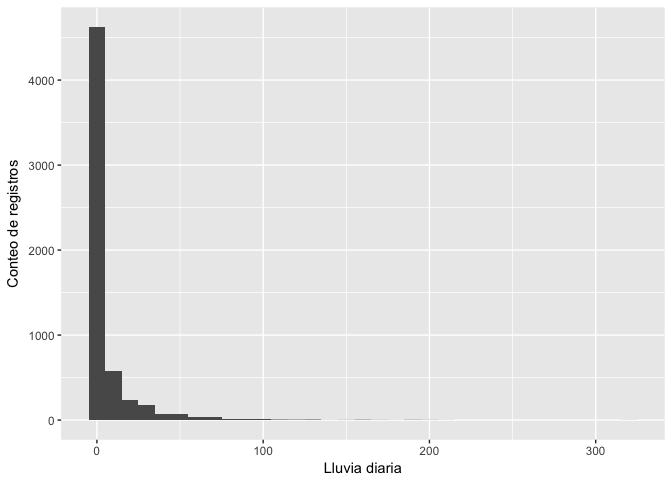

Datos climáticos históricos de ACG
================

``` r
library("googlesheets")
library("dplyr")
```

    ## 
    ## Attaching package: 'dplyr'

    ## The following objects are masked from 'package:stats':
    ## 
    ##     filter, lag

    ## The following objects are masked from 'package:base':
    ## 
    ##     intersect, setdiff, setequal, union

``` r
library("lubridate")
```

    ## 
    ## Attaching package: 'lubridate'

    ## The following object is masked from 'package:base':
    ## 
    ##     date

``` r
library("ggplot2")
library("kableExtra")
library("knitr")
options(knitr.table.format = "latex") 
```

A leer GoogleSheet con los datos del ACG y cargar datos de Estación Santa Rosa:

``` r
SR <- gs_title("EstacionesACG")
```

    ## Sheet successfully identified: "EstacionesACG"

``` r
SantaRosa <- SR %>% gs_read(ws = "StaRosa")
```

    ## Accessing worksheet titled 'StaRosa'.

    ## Parsed with column specification:
    ## cols(
    ##   dia = col_character(),
    ##   mes = col_integer(),
    ##   anno = col_integer(),
    ##   Lluvia = col_character(),
    ##   Tmax = col_number(),
    ##   Tmin = col_number(),
    ##   Unid_T = col_character(),
    ##   observ = col_character()
    ## )

Estructura de la tabla importada:

``` r
str(SantaRosa)
```

    ## Classes 'tbl_df', 'tbl' and 'data.frame':    7170 obs. of  8 variables:
    ##  $ dia   : chr  "1" "2" "3" "4" ...
    ##  $ mes   : int  1 1 1 1 1 1 1 1 1 1 ...
    ##  $ anno  : int  1995 1995 1995 1995 1995 1995 1995 1995 1995 1995 ...
    ##  $ Lluvia: chr  "0" "0" "0" "0" ...
    ##  $ Tmax  : num  NA NA NA NA NA NA NA NA NA NA ...
    ##  $ Tmin  : num  NA NA NA NA NA NA NA NA NA NA ...
    ##  $ Unid_T: chr  NA NA NA NA ...
    ##  $ observ: chr  NA NA NA NA ...
    ##  - attr(*, "spec")=List of 2
    ##   ..$ cols   :List of 8
    ##   .. ..$ dia   : list()
    ##   .. .. ..- attr(*, "class")= chr  "collector_character" "collector"
    ##   .. ..$ mes   : list()
    ##   .. .. ..- attr(*, "class")= chr  "collector_integer" "collector"
    ##   .. ..$ anno  : list()
    ##   .. .. ..- attr(*, "class")= chr  "collector_integer" "collector"
    ##   .. ..$ Lluvia: list()
    ##   .. .. ..- attr(*, "class")= chr  "collector_character" "collector"
    ##   .. ..$ Tmax  : list()
    ##   .. .. ..- attr(*, "class")= chr  "collector_number" "collector"
    ##   .. ..$ Tmin  : list()
    ##   .. .. ..- attr(*, "class")= chr  "collector_number" "collector"
    ##   .. ..$ Unid_T: list()
    ##   .. .. ..- attr(*, "class")= chr  "collector_character" "collector"
    ##   .. ..$ observ: list()
    ##   .. .. ..- attr(*, "class")= chr  "collector_character" "collector"
    ##   ..$ default: list()
    ##   .. ..- attr(*, "class")= chr  "collector_guess" "collector"
    ##   ..- attr(*, "class")= chr "col_spec"

Crear columna de fecha:

``` r
SantaRosa$fecha <- ymd(paste(SantaRosa$anno,SantaRosa$mes,SantaRosa$dia, sep = '/'))
```

    ## Warning: 32 failed to parse.

Notese que "Lluvia" se importó como tipo "character", hay que convertirla a "numeric":

``` r
SantaRosa$Lluvia <- as.numeric(SantaRosa$Lluvia)
```

    ## Warning: NAs introduced by coercion

Tipos de datos:

``` r
str(SantaRosa)
```

    ## Classes 'tbl_df', 'tbl' and 'data.frame':    7170 obs. of  9 variables:
    ##  $ dia   : chr  "1" "2" "3" "4" ...
    ##  $ mes   : int  1 1 1 1 1 1 1 1 1 1 ...
    ##  $ anno  : int  1995 1995 1995 1995 1995 1995 1995 1995 1995 1995 ...
    ##  $ Lluvia: num  0 0 0 0 0 0 0 0 0 0 ...
    ##  $ Tmax  : num  NA NA NA NA NA NA NA NA NA NA ...
    ##  $ Tmin  : num  NA NA NA NA NA NA NA NA NA NA ...
    ##  $ Unid_T: chr  NA NA NA NA ...
    ##  $ observ: chr  NA NA NA NA ...
    ##  $ fecha : Date, format: "1995-01-01" "1995-01-02" ...
    ##  - attr(*, "spec")=List of 2
    ##   ..$ cols   :List of 8
    ##   .. ..$ dia   : list()
    ##   .. .. ..- attr(*, "class")= chr  "collector_character" "collector"
    ##   .. ..$ mes   : list()
    ##   .. .. ..- attr(*, "class")= chr  "collector_integer" "collector"
    ##   .. ..$ anno  : list()
    ##   .. .. ..- attr(*, "class")= chr  "collector_integer" "collector"
    ##   .. ..$ Lluvia: list()
    ##   .. .. ..- attr(*, "class")= chr  "collector_character" "collector"
    ##   .. ..$ Tmax  : list()
    ##   .. .. ..- attr(*, "class")= chr  "collector_number" "collector"
    ##   .. ..$ Tmin  : list()
    ##   .. .. ..- attr(*, "class")= chr  "collector_number" "collector"
    ##   .. ..$ Unid_T: list()
    ##   .. .. ..- attr(*, "class")= chr  "collector_character" "collector"
    ##   .. ..$ observ: list()
    ##   .. .. ..- attr(*, "class")= chr  "collector_character" "collector"
    ##   ..$ default: list()
    ##   .. ..- attr(*, "class")= chr  "collector_guess" "collector"
    ##   ..- attr(*, "class")= chr "col_spec"

Transformar las temperaturas a centígrados: Primero hacer función de transformación

``` r
FaC <- function(x, y) {
  ifelse (x == 'F', (y - 32) * (5/9), y)
}
```

Ahora hacer la transformación para temperatura máxima (Tmax) y mínima (Tmin):

``` r
SantaRosa$TmaxC <- FaC(SantaRosa$Unid_T, SantaRosa$Tmax)
SantaRosa$TminC <- FaC(SantaRosa$Unid_T, SantaRosa$Tmin)
```

Revisar rango de valores a través de un histograma.

Lluvia:

``` r
ggplot(SantaRosa) + geom_histogram(aes(x=Lluvia), binwidth = 10)
```

    ## Warning: Removed 3597 rows containing non-finite values (stat_bin).


``` r
summary(SantaRosa$Lluvia)
```

    ##    Min. 1st Qu.  Median    Mean 3rd Qu.    Max.    NA's 
    ##   0.000   0.000   0.000   1.481   0.000 211.000    3597

Temperatura máxima:

``` r
ggplot(SantaRosa) + geom_histogram(aes(x=TmaxC), binwidth = 10)
```

    ## Warning: Removed 2738 rows containing non-finite values (stat_bin).



``` r
summary(SantaRosa$TmaxC)
```

    ##    Min. 1st Qu.  Median    Mean 3rd Qu.    Max.    NA's 
    ##   21.11   30.00   33.00  129.43  298.00  461.67    2738

Temperatura mínima:

``` r
ggplot(SantaRosa) + geom_histogram(aes(x=TminC), binwidth = 10)
```

    ## Warning: Removed 2729 rows containing non-finite values (stat_bin).


``` r
summary(SantaRosa$TminC)
```

    ##    Min. 1st Qu.  Median    Mean 3rd Qu.    Max.    NA's 
    ##  -6.111  22.000  23.000  79.043 215.000 379.444    2729

Los valores de más de 100 C se asumen son valores donde no se les puso el decimal, por lo que hay que hacer una función que seleccione esos valores y los divida entre 10.

``` r
deci <- function(x) {
  ifelse (x > 100, x/10, x)
}
```

Se aplica la función a las columnas TmaxC y TminC:

``` r
SantaRosa$TmaxC <- deci(SantaRosa$TmaxC)
SantaRosa$TminC <- deci(SantaRosa$TminC)
```

Comprobar cambios con nuevos histogramas:

``` r
ggplot(SantaRosa) + geom_histogram(aes(x=TminC), binwidth = 1)
```

    ## Warning: Removed 2729 rows containing non-finite values (stat_bin).


``` r
ggplot(SantaRosa) + geom_histogram(aes(x=TmaxC), binwidth = 1)
```

    ## Warning: Removed 2738 rows containing non-finite values (stat_bin).


``` r
summary(SantaRosa$TmaxC)
```

    ##    Min. 1st Qu.  Median    Mean 3rd Qu.    Max.    NA's 
    ##   12.94   29.50   31.11   31.53   33.33   46.17    2738

Revisar años con datos:

``` r
annosdatos <- SantaRosa %>% group_by(year(fecha)) %>% summarise(n())
```

Tabla con número de entradas por año:

``` r
kable(annosdatos)
```

Revisar número de meses por año:

``` r
mesaanodatos <- SantaRosa %>% group_by(year(fecha), month(fecha)) %>% summarise(n())
colnames(mesaanodatos)[3] <- "registros"
```

Tabla con número de entradas por mes y año:

``` r
kable(mesaanodatos)
```

Seleccionar meses y años con menos de 28 registros:

``` r
meseslt28 <- mesaanodatos %>% filter(registros < 28)
```

Tabla con resultados:

``` r
kable(meseslt28)
```
