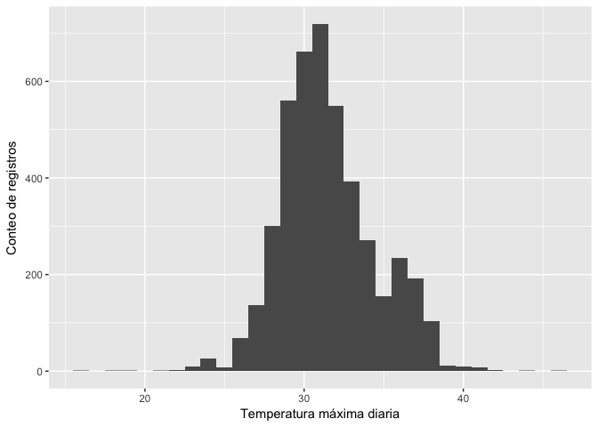
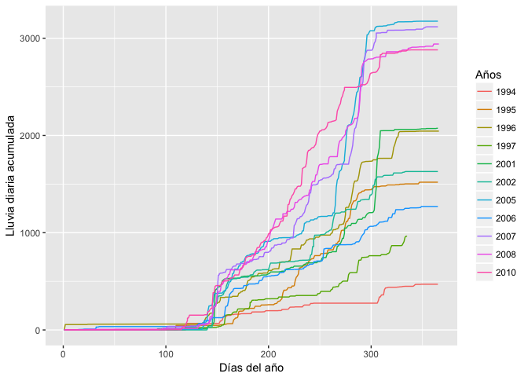
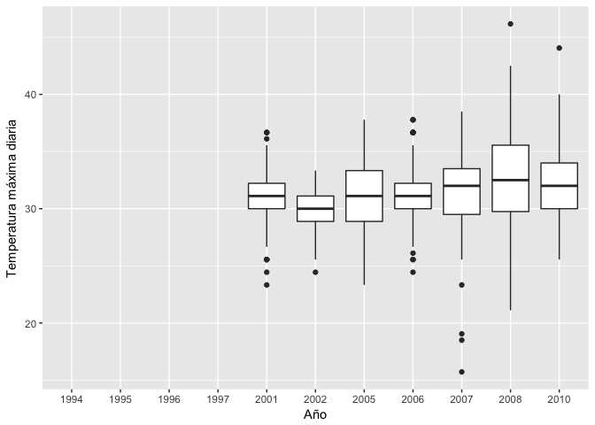
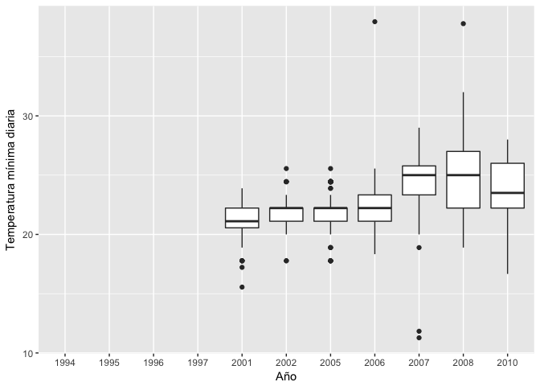

Datos climáticos históricos de ACG
================

``` r
rm(list = ls())
```

``` r
library("googlesheets")
library("tidyverse")
library("lubridate")
library("ggplot2")
library("plotly")
```

Estación Santa Rosa
-------------------

A leer GoogleSheet con los datos del ACG y cargar datos de Estación Santa Rosa:

``` r
SR <- gs_title("EstacionesACG")
```

    ## Warning in strptime(x, fmt, tz = "GMT"): unknown timezone 'zone/tz/2017c.
    ## 1.0/zoneinfo/America/Costa_Rica'

    ## Sheet successfully identified: "EstacionesACG"

``` r
SantaRosa <- SR %>% gs_read(ws = "StaRosa")
```

    ## Accessing worksheet titled 'StaRosa'.

    ## Parsed with column specification:
    ## cols(
    ##   dia = col_character(),
    ##   mes = col_integer(),
    ##   anno = col_integer(),
    ##   Lluvia = col_character(),
    ##   Tmax = col_number(),
    ##   Tmin = col_number(),
    ##   Unid_T = col_character(),
    ##   observ = col_character()
    ## )

Estructura de la tabla importada:

``` r
str(SantaRosa)
```

    ## Classes 'tbl_df', 'tbl' and 'data.frame':    7170 obs. of  8 variables:
    ##  $ dia   : chr  "1" "2" "3" "4" ...
    ##  $ mes   : int  1 1 1 1 1 1 1 1 1 1 ...
    ##  $ anno  : int  1995 1995 1995 1995 1995 1995 1995 1995 1995 1995 ...
    ##  $ Lluvia: chr  "0" "0" "0" "0" ...
    ##  $ Tmax  : num  NA NA NA NA NA NA NA NA NA NA ...
    ##  $ Tmin  : num  NA NA NA NA NA NA NA NA NA NA ...
    ##  $ Unid_T: chr  NA NA NA NA ...
    ##  $ observ: chr  NA NA NA NA ...
    ##  - attr(*, "spec")=List of 2
    ##   ..$ cols   :List of 8
    ##   .. ..$ dia   : list()
    ##   .. .. ..- attr(*, "class")= chr  "collector_character" "collector"
    ##   .. ..$ mes   : list()
    ##   .. .. ..- attr(*, "class")= chr  "collector_integer" "collector"
    ##   .. ..$ anno  : list()
    ##   .. .. ..- attr(*, "class")= chr  "collector_integer" "collector"
    ##   .. ..$ Lluvia: list()
    ##   .. .. ..- attr(*, "class")= chr  "collector_character" "collector"
    ##   .. ..$ Tmax  : list()
    ##   .. .. ..- attr(*, "class")= chr  "collector_number" "collector"
    ##   .. ..$ Tmin  : list()
    ##   .. .. ..- attr(*, "class")= chr  "collector_number" "collector"
    ##   .. ..$ Unid_T: list()
    ##   .. .. ..- attr(*, "class")= chr  "collector_character" "collector"
    ##   .. ..$ observ: list()
    ##   .. .. ..- attr(*, "class")= chr  "collector_character" "collector"
    ##   ..$ default: list()
    ##   .. ..- attr(*, "class")= chr  "collector_guess" "collector"
    ##   ..- attr(*, "class")= chr "col_spec"

Crear columna de fecha:

``` r
SantaRosa$fecha <- ymd(paste(SantaRosa$anno,SantaRosa$mes,SantaRosa$dia, sep = '/'))
```

Notese que "Lluvia" se importó como tipo "character", hay que convertirla a "numeric", pero primero hay que convertir el separador de decimales de coma a punto:

``` r
SantaRosa$Lluvia <- gsub(",", ".", SantaRosa$Lluvia, fixed = T)
```

``` r
SantaRosa$Lluvia <- as.numeric(SantaRosa$Lluvia)
```

    ## Warning: NAs introduced by coercion

Tipos de datos:

``` r
str(SantaRosa)
```

    ## Classes 'tbl_df', 'tbl' and 'data.frame':    7170 obs. of  9 variables:
    ##  $ dia   : chr  "1" "2" "3" "4" ...
    ##  $ mes   : int  1 1 1 1 1 1 1 1 1 1 ...
    ##  $ anno  : int  1995 1995 1995 1995 1995 1995 1995 1995 1995 1995 ...
    ##  $ Lluvia: num  0 0 0 0 0 0 0 0 0 0 ...
    ##  $ Tmax  : num  NA NA NA NA NA NA NA NA NA NA ...
    ##  $ Tmin  : num  NA NA NA NA NA NA NA NA NA NA ...
    ##  $ Unid_T: chr  NA NA NA NA ...
    ##  $ observ: chr  NA NA NA NA ...
    ##  $ fecha : Date, format: "1995-01-01" "1995-01-02" ...
    ##  - attr(*, "spec")=List of 2
    ##   ..$ cols   :List of 8
    ##   .. ..$ dia   : list()
    ##   .. .. ..- attr(*, "class")= chr  "collector_character" "collector"
    ##   .. ..$ mes   : list()
    ##   .. .. ..- attr(*, "class")= chr  "collector_integer" "collector"
    ##   .. ..$ anno  : list()
    ##   .. .. ..- attr(*, "class")= chr  "collector_integer" "collector"
    ##   .. ..$ Lluvia: list()
    ##   .. .. ..- attr(*, "class")= chr  "collector_character" "collector"
    ##   .. ..$ Tmax  : list()
    ##   .. .. ..- attr(*, "class")= chr  "collector_number" "collector"
    ##   .. ..$ Tmin  : list()
    ##   .. .. ..- attr(*, "class")= chr  "collector_number" "collector"
    ##   .. ..$ Unid_T: list()
    ##   .. .. ..- attr(*, "class")= chr  "collector_character" "collector"
    ##   .. ..$ observ: list()
    ##   .. .. ..- attr(*, "class")= chr  "collector_character" "collector"
    ##   ..$ default: list()
    ##   .. ..- attr(*, "class")= chr  "collector_guess" "collector"
    ##   ..- attr(*, "class")= chr "col_spec"

Transformar las temperaturas a centígrados: Primero hacer función de transformación

``` r
FaC <- function(x, y) {
  ifelse (x == 'F', (y - 32) * (5/9), y)
}
```

Ahora hacer la transformación para temperatura máxima (Tmax) y mínima (Tmin):

``` r
SantaRosa$TmaxC <- FaC(SantaRosa$Unid_T, SantaRosa$Tmax)
SantaRosa$TminC <- FaC(SantaRosa$Unid_T, SantaRosa$Tmin)
```

Revisar rango de valores a través de un histograma.

Lluvia:

``` r
ggplot(SantaRosa) + geom_histogram(aes(x=Lluvia), binwidth = 10)
```


``` r
summary(SantaRosa$Lluvia)
```

    ##    Min. 1st Qu.  Median    Mean 3rd Qu.    Max.    NA's 
    ##   0.000   0.000   0.000   6.155   3.300 322.300    1267

Temperatura máxima:

``` r
ggplot(SantaRosa) + geom_histogram(aes(x=TmaxC), binwidth = 10)
```


``` r
summary(SantaRosa$TmaxC)
```

    ##    Min. 1st Qu.  Median    Mean 3rd Qu.    Max.    NA's 
    ##   21.11   30.00   33.00  129.43  298.00  461.67    2738

Temperatura mínima:

``` r
ggplot(SantaRosa) + geom_histogram(aes(x=TminC), binwidth = 10)
```


``` r
summary(SantaRosa$TminC)
```

    ##    Min. 1st Qu.  Median    Mean 3rd Qu.    Max.    NA's 
    ##  -6.111  22.000  23.000  79.043 215.000 379.444    2729

Los valores de más de 100 C se asumen son valores donde no se les puso el decimal, por lo que hay que hacer una función que seleccione esos valores y los divida entre 10.

``` r
deci <- function(x) {
  ifelse (x > 100, x/10, x)
}
```

Se aplica la función a las columnas TmaxC y TminC:

``` r
SantaRosa$TmaxC <- deci(SantaRosa$TmaxC)
SantaRosa$TminC <- deci(SantaRosa$TminC)
```

Comprobar cambios con nuevos histogramas:

``` r
ggplot(SantaRosa) + geom_histogram(aes(x=TminC), binwidth = 1)
```


``` r
ggplot(SantaRosa) + geom_histogram(aes(x=TmaxC), binwidth = 1)
```



``` r
summary(SantaRosa$TmaxC)
```

    ##    Min. 1st Qu.  Median    Mean 3rd Qu.    Max.    NA's 
    ##   12.94   29.50   31.11   31.53   33.33   46.17    2738

Estadísticas generales para los años con datos completos o casi completos
=========================================================================

Hacer vector con los años que se tienen datos completos:

``` r
AnnosCompletosSR <- as.factor(c(1994:1997,2001,2002, 2005:2008,2010))
```

Seleccionar los valores para esos años:

``` r
SantaRosa_AnnosCompletos <- SantaRosa %>% filter(anno %in% AnnosCompletosSR)
```

Calcular totales de lluvia por año completo:

``` r
TotalLluviaAnnos <- SantaRosa_AnnosCompletos %>% replace_na(list(Lluvia = 0)) %>% 
  group_by(anno) %>% summarise(LluviaAnno = sum(Lluvia))
```

Tabla con totales de lluvia por año:

``` r
TotalLluviaAnnos
```

    ## # A tibble: 11 x 2
    ##     anno LluviaAnno
    ##    <int>      <dbl>
    ##  1  1994     470.00
    ##  2  1995    1519.42
    ##  3  1996    2044.70
    ##  4  1997     963.92
    ##  5  2001    2074.10
    ##  6  2002    1629.30
    ##  7  2005    3175.36
    ##  8  2006    1269.80
    ##  9  2007    3117.60
    ## 10  2008    2940.70
    ## 11  2010    2880.40

Promedio de lluvia anual para la estación Santa Rosa:

``` r
mean(TotalLluviaAnnos$LluviaAnno)
```

    ## [1] 2007.755

Los días más lluviosos:

``` r
SantaRosa_AnnosCompletos %>% select(fecha, Lluvia, TmaxC, TminC) %>% arrange(desc(Lluvia)) %>% slice(1:5)
```

    ## # A tibble: 5 x 4
    ##        fecha Lluvia    TmaxC    TminC
    ##       <date>  <dbl>    <dbl>    <dbl>
    ## 1 2001-05-28  322.3 31.11111 21.11111
    ## 2 2008-10-16  211.0 24.44444 22.22222
    ## 3 2007-10-20  201.3 28.50000 25.50000
    ## 4 2001-11-02  201.2 24.44444 21.11111
    ## 5 2007-05-31  194.2 26.00000 24.00000

``` r
#tail(sort(SantaRosa_AnnosCompletos$Lluvia), 5)
```

Los días más calurosos:

``` r
SantaRosa_AnnosCompletos %>% select(fecha, Lluvia, TmaxC, TminC) %>% arrange(desc(TmaxC)) %>% slice(1:5)
```

    ## # A tibble: 5 x 4
    ##        fecha Lluvia    TmaxC    TminC
    ##       <date>  <dbl>    <dbl>    <dbl>
    ## 1 2008-06-02   69.3 46.16667 20.00000
    ## 2 2010-11-25    0.2 44.05556 20.55556
    ## 3 2008-05-18    0.0 42.50000 29.00000
    ## 4 2008-05-16    0.0 42.00000 29.50000
    ## 5 2008-04-04    0.0 41.50000 27.50000

Los días menos calurosos:

``` r
SantaRosa_AnnosCompletos %>% select(fecha, Lluvia, TmaxC, TminC)%>% arrange(TminC) %>% slice(1:5)
```

    ## # A tibble: 5 x 4
    ##        fecha Lluvia    TmaxC     TminC
    ##       <date>  <dbl>    <dbl>     <dbl>
    ## 1 2008-12-24      0 12.94444 -6.111111
    ## 2 2007-05-08      0 18.50000 11.277778
    ## 3 2007-05-09      0 19.05556 11.833333
    ## 4 2001-01-18      0 31.11111 15.555556
    ## 5 2010-12-20      0 31.11111 16.666667

Graficos
========

Ordenar por fecha:

``` r
SantaRosa_AnnosCompletos <- SantaRosa_AnnosCompletos[order(SantaRosa_AnnosCompletos$fecha),]
```

Preparación para un gráfico de acumulado de lluvias por año:

``` r
SantaRosa_AnnosCompletos$djuliano <- yday(SantaRosa_AnnosCompletos$fecha)

SantaRosa_graficos <- SantaRosa_AnnosCompletos %>% replace_na(list(Lluvia = 0))

SantaRosa_graficos <- SantaRosa_graficos %>% group_by(year(fecha)) %>% mutate(LluviaAcumulada = cumsum(Lluvia))
```

Gráfico de lluvia acumulada por año:

``` r
ggplot(SantaRosa_graficos, aes(x = djuliano, y = LluviaAcumulada)) +
  geom_line(aes(group = factor(anno), colour = factor(anno)))
```



Promedio de temperaturas por mes:

``` r
ggplot(SantaRosa_graficos, aes(factor(anno), TmaxC)) +
  geom_boxplot()
```



``` r
ggplot(SantaRosa_graficos, aes(factor(anno), TminC)) +
  geom_boxplot()
```



Seleccionar tabla final y xportar resultados a CSV:

``` r
SantaRosa_final <- select(SantaRosa_AnnosCompletos, fecha, TmaxC, TminC, Lluvia)

write_csv(SantaRosa_final, "SantaRosa.csv")
```
